GENERICS :

## **What is Generics in Java?**
        
        Generics in Java are a way to **define classes, interfaces, and methods with type parameters**.  
        This means instead of writing code for one specific data type, you can write **generic (reusable) code** that works with different data types safely.

👉 Example without generics:
```
import java.util.*;

public class ExampleWithoutGenerics {
    public static void main(String[] args) {
        List list = new ArrayList();   // Raw type, no generics
        list.add("Hello");
        list.add(123);  // Allowed, but risky

        for (Object obj : list) {
            // We need to cast manually
            String str = (String) obj; // ClassCastException at runtime
            System.out.println(str);
        }
    }
}

```


    ❌ Problem: You can put any object in the list (String, Integer, etc.), but when retrieving, you must cast, and this can fail at **runtime**.

---

👉 Example with Generics:

```
import java.util.*;

public class ExampleWithGenerics {
    public static void main(String[] args) {
        List<String> list = new ArrayList<>(); // Generic type parameter
        list.add("Hello");
        // list.add(123); // Compile-time error ✅

        for (String str : list) {
            System.out.println(str);  // No cast needed
        }
    }
}

```


## **Why is Generics Used?**

Generics are mainly used for:

    1. **Type Safety**  
       Prevents inserting the wrong type into collections or methods.  
       → Compiler ensures only the correct type goes in.
    
       2. **Eliminating Type Casting**  
          Without generics, you need explicit casting. With generics, casting is automatic and safe.
    
       3. **Code Reusability**  
          You can write a generic class/method once, and reuse it for any type
    
    4  **Better Code Readability & Maintainability**  
    You know exactly what type of object is expected in collections or methods.


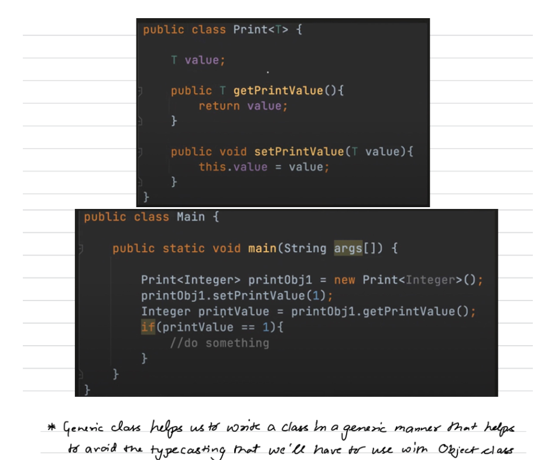

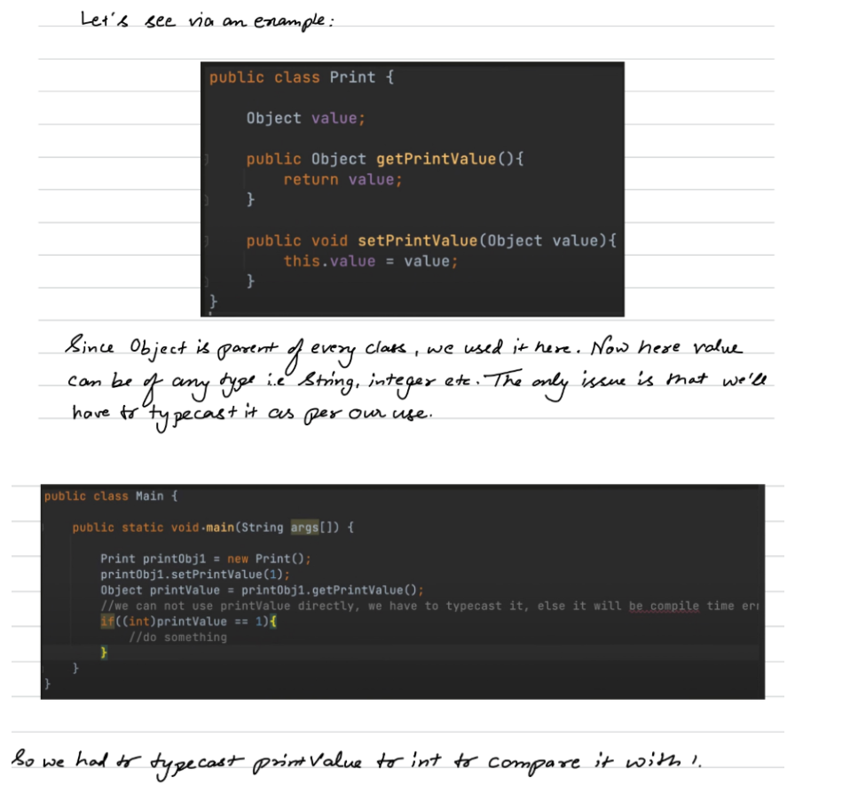

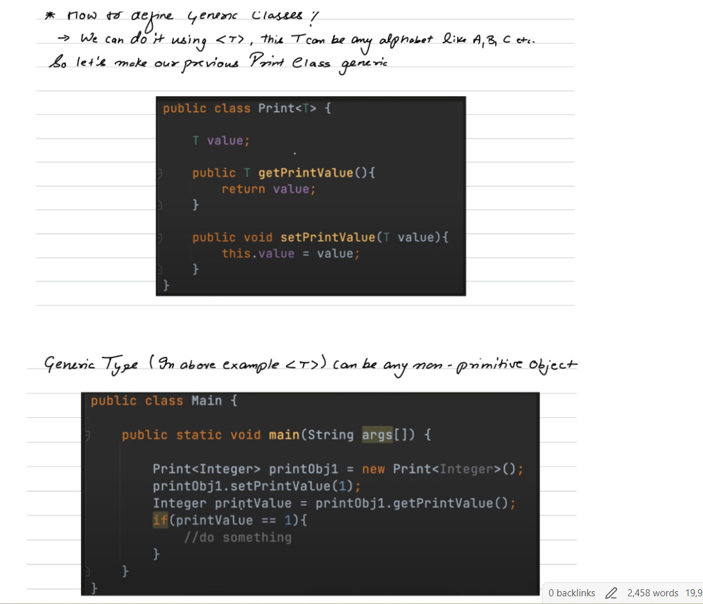

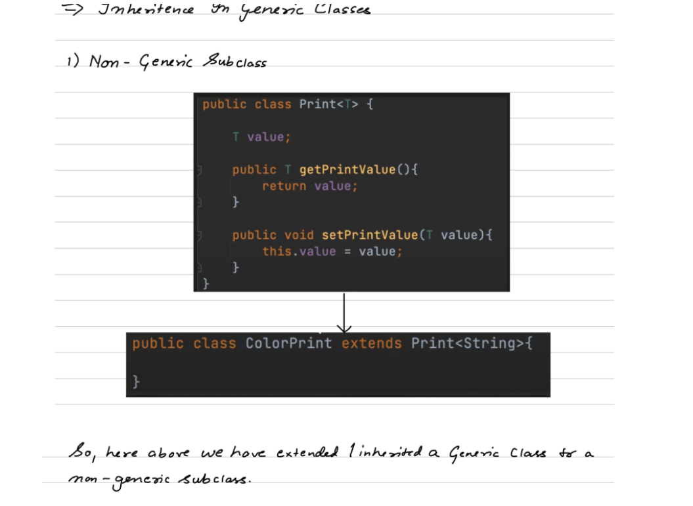

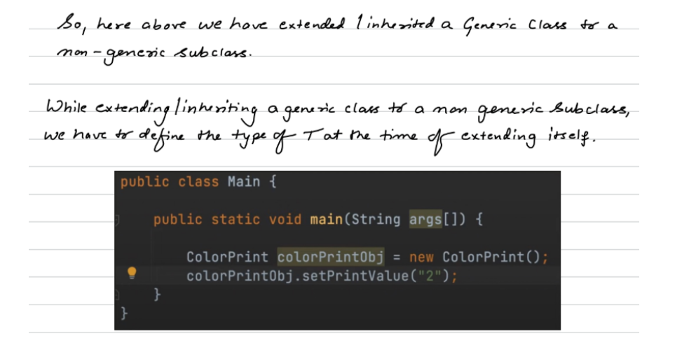

### ❌ If you don’t specify it:

`class WrongBox extends Box { } // ❌ Compile-time warning`
    
    - This uses the **raw type** of `Box`, which removes all generic type information.
      - It’s **allowed** (for backward compatibility), but it’s **unsafe** and discouraged.


You’ll get a warning like:

`Note: Box is a raw type. References to generic type Box<T> should be parameterized.`


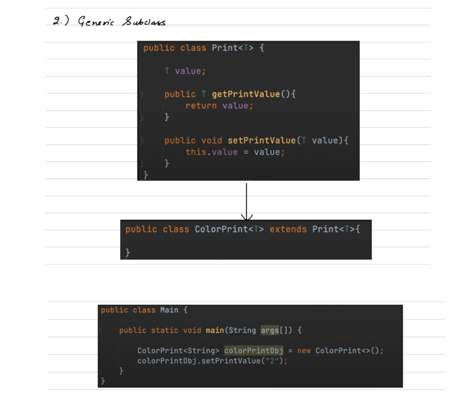


```
class Parent<T> { }

class Child<U> extends Parent<T> { } // ← is this valid?

```

## ❌ Short Answer

**No — this will NOT compile.**  
You’ll get a **compile-time error** because `T` is **not defined** in `Child`.

---

## 🧩 Why?

Let’s analyze step-by-step 👇

- `Parent<T>` → means `Parent` has a type parameter called `T`.
- But in `Child`, you defined **only one type parameter: `U`**.

So inside `Child`, the compiler knows only about `U`, not about `T`.

| Declaration                             | Valid? | Explanation                    |
| --------------------------------------- | ------ | ------------------------------ |
| `class Child<T> extends Parent<T>`      | ✅      | Child uses same type param     |
| `class Child<U> extends Parent<U>`      | ✅      | Child maps its U to Parent’s T |
| `class Child<U> extends Parent<String>` | ✅      | Parent type fixed as String    |
| `class Child<U> extends Parent<T>`      | ❌      | T not declared in Child        |


`class Child<U> extends Parent<String>`  Here U can be anything

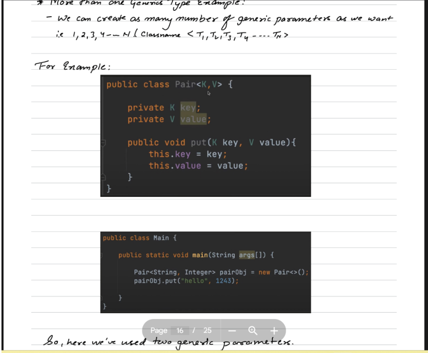

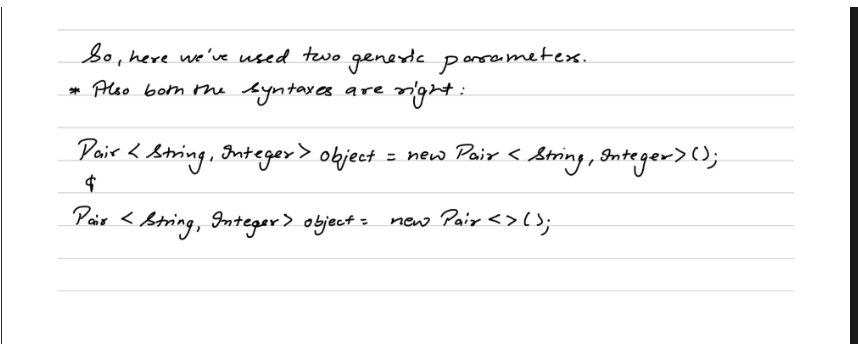


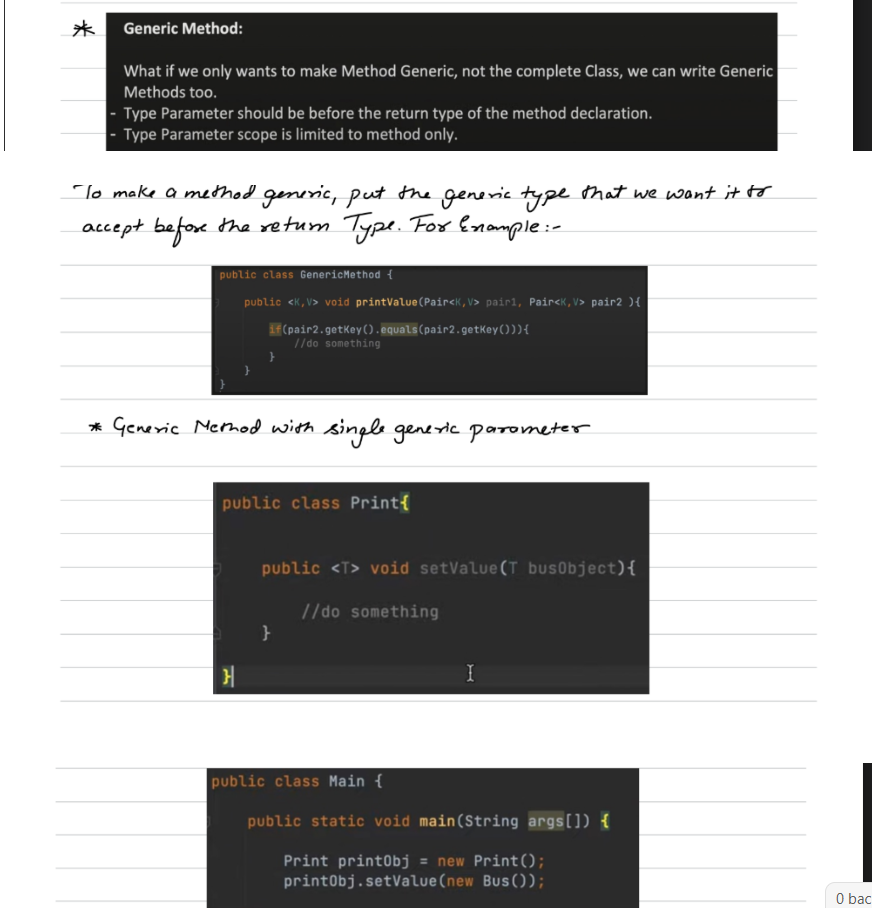


What is a Generic Method?
    
    A **generic method** is a method that declares its **own type parameter(s)** — independent of the class’s type parameters.
    👉 You can use them **inside** generic or **non-generic** classes.

---

### 📘 Syntax:

    `<type-parameter(s)> returnType methodName(parameter list)


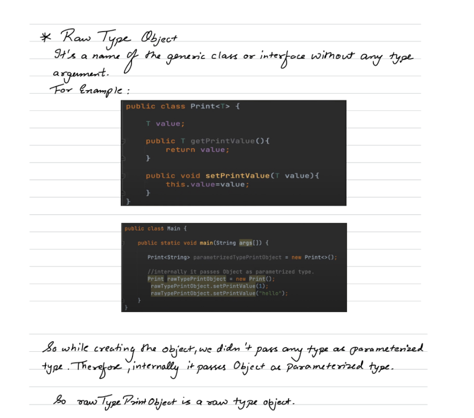

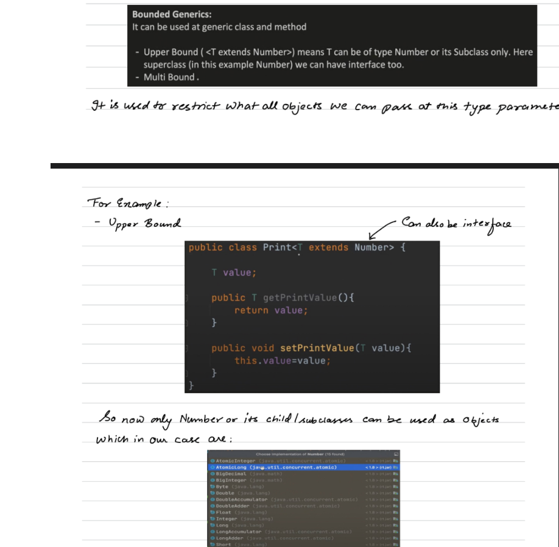


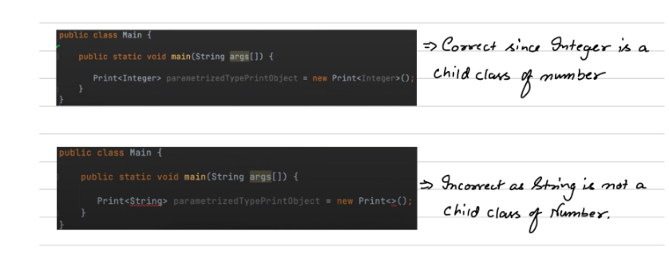


1️⃣ What are Bounded Generics?

A **bounded generic** restricts the kinds of types that can be used as a **type parameter**.

- By default, a generic type can accept **any type**.

- With bounds, you can restrict it to a **subclass** or a class that **implements an interface**.


---

### 🔹 2️⃣ Syntax

**Upper Bound (extends keyword)**

`<T extends SomeClass>  // T can only be SomeClass or its subclasses`

**Lower Bound (`super`)** is used **in wildcards**, not in generic class declaration:

`? super Type   // Only in usage, like List<? super Number>`

```
interface Printable {
    void print();
}

class Document implements Printable {
    public void print() { System.out.println("Document"); }
}

class Printer<T extends Printable> {
    private T item;
    public Printer(T item) { this.item = item; }
    public void doPrint() { item.print(); }
}

```

```
Document doc = new Document();
Printer<Document> printer = new Printer<>(doc);  // ✅ OK
// Printer<String> p = new Printer<>("Hello");   // ❌ Compile error

```


## 2️⃣ Bounded generics at **method level**

You **can** declare bounded type parameters for methods, independent of the class:


```
class Utility {
    public static <T extends Number> void printNumbers(List<T> list) {
        for (T n : list) {
            System.out.println(n);
        }
    }

    public static <T extends Number & Comparable<T>> T max(T a, T b) {
        return (a.compareTo(b) > 0) ? a : b;
    }
}

```


|Level|Type Parameters|Bounds Allowed?|Example|
|---|---|---|---|
|Class|`<T>`|✅ Yes|`class Box<T extends Number>`|
|Method|`<T>`|✅ Yes|`<T extends Number> T getFirst(List<T> list)`|
|Method param inline|`List<T extends Number>`|❌ No|❌ Invalid|
|Method param wildcard|`List<? extends Number>`|✅ Yes|✅ Valid|


Method Param INline means
we cant extend in the param of the method using type param but we can do it using wildcard

--------------------------------------------------------------------------------

### MultiBound:

You can restrict a type parameter with **more than one bound** (class first, then interfaces):

```
class MultiBound<T extends Number & Comparable<T>> {
    private T value;

    public MultiBound(T value) { this.value = value; }

    public boolean isGreaterThan(T other) {
        return value.compareTo(other) > 0;
    }
}

```

```
MultiBound<Integer> m1 = new MultiBound<>(10);   // ✅ OK
MultiBound<Double> m2 = new MultiBound<>(3.14);  // ✅ OK
// MultiBound<String> m3 = new MultiBound<>("Hi"); // ❌ Compile error

```

Since Integer, Double extends Number as well as implements Comparable, it is valid


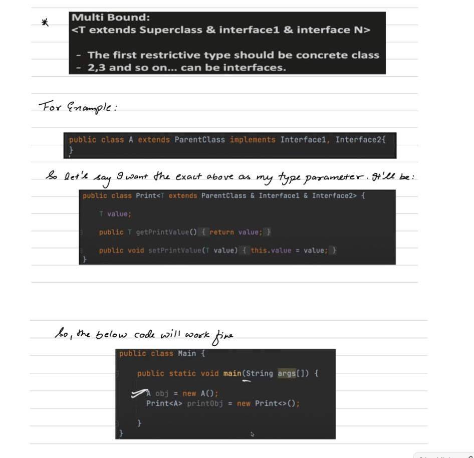

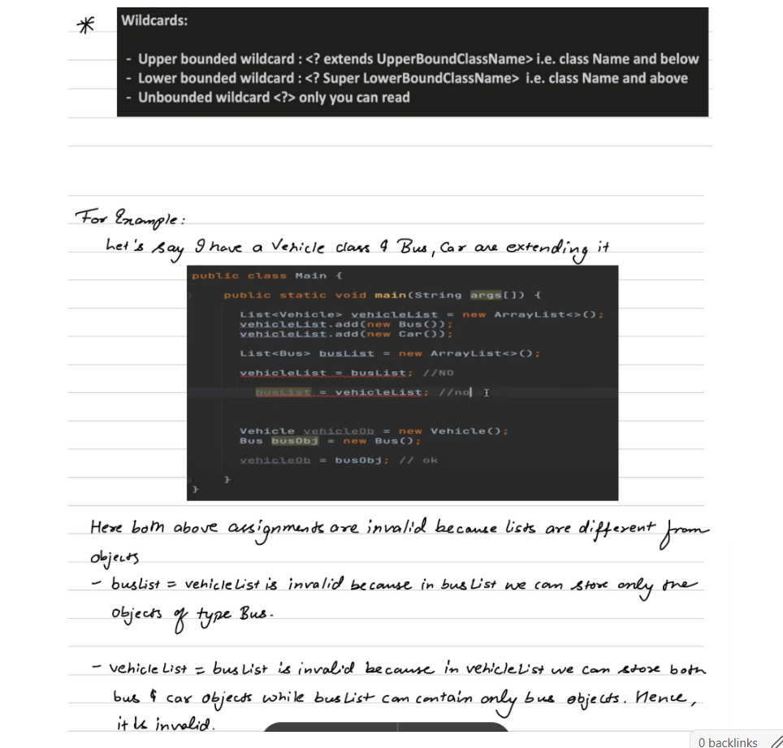

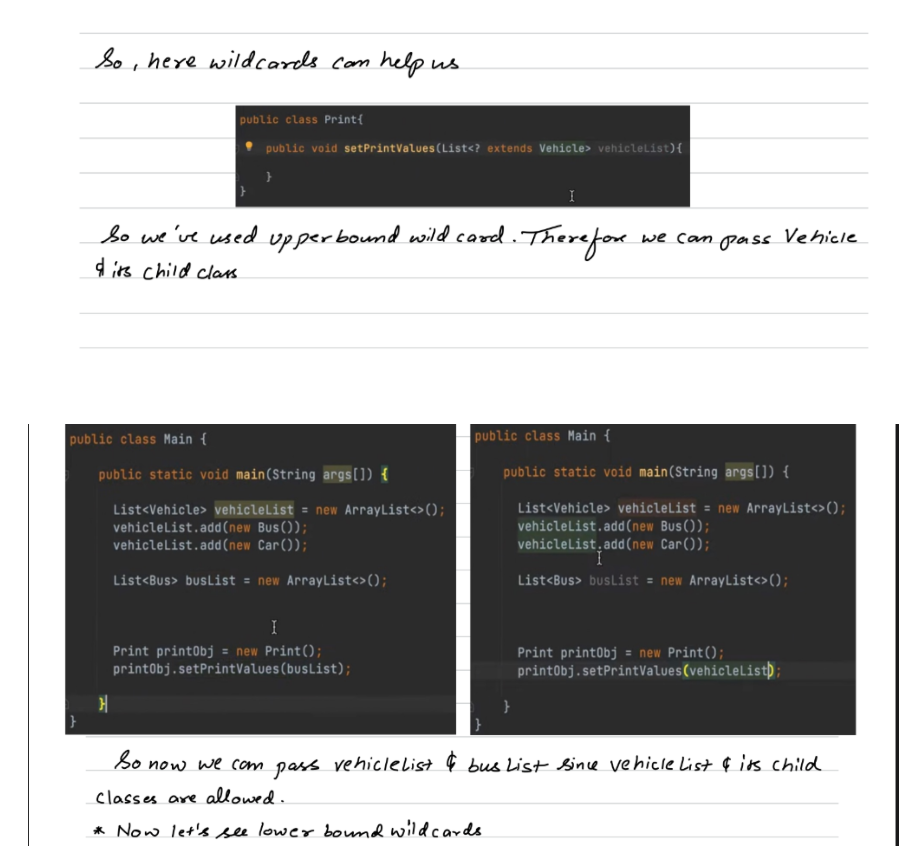

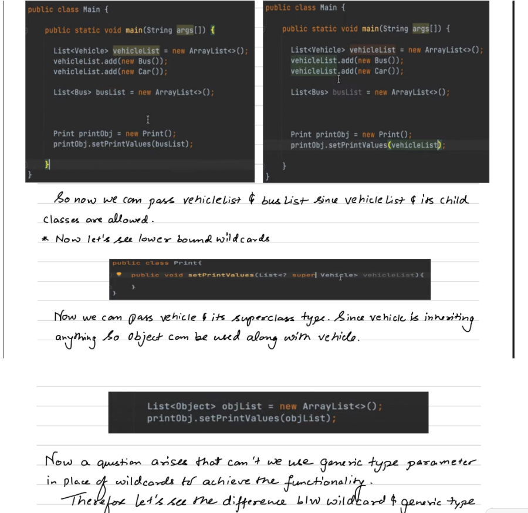

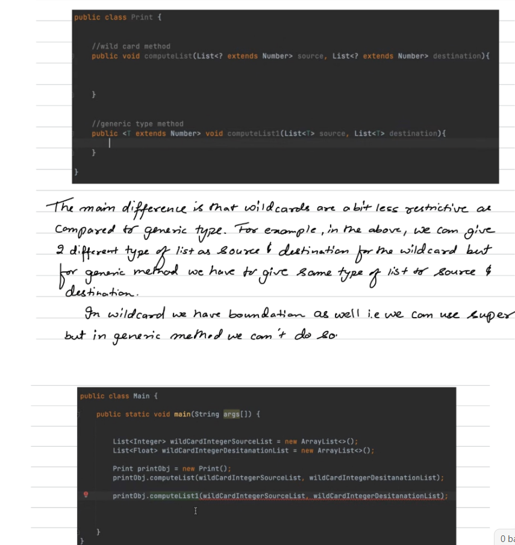

1️⃣ What is a Wildcard?

A **wildcard** is represented by the **question mark `?`** in Java generics.

- It is used when the **exact type is unknown** or **doesn’t matter**.

- Wildcards are mostly used in **method parameters** or **collections** to make them **more flexible**.


---

### 🔹 2️⃣ Syntax

| Wildcard        | Meaning                                                     |
|-----------------|-------------------------------------------------------------|
| `<?>`           | Unbounded wildcard — any type                               |
| `<? extends T>` | Upper bounded — any type that is `T` or a subclass of `T`   |
| `<? super T>`   | Lower bounded — any type that is `T` or a superclass of `T` |


----------------------------------------------------------------------------------------


**Type erasure** is the process by which **all generic type information is removed by the compiler after compile-time checks**.

    - Generics exist **only at compile time** for **type safety**.
      - At runtime, the JVM sees **raw types only**.

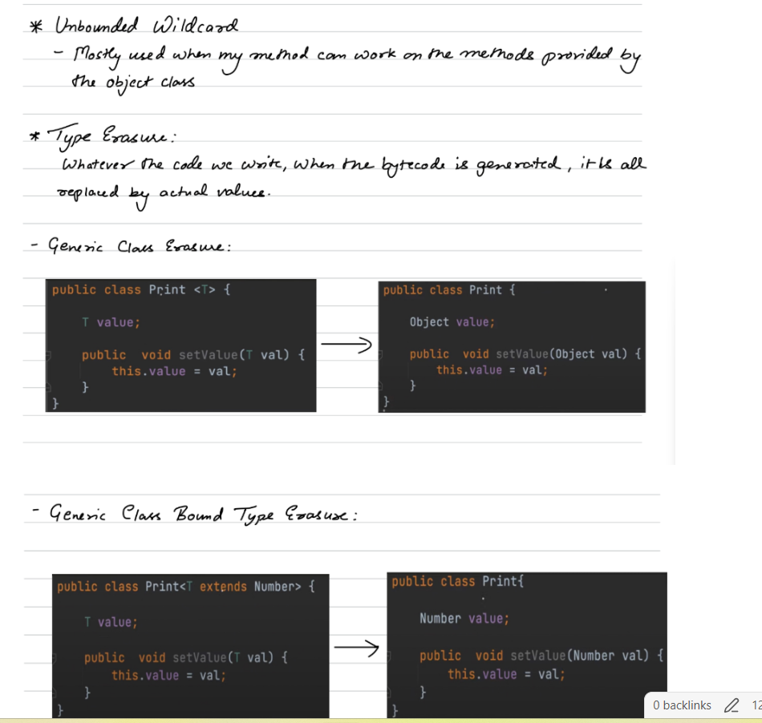

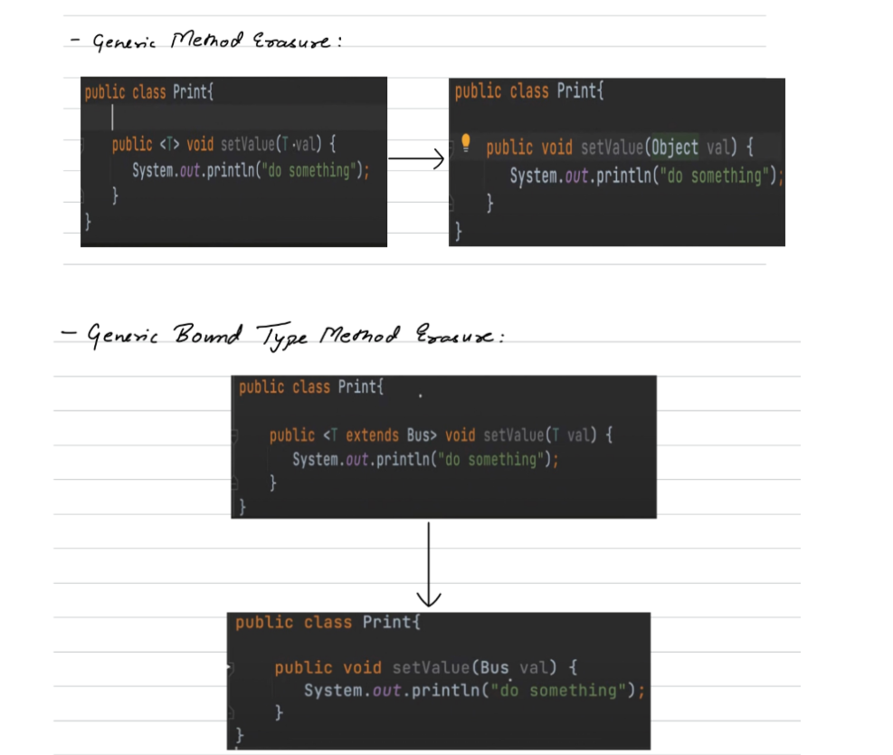

Step-by-Step Internal Flow of Java Generics**

We’ll take a **generic class and method example**:

```
class Box<T extends Number> {
    private T value;

    public Box(T value) { this.value = value; }

    public T get() { return value; }

    public <U extends Number> void printSum(U other) {
        System.out.println(value.doubleValue() + other.doubleValue());
    }
}

public class Main {
    public static void main(String[] args) {
        Box<Integer> intBox = new Box<>(10);
        intBox.printSum(5);       // method generic
        Integer val = intBox.get();
        System.out.println(val);
    }
}

```

---

## **1️⃣ Source Code Stage**

- **Developer writes generic classes and methods**: `<T>`, `<U>` and wildcards (`? extends Number`)

- **Generics provide type safety at the source level**

    - e.g., `Box<String>` is invalid because `T extends Number`

- **Compiler can infer types** for generic methods (like `U` in `printSum`)


**Purpose:** Catch **type errors early** (before runtime)

---

## **2️⃣ Compile-Time: Type Checking & Type Safety**

### a) Class-level generics

`Box<Integer> intBox = new Box<>(10);  // ✅ Integer is Number subclass Box<String> strBox = new Box<>("Hi"); // ❌ Compile-time error`

### b) Method-level generics

`intBox.printSum(5);        // ✅ U inferred as Integer intBox.printSum(5.5);      // ✅ U inferred as Double`

- Compiler checks **bounds** (`T extends Number`, `U extends Number`)

- Ensures **methods and assignments are type safe**

- Prevents **invalid operations** at runtime


---

## **3️⃣ Type Erasure**

After compile-time checks, **all generic type info is removed**:

1. **Unbounded types → replaced by Object**

2. **Bounded types → replaced by upper bound (Number)**

3. **Method type parameters → erased similarly**

4. **Automatic casts inserted** to maintain type safety


Our example becomes roughly:
```
class Box {
    private Number value;

    public Box(Number value) { this.value = value; }

    public Number get() { return value; }

    public void printSum(Number other) {
        System.out.println(value.doubleValue() + other.doubleValue());
    }
}

public class Main {
    public static void main(String[] args) {
        Box intBox = new Box(10);
        intBox.printSum(5);
        Integer val = (Integer) intBox.get(); // cast inserted automatically
        System.out.println(val);
    }
}

```

✅ **Type safety is ensured** via these **compiler-inserted casts**

---

## **4️⃣ Bytecode Generation**

- JVM **does not see generic type parameters**

- Only sees **raw types and casts**

- No extra objects or classes are generated for different `<T>`

- This is why generics have **no runtime overhead**


---

## **5️⃣ Runtime Behavior**

- JVM sees only **raw types**: `Box` instead of `Box<Integer>`

- **All generic info is gone**

- **Casts** inserted by compiler enforce type safety

- **Wildcards** are also erased (`? extends Number` → `Number`)


**Example:**

`intBox instanceof Box<Integer> // ❌ Compile-time error intBox instanceof Box         // ✅ Valid`

- Reading values works due to **casts**

- Writing into collections depends on **wildcards** and **bounds**


---

## **6️⃣ Wildcards and Bounds at Runtime**

- Wildcards exist **only for compile-time type checking**

- They **don’t exist at runtime**

- Reading/writing restrictions are enforced by compiler **before type erasure**


**Example:**

`void sumList(List<? extends Number> list) { ... }`

- Erased to:


`void sumList(List list) { ... }`

- Compiler ensures you **don’t add invalid types** to the list

| Step             | Action                                                                                           |
| ---------------- | ------------------------------------------------------------------------------------------------ |
| **Compile-time** | Compiler sees `Box<String>` → ensures only Strings assigned, inserts `(String)` cast for `get()` |
| **Type erasure** | `<T>` removed → JVM sees `Box` and `Object`                                                      |
| **Runtime**      | JVM executes cast `(String)` → verifies object type at runtime → ClassCastException if mismatch  |


--------------------------------------------------------------------------------------------


## **Step 0: Original Generic Code**

```
class Box<T> {
    private T value;

    public Box(T value) {
        this.value = value;
    }

    public T get() {
        return value;
    }

    public void set(T value) {
        this.value = value;
    }
}

public class Main {
    public static void main(String[] args) {
        Box<Integer> intBox = new Box<>(10);
        intBox.set(20);                 // ✅ OK
        // intBox.set("Hello");         // ❌ Compile-time error
        Integer val = intBox.get();
        System.out.println(val);
    }
}

```

---

## **Step 1: Compile-Time Type Checking**

1. **Class instantiation:** `Box<Integer>`

    - Compiler sets **T = Integer** for this variable

2. **Method calls:**

    - `set(T value)` → becomes `set(Integer value)`

    - `get()` → returns `Integer`

3. **Type safety check:**

    - `intBox.set("Hello")` ❌ not allowed → compile-time error

    - Compiler **prevents assigning wrong types**


> ✅ At this stage, **full generic type info is available**.

---

## **Step 2: Type Erasure**

After the compiler checks types, **generic info is removed**:

- **T replaced by upper bound** (Object if unbounded, Number if `T extends Number`)

- Methods and fields updated accordingly

- Compiler inserts **casts automatically** where needed


Our `Box<T>` becomes **roughly**:
```
class Box {
    private Object value;           // T → Object

    public Box(Object value) {
        this.value = value;
    }

    public Object get() {           // T → Object
        return value;
    }

    public void set(Object value) {
        this.value = value;
    }
}

```

- **Generic type info (`<Integer>`) is gone**

- JVM only sees **raw `Box` with Object**


---

## **Step 3: Compiler Inserts Casts**

At usage site:

    `Box<Integer> intBox = new Box<>(10); Integer val = intBox.get();`

After type erasure + compiler casts:

`Box intBox = new Box(10); Integer val = (Integer) intBox.get();  // cast inserted`

        - JVM does **runtime check** for `(Integer)`
          - Ensures type safety at runtime
          - If object is not Integer → **ClassCastException**


---

## **Step 4: Runtime Behavior**

    - JVM sees **raw types only**
      - All casts are inserted by compiler
      - Type safety depends on compiler-generated casts


Example of raw type risk:

`Box rawBox = new Box(); rawBox.set("Hello");       // ✅ JVM allows it Integer val = (Integer) rawBox.get(); // ❌ ClassCastException`

    - Compiler **cannot prevent raw type misuse**
      - Shows why using generics (not raw types) is safer

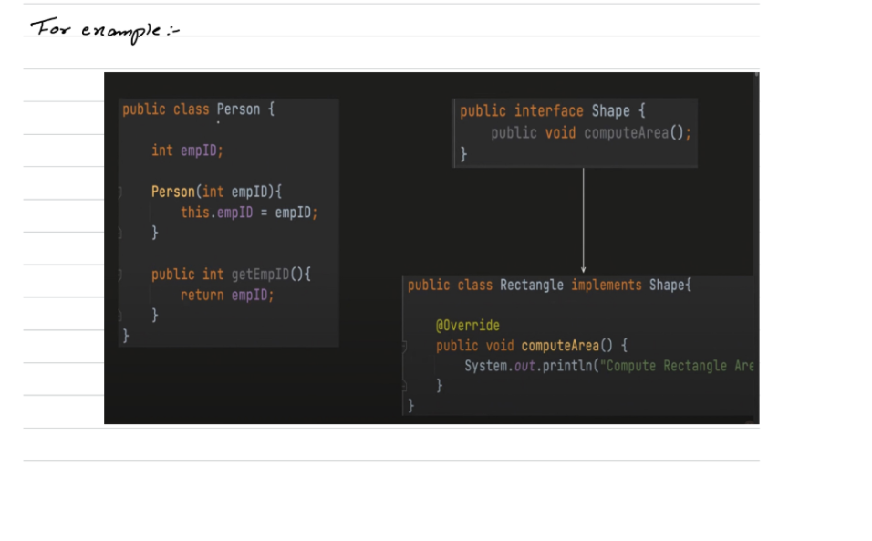


🔹 Step 1 — The Full Generic Code (Before Compilation)

```
class Box<T> {
    private T value;

    public void set(T value) {
        this.value = value;
    }

    public T get() {
        return value;
    }
}

public class Test {
    public static void main(String[] args) {
        Box<Integer> intBox = new Box<>();
        intBox.set(10);
        Integer val = intBox.get();  // <---- focus line
        System.out.println(val);
    }
}

```

---

## 🔹 Step 2 — What Happens During Compilation

When you compile this, the compiler performs:

1️⃣ **Type-checking** (ensures only `Integer` is stored/retrieved)  
2️⃣ **Type erasure** (removes generic type information)

After erasure, `Box<T>` becomes a class that looks like this internally 👇

---

## 🔹 Step 3 — After Type Erasure (Compiler’s View)

```
class Box {
    private Object value;

    public void set(Object value) {
        this.value = value;
    }

    public Object get() {
        return value;
    }
}

```

And your `main()` method becomes logically equivalent to this:

```
public class Test {
    public static void main(String[] args) {
        Box intBox = new Box();     // type parameter <Integer> erased
        intBox.set(Integer.valueOf(10));  // autoboxed

        // The compiler adds an automatic CAST here
        Integer val = (Integer) intBox.get();  // <-- injected cast
        System.out.println(val);
    }
}

```

---

## 🔹 Step 4 — “Wherever” Means

👉 “Wherever” refers to **any place** in your code that _relies on the generic return type_ after erasure.  
That includes:

|Place|Example|What Compiler Inserts|
|---|---|---|
|**Assignment**|`Integer val = intBox.get();`|`(Integer)` cast added|
|**Method argument**|`printNumber(intBox.get());`|`(Integer)` cast inside argument|
|**Return statement**|`return box.get();` (if returning T)|cast to expected return type|
|**Expressions**|`System.out.println(intBox.get() + 5);`|`(Integer)` cast before arithmetic|

---

## 🔹 Step 5 — Why This Matters

If the compiler didn’t add those casts, the erased class would return `Object` and cause runtime issues.  
The cast preserves type safety **guaranteed at compile-time**.

But remember — the cast is **not actually checked by the compiler** at runtime.  
It’s just inserted to match the expected type — if it fails, you get a `ClassCastException`.

Example:

```
Box rawBox = new Box();
rawBox.set("hello");
Integer i = (Integer) rawBox.get();  // 💥 ClassCastException at runtime
//in main if we use raw type this happenss
```

If you used generics properly (`Box<Integer>`), this code would never compile in the first place.

---

✅ **In summary:**

|Stage|What Happens|Example|
|---|---|---|
|Compile time|Type check ensures only `Integer` goes in/out|`intBox.set("abc")` ❌|
|After erasure|Type replaced with `Object`|`public Object get()`|
|Cast injection|Compiler inserts `(Integer)` before assignment|`Integer val = (Integer) intBox.get();`|


## ❓ Question: Why is **Type Erasure** needed in Java Generics?

---

### 🧠 **Short Answer (for quick recall):**

> **Type erasure** was introduced to make **Generics backward compatible** with older Java versions (before Java 5).  
> It lets generic code work with the **existing JVM and libraries** without changing the bytecode or breaking older code.

---

### 🧩 **Detailed Explanation**

When Java introduced Generics in **Java 5**, millions of Java programs already existed that used collections like `List`, `Map`, etc.

If Generics added new runtime type information (like C# does with reified types), it would:

    - require **major JVM changes**, and
      - **break binary compatibility** with existing Java class files.


So instead, Java made Generics a **compile-time feature only**.

That means:
    
    - The compiler enforces **type safety** (checking what type is used).
      - At **runtime**, all generic type information is **removed** (erased).
      - The JVM only sees **raw types** (like `List`, `Map`, `Object`).


🔥 9. Static and Generics (VERY TRICKY)
class Box<T> {
static T value; // ❌ NOT allowed
}

👉 Why?

Static belongs to class
Generics belong to object


🔥 1. PECS Rule (Producer Extends, Consumer Super)

🧠 Core Idea

      Producer → extends (read)
      Consumer → super (write)

✅ Case 1: ? extends → READ ONLY
      
      List<? extends Number> list = List.of(1, 2, 3);
      What you can do:
      Number n = list.get(0); // ✅ allowed
      What you CANNOT do:
      list.add(10); // ❌ compile error

❓ Why can't we add?

Because:

      List<? extends Number>

👉 Could be:
      
      List<Integer>
      List<Double>
etc.

If you add:

list.add(10); // Integer

👉 What if actual list is List<Double>? ❌

✅ Case 2: ? super → WRITE

      List<? super Integer> list = new ArrayList<Number>();
You can:

      list.add(10); // ✅ allowed
But:

      Object obj = list.get(0); // only Object guaranteed
      🧠 Final Rule
      Type	        Read	              Write
      ? extends T	✅	                  ❌
      ? super T	    ❌ (only Object)	  ✅
🎯 Interview One-Liner

      👉 “Use extends when you only need to read, and super when you only need to write (PECS rule).”

🔥 2. Why List<Object> ≠ List<String> (Invariance)
❓ Problem

      List<Object> list = new ArrayList<String>(); // ❌
🧠 Why not allowed?

      Because generics are invariant

❗ What would go wrong?

If allowed:
      
      List<Object> list = new ArrayList<String>();
      list.add(100); // allowed for Object
      
      👉 But actual list is List<String>
      👉 Now it contains Integer ❌

✅ Correct Way

      List<? extends Object> list = new ArrayList<String>();
🎯 Interview One-Liner

      👉 “Generics are invariant, so List<String> is not a subtype of List<Object>.”

🔥 3. Why Generic Arrays are NOT allowed
      
      ❌ Not allowed:
      T[] arr = new T[10];
🧠 Reason

👉 Conflict between:

      Arrays → runtime type checking
      Generics → compile-time (type erasure)
      ❗ Example problem
      List<String>[] arr = new ArrayList[10]; // imagine allowed
      Object[] objArr = arr;
      
      objArr[0] = List.of(10); // Integer list inserted

👉 Now:

      String s = arr[0].get(0); // 💥 ClassCastException
🎯 Interview One-Liner

      👉 “Generic arrays are not allowed because arrays are reified but generics use type erasure, causing type safety issues.”

🔥 4. instanceof with Generics

      ❌ Not allowed:
      if (obj instanceof List<String>) // ❌
🧠 Why?

👉 Due to type erasure

At runtime:
      
      List<String> → List
      List<Integer> → List

👉 JVM cannot distinguish

✅ Allowed:

      if (obj instanceof List) // ✅
🎯 Interview One-Liner

👉 “instanceof with parameterized types is not allowed because generic type information is erased at runtime.”

🔥 5. Bridge Methods (ADVANCED 🔥)

This is very powerful for interviews

❓ Problem Scenario
      class Parent<T> {
      T get() {
      return null;
      }
      }
      
      class Child extends Parent<String> {
      @Override
      String get() {
      return "Hello";
      }
      }
🧠 After Type Erasure
         
         class Parent {
         Object get()
         }
         
         class Child extends Parent {
         String get()
         }

👉 Problem:

Return types differ:

Parent → Object
Child → String


What is a Bridge Method?

👉 A synthetic method automatically added by compiler
👉 Ensures polymorphism works correctly after type erasure

🔥 What Compiler Actually Generates
class Child extends Parent {

    // Your actual method
    String get() {
        return "Hello";
    }

    // 🔥 Compiler-generated bridge method
    Object get() {
        return get(); // calls String get()
    }
}
🔥 Why This Works

Now JVM sees:
      
      Parent → Object get()
      Child → Object get() ✅ (bridge method)
      
      👉 Proper overriding restored
      👉 Runtime polymorphism works


🔥 1. What are Wildcards (?)

Wildcard means “unknown type”.

List<?> list;

      👉 This means:
      List of something, but we don’t know what
🔥 2. Types of Wildcards
✅ 1. Unbounded Wildcard
List<?> list;

👉 Can hold:
      
      List<String>
      List<Integer>
      List<Object>
✔ What you can do:

      Object obj = list.get(0); // allowed
❌ What you cannot do:

      list.add("hello"); // NOT allowed

      👉 Reason:
      We don’t know actual type → unsafe to add

✅ 2. Upper Bounded Wildcard (extends)
List<? extends Number> list;

👉 Means:

List of Number or its subclasses

Allowed:

List<Integer>
List<Double>
✔ What you can do:
Number n = list.get(0);
❌ What you cannot do:
list.add(10); // NOT allowed

👉 Even though Integer is allowed, compiler doesn’t know exact type
It could be List<Double> → adding Integer breaks it

✅ 3. Lower Bounded Wildcard (super)
List<? super Integer> list;

👉 Means:

List of Integer or its parent classes

Allowed:

List<Integer>
List<Number>
List<Object>
✔ What you can do:
list.add(10); // allowed
⚠ What about reading?
Object obj = list.get(0); // only Object guaranteed

👉 You don’t know exact type → only safe type is Object

🔥 3. CORE IDEA (Most Important)
Type	Read	Write
?	Object	❌
? extends T	T	❌
? super T	Object	✅
🔥 4. PECS Rule (INTERVIEW FAVORITE)

👉 P = Producer → Extends
👉 C = Consumer → Super

🟢 Producer → extends

If data is coming OUT (read) → use extends

void printNumbers(List<? extends Number> list) {
for (Number n : list) {
System.out.println(n);
}
}

👉 List is producing data

🔵 Consumer → super

If data is going IN (write) → use super

void addNumbers(List<? super Integer> list) {
list.add(10);
list.add(20);
}

👉 List is consuming data

🔥 5. Real-Life Analogy (helps in interview)

Think:

? extends Number

📤 Producer (read only)
→ “Give me numbers”

? super Integer

📥 Consumer (write only)
→ “I will put integers”

🔥 6. VERY IMPORTANT TRICK QUESTION
❓ Why can't we add in extends?
List<? extends Number> list = new ArrayList<Integer>();
list.add(10); // ❌

👉 Compiler thinks:

What if it's actually List<Double>?
Adding Integer breaks type safety
🔥 7. Interview-Level Example
Without PECS (bad design)
void copy(List<Number> src, List<Number> dest)

❌ Cannot pass List<Integer>

With PECS (correct design)
void copy(List<? extends Number> src, List<? super Number> dest)

👉 Now:

Source → produces → extends
Destination → consumes → super

      
      2a. Backward Compatibility
      Millions of existing Java programs existed before Java 5.
      If generics were reified:
      Collections like ArrayList<String> would become a different class from ArrayList<Integer>.
      All older code using raw ArrayList would break.
      Type erasure allows generic code to work with existing JVM and libraries without breaking old code.
      2b. No JVM Changes Needed
      The Java Virtual Machine (JVM) doesn’t have built-in support for generics.
      Type erasure means:
      The compiler checks types at compile-time.
      Erases type info at runtime.
      JVM still sees raw types (e.g., List) → no JVM modifications needed


1️⃣ Problem Without Wildcards

Suppose you want to sum all numbers in a list, but your method is defined as:

void printSum(List<Number> list) {
double sum = 0;
for (Number n : list) {
sum += n.doubleValue();
}
System.out.println(sum);
}

Now try calling it:

List<Integer> ints = Arrays.asList(1, 2, 3);
printSum(ints); // ❌ Compilation Error!

Why?

List<Integer> is not a subtype of List<Number> in Java generics.
If it were allowed, you could do this inside printSum:
list.add(3.14); // Add a Double to a list of Integer → unsafe

Java prevents this.

2️⃣ Solving with Wildcards (? extends T)

We can use upper-bounded wildcard:

void printSum(List<? extends Number> list) {
double sum = 0;
for (Number n : list) {
sum += n.doubleValue(); // ✅ Safe to read
}
System.out.println(sum);
}

Now it works:

List<Integer> ints = Arrays.asList(1, 2, 3);
List<Double> doubles = Arrays.asList(1.5, 2.5, 3.5);

printSum(ints);     // ✅ Works
printSum(doubles);  // ✅ Works
? extends Number → compiler says: “I don’t know exact subtype, but it is at least a Number”
✅ You can read as Number
❌ You cannot add anything (except null) — prevents unsafe writes
3️⃣ Another Example: Adding Elements (? super T)

Suppose you want a method that adds integers to a list:

void addNumbers(List<Number> list) {
list.add(10);
list.add(20);
}
You cannot pass List<Object> because List<Number> is not a supertype of List<Object>.
If we want flexibility, we use lower-bounded wildcard:
void addNumbers(List<? super Integer> list) {
list.add(10);  // ✅ Safe
list.add(20);  // ✅ Safe
}

Now it works:

List<Number> numbers = new ArrayList<>();
List<Object> objects = new ArrayList<>();

addNumbers(numbers);  // ✅ OK
addNumbers(objects);  // ✅ OK
? super Integer → compiler says: “This list can hold Integer safely”
✅ You can write Integers
❌ Reading gives only Object — compiler cannot guarantee exact type
4️⃣ Wildcards Give Flexibility

Without wildcards:

void printSum(List<Number> list) { ... }
void addNumbers(List<Integer> list) { ... }
printSum cannot accept List<Integer>
addNumbers cannot accept List<Number> or List<Object>

With wildcards:

List<? extends Number> → flexible reading
List<? super Integer> → flexible writing

This solves the rigidity problem while keeping type safety.

✅ Key takeaway:

Wildcards exist because sometimes you want flexible APIs:

extends → read-only, safe for superclasses
super → write-only, safe for subclasses

Without wildcards, Java would either:

Break type safety (allow List<Integer> to List<Number> → runtime error)
Force you to create one method per exact type → impractical

If you want, I can make a single “super vs extends vs normal type” example that combines reading + writing in one class — it’s very visual and shows exactly why wildcard is needed.

Do you want me to do that?

but that can be done with T extends Number right?

Ah — now this is a common confusion. Let’s clear it carefully.

1️⃣ Difference between T extends Number and ? extends Number
Using a type parameter:
<T extends Number> void printSum(List<T> list) { ... }
Here, T is a specific, unknown type that extends Number.
All elements in this call must be of the same type T.
Example:
List<Integer> ints = Arrays.asList(1,2,3);
List<Double> doubles = Arrays.asList(1.1,2.2);

printSum(ints);     // ✅ T = Integer
printSum(doubles);  // ✅ T = Double

✅ Works fine for one list at a time.

But notice:

<T extends Number> void combineLists(List<T> a, List<T> b) { ... }
Now both lists must have the same type T.
You cannot call:
combineLists(ints, doubles); // ❌ Error! T cannot be both Integer and Double
Using a wildcard:
void printSum(List<? extends Number> list) { ... }
Here, the method does not care about the exact type.
You can pass any subtype of Number.
printSum(ints);     // ✅ Works
printSum(doubles);  // ✅ Works
You cannot combine two lists safely here either if you want to read/write mixed types.
But for read-only operations, wildcard is simpler: no need for a type parameter.
2️⃣ Key difference
Feature	<T extends Number>	? extends Number
Declaration	Generic type parameter	Wildcard type
Use	When you need same type across multiple params	When you just need some subtype, one param
Flexibility	Less flexible if mixing different subtypes	More flexible for reading unknown subtype
Example	combineLists(List<T> a, List<T> b)	printSum(List<? extends Number> list)
3️⃣ Practical example
List<Integer> ints = Arrays.asList(1,2,3);
List<Double> doubles = Arrays.asList(1.1,2.2);

<T extends Number> void combine(List<T> a, List<T> b) { ... }

combine(ints, doubles); // ❌ won't compile
void combine(List<? extends Number> a, List<? extends Number> b) { ... }

combine(ints, doubles); // ✅ works, but you can't add anything inside

✅ So wildcard is needed when you don’t care about exact type but just want flexibility, especially for library methods like Collections.max, Collections.copy, etc.

If you want, I can draw a diagram showing T vs ? vs ? super — it really makes the difference obvious visually.

Do you want me to do that?