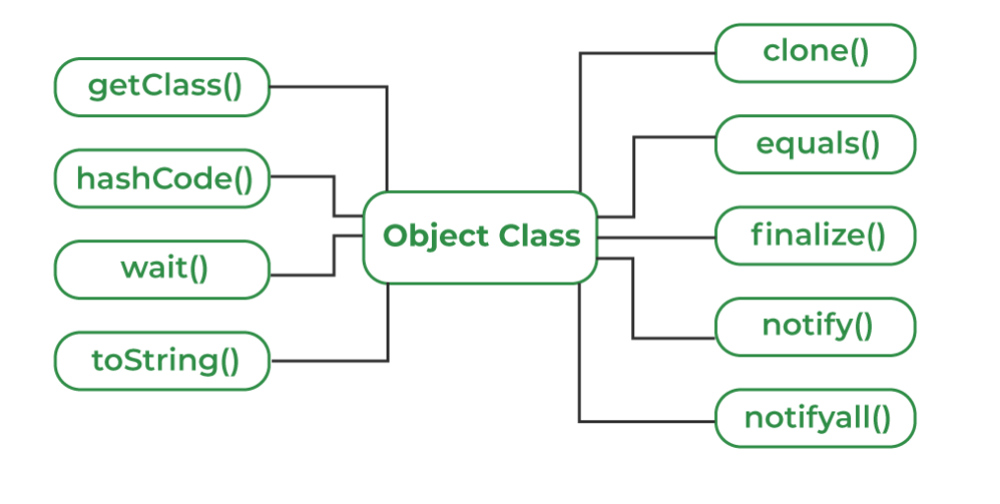

Object class (in java.lang) is the root of the Java class hierarchy. 
Every class in Java either directly or indirectly extends Object. 
It provides essential methods like toString(), equals(), hashCode(), clone() and several others that support object comparison, hashing, debugging, cloning and synchronization.


Acts as the root of all Java classes
Defines essential methods shared by all objects
Provides default behavior for printing, comparing and cloning objects
Supports thread communication (wait(), notify(), notifyAll())


    class Person{
    
        String n;  
    
        // Constructor
        public Person(String n) {
            this.n = n;
        }
    
        // Override toString() for a 
        // custom string representation
        @Override
        public String toString() {
            return "Person{name:'" + n + "'}";
        }
    
        public static void main(String[] args) {
          
            Person p = new Person("Geek");
          
            // Custom string representation
            System.out.println(p.toString());
          
            // Default hash code value
            System.out.println(p.hashCode()); 
        }
    }





1. toString() Method
   
        toString() provides a String representation of an object and is used to convert an object to a String.
Default behavior of toString() is to print class name, then @, then unsigned hexadecimal representation of the hash code of the objec

```java
// Java program to Illustrate
// working of toString() method

public class Geeks 
{

    String name;
    String age; 

    Geeks(String name, String age) {
        this.name = name;
        this.age = age;
        
    }
    
  // Main Method  
  public static void main(String[] args) 
    {

        Geeks g1 = new Geeks("Geeks", "22");
      
        // printing the hashcode of the objects
        System.out.println(g1.toString());


    }
}
```

Output
Geeks@5a07e868


```java
// Java program to Illustrate
// working of toString() method

public class Geeks 
{

    String name;
    String age; 

    Geeks(String name, String age) {
        this.name = name;
        this.age = age;
        
    }
    
    // Overriding toString() method
    @Override
    public String toString() {
        return "Geeks object => {" +
                "name='" + name + '\'' +
                ", age='" + age + '\''+
                '}'
                ;
    }
    
  // Main Method  
  public static void main(String[] args) 
    {

        Geeks g1 = new Geeks("Geeks", "22");
      
        // printing the hashcode of the objects
        System.out.println(g1.toString());


    }
}
```

Output
Geeks object => {name='Geeks', age='22'}


2. hashCode() Method

        hashCode() method returns the hash value of an object (not its memory address). Used heavily in hash-based collections like HashMap, HashSet, etc. 


🔹 1. Default hashCode() in Object

    In java.lang.Object, the default implementation of hashCode() is implementation-dependent, but most JVMs do something like:

Return a number derived from the memory address of the object or some internal object ID.
This is why:

    Object obj1 = new Object();
    Object obj2 = new Object();

System.out.println(obj1.hashCode()); // e.g., 366712642
System.out.println(obj2.hashCode()); // e.g., 1829164700

Different objects → different hash codes (usually).

🔹 2. Hash code is not literally the memory address
    
    JVMs may move objects in memory (due to garbage collection).
    So hashCode() is usually based on an internal object identifier or a calculated value, not the raw memory address.
    HotSpot JVM, for example, keeps a 32-bit or 64-bit object header field for this purpose.
🔹 3. Overridden hashCode()

    If you override hashCode() in your class, the hash code is usually calculated from the object’s fields, not memory:

Example:

    class Person {
    String name;
    int age;
    
        @Override
        public int hashCode() {
            return name.hashCode() * 31 + age;
        }
    }
Here, two Person objects with the same name and age → same hash code
Two objects with different values → likely different hash code


3. equals(Object obj) Method

        equals() method compares the given object with the current object. It is recommended to override this method to define custom equality conditions

🔹 1. Signature in Object

        public boolean equals(Object obj)
        It takes any object as parameter.
        Returns true if the current object is considered “equal” to obj.
🔹 2. Default Behavior

        The default equals() in Object is basically:
        
        public boolean equals(Object obj) {
        return (this == obj);
        }

✅ That is, it compares object references, not their content.

🔹 3. What does this mean?

        String s1 = new String("Java");
        String s2 = new String("Java");
        
        System.out.println(s1.equals(s2)); // true  (String overrides equals)
        System.out.println(s1 == s2);      // false (different references)
        == → checks if both references point to the same object
        Object.equals() → default behaves exactly like ==

So if you don’t override equals(), two objects with identical content are still considered unequal.

🔹 4. When to Override equals()
For value-based comparison (content equality)
Example: Person class

        class Person {
        String name;
        int age;
        
            @Override
            public boolean equals(Object o) {
                if (this == o) return true;              // same reference
                if (!(o instanceof Person)) return false; // not same type
                Person p = (Person) o;
                return age == p.age && name.equals(p.name); // field comparison
            }
        
            @Override
            public int hashCode() {
                return name.hashCode() * 31 + age;      // important for HashMap/Set
            }
        }
Now, two different Person objects with the same name and age → considered equal.
String overrides equals() to compare content, which is why s1.equals(s2) is true even though s1 and s2 are different objects in memory.


When using hashmap with custom objects as keys, you must override both equals() and hashCode() to ensure correct behavior. 
Otherwise, you may get unexpected results when retrieving values from the map.


4. getClass() method

       getClass() method returns the class object of "this" object and is used to get the actual runtime class of the object.
```java
public class Geeks{
    
    public static void main(String[] args)
    {
        Object o = new String("GeeksForGeeks");
        Class c = o.getClass();
        System.out.println("Class of Object o is: "
                           + c.getName());
    }
}
```


5. finalize() method

       finalize() method is invoked by the Garbage Collector just before an object is destroyed. 
       It runs when the object has no remaining references. 
       You can override finalize() to release system resources and perform cleanup, but its use is discouraged in modern Java.
      Object’s default finalize() does nothing: it is emoty method

   6. clone() method

          clone() method creates and returns a copy of the object. 
          The class must implement the Cloneable interface and override clone() to make it public. 
          By default, Object’s clone() performs a shallow copy of the object’s fields.
  

   Shallow copy: copies field values as they are (for reference types, it copies the reference, not the object)
   Deep copy: creates new instances for reference fields (not done by default clone()) 


Example: Shallow Copy

    class Person implements Cloneable {
    String name;
    int[] marks;
    
        @Override
        protected Object clone() throws CloneNotSupportedException {
            return super.clone(); // shallow copy
        }
    }
    
    Person p1 = new Person();
    p1.name = "Alice";
    p1.marks = new int[]{90, 95};
    
    Person p2 = (Person) p1.clone(); // shallow copy

p2 is a different Person object
p2.name → points to the same String object "Alice"
p2.marks → points to the same array object as p1.marks


In case of deep copy p1.marks and p2.marks will point to different array objects with same content

🔹 1. Does Object implement Cloneable?

No.

    Object provides the clone() method, but it does NOT implement the Cloneable interface.
    Cloneable is a marker interface (has no methods) that signals that your class allows cloning.

🔹 2. How it works

    Object.clone() is protected.
    If you call super.clone() on a class that does not implement Cloneable, it will throw:
    CloneNotSupportedException
    So, to actually use clone():

    class Person implements Cloneable {
    String name;
    int age;
    
        @Override
        public Object clone() throws CloneNotSupportedException {
            return super.clone(); // calls Object.clone()
        }
    }

✅ Now you can safely clone Person objects.


Default impl of clone() in Object class

```java
protected Object clone() throws CloneNotSupportedException {
    if (!(this instanceof Cloneable)) {
        throw new CloneNotSupportedException();
    }

    // create a new object of same class
    // copy all fields (primitive + references)
    return shallowCopyOf(this);
}
```

🔹 Why your code fails
Person p = new Person();
p.clone(); // ❌ compile error

Even though Person extends Object:

You are calling clone() from outside the class
protected does not allow access like this


🔹 When it DOES work

Inside the subclass:

class Person implements Cloneable {
@Override
public Object clone() throws CloneNotSupportedException {
return super.clone(); // ✅ allowed
}
}

👉 Because:

You are inside subclass
Calling via super


7. Concurrency Methods: wait(), notify() and notifyAll()
   These methods are related to thread Communication in Java. They are used to make threads wait or notify others in concurrent programming.


2. equals() CONTRACT (VERY COMMON QUESTION)

You should know this:

equals() must be:
Reflexive → a.equals(a)
Symmetric → a.equals(b) == b.equals(a)
Transitive → a=b, b=c ⇒ a=c
Consistent
x.equals(null) → false

👉 Even if you don’t memorize names, understand behavior.


-------------------------------------------------------------------------------------------------------------------------------------------------


🔥 1. Why clone() is considered a “broken design”
❌ Problem 1: Uses marker interface (bad design)

Cloneable has no methods, just a signal.

class A implements Cloneable {}

👉 There’s no contract like:

what to copy?
shallow or deep?
how to handle references?

➡️ Unclear behavior → bad API design

❌ Problem 2: clone() is protected in Object
protected Object clone()

👉 So:

You can’t call it directly
You must override it and make it public

➡️ Feels unnatural and confusing

❌ Problem 3: Default is shallow copy (dangerous)
class Person {
int[] marks;
}
p2 = p1.clone();

👉 Both share same array → bug-prone

➡️ Leads to:

unexpected mutations
hidden bugs
❌ Problem 4: Doesn’t call constructors

👉 clone() bypasses constructors

Person p2 = (Person) p1.clone();

➡️ Constructor logic is skipped:

    validations ❌
    initialization ❌
    
    Java does:
    
    Allocate memory
    Copy all field values from original → new object
    ❌ Does NOT call constructor

❌ Problem 5: Exception handling mess
clone() throws CloneNotSupportedException

👉 Even if your class supports cloning,
you’re forced to handle a checked exception

➡️ unnecessary complexity

✅ Better Alternative: Copy Constructor
class Person {
String name;

    Person(Person other) {
        this.name = other.name;
    }
}

👉 Advantages:

Clear ✔️
Constructor runs ✔️
You control deep/shallow ✔️
No weird exceptions ✔️
✅ Builder Pattern (even better for complex objects)
Person p2 = new Person.Builder()
.name(p1.name)
.build();

👉 Clean, flexible, safe

🎯 Interview Answer

“clone() is considered broken because it relies on a marker interface, performs shallow copying by default, bypasses constructors, and introduces checked exceptions. Modern Java prefers copy constructors or builders for clarity and control.”

🔥 2. Why finalize() is bad (VERY IMPORTANT)
❌ Problem 1: Not guaranteed to run
@Override
protected void finalize() {
System.out.println("Cleaning...");
}

👉 JVM may:

delay it
or NEVER call it

➡️ You cannot rely on it

❌ Problem 2: Unpredictable timing

Garbage Collector runs when it wants

👉 So:

resource cleanup may happen too late
or not at all

➡️ Leads to:

memory leaks
file handle leaks
❌ Problem 3: Performance issues
GC must track objects with finalize()
Extra overhead

➡️ Slows down system

❌ Problem 4: Security & resurrection issues

Inside finalize():

thisRef = this; // resurrect object

👉 Object comes back to life 😵

➡️ Leads to:

unpredictable behavior
security bugs
❌ Problem 5: Deprecated (Java 9+)

👉 Officially discouraged by Java itself

✅ Better Alternative: try-with-resources
try (FileInputStream fis = new FileInputStream("file.txt")) {
// use file
}

👉 Automatically calls close()


------------------------------------------------------------------------------------------------------------------------------------------


