**_Reflection :_**


        ---> Reflection is the ablity of JVM to view, inspect and modify a class's own structure at runtime
        ---> With reflection we can view , modify or call fields, methods, constructors, objects etc

Whenever a class is loaded , for each class it creates a class object which contains metadata about the class like what fields, methods, contsructors it has
what is the acceess modifier and every information about class


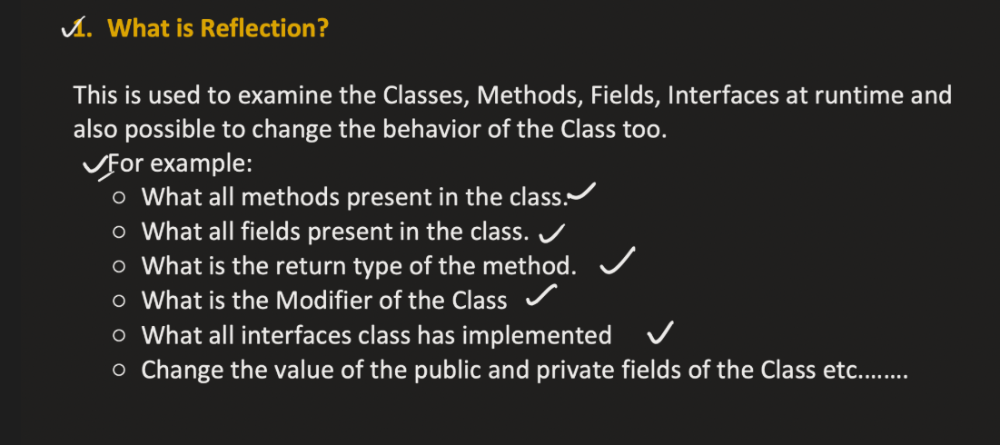

🔥 STEP 1 — Class Loading

When JVM first needs Person (for example new Person(...) or Person.population):

JVM does:

        Reads Person.class bytecode
        Creates metadata structure in Metaspace
        Creates a Class<Person> object in Heap

Links them

Example :
```java

class Person {
    static int population = 0;

    String name;
    int age;

    Person(String name, int age) {
        this.name = name;
        this.age = age;
        population++;
    }

    void sayHello() {
        System.out.println("Hi " + name);
    }
}


```

🔥 STEP 1 — Class Loading

When JVM first needs Person (for example new Person(...) or Person.population):

JVM does:

        Reads Person.class bytecode
        Creates metadata structure in Metaspace
        Creates a Class<Person> object in Heap
        Links them

Metadat contains :

        Person Metadata:
        
        Class name: Person
        Superclass: Object
        
        Fields:
        static int population
        String name
        int age
        
        Methods:
        <init>(String,int)
        sayHello()
        
        Runtime constant pool
        Field offsets
        Method table
        Bytecode


🔹 What Gets Created in Heap?

A special object:

Heap:

    Class<Person> object


+--------------------------------------+
|   Class<Person> object               |
|--------------------------------------|
| name = "Person"                     |
| superclass = Class<Object>          |
| classLoader = AppClassLoader        |
| pointer → Person metadata (Metaspace)
|                                      |
| static variable storage:             |
|     population = 0                   |
+--------------------------------------+


🔥 STEP 2 — Linking Phase

During linking:

        population → allocated
        default value = 0
        
        Still no constructor run.

        ✔ Memory for static variables is allocated
        ✔ Default values are assigned

🔥 STEP 3 — Initialization Phase

Now static initializers run.

If you had:

    static int population = 100;

JVM internally does:

    population = 100

This value is stored inside:  Class<Person> object
Not in metaspace.

🔥 STEP 4 — Creating an Instance

Now: Person p = new Person("John", 25);

JVM does:

        Looks at Class<Person>
        Follows pointer to metadata
        Reads field layout
        Allocates memory in heap
Instance looks like:

Heap:

Person instance:
+------------------+
| name = "John"    |
| age = 25         |
+------------------+

Notice:

No metadata inside instance.
It uses metadata via Class object.


Example 2:


🔥 Example to Prove They Are Different

```java
class Demo {
static {
System.out.println("Initialized");
}

    Demo() {
        System.out.println("Object Created");
    }
}
```

Now:

System.out.println(Demo.class);

👉 Loads class
👉 Links
❌ Does NOT initialize
❌ Does NOT create object

Now:

Class.forName("Demo");

Output:

Initialized

👉 Class initialized
❌ No object created

Now:

new Demo();

Output:

Initialized
Object Created

👉 Class initialized (if not already)
👉 Object created


----------------------------------------------------------------------------------------------------------------------------------

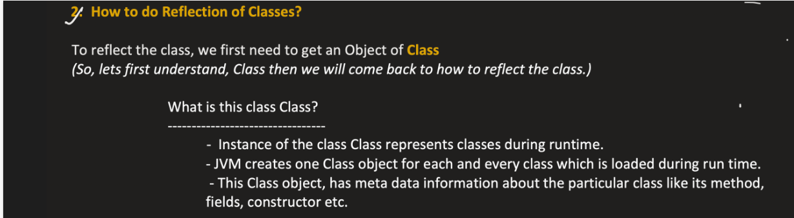

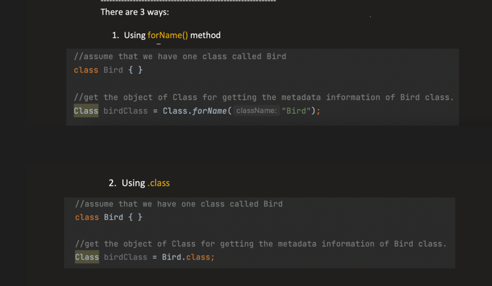

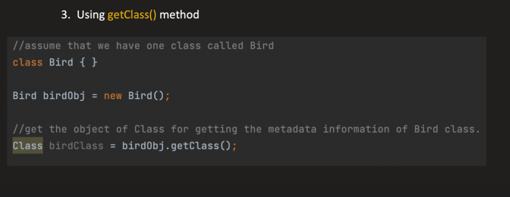


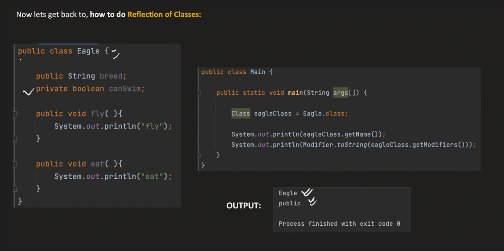


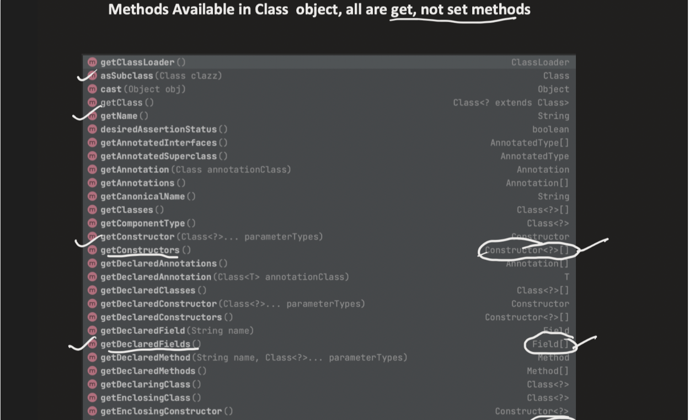
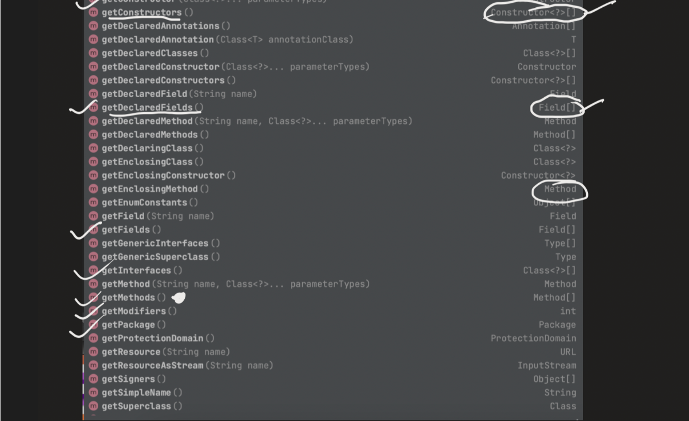


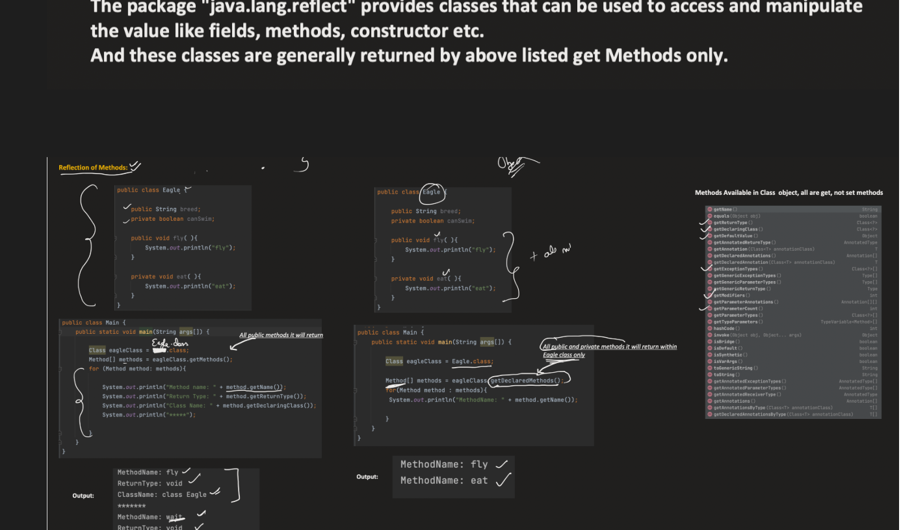

Spring does NOT write:

userService.save();

Instead it does something like:

Method method = bean.getClass().getMethod("save");
method.invoke(bean);

Because Spring doesn't know your class at compile time.

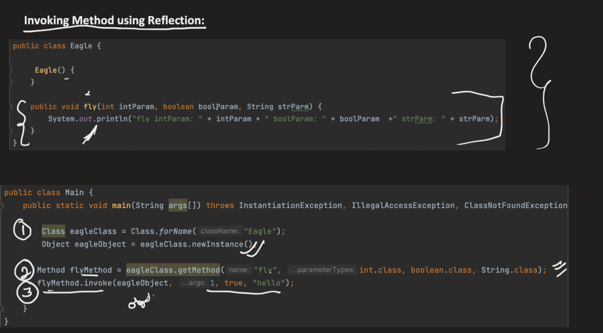


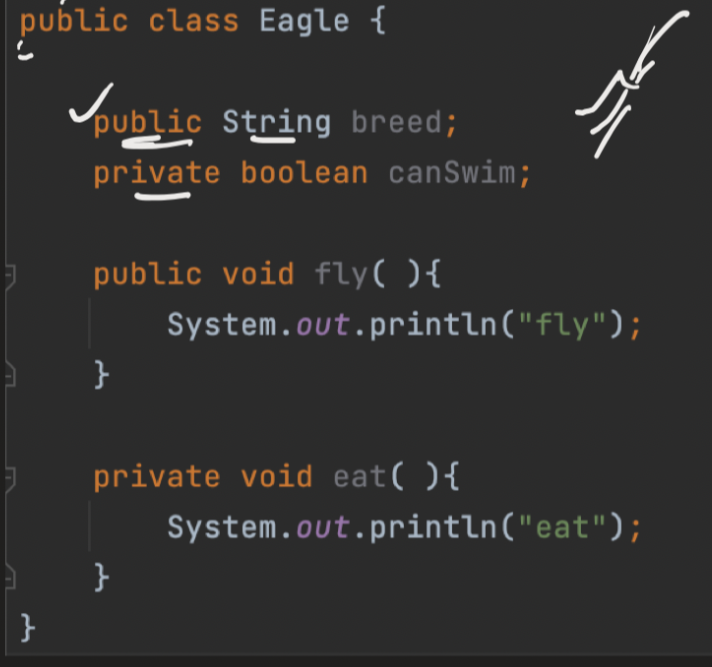

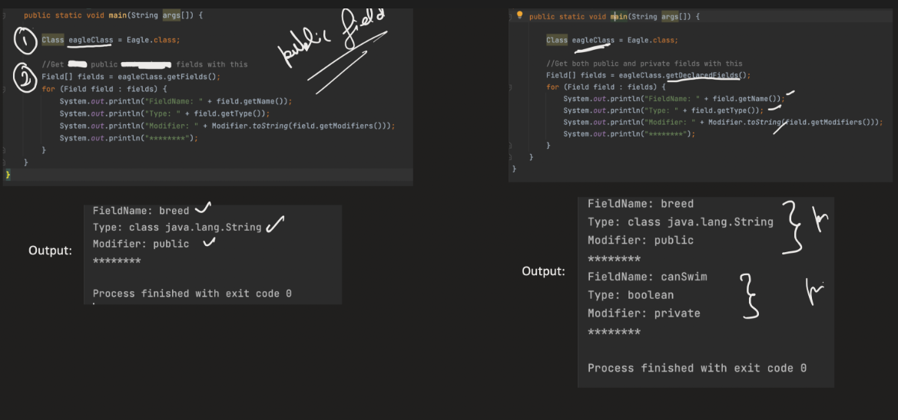


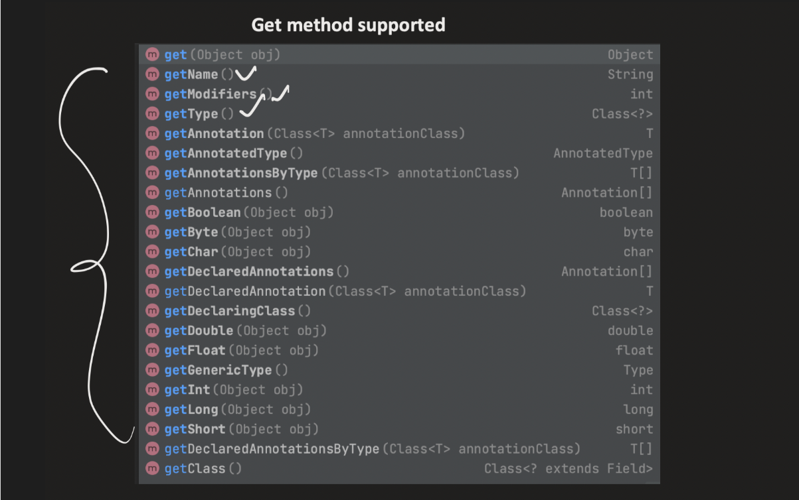

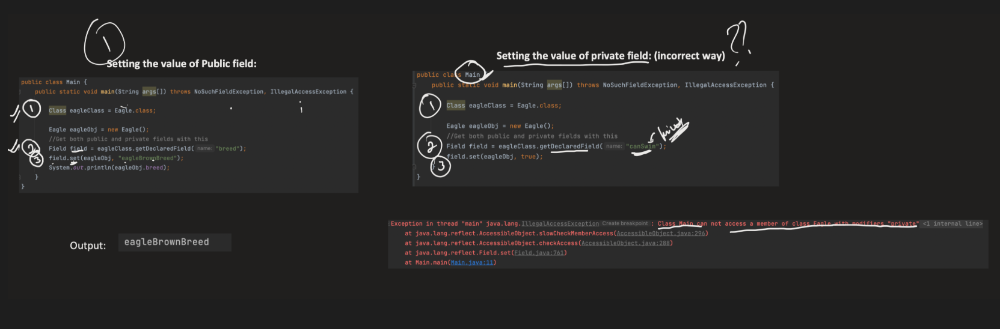


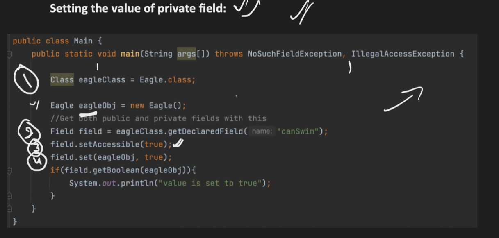


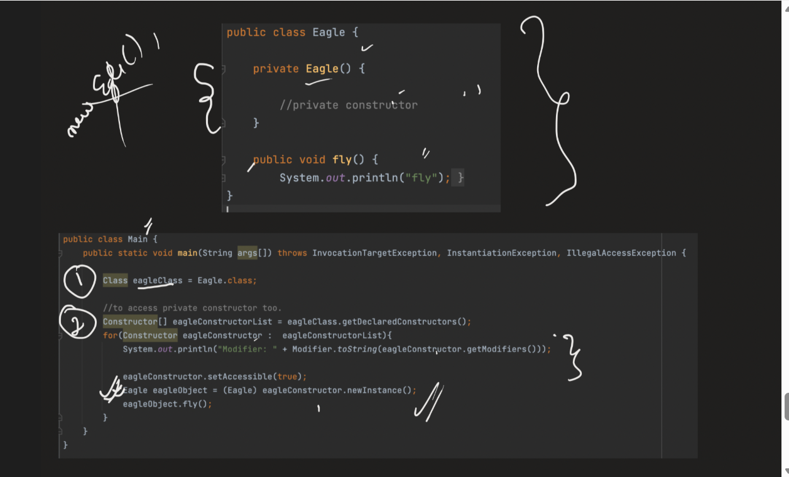

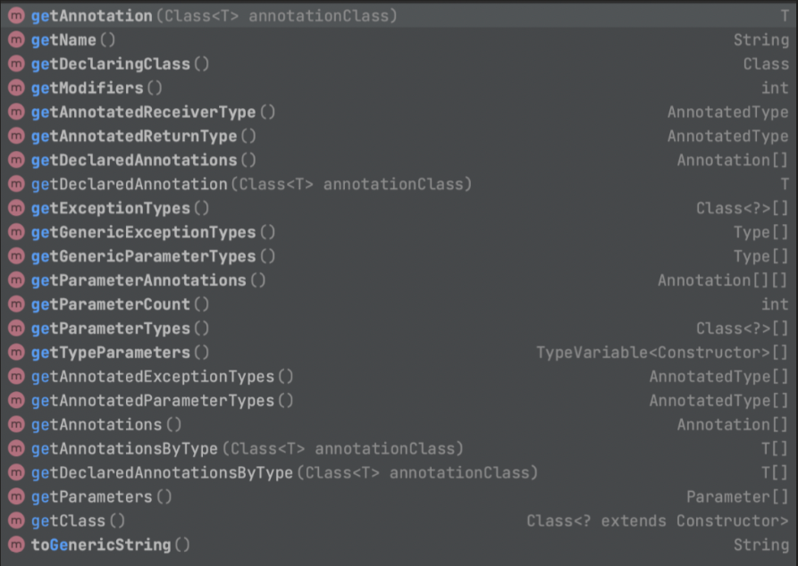