ANNOTATIONS:

        -> Annotations are metadata added to classes, methods, fields, etc.
        -> Metadata means information about the program structure.
        -> Depending on their retention policy, annotations can be processed:
                - At compile time (by compiler or annotation processors)
                - At runtime (by reflection or bytecode readers)
        -> Annotations marked with RetentionPolicy.RUNTIME can be read using reflection,
          and frameworks can execute logic based on them.

Example :

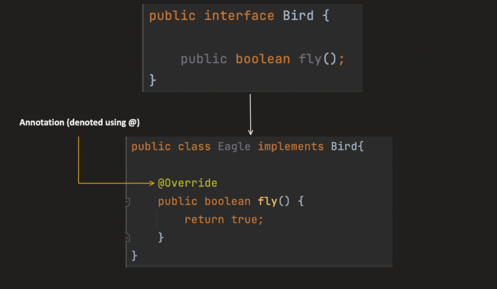

For example : Compiler uses @Override annotation and by mistake while overriding a method if we made a typo in the method name
              compiler will throw error
              Say if we didnot provide override and do a typo it will treat it as a seperate method

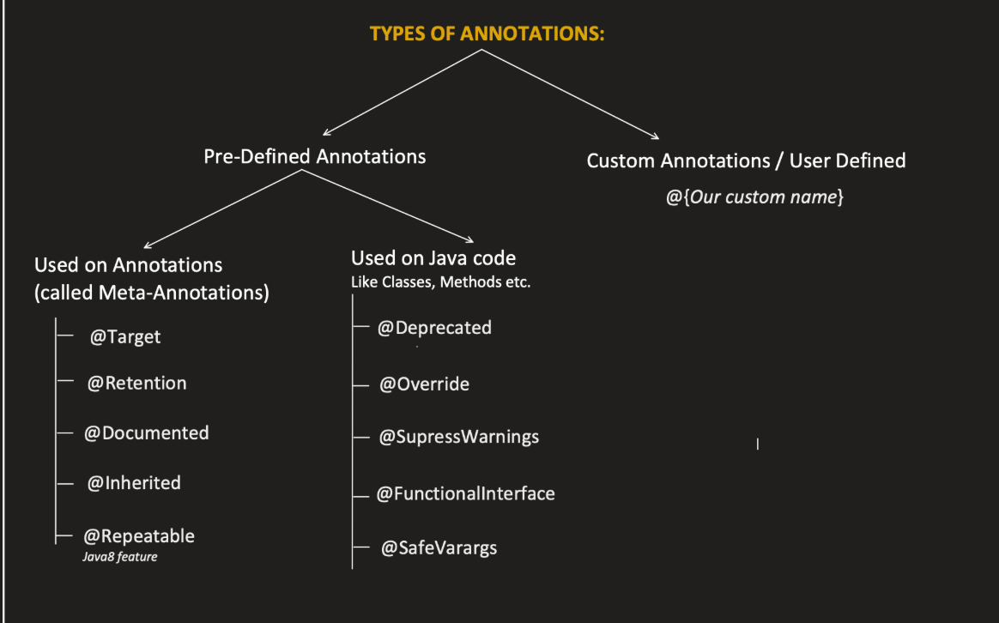

🔹 1️⃣ The Core Problem

        Before annotations, configuration was mostly done using:

❌ XML

Example (old Spring style):

        <bean id="userService" class="com.app.UserService"/>

Problems:

        Separate from code
        Hard to maintain
        Not type-safe
        Verbose
        Easy to misconfigure

🔥 2️⃣ What Annotations Solve

    Annotations allow you to keep configuration close to the code it affects.

Instead of XML:

@Service
class UserService {}

Now:

    Configuration is near the class
    Easier to read
    Less boilerplate
    Cleaner design
    Frameworks like Spring Framework heavily rely on this idea.

🔹 3️⃣ Why Not Just Use Code?

You might ask:

    Why not just write normal Java logic instead of annotations?

Because annotations allow:

✅ Declarative Programming

Instead of writing:
    
    public void save() {
    startTransaction();
    // business logic
    commitTransaction();
    }

You just write:

    @Transactional
    public void save() {}

You declare what you want, not how it works.

Framework handles the how.

🔥 4️⃣ What Annotations Actually Enable

They enable frameworks to:

        Discover components automatically
        Apply cross-cutting logic (AOP)
        Configure behavior declaratively
        Reduce boilerplate
        Improve readability

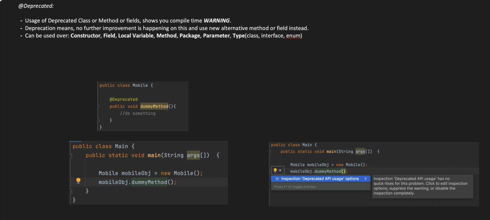

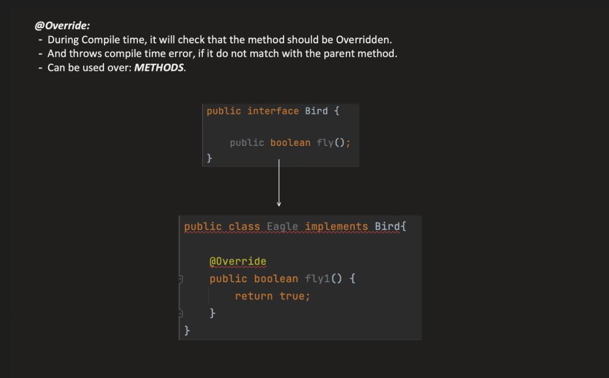

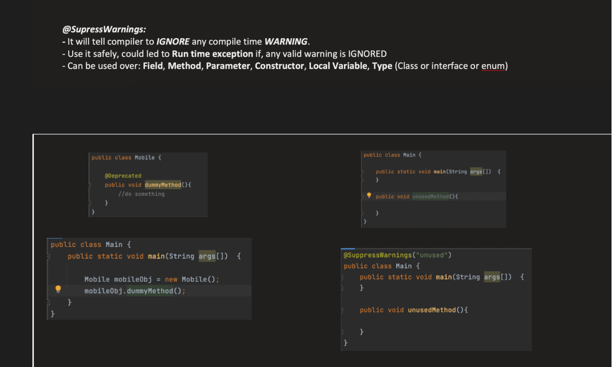

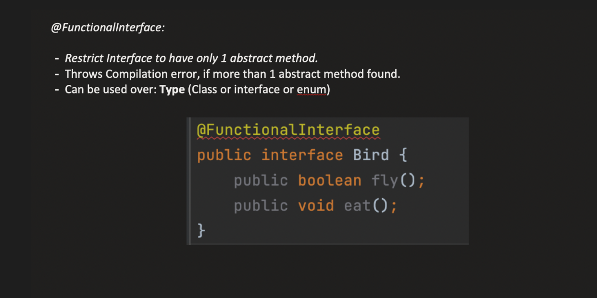

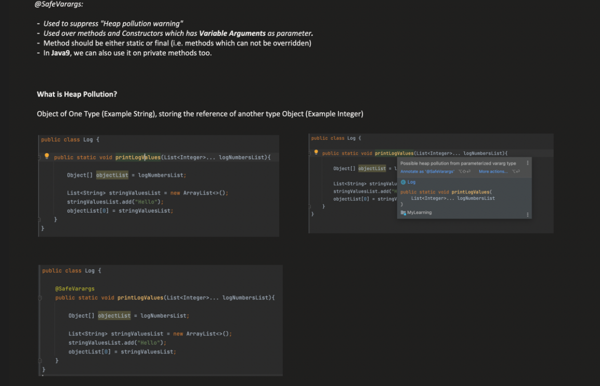

**_META ANNOTATIONS:_**

---> These are annotations used on top of another annotations

1. **_TARGET:_**

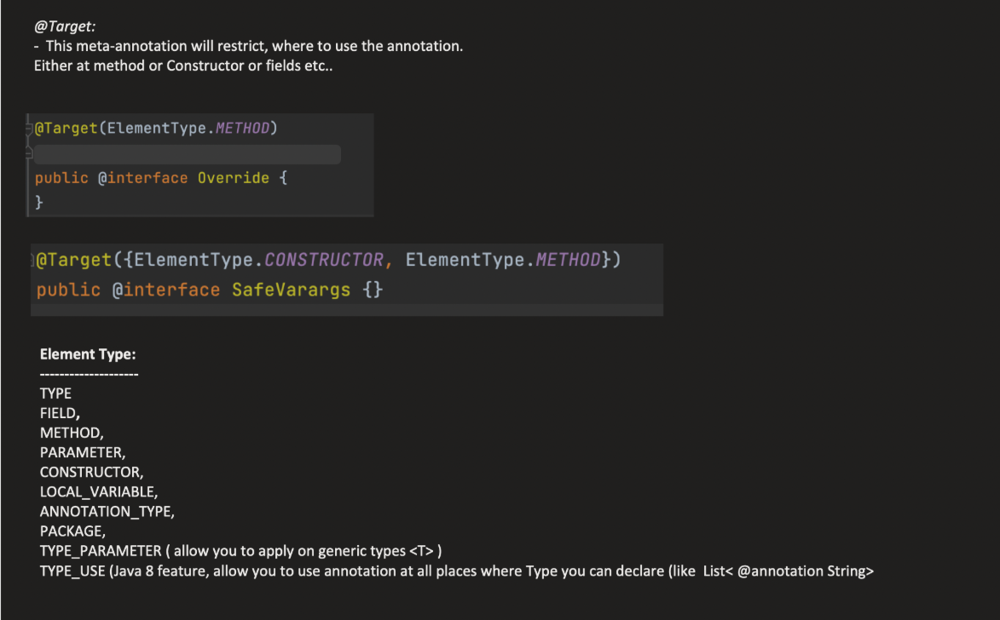

Here type can be class, interface or enum
All meta annotations on their inside will have @Target(ANNOTATION_TYPE) so that they can be used on top of another annotation

2. **_RETENTION:_**

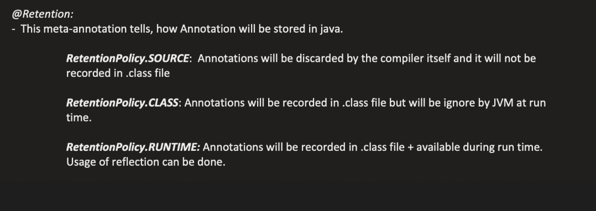

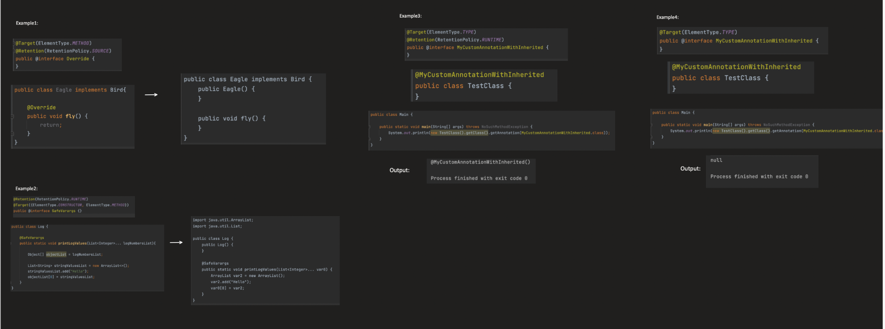

RetentionTYpe.class can be used by bytecode readers , compilers or tools which work with byte codes

3. **_DOCUMENTED :_**

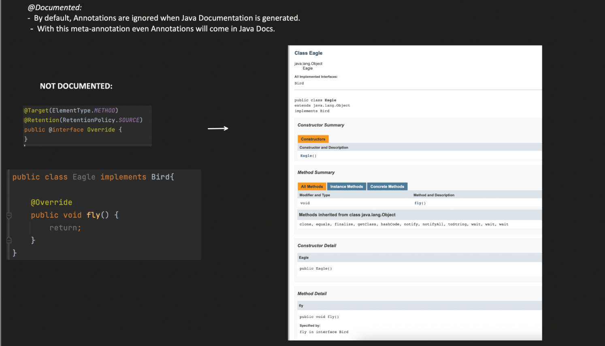

Java docs are created by reading .java files the human wriiten files before compilation

🔹 2️⃣ Generate Javadoc in IntelliJ
Tool Used:

👉 javadoc (comes with JDK)

**_Steps in IntelliJ:**_

Go to:

    Tools → Generate JavaDoc

Choose:

        Output directory
        Scope (module/package)
        Click OK

It generates HTML documentation.

Then open:

        index.html

in the generated folder.

4. **_@Inherited :_**

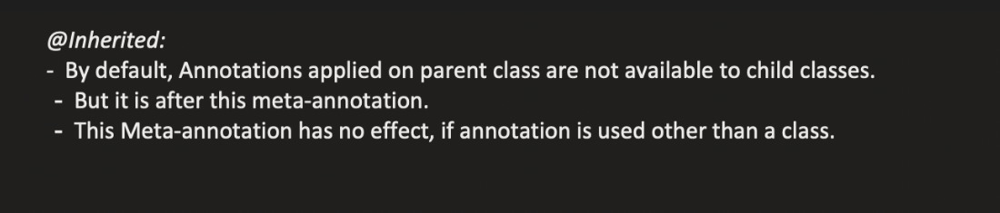

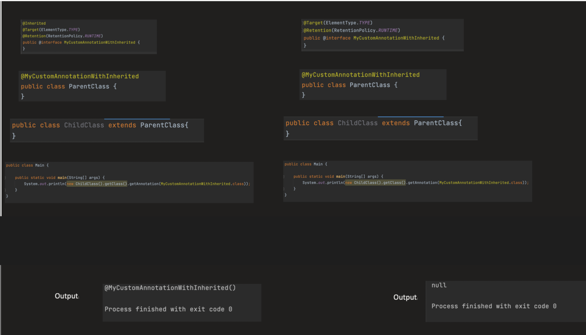

5. **_@Repetable :_**

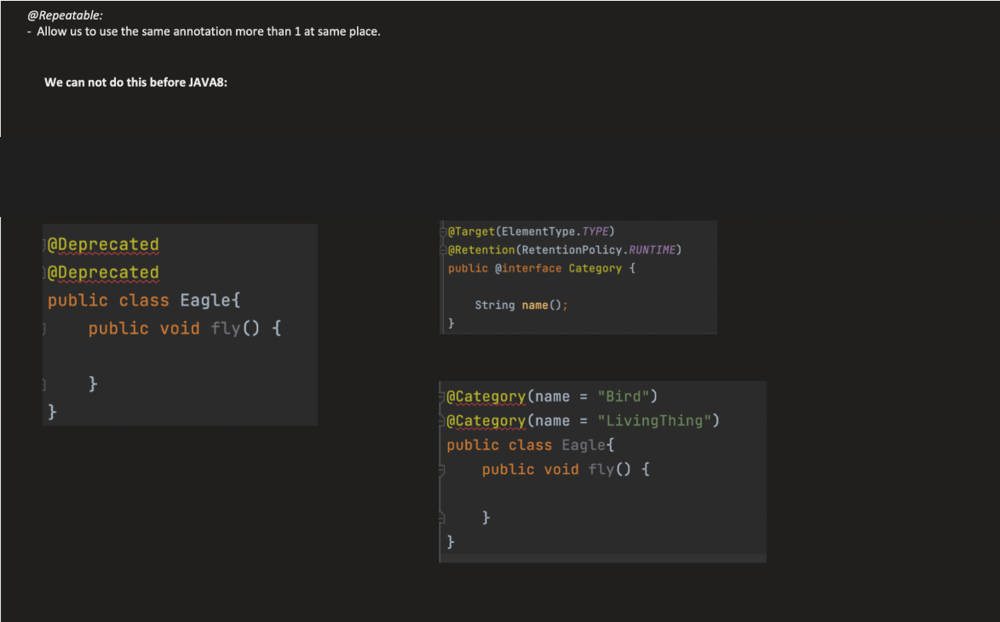

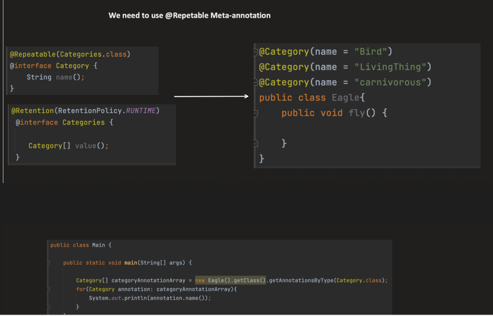

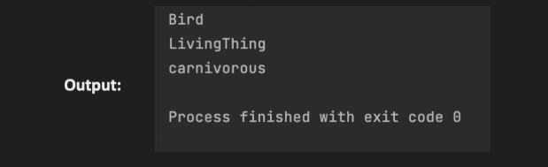

===> CUSTOM ANNOTATIONS :

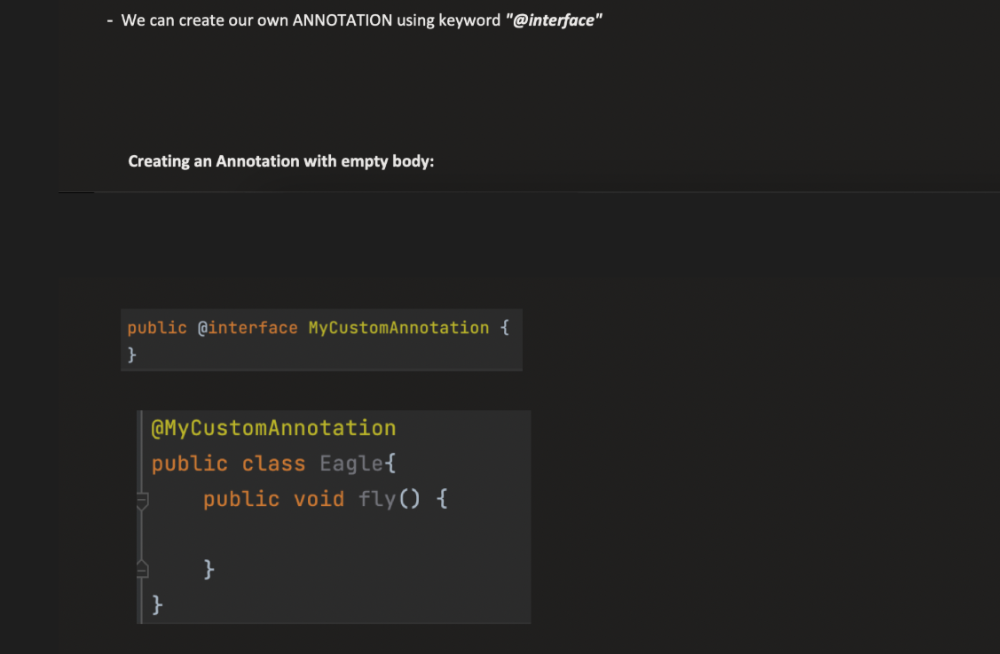

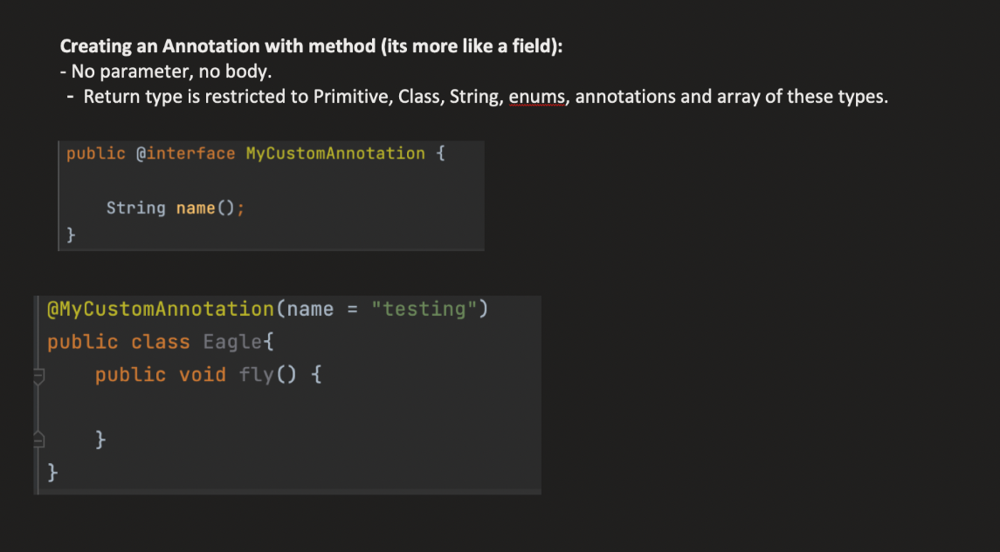

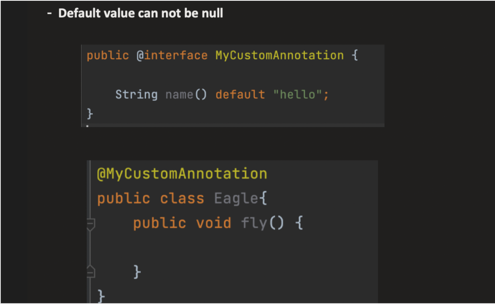

--------------------------------------------------------------------------------------------------------------------------------------

Problem with repetable , why it is used

🔹 The Problem Before Java 8

Before Java 8, you could NOT write:

        @Role("ADMIN")
        @Role("USER")
        class Test {}

It was illegal.

So people had to write:

    @Roles({
    @Role("ADMIN"),
    @Role("USER")
    })
    class Test {}

Notice:

👉 A container annotation
👉 That container holds an array

🔹 Java 8 Solution: @Repeatable

Java 8 introduced:

        @Repeatable(Roles.class)
        @interface Role {
        String value();
        }

And container:

        @interface Roles {
        Role[] value();
        }

Now you can write:

        @Role("ADMIN")
        @Role("USER")
        class Test {}

But internally…

🔥 What Actually Happens?

The compiler rewrites this:

        @Role("ADMIN")
        @Role("USER")

Into this:

        @Roles({
        @Role("ADMIN"),
        @Role("USER")
        })

So the array is required because:

    The container annotation must store multiple annotation instances.
    And the only way to store multiple values in an annotation is:

👉 Using an array.

When you write:

    @interface Role {
    String value();
    }

        This is actually syntactic sugar for something like:

    public interface Role extends java.lang.annotation.Annotation {
    String value();
    }

Without repeatable this was how it was used

        @interface Roles {
        Role[] value();
        }

    Role is again an interface