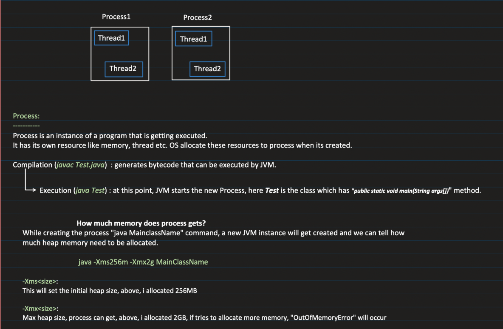
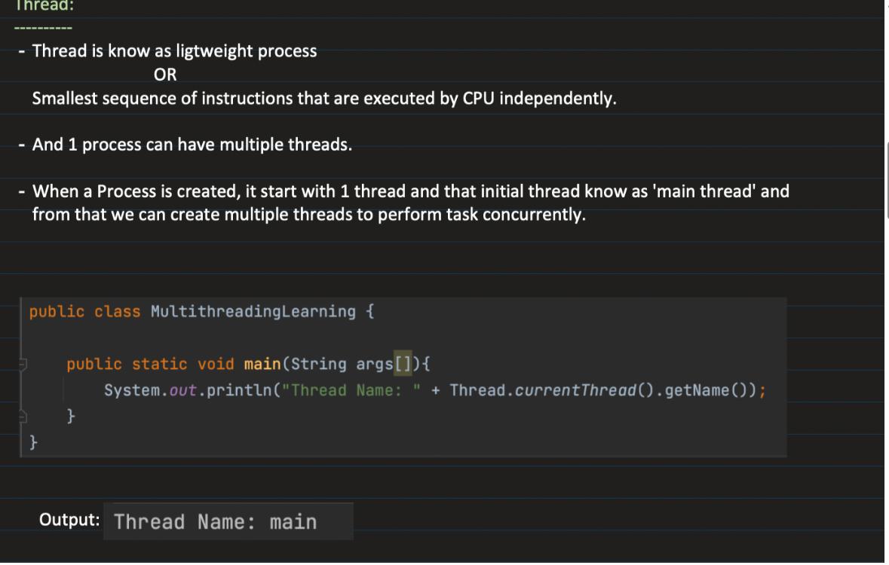
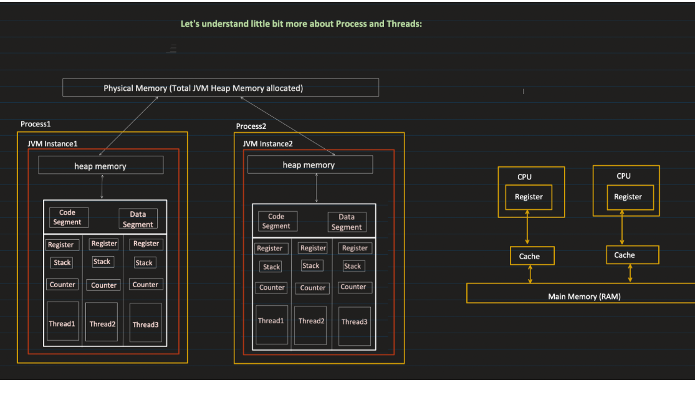

**_PROCESS :_**

    ---> Process is an instance of program being executed and process are managed by OS
    ---> Whenever we run a Java Program Process gets created and OS allocates memory to process and also a new JVM instance is created and loaded into process and also byte code is loaded to process
    
    ---> When a program runs, these things physically exist in RAM and CPU:
    
            Memory allocated in RAM
            CPU registers holding values
            Program counter
            Stack frames
            Heap memory
            OS kernel data structure (PCB)
            All these are real.
    
    The OS groups all of this together and says:
    “This entire execution unit = Process”

**_THREADS:**_

    ---> A thread is a lightweight unit of execution within a process
    ---> A thread is a single flow of execution (sequence of instructions) executed by the CPU within a process.
    ---> Whenever we run a Java prog process is create with only one thread known as main Thread

🔹 What is a JVM Thread?

    A JVM thread:
    
        Is created using new Thread() in Java
        Managed partly by JVM
    
    Has:
    
        Java stack
        Program counter
        Thread state (NEW, RUNNABLE, BLOCKED, etc.)

An OS thread:

    Is created by the operating system
    Scheduled by OS scheduler
    
    Has:
    
        CPU registers
        Native stack
        Kernel-level structure
    
    It is managed entirely by the OS kernel.

How They Work Together

        CPU executes JVM interpreter/JIT machine code.
        Interpreter code may read/write JVM “registers” (memory) for temporary values.
        CPU PC register points to interpreter instructions, not to JVM bytecode or JVM registers.
        JVM bytecodePC (counter) tells interpreter which bytecode instruction to read next.
        So the JVM “registers” are simulated, while CPU registers are real hardware.
        JVM register is used to store intermediate values so that it will be helpful for context switching
✅ WHAT PEOPLE ACTUALLY MEAN

When they say “JVM registers”, they usually mean:

👉 Inside each stack frame:

        ✔️ Local Variable Array
        Stores method variables
        int a = 10;
✔️ Operand Stack

    Used for calculations

Example:

int c = a + b;

Steps:

        push a
        push b
        add
        store result

-------------------------------------------------------------------------------------------------------------------------------------------------

1. JVM main thread

When you run:

public class Test {
    public static void main(String[] args) {
    System.out.println("Hello");
}
}

JVM creates its main thread object for Thread.currentThread() → main.

This is the java.lang.Thread object representing the main thread in the JVM.

So yes, the JVM itself has a Thread object for the main thread.

2. OS thread for main

When the JVM process starts, the OS creates a main thread for that process (all processes start with a main thread at the OS/kernel level).

JVM links the Thread object to this OS thread.

So the main thread is both a JVM thread object and a native OS thread.

In other words:

Concept	Exists?	Notes
JVM main Thread	✅ Yes	java.lang.Thread object
OS main Thread	✅ Yes	Created by OS when process starts
Linked?	✅ Yes	JVM thread object references the OS thread underneath
3. Memory & Execution

OS stack: allocated by OS for main thread.

JVM stack: JVM may use the OS stack for its frames (method calls, locals) or maintain additional Java stack frames.

Registers, TCB, state: all managed by OS.

JVM thread object: holds Java-level info like thread name, priority, ThreadLocals, thread state.

So when your main method runs:

CPU executes OS main thread instructions.

JVM interprets those instructions as running on main Thread object.

Any new threads you create are separate OS threads, each with its own JVM thread object.

-------------------------------------------------------------------------------------------------------------------------------------------

so whenever we create athread JVM will just create a thread obj and Os will create the actual thread and it is linked 
and JVM will jave some memory in its allocaetd memory for each thread and OS will have seperate memory for each thread
SO for a thread JVM will allocate seperate memory and OS will allocate seperate memory

---------------------------------------------------------------------------------------------------------------------------------------------------

✅ 1️⃣ Thread creation

    Whenever we create a thread JVM thread obj is created which is linked to native thread created by OS

✔️ Correct (for HotSpot JVM)

        Java uses 1:1 threading model:
        Java Thread object (heap)
        ↕
        Native OS thread

The JVM calls the OS to create a real native thread.

⚠️ 2️⃣ “Each thread will have JVM counters for pointing to next byte code in meta space”

Almost correct, but wording needs fixing.
Correct version:

Each Java thread has:

        ✅ JVM Program Counter (PC)
        Points to the next bytecode instruction
        NOT pointing to Metaspace
        Points to bytecode inside the method area (Metaspace)

So:

Bytecode is stored in Metaspace
JVM PC points to the current instruction inside that bytecode

⚠️ 3️⃣ “JVM registers to store intermediate thread values”

Not exactly correct terminology.
There are no general “JVM registers” like CPU registers.

Instead, each thread has:

        ✔️ Operand Stack (inside each stack frame)
        ✔️ Local Variable Array
        ✔️ Java Stack

These store intermediate values during execution.

So replace: JVM registers

With: Operand stack and local variables inside stack frames

⚠️ 4️⃣ “PC registers which is physical hardware”

This is where things mix.

There are TWO PCs:

🔹 JVM PC (Logical)

        One per Java thread
        Tracks next bytecode instruction
        Stored in JVM thread structure

🔹 CPU PC (Hardware register)

        Exists inside CPU core
        Points to next machine instruction
        Used when native machine code executes

So:

    ❌ JVM PC is NOT physical hardware
    ✔️ CPU PC is hardware

⚠️ 5️⃣ “Caches for each cpu cores”

        Not correct.
        CPU cache (L1/L2/L3):
        Belongs to CPU core
        NOT per thread
Important:

        ✅ L1 cache → private per core
        ✅ L2 cache → usually private per core
        ✅ L3 cache → shared across cores
        Multiple threads may use same cache when scheduled on same core

Threads do NOT have their own hardware caches.

------------------------------------------------------------------------------------------------------------------------

A Process is a running program.

When you run a Java program:

        OS creates a process
        Memory is allocated (RAM)
        A JVM instance is started inside that process
        Your .class (bytecode) is loaded into memory
        Inside a Process (what actually exists)
        Heap memory (objects)
        Stack memory (method calls)
        CPU registers (real hardware)
        Program Counter (real hardware)
        OS data (PCB – Process Control Block)

👉 The OS groups all this and calls it a Process

🚀 THREAD (Clean Version)

    A Thread is a unit of execution inside a process.
    
    A process can have multiple threads
    Each thread runs independently
    All threads share the same heap, but have their own stack

When you run a Java program:

👉 One thread is created by default → main thread

🚀 JVM THREAD vs OS THREAD (VERY IMPORTANT)
✅ Java Thread (JVM side)

Created using:

new Thread()

It has:

Java stack
Program Counter (JVM-level)
Thread state (RUNNABLE, BLOCKED, etc.)
✅ OS Thread (Real thread)

Created by the Operating System.

It has:

CPU registers (real hardware)
Native stack
Scheduled by OS
🔗 HOW THEY ARE CONNECTED

Java uses a 1:1 model:

👉 One Java thread = One OS thread

So when you do:

new Thread().start();

What happens:

JVM creates a Thread object (in heap)
JVM asks OS to create a real thread
OS creates native thread
Both are linked

✔️ JVM manages logic
✔️ OS executes it physically

🚀 MEMORY PER THREAD (VERY IMPORTANT)
Each thread has:
✅ JVM Side
Java Stack
Local variables
Method calls
Operand Stack (for calculations)
JVM Program Counter (points to next bytecode instruction)
✅ OS Side
Native stack
CPU registers
Thread control block
⚠️ IMPORTANT CORRECTIONS (Your Confusions Fixed)
❌ "JVM registers"

Not correct

✔️ Correct term:

Operand Stack
Local Variables
❌ "PC points to Metaspace"

Not correct

✔️ Correct:

Bytecode is stored in Metaspace
JVM PC points to next instruction in that bytecode
❌ "PC is hardware"

Half wrong

There are TWO PCs:

Type	Description
JVM PC	Logical (per thread)
CPU PC	Physical hardware register
❌ "Each thread has its own cache"

Wrong

✔️ Cache belongs to CPU core:

L1 → per core
L2 → per core
L3 → shared

👉 Threads just use cache, they don’t own it

🔥 FINAL SIMPLE FLOW (BEST WAY TO EXPLAIN)

When you run a Java program:

OS creates a Process
JVM starts inside it
OS creates main thread
JVM creates Thread object and links to OS thread

When you create a new thread:

JVM creates Thread object
OS creates real thread
Both are linked (1:1)

+--------------------------------------------------+
|                  PROCESS (OS)                    |
|  (Created when you run: java Test)               |
|                                                  |
|  +--------------------------------------------+  |
|  |                JVM INSTANCE                |  |
|  |                                            |  |
|  |   Heap (Shared by all threads)             |  |
|  |   +------------------------------------+   |  |
|  |   |   Objects, Strings, Class data     |   |  |
|  |   +------------------------------------+   |  |
|  |                                            |  |
|  |   +-------------+   +-------------+         |  |
|  |   | Thread-1    |   | Thread-2    |         |  |
|  |   | (main)      |   |             |         |  |
|  |   +-------------+   +-------------+         |  |
|  |        |                    |                |  |
|  |   +----------+        +----------+          |  |
|  |   | Stack    |        | Stack    |          |  |
|  |   | (Java)   |        | (Java)   |          |  |
|  |   +----------+        +----------+          |  |
|  |   | PC Reg   |        | PC Reg   |          |  |
|  |   +----------+        +----------+          |  |
|  |                                            |  |
|  +--------------------------------------------+  |
|                                                  |
|  OS Threads (Real execution)                     |
|  Thread-1 ↔ CPU                                  |
|  Thread-2 ↔ CPU                                  |
+--------------------------------------------------+

Java Thread (JVM)              OS Thread (Native)
-------------------           -------------------
Thread object                 Real thread (kernel)
Java Stack                    Native Stack
JVM PC                        CPU Registers
Thread State                  Scheduled by OS

        🔗 1 : 1 Mapping

Thread
|
+----------------------+
|  Java Stack          |
|  ------------------  |
|  Frame 1 (method A)  |
|  Frame 2 (method B)  |
|                      |
|  Each Frame has:     |
|   - Local variables  |
|   - Operand stack    |
+----------------------+
|
+----------------------+
| JVM Program Counter  |
| (next bytecode line) |
+----------------------+

CPU Core
|
+-- Registers (REAL)
+-- Program Counter (REAL)
+-- Cache (L1/L2/L3)

        ↑
        |
OS Thread runs here
↑
|
JVM Thread mapped here

You run: java Test

        ↓

OS creates PROCESS

        ↓

JVM starts inside process

        ↓

OS creates MAIN THREAD

        ↓

JVM links Thread object to OS thread

        ↓

CPU executes instructions

🧠 CPU REGISTERS vs CACHE (SIMPLE + CLEAR)
✅ 1️⃣ CPU REGISTERS

👉 Registers are tiny, ultra-fast storage inside the CPU core

🔹 What they store:
Current values being processed
Intermediate results
Addresses (like Program Counter)
🔹 Examples:
General registers (R1, R2…)
Program Counter (PC)
Stack Pointer
🔹 Key points:
✔️ Fastest memory in the system
✔️ Very small (few bytes to KB)
✔️ Used directly by CPU instructions
✅ 2️⃣ CPU CACHE

👉 Cache is a small memory between CPU and RAM

🔹 What it stores:
Frequently used data from RAM
Recently accessed memory
🔹 Levels:
L1 (fastest, smallest)
L2
L3 (larger, shared)
🔹 Key points:
✔️ Faster than RAM
❗ Slower than registers
✔️ Helps reduce memory access time

🧠 HOW REGISTERS AND CACHE INTERACT
🔹 Flow of data:
RAM → Cache → Registers → CPU executes
⚙️ STEP-BY-STEP
1️⃣ Data comes from RAM
Needed data is first loaded into cache
2️⃣ From Cache → Registers
CPU loads data from cache into registers
Now CPU can operate on it
3️⃣ CPU processes data
All calculations happen inside registers
4️⃣ Result goes back
Registers → Cache → RAM (eventually)