**_MULTI THREADING:_**

----> MUltiThreading is a technique by which multiple tasks run simultaneously (i.e) multiple threads are executed within a process simultaneously
----> It looks like multiple threads are executed parallely but it is not parallel execution context switching happens

Threads share the same memory:

    All threads of a process share code, data, and resources.
    Each thread has its own stack (local variables, execution context).

Concurrency vs Parallelism:

    Concurrency: Threads take turns executing on a single CPU core.
    Parallelism: Threads run simultaneously on multiple CPU cores.

Lightweight:

    Creating threads is cheaper than creating separate processes because threads share resou
rces.

Uses of Multithreading

        Improved Performance:
        Run multiple tasks simultaneously to utilize CPU efficiently.
        Example: A video player can decode video, play audio, and handle user input simultaneously.
        
        Responsive Applications:
        In GUI apps, background tasks like downloading files or fetching data can run in a thread while the main thread keeps the interface responsive.
        
        Resource Sharing:
        Threads can easily share data and resources of the parent process without inter-process communication (IPC).
        
        Real-time Applications:
        Useful in systems that need to perform multiple operations at once, e.g., embedded systems, games, or stock trading platforms.
        
        Server Handling Multiple Clients:
        Web servers use threads to handle multiple client requests concurrently.
        When multithreading helps even on 1 core
        
        I/O-bound tasks:
        If Task A is waiting for a disk or network, the CPU can switch to Task B instead of idling.
        This reduces idle CPU time and improves throughput.
        
        GUI responsiveness:
        User interface thread can remain responsive while background tasks run in separate threads.

When multithreading helps even on 1 core

    I/O-bound tasks:
    If Task A is waiting for a disk or network, the CPU can switch to Task B instead of idling.
    This reduces idle CPU time and improves throughput.
    
    GUI responsiveness:
    User interface thread can remain responsive while background tasks run in separate threads.

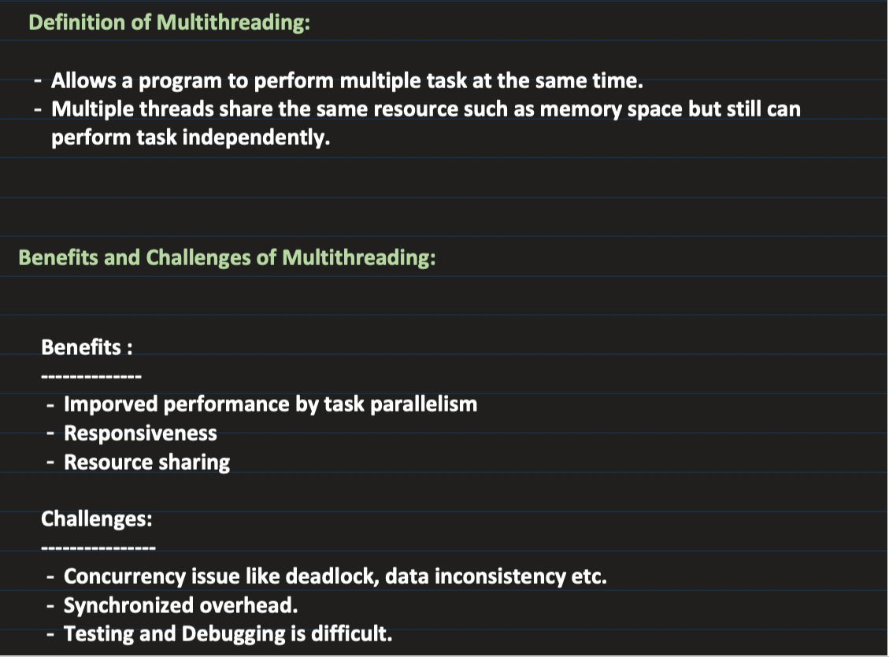

Thread Creation :

2 ways : extend thread class, implement runnable interface

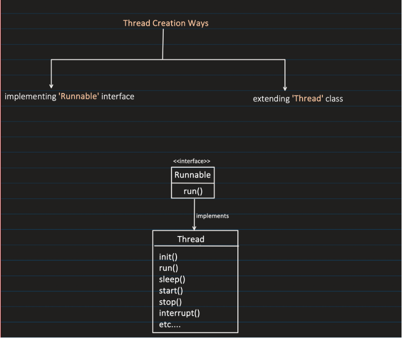

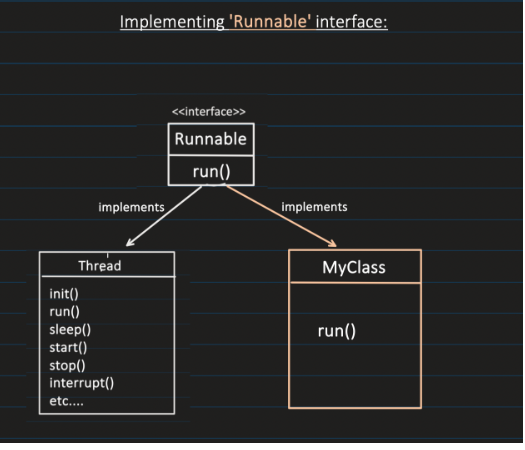

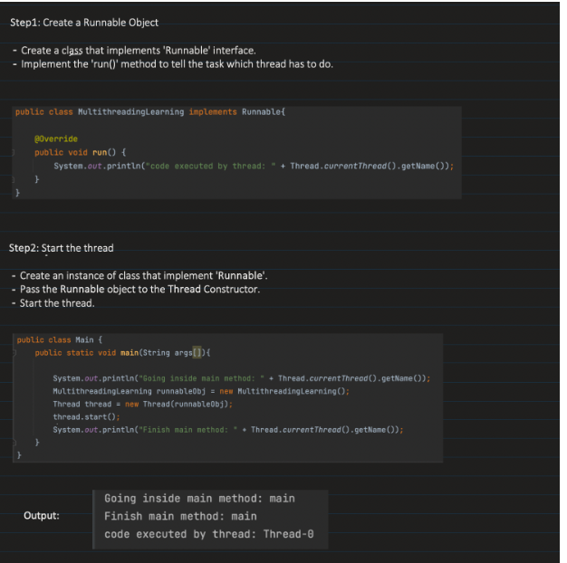

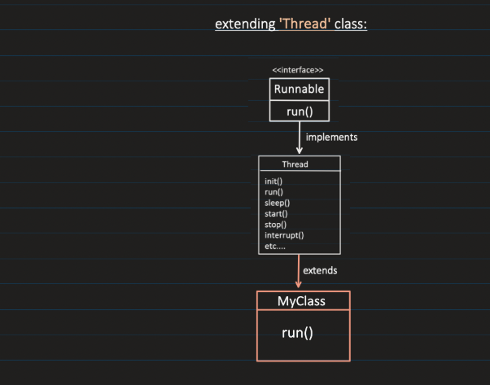

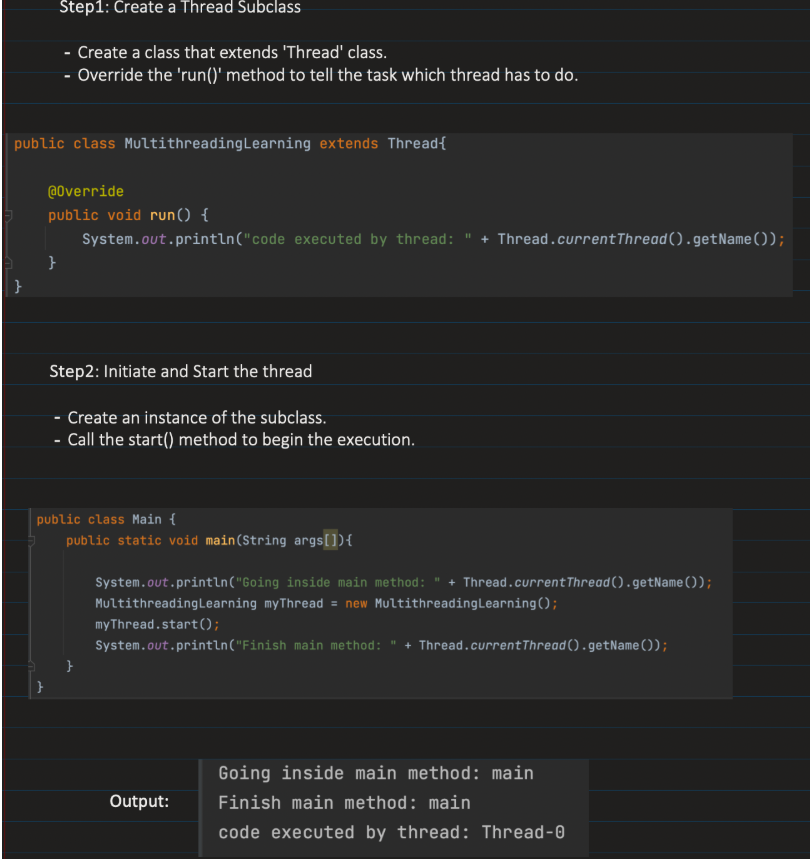

**_Thread Lifecycle :**_

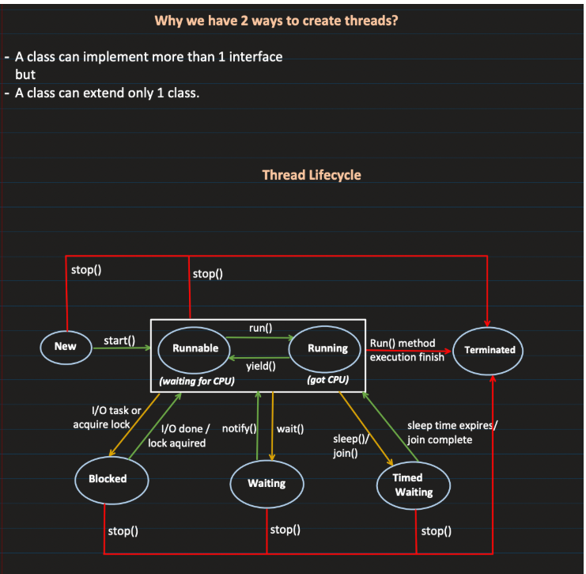

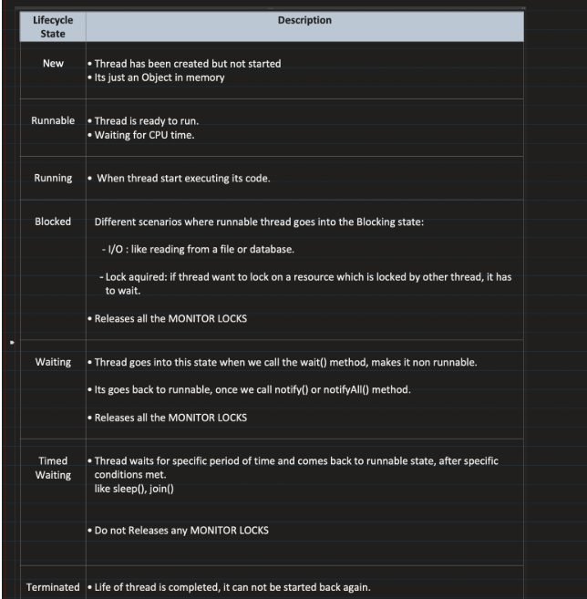

    wait() ----> Thread will release monitor lock and wil go to waiting state, Any other thread has to use notify/notify ALl to change from wait to runnable/running
    
    notify() ----> any thread hitting notify will make any random thread which is in wait state to blocked (will wait till lock is released)
    
    notifyAll() ----> any thread htiiting notifyAll will make all the threads in wait state to blocked (will wait till lock is released)

    sleep() ---> It will make the therad to go for timed wait it doesnot release monitor lock , after time it becomes runnable

In Java, wait(), notify(), and notifyAll() only work when the thread holds the monitor lock on the object, which means the thread must be inside a synchronized block or method on that object.

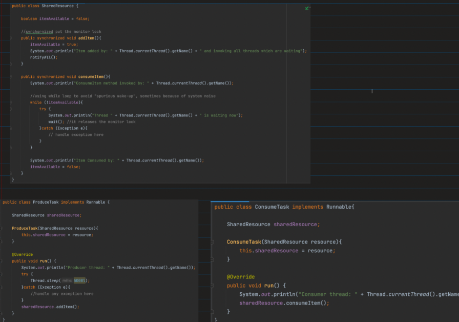
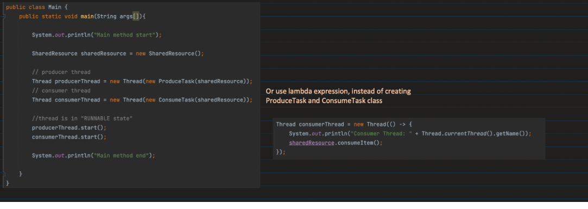
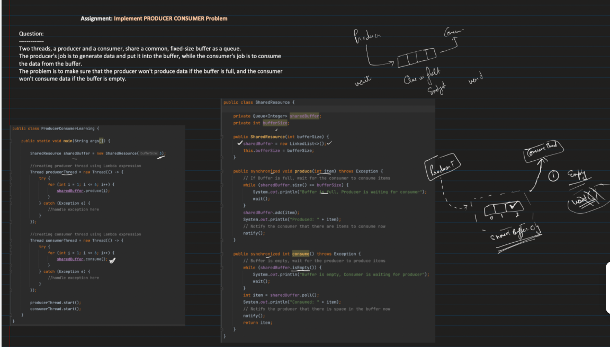
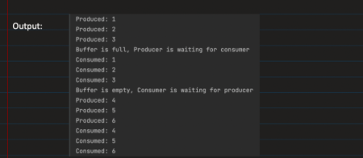

stop() ---> it will move the thread to terminated. All locks held by the thread are released.
suspend() ---> it will make the thread to suspend,  state will be runnable but no monitor lock is releaes
resume()  ---> resumes the suspended thread

here both stop() and suspend() will cause deadlock situtions

DEADLOCK :

🛑 What is Deadlock?

Deadlock is a situation in multithreading where:

    Two or more threads are blocked forever, each waiting for a resource (lock) held by another thread.
    No thread can make progress.
    System appears “frozen” for those threads.

join()  ----> It makes the current thread to wait for any other thread which the current thread invokes join on

THREAD PRIORITY : 

Thread priority is a hint to the thread scheduler about which threads are more important and should get more CPU time compared to others.
In Java, every thread has a priority value.
Thread scheduler may use this priority to decide the order of execution.
Important: Priority is not guaranteed — actual scheduling depends on the OS and JVM implementation.

| Constant               | Value | Meaning          |
| ---------------------- | ----- | ---------------- |
| `Thread.MIN_PRIORITY`  | 1     | Lowest priority  |
| `Thread.NORM_PRIORITY` | 5     | Default priority |
| `Thread.MAX_PRIORITY`  | 10    | Highest priority |

🛡 What is a Daemon Thread?

    A daemon thread is a background thread that runs in the background to perform supporting tasks.
    Key property: The JVM does not wait for daemon threads to finish when shutting down.
    Contrast: Non-daemon (user) threads keep the JVM alive until they complete.
    
    🔹 Characteristics of Daemon Threads
    
    Background service threads: Usually used for tasks like garbage collection, logging, or monitoring, autosaving
    
    JVM exit behavior:
        
        JVM exits automatically when only daemon threads remain.
        If there are any non-daemon threads running, JVM waits for them.
        Cannot block JVM shutdown: They are not essential for program completion.
    
    Inherited property: If a thread is created by a daemon thread, it inherits the daemon status.

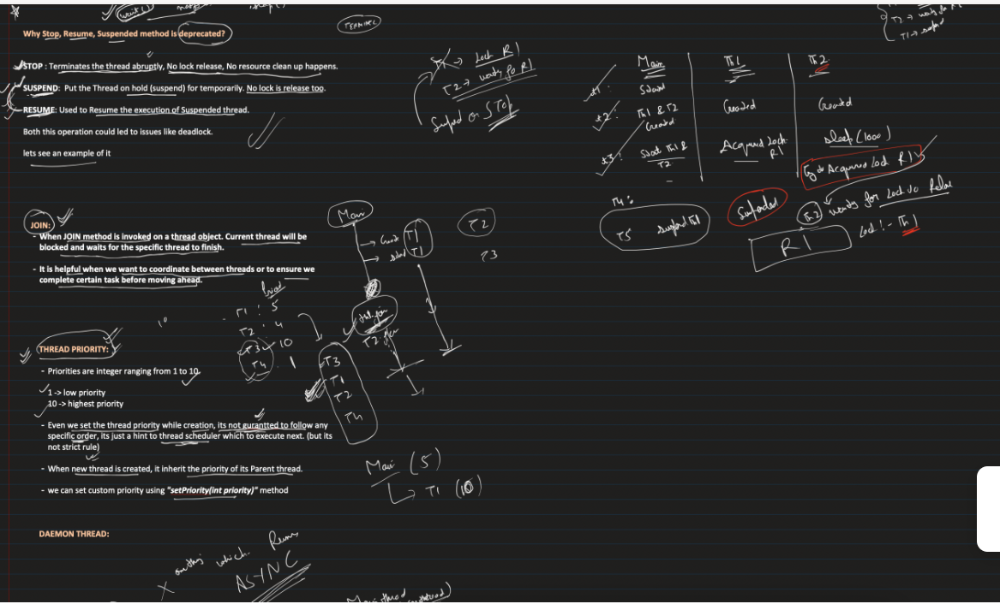

----------------------------------------------------------------------------------------------------------------------------------------------------------------------------------------------------------------------------------------

1️⃣ Thread Lifecycle Methods

These control the start and execution of a thread.

start()

        Starts a new thread and calls run() internally.
        Thread t = new Thread(() -> System.out.println("Running"));
        t.start();
        
        Important:
        start() → creates a new OS thread
        Calling run() directly → no new thread

run()

        Contains the task logic.
        
        public void run() {
        System.out.println("Thread work");
        }
2️⃣ Thread Control Methods
sleep()

        Pauses the current thread.
        Thread.sleep(2000);
        Thread goes to TIMED_WAITING
        Lock is NOT released

yield()

        Hints the scheduler to allow another thread to run.
        Thread.yield();
        Not guaranteed.

🔹 What yield() Does

When a thread calls:

Thread.yield();

        it tells the scheduler:
        "I’m currently running, but if another thread of the same priority wants the CPU, it can run now."
        Key point: It is only a hint, not a guarantee.

🔹 Thread State Change

Before yield:

        RUNNING
        
        After yield:
        
        RUNNABLE

The thread goes back to the ready queue.

join()

        Waits for another thread to finish.

t.join();

Example:

        Thread t = new Thread(() -> System.out.println("Task"));
        t.start();
        t.join(); // main thread waits
        3️⃣ Thread Interruption Methods
        Used to stop blocking threads gracefully.

interrupt()
t.interrupt();

        Sets interrupt flag.

for a working thread it just sets the interupted falg to true sate remain the same
If the thread is blocked in methods like:

        Thread.sleep()
        Object.wait()
        Thread.join()
        BlockingQueue.take()

Then interrupt() will:

        Wake the thread
        Throw InterruptedException
        Clear the interrupt flag

isInterrupted()
t.isInterrupted();

        Checks interrupt flag without clearing it.

interrupted()
Thread.interrupted();

        Static method
        Checks and clears interrupt flag.

4️⃣ Thread State Methods
getState()

        Returns thread state.
        Example states:
        
        NEW
        RUNNABLE
        BLOCKED
        WAITING
        TIMED_WAITING
        TERMINATED

t.getState();
5️⃣ Thread Info Methods
getName() / setName()

    t.setName("Worker-1");
    System.out.println(t.getName());
getId()

    Returns thread ID.
    t.getId();

getPriority() / setPriority()

    t.setPriority(Thread.MAX_PRIORITY);
    
    Priority range:
    
    1 → MIN_PRIORITY
    5 → NORM_PRIORITY
    10 → MAX_PRIORITY
6️⃣ Static Utility Methods
currentThread()

    Returns current executing thread.

    Thread.currentThread();
    
    Example:
    System.out.println(Thread.currentThread().getName());
activeCount()

        Returns number of active threads in current thread group.
        Thread.activeCount();
7️⃣ Deprecated / Dangerous Methods (Interview Question)

These exist but should NOT be used.

❌ stop()

Stops thread abruptly.

❌ suspend()

Pauses thread.

❌ resume()

Resumes suspended thread.

Why deprecated?

Can cause deadlocks

Leaves shared resources in inconsistent state

    The thread scheduler is NOT inside the JVM.
    Scheduling is mainly handled by the Operating System.

🔹 Who Schedules Threads?

                    Component	Role
                    JVM	Creates Java threads
                    OS	Schedules threads on CPU
                    CPU	Executes instructions

Java threads map to native OS threads.

🔹 Flow When You Create a Thread

When you write:

    Thread t = new Thread();
    t.start();

Steps:

        1️⃣ JVM creates a Thread object in heap
        2️⃣ JVM asks OS to create a native thread
        3️⃣ OS thread scheduler decides when it runs
        4️⃣ CPU executes that thread

So scheduling is done by the OS kernel scheduler.

1️⃣ What Thread.stop() does
thread.stop();

When this is called:

The JVM forces the thread to terminate immediately

It throws an internal error (ThreadDeath)

The thread stops wherever it is executing

Example:

synchronized(account) {
account.withdraw(100);
account.deposit(100);
}

If stop() happens here:

withdraw completed
deposit not executed
thread killed

Now the account state is corrupted.

Method	    Static / Instance	  How to call
start() 	  Instance	         t1.start()
join()	      Instance	         t1.join()
sleep()	       Static	            Thread.sleep()
yield()     	Static	      Thread.yield()
currentThread()	Static	      Thread.currentThread()
interrupt()	    Instance	        t1.interrupt()