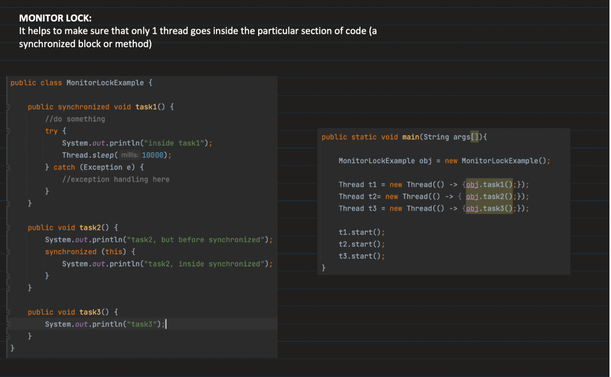
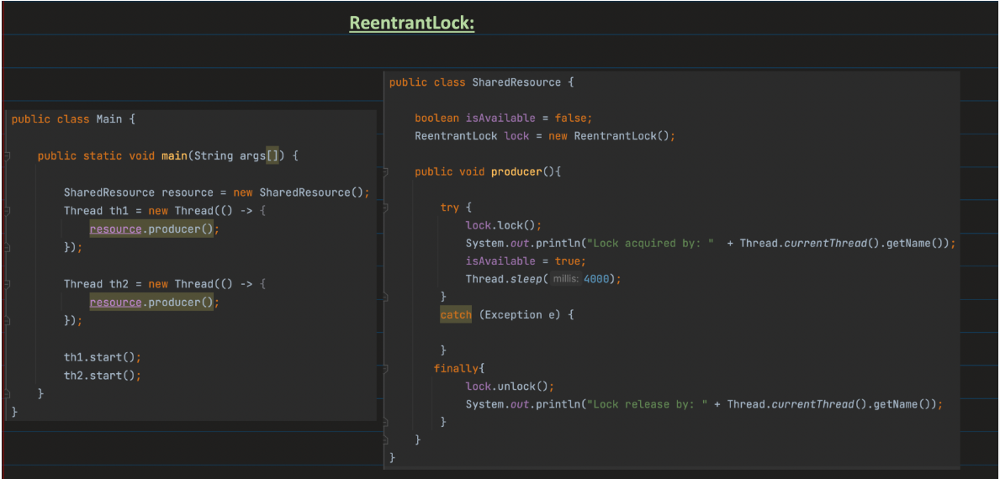
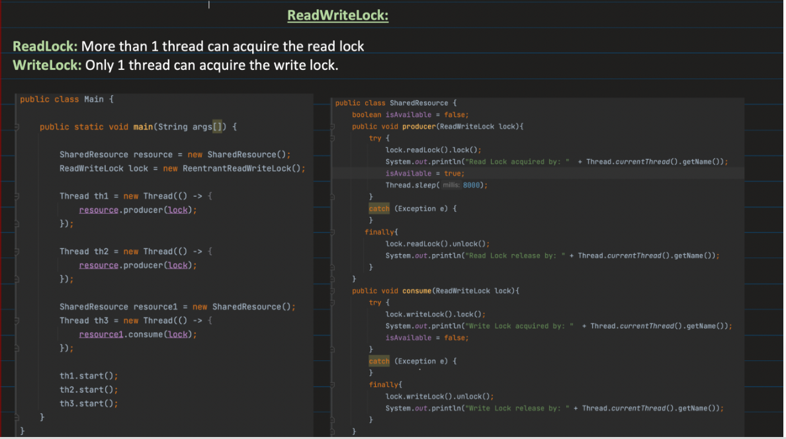
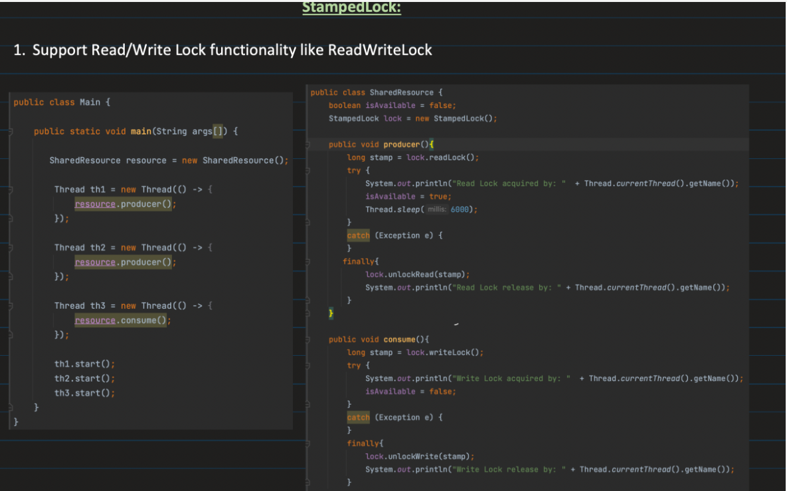
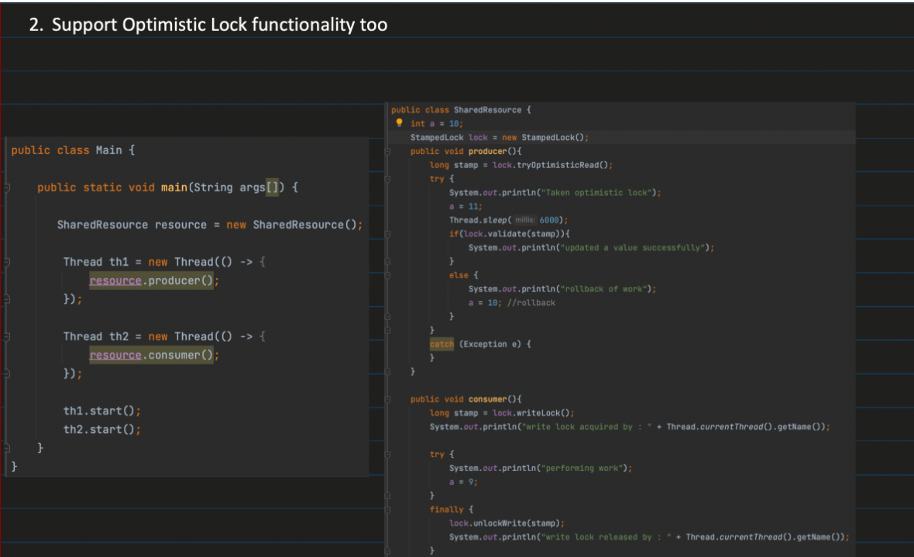
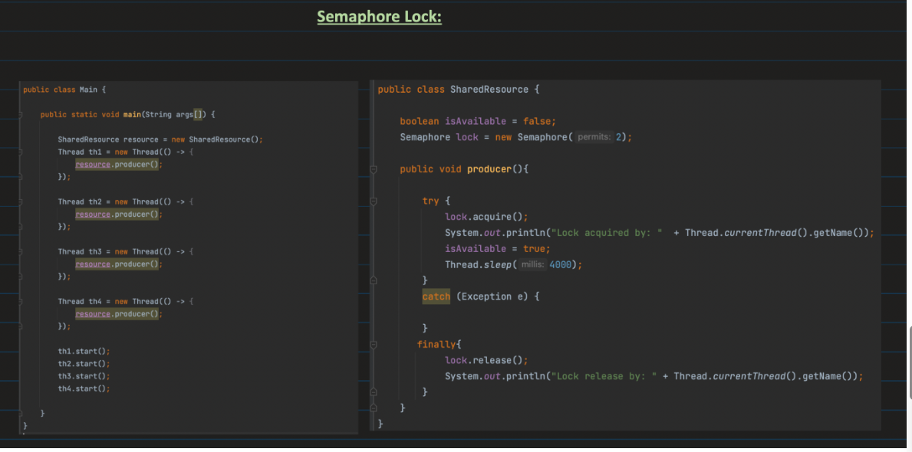

**_Concurrency :**_

Concurrency is the concept by which multiple tasks are run simultaneously at the same time
Multithreading helps in achieving concurrency
But while achieving concurrency using multithreading there are various problems like

        race conditions
        deadlock
        data inconsistency
        starvation 
        livelock
        memory visibility problem etc

To achive concurrency without the above problems we need to have control over concurrency


Concurrency Control
│
├── Lock-Based (Pessimistic)
│     ├── synchronized
│     ├── ReentrantLock
│     └── ReadWriteLock
│     |__ Semaphores
├── Lock-Free (Optimistic)
│     ├── Atomic variables
│     └── CAS
│
├── Coordination Mechanisms
│     ├── wait/notify
│     ├── CountDownLatch
│     └── CyclicBarrier
│
└── Design-Based Control
├── Immutability
└── Thread confinement


🔐 What is a Mutex in Java?

    A Mutex (short for Mutual Exclusion) is a synchronization mechanism(concept) that ensures only one thread can access a critical section of code at a time.
    Synchronized keyword, reentrant locks and semaphores with one thread helps in acheiving mutex

   

**_MONITOR LOCKS :_**


    A monitor lock (or just monitor) is a mechanism used by the JVM to enforce mutual exclusion.
    It ensures that only one thread can execute a block of code or access an object at a time.
    In Java, every object has an implicit monitor lock.

Mutual exclusion is a concurrency principle that ensures:

    Only one thread can access a shared resource or critical section at a time.

1️⃣ Java Object Layout (HotSpot JVM)

A typical object in memory has:

| Part              | Size (approx)        | Purpose                                                                                           |
| ----------------- | -------------------- | ------------------------------------------------------------------------------------------------- |
| **Mark Word**     | 8 bytes (64-bit JVM) | Stores object metadata, including: <br>• Hash code <br>• GC info <br>• Lock information (monitor) |
| **Class Pointer** | 4–8 bytes            | Points to object’s class metadata                                                                 |
| **Instance Data** | Depends on fields    | Actual fields (int, reference, etc.)                                                              |
| **Padding**       | To align memory      | JVM memory alignment                                                                              |

✅ Mark Word is where the monitor lock lives.

2️⃣ How Monitor Lock Uses Mark Word

The mark word can change meaning depending on the state of the object:

| Lock State            | Mark Word stores                                                          |
| --------------------- | ------------------------------------------------------------------------- |
| **No lock (neutral)** | Object hash, GC info                                                      |
| **Biased Lock**       | Thread ID of the thread that holds the lock (optimizes uncontended locks) |
| **Lightweight Lock**  | Pointer to the lock record in thread stack                                |
| **Heavyweight Lock**  | Pointer to monitor structure in JVM heap                                  |


Thread wants to enter a synchronized block on object obj.

JVM looks at obj’s mark word:

        If unlocked → mark word updated to hold thread ID (biased lock) → thread enters.
        If already locked → may create monitor structure (heavier lock) → thread waits.
        On exit, mark word restored → lock released.


Synchronization internally uses this monitor locks to achieve concurrency




🟢 1️⃣ Synchronized Method

Entire method is locked.

```java
synchronized void increment() {
    count++;
}

```


    Lock = current object (this)
    Only one thread can execute this method per object.

For static method:

    static synchronized void test() {}

Lock = Class object (ClassName.class)

🟢 2️⃣ Synchronized Block

Only a part of method is locked.

```java
void increment() {
synchronized(this) {
count++;
}
}

```


More efficient than synchronizing w
hole method.

Lock can be any object.

🟢 3️⃣ Static Synchronization
synchronized(ClassName.class) {
// critical section
}

Lock is on Class object.

Affects all instances.


-------------------------------------------------------------------------------------------------------------------------------------


2. Locks

        ---> Here locks are not based on method class object like synchronized rather on Lock class object
        ---> Locks are introduced to provide more control over locking mechanisms than it was with synchronized
        synchronized → JVM-level monitor
        Lock → Java-level explicit lock implementation

ADVANTAGES :


       1. You can do try lock that is u can check whether a the shared section is already locked or not
       Based on it you can decide whether to wait or not wait
    
       2. Timed Waits : You can customize to wait only for a few secs 
    
       3. Fairness is maintained if enabled the thread which comes first will get the lock first
    
       4. Supports interruptible locking : Say you have a thread waiting to acquire lock if interruptibility is set for the thread main thread can interrupt the 
          waiting thread and waiting thread throws interruptibility exception and terminates
    
    🔹 Why Is This Important?
    
    Imagine:
    
    A web request thread waiting for a lock
    Client cancels request
    You want to stop that thread immediately
    
    If using synchronized:
    
        ❌ Thread remains blocked until lock released
    
    If using lockInterruptibly():
    
    ✅ Thread can exit immediately


DISADVANTAGES :

        You have to do manual unlocking
        Code might be little bit complex
        If any exception occurs in Reentrant lock the lock will not be auto release we need to unlock it in finally code
        But for synchronized JVM automatically removes the monitor lock


**_Reentrant Lock :_**

    ---> Reentrant means same thread can acquire same lock multiple time without getting locked like synchronized
    ---> It is an explicit mutual exclusion lock (like synchronized) but with more features and control.
🔹 What is Mutual Exclusion?

        Mutual Exclusion (Mutex) means:
        Only ONE thread is allowed to access a shared resource at a time.
```java

ReentrantLock lock = new ReentrantLock();

public void method1() {
    lock.lock();
    try {
        method2();   // Calls another method that also locks
    } finally {
        lock.unlock();
    }
}

public void method2() {
    lock.lock();
    try {
        System.out.println("Inside method2");
    } finally {
        lock.unlock();
    }
}

```



🔹 1️⃣ Lock Acquisition Methods
✅ void lock()

        Acquires the lock.
        If free → take it
        If busy → thread blocks (non-interruptible)

        lock.lock();

✅ void lockInterruptibly()
Acquires lock, but can be interrupted while waiting.

        lock.lockInterruptibly();

Throws: InterruptedException

✅ boolean tryLock()

        Attempts to acquire lock immediately.
        If free → returns true
        If busy → returns false

Does NOT block

```java
Thread t = new Thread(() -> {
    try {
        lock.lockInterruptibly();
        try {
            System.out.println("Lock acquired interruptibly");
        } finally {
            lock.unlock();
        }
    } catch (InterruptedException e) {
        System.out.println("Interrupted while waiting for lock");
    }
});

t.start();

```

✅ boolean tryLock(long time, TimeUnit unit)

    Attempts to acquire lock within given time.


            try {
                if (lock.tryLock(3, TimeUnit.SECONDS)) {
                    try {
                        System.out.println("Acquired within timeout");
                    } finally {
                        lock.unlock();
                    }
                } else {
                    System.out.println("Could not acquire within 3 seconds");
                }
            } catch (InterruptedException e) {
                e.printStackTrace();
            }

    Waits for specified duration
    Returns false if timeout
    Interruptible

🔹 2️⃣ Unlock Method

✅ void unlock()

    Releases the lock.
    Must be called same number of times as lock acquisition.
        
        lock.lock();
        try {
            System.out.println("Lock acquired using lock()");
        } finally {
            lock.unlock();
        }

⚠ If wrong thread calls unlock → IllegalMonitorStateException


If any exception occurs in Reentrant lock the lock will not be auto release we need to unlock it in finally code
But for synchronized JVM automatically removes the monitor lock


-----------------------------------------------------------------------------------------------------------------------------------------


**_ReadWriteLock :**_

        It is used when no of reads are much higher than no of writes
        Say for ex : In pricing db tables pricing will be read much more while price updates will be less
                     In lib book search reads will be more whereas books get added rarely
        
        In such scenarios if we use reentrant locks for every read also we need to put lock
        Even if we lock only the write the read will give inconsistent data

        It uses the concept of sharedlock(read lock) and exclusive lock(write lock)
        A read lock can be acquired if no write lock is present
        A write lock can be acquired if No other thread holds the write lock and No thread holds the read lock

If readers keep coming continuously, a writer may wait for a long time.
This is called writer starvation.

To avoid this, you can create a fair lock:

        new ReentrantReadWriteLock(true);


If writes are more frequent then readwrite lock will be slower than reentrant because for readwrite lock it must check whether it has read lock and whether it has write lock, it ust keep count of no of read locks
So it will be little bit slower and also Writers will block readers frequently.




🔵 1️⃣ Creating ReadWriteLock
```java
import java.util.concurrent.locks.ReentrantReadWriteLock;

ReentrantReadWriteLock rwLock = new ReentrantReadWriteLock();       // non-fair
ReentrantReadWriteLock fairLock = new ReentrantReadWriteLock(true); // fair
```
🔵 2️⃣ readLock()

Returns read lock.

        ReentrantReadWriteLock.ReadLock readLock = rwLock.readLock();
        
        readLock.lock();
        try {
            System.out.println("Reading data");
        } finally {
            readLock.unlock();
        }

🔵 3️⃣ writeLock()

Returns write lock.

    ReentrantReadWriteLock.WriteLock writeLock = rwLock.writeLock();
    
    writeLock.lock();
    try {
        System.out.println("Writing data");
    } finally {
        writeLock.unlock();
    }
🔵 4️⃣ tryLock() (Read Lock)

    if (rwLock.readLock().tryLock()) {
        try {
            System.out.println("Read lock acquired");
        } finally {
            rwLock.readLock().unlock();
        }
    }
🔵 5️⃣ tryLock(timeout) (Write Lock)

import java.util.concurrent.TimeUnit;

    try {
        if (rwLock.writeLock().tryLock(2, TimeUnit.SECONDS)) {
            try {
            System.out.println("Write lock acquired");
            } finally {
            rwLock.writeLock().unlock();
            }
        } else {
            System.out.println("Could not acquire write lock");
        }
    } catch (InterruptedException e) {
        e.printStackTrace();
    }
🔵 6️⃣ lockInterruptibly()

    try {
        rwLock.writeLock().lockInterruptibly();
        try {
            System.out.println("Write lock acquired interruptibly");
        } finally {
            rwLock.writeLock().unlock();
        }
    } catch (InterruptedException e) {
        System.out.println("Interrupted while waiting");
    }
🔵 7️⃣ newCondition() (Write Lock Only)

⚠ Important:
Conditions are supported only on write lock, not read lock.

    import java.util.concurrent.locks.Condition;
    
    Condition condition = rwLock.writeLock().newCondition();
    
    rwLock.writeLock().lock();
    try {
        condition.await();   // wait
        condition.signal();  // notify
    } catch (InterruptedException e) {
        e.printStackTrace();
    } finally {
        rwLock.writeLock().unlock();
    }
🔵 8️⃣ Monitoring Methods

These are on ReentrantReadWriteLock (not on Lock object).

getReadLockCount()

    System.out.println("Active readers: " + rwLock.getReadLockCount());
isWriteLocked()

    System.out.println("Is write locked? " + rwLock.isWriteLocked());
isWriteLockedByCurrentThread()

    rwLock.writeLock().lock();
    try {
        System.out.println(rwLock.isWriteLockedByCurrentThread()); // true
    } finally {
        rwLock.writeLock().unlock();
    }
getWriteHoldCount()

    Shows reentrancy count for write lock.

    rwLock.writeLock().lock();
    rwLock.writeLock().lock();
    try {
        System.out.println(rwLock.getWriteHoldCount()); // 2
    } finally {
        rwLock.writeLock().unlock();
        rwLock.writeLock().unlock();
    }
getReadHoldCount()

Per-thread read hold count.

    rwLock.readLock().lock();
    rwLock.readLock().lock();
    try {
        System.out.println(rwLock.getReadHoldCount()); // 2
    } finally {
        rwLock.readLock().unlock();
        rwLock.readLock().unlock();
    }
hasQueuedThreads()

    System.out.println(rwLock.hasQueuedThreads());
getQueueLength()

    System.out.println(rwLock.getQueueLength());

---------------------------------------------------------------------------------------------------------------------------------------------


**_STAMPED LOCK :_**

---> Stamped Lock provides two functionalities

1. Read Write Lock
2. Optimistic Read

There was a problem with read write lock which was it has to keep track of all the read locks so that it can know how many read locks were unlocked
which was causing an issue with being slower

StampedLock has optimistic read which does not block writers even when optimistic read is acquired

whenever we do a optimistic read we will get a stamp value which basically denotes the version of data
It does not block writers if someone acquire write lock do write lock and unock write the original stamp version which will be compared with other threads changes

So if the first thread does validate(stamp) it will not be equal


Example :


    long stamp = lock.tryOptimisticRead();

        int localX = x;
        int localY = y;
        
        if (!lock.validate(stamp)) {
            stamp = lock.readLock();
            try {
                localX = x;
                localY = y;
            } finally {
                lock.unlockRead(stamp);
            }
        }

🔵 1️⃣ Write Lock Methods (Exclusive)
✅ long writeLock()

    Acquires exclusive lock.
    Blocks until available.
    Returns a stamp.
    Only one thread can hold it.

    long stamp = lock.writeLock();

✅ long tryWriteLock()

    Tries to acquire write lock immediately.
    Returns 0 if failed.

✅ long tryWriteLock(long time, TimeUnit unit)

    Tries with timeout.

✅ void unlockWrite(long stamp)

    Releases write lock.

Increments version internally (important for optimistic reads).

🔵 2️⃣ Read Lock Methods (Shared)
✅ long readLock()

    Acquires shared read lock.
    Multiple readers allowed.
    Blocks if writer active.

✅ long tryReadLock()

    Tries immediately.
    Returns 0 if failed.

✅ long tryReadLock(long time, TimeUnit unit)

    Tries with timeout.

✅ void unlockRead(long stamp)

    Releases read lock.
    Decrements reader count.
    Does NOT change version.

🔵 3️⃣ Optimistic Read Methods ⭐
✅ long tryOptimisticRead()

    Does NOT block.
    Does NOT increase reader count.
    Returns current state stamp.

✅ boolean validate(long stamp)

    Returns true if:
    No write occurred since stamp was taken.
    Returns false if:
    Any write lock was acquired and released.


```java

public double distanceOptimistic() {
    long stamp = lock.tryOptimisticRead();

    double currentX = x;
    double currentY = y;

    if (!lock.validate(stamp)) {
        // Fallback to real read lock
        stamp = lock.readLock();
        try {
            currentX = x;
            currentY = y;
        } finally {
            lock.unlockRead(stamp);
        }
    }

    return Math.sqrt(currentX * currentX + currentY * currentY);
}

```

here say 10000 read and 10 writes come
    Without optimistic read CPU need to Internally:
    
    Increments shared reader count in lock state
    Writes to shared memory
    Causes CPU cache invalidation
    Adds memory fence
    
    So:
    
    10,000 reads
    → 10,000 increments
    → 10,000 decrements
    → heavy shared memory traffic
With optimistic read ✅ "We avoid modifying shared lock state for most reads, reducing contention." only validation filed needs it






------------------------------------------------------------------------------------------------------------------------------------------------------------------------


**_SEMAPHORES :_**


Semaphores is a synchronization tool which is used to limit the no of threads entering a critical section of code
at  the same time

Semaphores which allows one thread is called mutex

🔵 Why It Is Used

Semaphore is used when:

You want to limit concurrency instead of locking everything.

Examples:

        1️⃣ Database connection pool
        
            If DB allows only 10 connections:
            Use Semaphore(10)
        
        2️⃣ Rate limiting
        
            Allow only 5 API calls at a time.
        
        3️⃣ Printer example
        
            If 2 printers available:
            Semaphore(2)
        
        4️⃣ Resource pool
        
            Any limited shared resource.





🔵 1️⃣ Constructor

    ✅ Semaphore(int permits)

Creates semaphore with given number of permits.

    Semaphore semaphore = new Semaphore(5);
✅ Semaphore(int permits, boolean fair)

    fair = true → FIFO order
    fair = false (default) → higher throughput
    
    Semaphore semaphore = new Semaphore(5, true);
🔵 2️⃣ Acquiring Permits
✅ void acquire()

    Blocks until a permit is available.

    semaphore.acquire();
✅ void acquire(int permits)

        Acquire multiple permits.

    semaphore.acquire(2);
✅ void acquireUninterruptibly()

    Ignores interruption.

✅ boolean tryAcquire()

    Does NOT block.

Returns true if permit available.

if (semaphore.tryAcquire()) {
// do work
}
✅ boolean tryAcquire(long timeout, TimeUnit unit)

    Waits for limited time.

semaphore.tryAcquire(2, TimeUnit.SECONDS);
🔵 3️⃣ Releasing Permits
✅ void release()

    Returns one permit.
    semaphore.release();
✅ void release(int permits)

    Returns multiple permits.

semaphore.release(2);

⚠ Important:

Release can be called by different thread.

No ownership restriction.

🔵 4️⃣ Inspection Methods
✅ int availablePermits()

    Returns current permit count.

int count = semaphore.availablePermits();
✅ int getQueueLength()

    Returns number of waiting threads (approximate).

✅ boolean hasQueuedThreads()

    Checks if threads are waiting.

✅ void drainPermits()

    Removes and returns all available permits.

✅ void reducePermits(int reduction)

    Reduces available permits internally.
    (Protected method — used by subclasses)


------------------------------------------------------------------------------------------------------------------------------------------------------


🔵 What is a Condition?

A Condition allows threads to:

    Wait until a specific condition becomes true.

It is similar to:

    wait()
    notify()
    notifyAll()

But more powerful and flexible.


🔵 Important Methods in Condition
✅ await()

    Thread waits.
    Releases the lock.
    Goes into waiting state.
    Must re-acquire lock before continuing.

✅ signal()

    Wakes up one waiting thread.

✅ signalAll()

    Wakes all waiting threads.

✅ await(long time, TimeUnit unit)

    Timed wait.


```java

import java.util.concurrent.locks.*;

class Buffer {
    private int item;
    private boolean available = false;

    private final ReentrantLock lock = new ReentrantLock();
    private final Condition notEmpty = lock.newCondition();
    private final Condition notFull = lock.newCondition();

    public void produce(int value) throws InterruptedException {
        lock.lock();
        try {
            while (available) {
                notFull.await();
            }
            item = value;
            available = true;
            notEmpty.signal();
        } finally {
            lock.unlock();
        }
    }

    public int consume() throws InterruptedException {
        lock.lock();
        try {
            while (!available) {
                notEmpty.await();
            }
            available = false;
            notFull.signal();
            return item;
        } finally {
            lock.unlock();
        }
    }
}

```


🔵 First: What is a Condition Actually?

When you do:

    Condition notFull = lock.newCondition();
    Condition notEmpty = lock.newCondition();

You are creating two separate waiting queues.
Each Condition has its own waiting list of threads.

Think of it like this:

Lock
├── Condition A (notFull) → Queue A
└── Condition B (notEmpty) → Queue B

Each queue is independent.

🔵 What Happens When await() Is Called?

Example:

    notEmpty.await();

What happens internally:

    Thread releases the lock
    Thread goes into notEmpty queue
    Thread sleeps (WAITING state)
    
    It is NOT in the main lock queue.
    It is inside that specific condition’s queue.

🔵 What Happens When signal() Is Called?

Example:

notEmpty.signal();
This means:

    Move ONE thread from the notEmpty queue
    back to the lock queue
    It does NOT wake threads waiting on notFull.
    It only touches that specific condition's queue.


------------------------------------------------------------------------------------------------------------------------------------------------------------------------------------------------------


Problem	            What Happens	                                     Example
Race Condition	     Multiple threads modify shared data	             count++
Data Inconsistency	 Shared state becomes incorrect	                      Bank transfer
Deadlock	         Threads wait for each other's locks forever	       lockA + lockB
Livelock	          Threads keep reacting but no progress	             polite threads
Starvation	            Thread never gets CPU/lock	                      greedy thread
Visibility Issue	      Thread cannot see updated value	           cached variable


Livelock examples


```java

class Worker {

    private boolean active = true;

    public void work(Worker other) {

        while(active) {

            if(other.active) {
                System.out.println(Thread.currentThread().getName() +
                        " : giving chance to other worker");
                continue;
            }

            System.out.println(Thread.currentThread().getName() + " working");

            active = false;
        }
    }
}

public class LivelockExample {

    public static void main(String[] args) {

        Worker w1 = new Worker();
        Worker w2 = new Worker();

        Thread t1 = new Thread(() -> w1.work(w2), "Thread1");
        Thread t2 = new Thread(() -> w2.work(w1), "Thread2");

        t1.start();
        t2.start();
    }
}

```


SOLUTION: OPTIMISTIC READ
        
        👉 Don’t lock at all
        👉 Just read and verify later

⚙️ STEP-BY-STEP FLOW


1️⃣ Take optimistic stamp

        long stamp = lock.tryOptimisticRead();

👉 This stamp = version of data

2️⃣ Read data (NO LOCK)
    
    int localX = x;
    int localY = y;
    
    👉 No blocking
    👉 Super fast

3️⃣ Validate
    
    if (!lock.validate(stamp)) {
    // fallback
    }

👉 Check:

    “Did any write happen after I read?”

4️⃣ If invalid → fallback

        stamp = lock.readLock();
        try {
        localX = x;
        localY = y;
        } finally {
        lock.unlockRead(stamp);
        }
🔥 SIMPLE ANALOGY

👉 Think of a whiteboard:
    
    You glance at it 👀 (optimistic read)
    Someone might change it ✍️
    Before using info, you ask:
    👉 “Was this changed?” (validate)

✔️ If NO → use it
❌ If YES → re-read properly

🧠 IMPORTANT RULE

👉 Optimistic read is ONLY safe if:

    No write happened during your read
🔥 INTERNAL MAGIC (VERY IMPORTANT)

👉 StampedLock maintains a version number

Every write:

        increments version

👉 Your stamp = old version

👉 validate() checks:

    Is current version == my stamp?

    ✔️ Yes → safe
    ❌ No → data changed

🔥 VISUAL FLOW
    
    Thread A:
    stamp = 10
    read x = 5
    
    Thread B:
    write happens → version = 11
    
    Thread A:
    validate(10) ❌ (fails)
    
    → fallback to read lock
⚡ WHY IT IS FAST

👉 Normal ReadLock:
    
    modifies shared state
    causes CPU cache traffic

👉 Optimistic Read:
    
    ❌ no locking
    ❌ no state change
    ✅ just read + check
⚠️ IMPORTANT LIMITATIONS

👉 You MUST validate
    
    ❌ Without validate → unsafe
    ❌ Data may be inconsistent

⚠️ WHEN TO USE

👉 Best when:

    Reads >> Writes (like 10000 reads, 10 writes)

👉 Not good when:

Frequent writes
🎯 INTERVIEW ANSWER

👉 “Optimistic read in StampedLock allows a thread to read data without acquiring a lock, using a version stamp. After reading, it validates whether a write occurred during the read. If validation fails, it falls back to acquiring a proper read lock.”

🧠 ONE-LINE MEMORY TRICK

👉 Read first → verify later

🔥 ULTRA SIMPLE EXAMPLE

        long stamp = lock.tryOptimisticRead();
        int value = data;
        
        if (!lock.validate(stamp)) {
        stamp = lock.readLock();
        try {
        value = data;
        } finally {
        lock.unlockRead(stamp);
        }
        }


⚡ Summary Table
Problem	                        Main Solution
Race Condition	           synchronized / Atomic / Lock
Deadlock	               Lock ordering / tryLock
Livelock	               Random backoff
Starvation	               Fair locks / thread pools
Data Inconsistency	       Atomic operations / transactions
Visibility	               volatile / synchronized


PROBLEM WITH wait() / notify()
    
    With synchronized:
    synchronized(lock) {
    lock.wait();
    lock.notify();
    }

👉 There is ONLY ONE waiting queue per object

❌ Problem:
    
    All waiting threads go into same queue
    notify() wakes random thread
    You cannot control WHICH thread wakes
    🚀 HOW Condition FIXES THIS
    Lock lock = new ReentrantLock();
    Condition notFull = lock.newCondition();
    Condition notEmpty = lock.newCondition();

👉 Now you have:
    
    Lock
    ├── notFull queue
    └── notEmpty queue

🔥 ADVANTAGE 1️⃣: MULTIPLE WAITING QUEUES
        
        Example: Producer-Consumer
        Producers wait → notFull
        Consumers wait → notEmpty
        With Condition:
        notFull.await();   // only producers wait
        notEmpty.await();  // only consumers wait

👉 Perfect control ✔️

        With wait():
        lock.wait(); // everyone mixed together ❌
        🔥 ADVANTAGE 2️⃣: TARGETED WAKE-UP
        With Condition:
        notEmpty.signal(); // wake ONLY consumers

👉 Precise control

With notify():
    
    lock.notify(); // random thread ❌
    🔥 ADVANTAGE 3️⃣: NO UNNECESSARY WAKEUPS

👉 With wait():
    
    You may wake wrong thread
    It checks condition → goes back to waiting

❌ Waste of CPU

👉 With Condition:
    
    Wake only correct threads ✔️
    More efficient
🔥 ADVANTAGE 4️⃣: BETTER READABILITY
    
    notFull.await();
    notEmpty.signal();

👉 Clear intent

vs

wait();
notify();

👉 Confusing

🔥 ADVANTAGE 5️⃣: ADVANCED FEATURES

Condition supports:
    
    await(timeout)
    awaitUninterruptibly()
    Multiple condition objects

👉 wait() is limited

🧠 ANALOGY
wait()/notify()

👉 One room 🏠
Everyone waiting together
You shout → random person wakes 😵

Condition

👉 Multiple rooms 🏢

Room 1 → producers
Room 2 → consumers

You knock specific room 🚪

🔥 SUMMARY TABLE
Feature	wait/notify	Condition
Queues	1	Multiple
Wake control	❌ Random	✅ Specific
Efficiency	❌ Lower	✅ Higher
Readability	❌ Poor	✅ Better
Features	Limited	Rich


condition.await(5, TimeUnit.SECONDS);

👉 It will:

1️⃣ Release the lock 🔓
2️⃣ Go into waiting state ⏳
3️⃣ Wait for:

signal() / signalAll() ✅
OR
Timeout (5 sec) ⏰
4️⃣ Re-acquire the lock 🔒 before continuing


🧠 WHAT IS LIVELOCK?

    👉 Livelock is a situation where threads are NOT blocked, but still no progress happens

🔥 SIMPLE DEFINITION

Threads keep responding to each other, but never complete their work
        
        ❗ KEY DIFFERENCE FROM DEADLOCK
        Feature	Deadlock	Livelock
        Threads state	Blocked ❌	Running/active ✅
        Progress	❌ None	❌ None
        CPU usage	Low	High
        Behavior	Waiting	Over-reacting
        🧠 SIMPLE ANALOGY

👉 Two people in a corridor:
    
    Person A moves left → B moves right
    A moves right → B moves left
    Both keep adjusting politely

👉 Result:
    
    Nobody stops ❌
    Nobody moves forward ❌

👉 That’s livelock

🔥 CODE-LIKE IDEA
    
    while(true) {
    if(otherThreadWantsResource) {
    // be polite and give chance
    continue;
    }

    // do work
}

    👉 Both threads keep giving way → no one works

⚙️ REAL EXAMPLE
    
    Two threads trying to avoid deadlock
    They keep releasing locks for each other
    But end up never doing actual work
🧠 WHY IT HAPPENS

👉 Threads are:
    
    Too “polite”
    Continuously reacting to each other
🔥 HOW TO FIX LIVELOCK
    
    ✅ 1️⃣ Random backoff
    Thread.sleep(randomTime);
    
    👉 Breaks synchronization between threads
    
    ✅ 2️⃣ Retry limit
    if(retryCount > 5) break;
    ✅ 3️⃣ Better locking strategy
    Avoid constant give-up behavior


WHAT IS RANDOM BACKOFF?

    👉 Random backoff = waiting for a random amount of time before retrying an operation