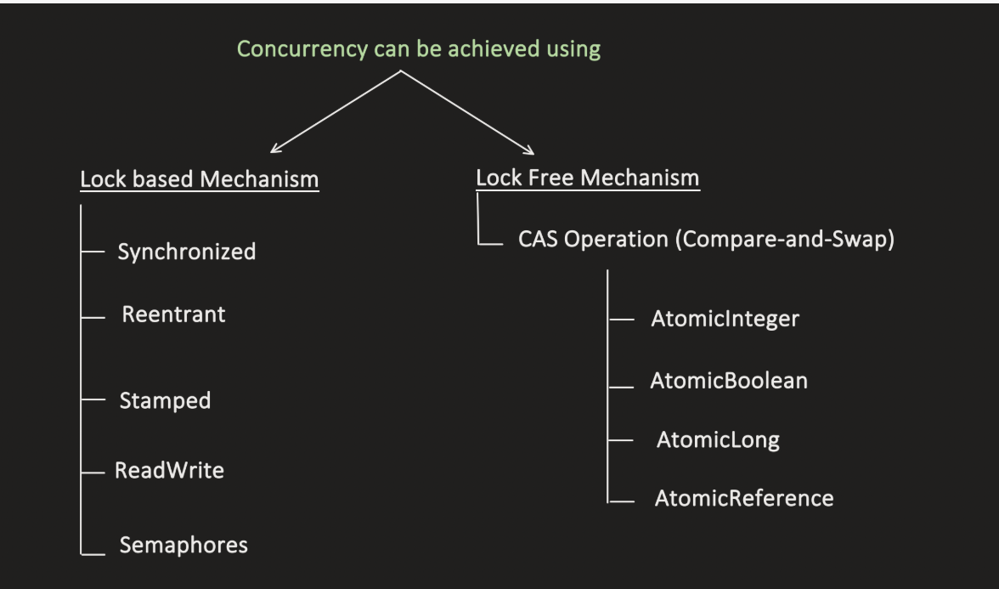
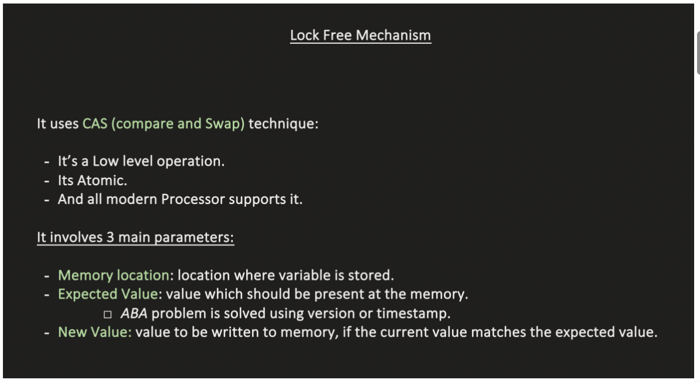
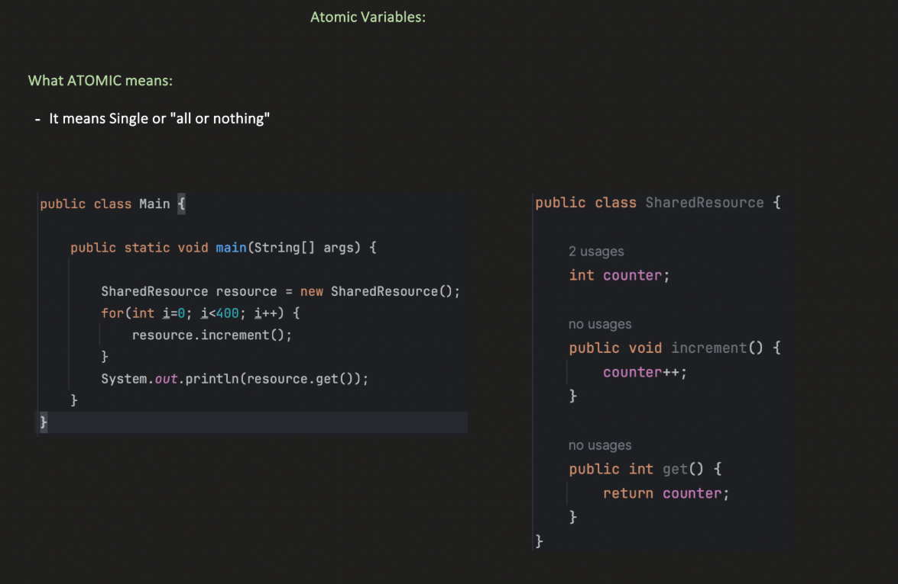
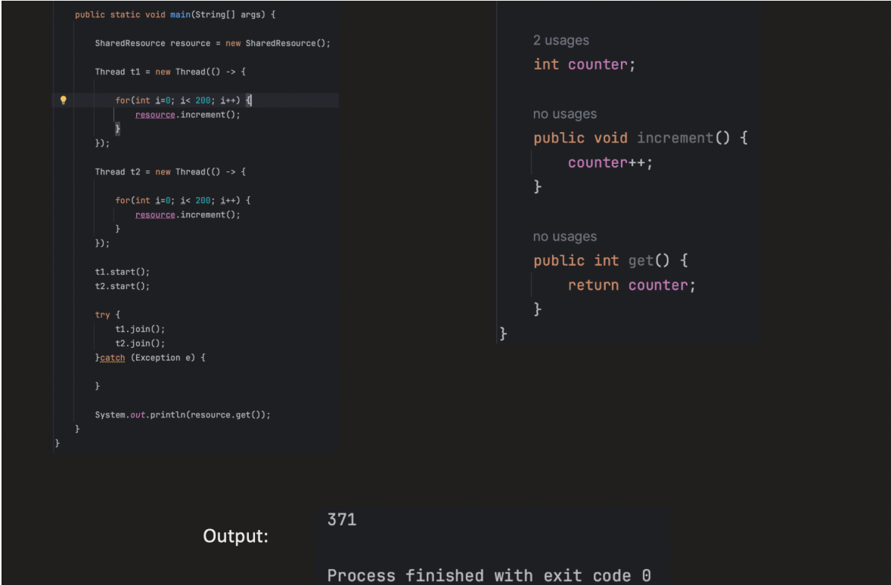
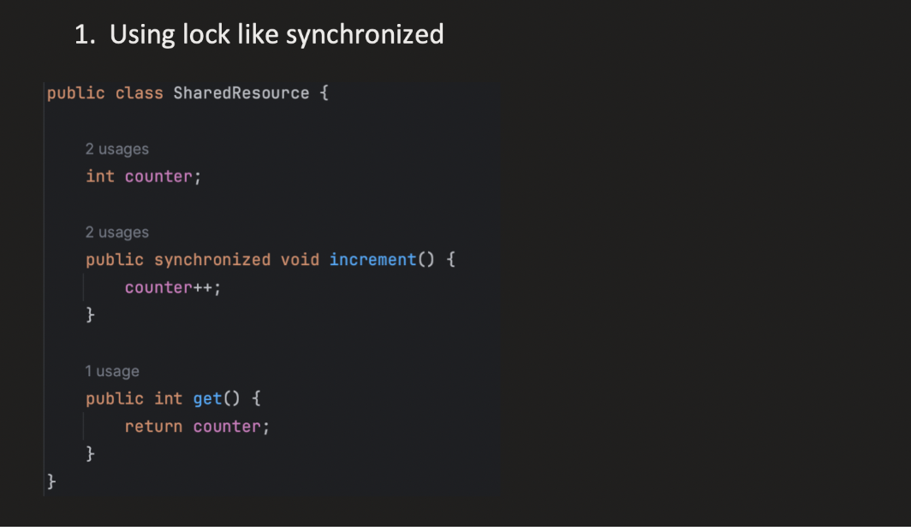
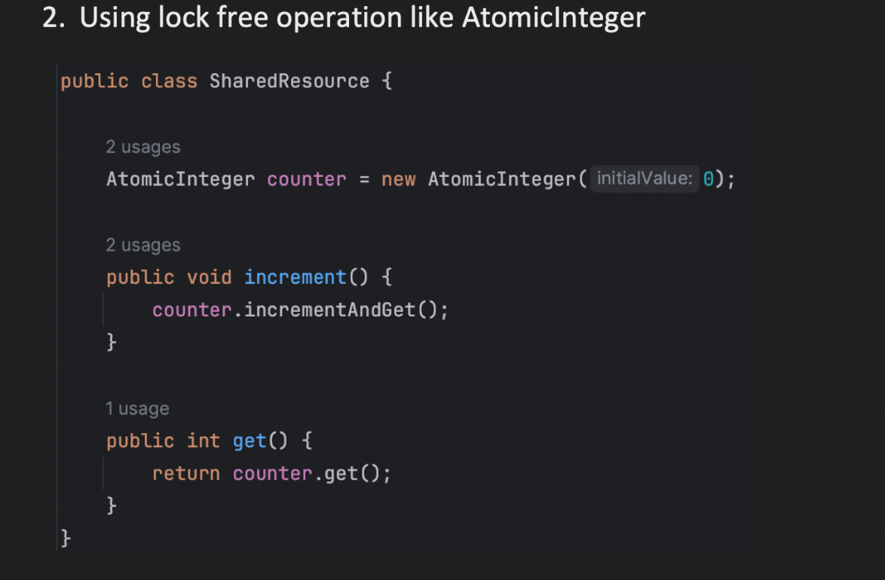

LOCK FREE CONCURRENCY :


1️⃣ Locks and Visibility

When a thread acquires a synchronized block or any Lock (like ReentrantLock), it establishes happens-before relationships:

    Releasing a lock: When Thread A releases a lock, all changes it made to shared variables are flushed to main memory.
    Acquiring a lock: When Thread B acquires the same lock, it invalidates its local caches and reads variables from main memory.

This means locks implicitly provide visibility—other threads will see the latest changes.


| Memory Region                                       | Who Uses It           | What It Stores                                        |
| --------------------------------------------------- | --------------------- | ----------------------------------------------------- |
| **Heap**                                            | Shared by all threads | Objects, arrays, instance variables                   |
| **Method Area / Metaspace**                         | Shared by all threads | Class metadata, bytecode, static variables, constants |
| **Thread Stack (per thread)**                       | Each thread           | Local variables, operand stack, stack frames          |
| **PC Register (per thread)**                        | Each thread           | Tracks **next bytecode instruction** to execute       |
| **JVM registers / operand stack (in thread stack)** | Each thread           | Holds intermediate computation values and references  |
| **CPU Registers / caches (hardware)**               | Each core / thread    | Temporary storage of variables for fast access        |


CPU cache:
| Aspect         | Details                                                                                                                                                                          |
| -------------- | -------------------------------------------------------------------------------------------------------------------------------------------------------------------------------- |
| **Location**   | Hardware CPU cache (L1, L2, maybe L3)                                                                                                                                            |
| **Purpose**    | Speeds up access to frequently used variables from **main memory (heap)**                                                                                                        |
| **Visibility** | Thread-local / core-local; other threads may see stale cached values                                                                                                             |
| **Notes**      | - Changes in CPU cache may **not immediately go to main memory**. <br>- Locks / volatile ensure **cache is flushed or invalidated**, so updates become visible to other threads. |


How locks ensure visibility?


    ---> Locks like synchronized and reentrant whenever  a write happens it will first save it in cPU cache of its own thread
    ---> When lock is removed it does 2 things
    
        1. Flushes cache to heap memory
        2. Invalidates all other threads CPU caches, so other threads will have to fetch from memory next time


VOLATILE : visibility

    It means changes made by one thread should be visible to other threads

```java

int counter = 0;
public void method1() {
    countet++;    
}

Thread th1 = new Thread(() -> {
     for(int i=0; i<200; i++) {
          method1;
     }
});

Thread th2 = new Thread(() -> {
    for(int i=0; i<200; i++) {
        method1;
    }
});

```

here if u print counter it will be less than 400 this is because of lack of visibility between 2 threads

ThreadA will be updating its own cpu cache and thread B be updating its own cpu cache with ocassional
heap to cpu sync that is why thread A changes are not visibel to threadB

Volatile solves this by allowing threads to directly read and write from heap memory rather than caches

counter++ is not a single CPU instruction. It’s actually three steps:

    Read the current value from memory → oldValue
    Add 1 → newValue = oldValue + 1
    Write the new value back to memory
Even if counter is volatile, both threads can read the same old value at the same time:


SO along with visibility the operations should be atomic that is if the another write happens before 
then this thread must rollback and start from first i.e read current value from memory

THis is what AtomicVariables provide:

VIsisbility + Atomicity

It internally uses compare and swap algorithm to implement atomicity

















1️⃣ What CAS is

    Compare-And-Swap (CAS) is a hardware-level atomic instruction used to update a variable safely without locks.

Definition:

CAS works like this:

    “If the value at a memory location is equal to an expected value, replace it with a new value atomically. Otherwise, do nothing.”

Formally:
    
    CAS(address, expectedValue, newValue)
    address → memory location of the variable
    expectedValue → the value you expect to be there
    newValue → the value you want to write if expectation is met
    Return: usually a boolean indicating whether the swap succeeded.

2️⃣ Why CAS is useful
    
    Atomicity: CAS ensures the read-modify-write sequence is atomic — no other thread can interrupt it.
    Lock-free programming: Threads can update shared variables without blocking each other, unlike locks.
    Used in Java Atomic classes (AtomicInteger, AtomicLong, AtomicReference) to implement thread-safe counters, stacks, queues, etc.

3️⃣ How CAS works step by step

Let’s consider a simple AtomicInteger increment:
    
    AtomicInteger counter = new AtomicInteger(0);
    counter.incrementAndGet();

Internally, it does:

do {
oldValue = counter.value            // read current value
newValue = oldValue + 1             // compute new value
} while (!CAS(counter.address, oldValue, newValue)) // attempt atomic update

Step-by-step example with two threads:

Initial value: counter = 5

Thread A reads oldValue = 5

Thread B reads oldValue = 5

Thread A computes newValue = 6

Thread B computes newValue = 6

Thread A CAS succeeds → writes 6 to memory

Thread B CAS fails because memory no longer contains 5

Thread B retries: reads 6 → computes 7 → CAS succeeds

Result: No increments are lost — atomicity is preserved.


2️⃣ Why CAS can be better than locks

        No blocking / context switch
        
        Locks can make threads sleep/wait, which involves OS scheduler overhead.
        
        CAS just retries in a spin loop → much faster if contention is low.
        
        Lower latency under low contention
        
        If few threads are updating the variable, CAS succeeds immediately.
        
        Lock acquisition/release still involves memory barriers, potential cache flushes, and scheduler involvement.
        
        Fine-grained concurrency
        CAS works on individual variables, no critical section needed.
        Locks can serialize threads unnecessarily if the critical section contains other unrelated operations.
        No deadlocks
        Since threads never wait for a lock, deadlocks are impossible.

```java
import java.util.concurrent.atomic.AtomicInteger;

public class CASExample {
public static void main(String[] args) {
AtomicInteger counter = new AtomicInteger(0);

        boolean updated = counter.compareAndSet(0, 10); // CAS
        System.out.println("CAS successful? " + updated); // true
        System.out.println("Current value: " + counter.get()); // 10

        updated = counter.compareAndSet(0, 20); // CAS fails
        System.out.println("CAS successful? " + updated); // false
        System.out.println("Current value: " + counter.get()); // still 10
    }
}
```
Atomic Integer

AtomicInteger counter = new AtomicInteger();       // default 0
AtomicInteger counter = new AtomicInteger(10);     // initial value 10


| Method                       | Description                                                                                |
| ---------------------------- | ------------------------------------------------------------------------------------------ |
| `int get()`                  | Returns the current value.                                                                 |
| `void set(int newValue)`     | Sets the value **with volatile semantics** (visible to all threads).                       |
| `void lazySet(int newValue)` | Eventually sets value; may **delay visibility** to other threads (less strict than `set`). |


| Method                                              | Description                                                                                      |
| --------------------------------------------------- | ------------------------------------------------------------------------------------------------ |
| `int getAndSet(int newValue)`                       | Atomically sets to newValue and returns **previous value**.                                      |
| `boolean compareAndSet(int expect, int update)`     | **CAS operation**: if current value == `expect`, update to `update`. Returns true if successful. |
| `boolean weakCompareAndSet(int expect, int update)` | May fail spuriously, typically used in **loops** for better performance on some platforms.       |


| Method                     | Description                                                |
| -------------------------- | ---------------------------------------------------------- |
| `int getAndIncrement()`    | Atomically increments by 1 and returns **previous value**. |
| `int incrementAndGet()`    | Atomically increments by 1 and returns **updated value**.  |
| `int getAndDecrement()`    | Atomically decrements by 1 and returns **previous value**. |
| `int decrementAndGet()`    | Atomically decrements by 1 and returns **updated value**.  |
| `int getAndAdd(int delta)` | Atomically adds `delta` and returns **previous value**.    |
| `int addAndGet(int delta)` | Atomically adds `delta` and returns **updated value**.     |


mehtods like increment asnd get retry happens if compare and swap fails internally
