**_Thread Pool :_**

ThreadPool is a set of pre created threads that can be reused to execute multiple tasks
Instead of creating a new thread every time a task comes, we:

        Create a fixed number of threads.
        Keep them waiting in a pool.
        Assign tasks to them as they arrive.
        Reuse them after the task completes.

In Java, thread pools are managed using the Executor Framework (ExecutorService).

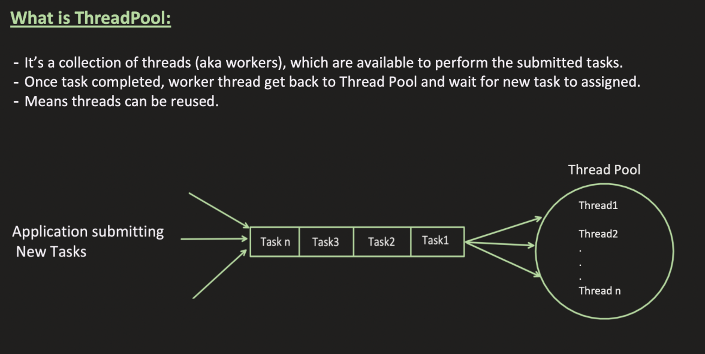

Why is Thread Pool Needed?

Creating a thread is expensive because:

    JVM has to create a Thread object
    OS has to create a native thread
    Memory (stack) must be allocated
    Context switching cost increases

If you create thousands of threads:

    High memory usage
    CPU overhead
    Possible OutOfMemoryError
    System becomes slow or crashes

Thread pool solves this by limiting and reusing threads.


Advantages of Thread Pool
1️⃣ Better Performance

    Threads are reused, so no repeated creation/destruction cost.

2️⃣ Controlled Resource Usage

    You limit number of threads → avoids CPU overload.
    
    Example:
    Executors.newFixedThreadPool(10);
    
    Only 10 threads will run at a time.

3️⃣ Prevents System Crash

Without pool:

    for(int i=0; i<100000; i++){
    new Thread(task).start();
    }
    
    This may crash your system.

With pool:

    ExecutorService service = Executors.newFixedThreadPool(10);
    
    for(int i=0; i<100000; i++){
    service.submit(task);
    }

Only 10 threads run concurrently.

4️⃣ Task Queueing

If all threads are busy:

    Tasks wait in a queue
    They execute when a thread becomes free

5️⃣ Better Throughput

    More stable and predictable performance.

Lifecycle will be managed by executors else we need to create thread,  run start(), destory thread etc which will be managed by executors itself 

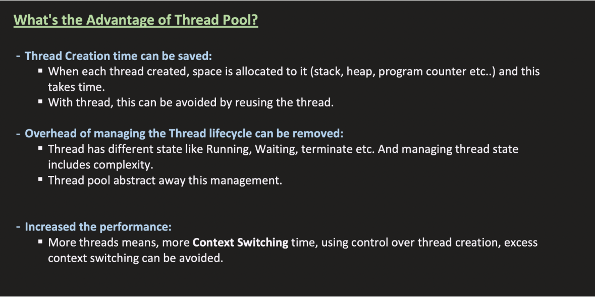

**_EXECUTOR FRAMEWORK :**_

What is Executor Framework?

The Executor Framework is a high-level concurrency framework in Java used to:

        Manage threads
        Manage thread pools
        Queue tasks
        Schedule task
        Control lifecycle of threads

It is part of:

        java.util.concurrent

It was introduced in Java 5 to simplify multithreading.
It helps in creating and managing thread pools
Executor is the core interface

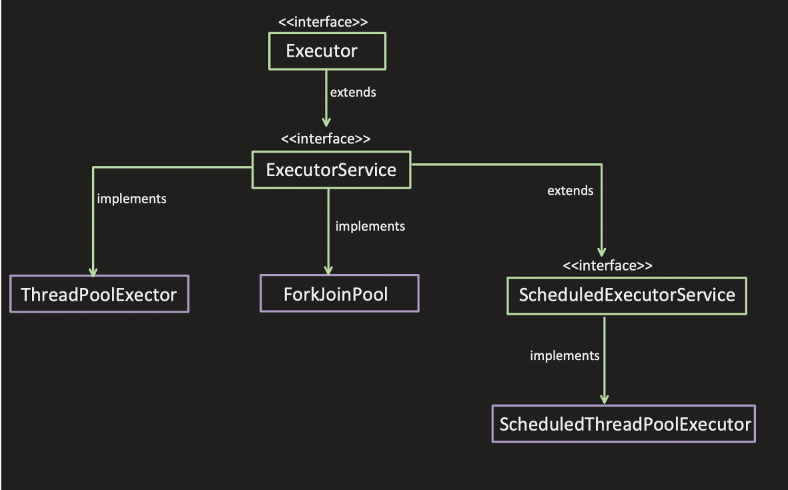


**_Executor :**_


🔹 What is Executor Interface?   

    It is the root interface of the Executor framework in Java.

Definition:

    Executor is a simple interface that executes a submitted task.
    It separates: Task submission from Task execution

🔹 Method in Executor

It has only ONE method:

        void execute(Runnable command);

That’s it.

        No shutdown.
        No future.
        No return value.


Example :

```java
import java.util.concurrent.Executor;
class SimpleExecutor implements Executor {
    public void execute(Runnable command) {
        new Thread(command).start();
    }
}

public class Main {
public static void main(String[] args) {
        Executor executor = new SimpleExecutor();
        executor.execute(() -> {
            System.out.println("Task executed");
        });
    }
}
```


**_👉 ExecutorService :**_

It is an interface that extends:Executor interface

It represents a managed thread pool that can:

        Execute tasks
        Return results
        Manage lifecycle (shutdown)
        Handle multiple tasks
        Control termination


🔹 Key Methods of ExecutorService
1️⃣ execute()

        Runs a task (no return value)

        void execute(Runnable command);

2️⃣ submit() ⭐ (Very Important)

    Future<?> submit(Runnable task);
    Future<T> submit(Callable<T> task);
    <T> Future<T> submit(Runnable task, T result);

    Allows returning a result
    Returns a Future

Example:

    Future<Integer> future = service.submit(() -> 10 + 20);
    System.out.println(future.get()); // 30

3️⃣ shutdown()

    service.shutdown();

    Stops accepting new tasks
    Completes existing tasks
    Then terminates threads

4️⃣ shutdownNow()

    Tries to stop immediately
    Interrupts running tasks

5️⃣ invokeAll()

    Runs multiple tasks and waits for all to complete.

6. boolean awaitTermination(long timeout, TimeUnit unit)
   throws InterruptedException;

It is used after shut down or shutdownnow() 


        ExecutorService service = Executors.newFixedThreadPool(2);
        
        service.shutdown();
        
        try {
            if (service.awaitTermination(5, TimeUnit.SECONDS)) {
                System.out.println("Executor terminated");
            } else {
                System.out.println("Still running");
            }
        } catch (InterruptedException e) {
            e.printStackTrace();
        }

Main thread waits Until: Executor reaches TERMINATED state OR timeout occurs


🔷 Executor Lifecycle States

Internally, a ThreadPoolExecutor moves through 5 states:

        RUNNING
        ↓
        SHUTDOWN
        ↓
        STOP
        ↓
        TIDYING
        ↓
        TERMINATED

Let’s go step by step.


whenever a xecutor is created it will be in running state
When u give shoutdown() the executor goes to shutodwn i.e it will not accept any more task whereas it will complete the tasks in queue
When u give shutDownNow() the excutor will move to stop state
Behavior:

    ❌ No new tasks accepted
    ⚠ Tries to interrupt running tasks
    ❌ Removes waiting tasks from queue
    ⚠ Returns list of tasks that never started
    
    Important:
    
    👉 Running tasks may STILL continue if they ignore interruption.

Both shutdown and stop leads to terminated state

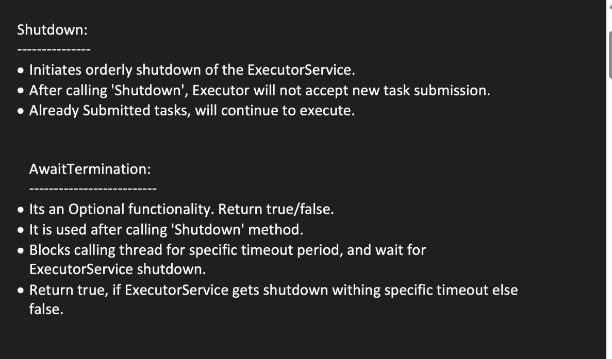

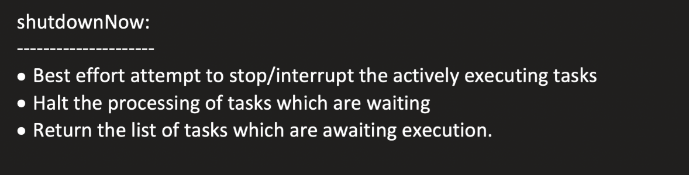

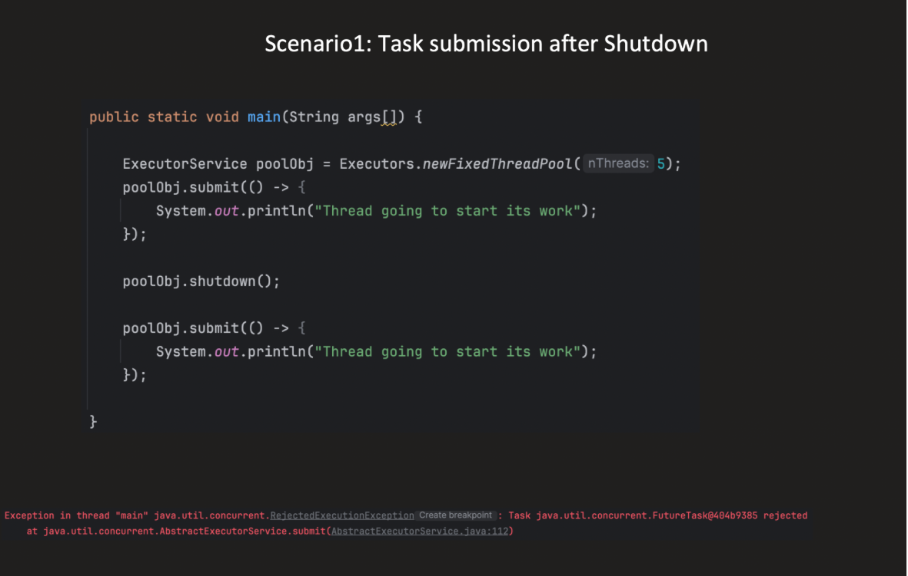

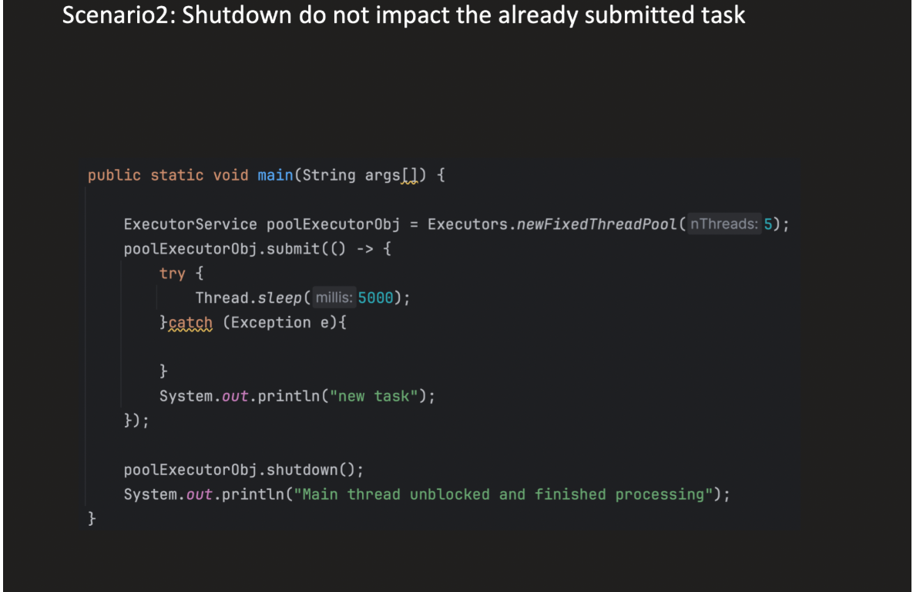

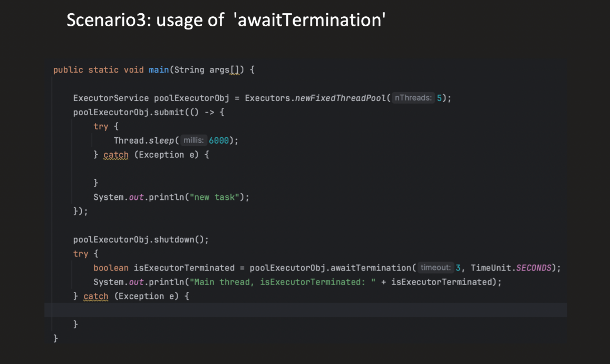


```java
import java.util.concurrent.*;

public class Example {
    public static void main(String[] args) throws Exception {

        ExecutorService service = Executors.newFixedThreadPool(2);

        Future<Integer> result = service.submit(() -> {
            return 5 * 5;
        });

        System.out.println("Result: " + result.get());

        service.shutdown();
    }
}

```


**_👉 ThreadPoolExecutor :**_

It is the core implementation of: 👉 ExecutorService

All common thread pools created using: 👉 Executors internally use ThreadPoolExecutor.

🔹 When Do We Use ThreadPoolExecutor?

    You use it when you need:
    
        Controlled number of threads
        High performance
        Task queueing
        Custom thread behavior
        Production-level concurrency control

🔹 Main Use Cases
1️⃣ Web Servers (Most Common)

    Servers handle thousands of requests.
    Instead of creating new thread per request:
    Fixed number of worker threads
    Requests wait in queue
    Threads reused

Example:
👉 Apache Tomcat

Uses thread pools to process HTTP requests.

2️⃣ Microservices / Backend APIs

    In backend applications:
    Database calls
    External API calls
    File processing

ThreadPoolExecutor helps:

    Limit concurrent calls
    Prevent overload
    Improve throughput


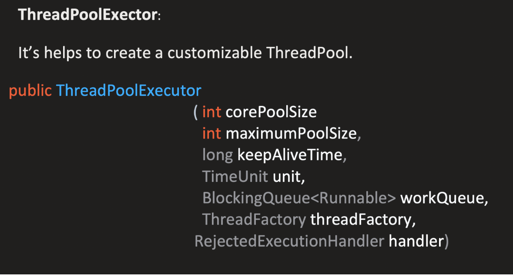
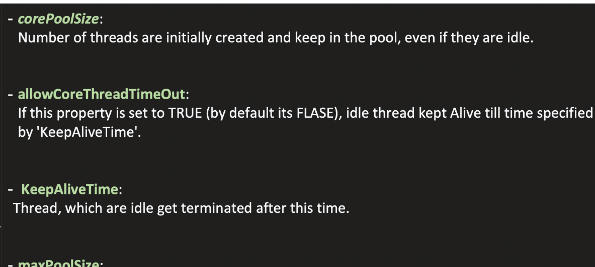

here allow core threadpool must be set to true in order for keep alive time to work for core threads also then only core pool threads will be destroyed
if not it is applicable ony for non core threads

Non core threads are created only if queue becomes , if queue is full and max size size is also reached then next tasks will be rejected


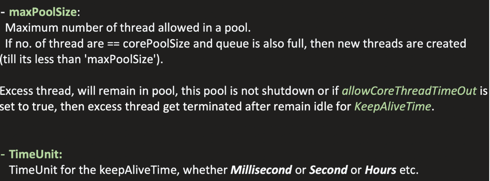
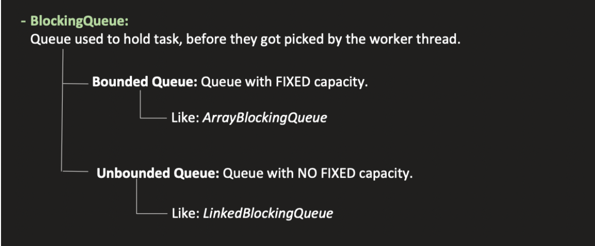
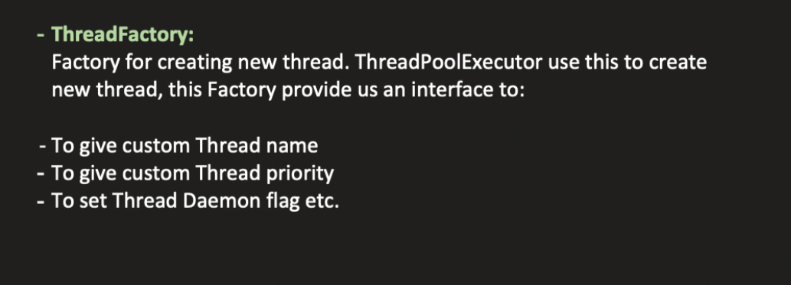
	
2️⃣	ThreadPoolExecutor(int corePoolSize, int maximumPoolSize, long keepAliveTime, TimeUnit unit, BlockingQueue<Runnable> workQueue, ThreadFactory threadFactory)	
3️⃣	ThreadPoolExecutor(int corePoolSize, int maximumPoolSize, long keepAliveTime, TimeUnit unit, BlockingQueue<Runnable> workQueue, RejectedExecutionHandler handler)	
4️⃣	ThreadPoolExecutor(int corePoolSize, int maximumPoolSize, long keepAliveTime, TimeUnit unit, BlockingQueue<Runnable> workQueue, ThreadFactory threadFactory, RejectedExecutionHandler handler)	


| Category                        | Method                                                  | Purpose                         |
| ------------------------------- | ------------------------------------------------------- | ------------------------------- |
| **Pool Size Control**           | `setCorePoolSize(int)`                                  | Change core thread count        |
|                                 | `getCorePoolSize()`                                     | Get core thread count           |
|                                 | `setMaximumPoolSize(int)`                               | Change max thread count         |
|                                 | `getMaximumPoolSize()`                                  | Get max thread count            |
| **Keep-Alive Control**          | `setKeepAliveTime(long, TimeUnit)`                      | Set idle timeout                |
|                                 | `getKeepAliveTime(TimeUnit)`                            | Get idle timeout                |
|                                 | `allowCoreThreadTimeOut(boolean)`                       | Allow core threads to time out  |
|                                 | `allowsCoreThreadTimeOut()`                             | Check if core timeout enabled   |
| **Queue Access**                | `getQueue()`                                            | Access internal task queue      |
|                                 | `remove(Runnable)`                                      | Remove specific task from queue |
|                                 | `purge()`                                               | Remove cancelled tasks          |
| **Monitoring / Stats**          | `getPoolSize()`                                         | Current total threads           |
|                                 | `getActiveCount()`                                      | Threads currently executing     |
|                                 | `getLargestPoolSize()`                                  | Highest thread count reached    |
|                                 | `getTaskCount()`                                        | Total tasks ever scheduled      |
|                                 | `getCompletedTaskCount()`                               | Total completed tasks           |
| **Rejection Handling**          | `setRejectedExecutionHandler(RejectedExecutionHandler)` | Set rejection policy            |
|                                 | `getRejectedExecutionHandler()`                         | Get rejection policy            |
| **ThreadFactory Control**       | `setThreadFactory(ThreadFactory)`                       | Set custom thread factory       |
|                                 | `getThreadFactory()`                                    | Get thread factory              |
| **Lifecycle Hooks (protected)** | `beforeExecute(Thread, Runnable)`                       | Hook before task runs           |
|                                 | `afterExecute(Runnable, Throwable)`                     | Hook after task completes       |
|                                 | `terminated()`                                          | Called when pool terminates     |


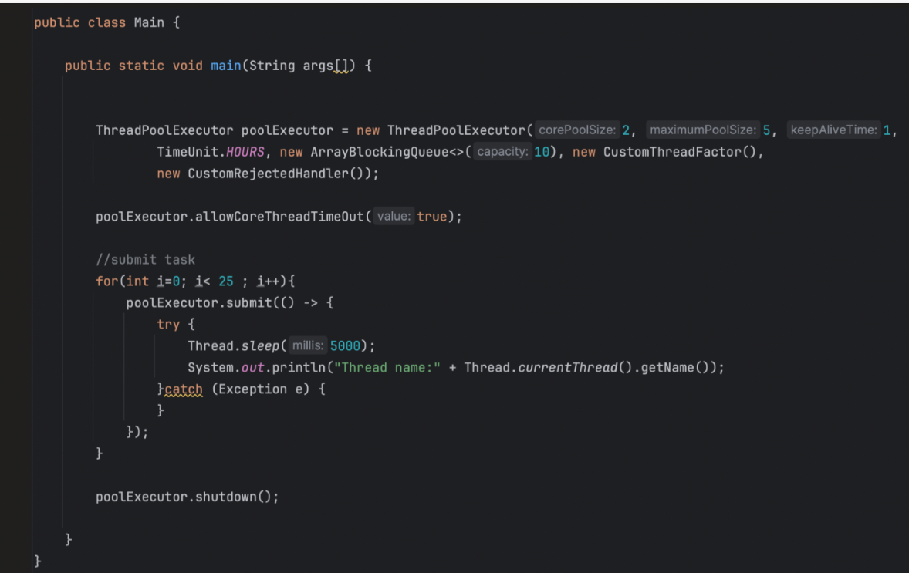

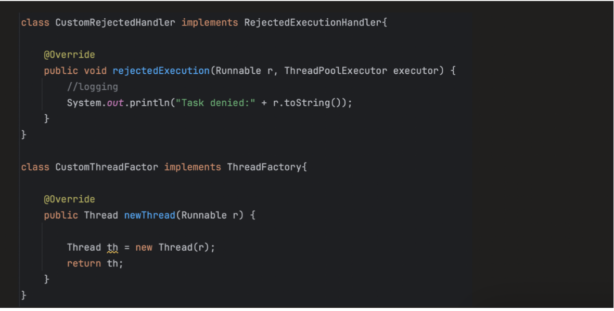


```java

import java.util.concurrent.*;

public class Main {
    public static void main(String[] args) {

        ThreadPoolExecutor executor =
                new ThreadPoolExecutor(
                        2,                          // corePoolSize
                        3,                          // maximumPoolSize
                        10,                         // keepAliveTime
                        TimeUnit.SECONDS,
                        new ArrayBlockingQueue<>(2), // queue capacity
                        Executors.defaultThreadFactory(),  // built-in ThreadFactory
                        new ThreadPoolExecutor.AbortPolicy() // built-in RejectionHandler
                );

        for (int i = 1; i <= 8; i++) {
            int taskId = i;
            executor.execute(() -> {
                System.out.println("Executing Task " + taskId +
                        " by " + Thread.currentThread().getName());
                try { Thread.sleep(3000); } catch (InterruptedException e) {}
            });
        }

        executor.shutdown();
    }
}

```


🎯 Step 1: Identify Task Type
1️⃣ CPU-Bound Tasks

Examples:

    Image processing
    Encryption
    Complex calculations
    Sorting large arrays

👉 These tasks use CPU heavily
👉 Threads mostly do computation
👉 Very little waiting

✅ Rule of Thumb
Core Threads = Number of CPU Cores

You can get cores:

    int cores = Runtime.getRuntime().availableProcessors();
🔥 Why?

If you create more threads than CPU cores:

    Threads fight for CPU
    Context switching increases
    Performance drops

2️⃣ I/O-Bound Tasks

Examples:

    Database calls
    REST API calls
    File reading
    Network operations

👉 Threads spend time WAITING
👉 CPU is idle during waiting

So you can create more threads than CPU cores.

✅ Formula (Common Rule)

    Threads = CPU Cores × (1 + Wait Time / Compute Time)

Example:

4 CPU cores

    Task waits 80% of time
    Computes 20%

Threads = 4 × (1 + 0.8/0.2)
= 4 × (1 + 4)
= 4 × 5
= 20 threads

🔥 That’s why web servers use more threads.


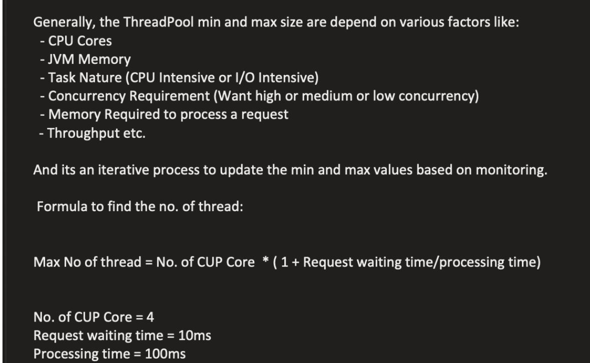


you always need to shutdown executors

🚨 What Happens If You Don’t?

Problems:

    Memory leak
    Threads remain alive
    App doesn’t terminate

Resource leak (especially in servers)


🔹 1️⃣ What is a Memory Leak?

A memory leak happens when:

    Memory is allocated but never released, even though it is no longer needed.
    In Java, we don’t manually free memory. The Garbage Collector (GC) does it.
    But GC only removes objects that are not reachable.
    If an object is still referenced, GC cannot remove it.

A resource leak happens when:

System resources are opened but never properly closed.

Resources include:

        Files
        Database connections
        Sockets
        Threads
        Thread pools

These are NOT managed by GC automatically.


----------------------------------------------------------------------------------------------------------------------------------


**_SCHEDULED THREAD POOL EXECUTOR :_**

      ScheduledThreadPoolExecutor is a concrete class in java.util.concurrent used to schedule tasks to run after a delay or periodically.
      It is the implementation behind:
         
         Executors.newScheduledThreadPool(int corePoolSize)
         Executors.newSingleThreadScheduledExecutor()


It extends ThreadPoolExecutor and implements ScheduledExecutorService.


CONSTRUCTORS : 

      ScheduledThreadPoolExecutor(int corePoolSize)
      ScheduledThreadPoolExecutor(int corePoolSize, ThreadFactory threadFactory)
      ScheduledThreadPoolExecutor(int corePoolSize, RejectedExecutionHandler handler)
      ScheduledThreadPoolExecutor(int corePoolSize, ThreadFactory threadFactory, RejectedExecutionHandler handler) 

METHODS : 

      schedule(Runnable command, long delay, TimeUnit unit)
      schedule(Callable<V> callable, long delay, TimeUnit unit)
      scheduleAtFixedRate(Runnable command, long initialDelay, long period, TimeUnit unit)
      scheduleWithFixedDelay(Runnable command, long initialDelay, long delay, TimeUnit unit)


ScheduleAtFixedRate:

      Schedules a task to run repeatedly at a fixed interval.
      The next execution starts at a fixed period after the previous execution started, regardless of how long the task takes to run.

Example :

      Period = 3 seconds
      Task execution time = 10 seconds
      Using scheduleAtFixedRate

        Task starts at 0s → runs for 10s → next starts at 3s (overlaps) → runs for 10s → next starts at 6s (overlaps) → runs for 10s
         0s   → Task starts
         10s  → Task finishes
         10s  → Next execution starts immediately
         20s  → Task finishes
         20s  → Next execution starts immediately
         30s  → Task finishes


ScheduleWithFixedDelay:

        Schedules a task to run repeatedly with a fixed delay between the end of one execution and the start of the next.
        The next execution starts after a fixed delay from the completion of the previous execution, so it accounts for the task’s execution time.


Example :
         Period = 3 seconds
         Task execution time = 10 seconds    
   
      Tasks start at 0s → runs for 10s → next starts at 13s (3s after previous finishes) → runs for 10s → next starts at 23s (3s after previous finishes) → runs for 10s
              0s   → Task starts
              10s  → Task finishes  
              13s  → Next execution starts
              23s  → Task finishes
              26s  → Next execution starts   


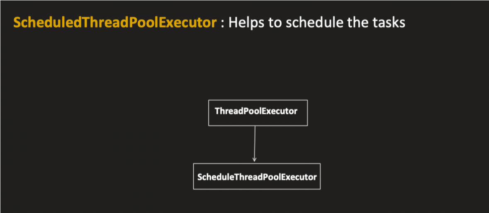

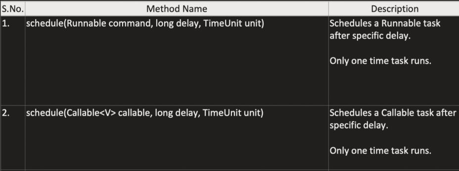

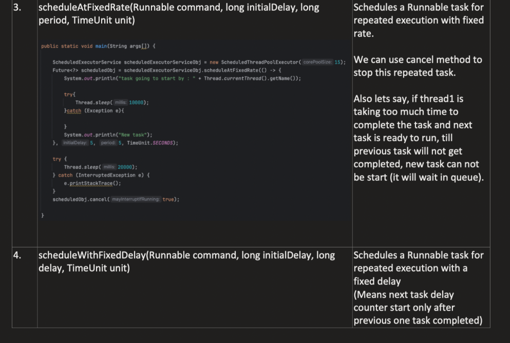


🔥 1️⃣ What Is a Delayed Queue?

        A Delayed Queue is a special queue(priority queue) where:
        An element can only be taken when its delay time has expired.

Until then:

        It stays in the queue
        Consumers cannot remove it

It is used for:

        Scheduling tasks in the future
        Time-based execution


🧠 Imagine This Situation

You schedule 3 tasks:

        scheduler.schedule(TaskA, 10, SECONDS);
        scheduler.schedule(TaskB, 5, SECONDS);
        scheduler.schedule(TaskC, 20, SECONDS);

Assume current time = 100 seconds.

🔹 Step 1: How Tasks Are Stored

        When you schedule a task, Java calculates:
        triggerTime = currentTime + delay

So:

        Task	Delay	Trigger Time
        TaskA	10s  	110
        TaskB	5s	    105
        TaskC	20s	    120

Now these are inserted into the DelayedWorkQueue.

🔹 Step 2: How They Are Stored in Queue

This queue is NOT FIFO.

    It is a min-heap (priority queue) ordered by triggerTime.

So internally it looks like:

            TaskB(105)
           /           \
    TaskA(110)     TaskC(120)

The smallest trigger time is always at the top.

So the queue order (logical view) is:

        [ TaskB(105), TaskA(110), TaskC(120) ]
        🔹 Step 3: What Worker Thread Does

Worker thread continuously does:

        Look at top element
        If triggerTime <= currentTime → execute
        Else → sleep until triggerTime


stord in queue

        ScheduledFutureTask {
            Runnable command;
            long time;      // next execution time (in nanoseconds)
            long period;    // interval (positive or negative)
        }


🔵 1️⃣ scheduleAtFixedRate
scheduler.scheduleAtFixedRate(task, 0, 3, SECONDS);

Inside the queue, it stores:

        command = task
        time = firstTriggerTime
        period = +3 seconds (POSITIVE)

👉 Positive period = Fixed Rate

After Each Execution

    It updates:

time = previousScheduledTime + period

Important:

        It does NOT use current time.
        It uses the original schedule rhythm.


🔵 Given

    Period = 3 seconds
    Task execution time = 5 seconds
    Using scheduleAtFixedRate
    Single periodic task

🔥 IMPORTANT RULE (Fixed Rate)

After each execution:

        nextScheduledTime = previousScheduledTime + period
        NOT based on current time.

🧠 Timeline (Correct Working)
Initial scheduling
Initial scheduled time = 0
Period = 3

Planned schedule times:

0, 3, 6, 9, 12, 15 ...
✅ 1️⃣ First Execution

Starts at:

0

Runs 5 seconds
Finishes at:

5

Now executor calculates next time:

0 + 3 = 3

        Is 3 < current time (5)?
        YES → it is late.

So it runs immediately.

✅ 2️⃣ Second Execution

        Starts at:
        
        5
        
        Runs 5 seconds
        Finishes at:
        
        10

Now calculate next scheduled time:

        3 + 3 = 6
        
        Is 6 < current time (10)?
        YES → late again.

So it runs immediately.

✅ 3️⃣ Third Execution

        Starts at:
        
        10
        
        Runs 5 seconds
        Finishes at:
        
        15

Next scheduled time:
    
    6 + 3 = 9
    
    9 < 15 → late
    Run immediately.


```java
while (true) {
    task = delayedQueue.take(); // blocks until a task is ready
    execute(task);
}
```

Each thread does like above to see if there are any task to be executed
🔹 2️⃣ Waiting Mechanism

Internally, DelayedWorkQueue uses:

ReentrantLock + Condition

Worker thread calls condition.awaitNanos(remainingDelay)

If a new task arrives with an earlier execution time, the thread is signaled to wake up

This is called leader-follower pattern