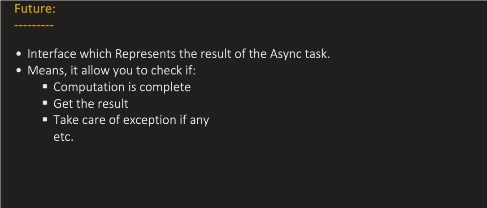
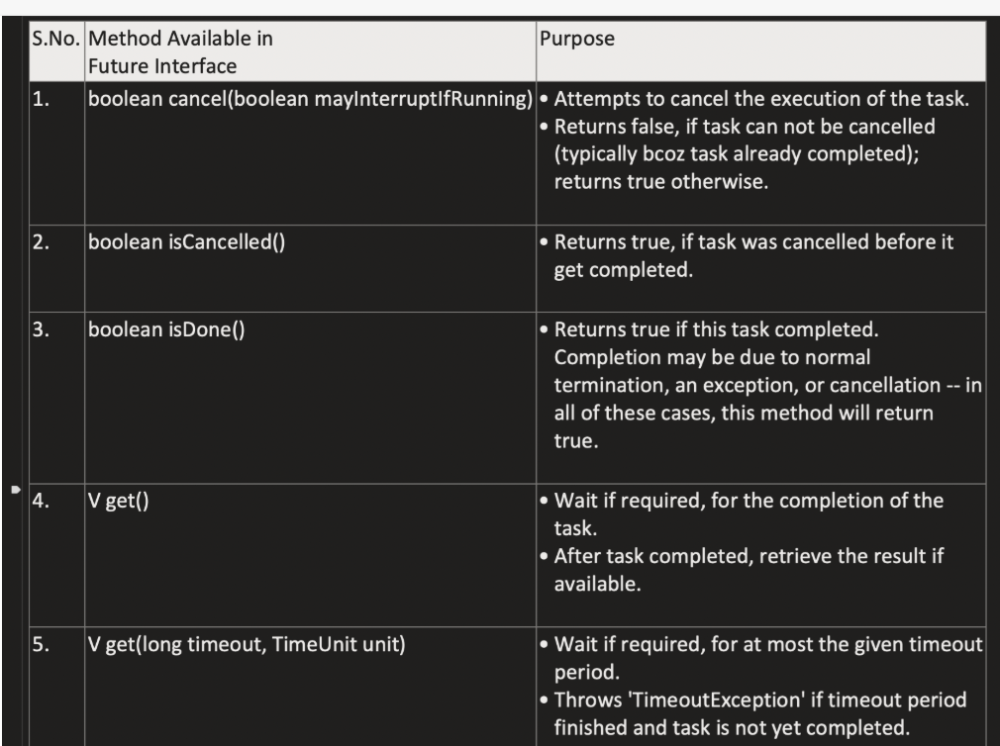
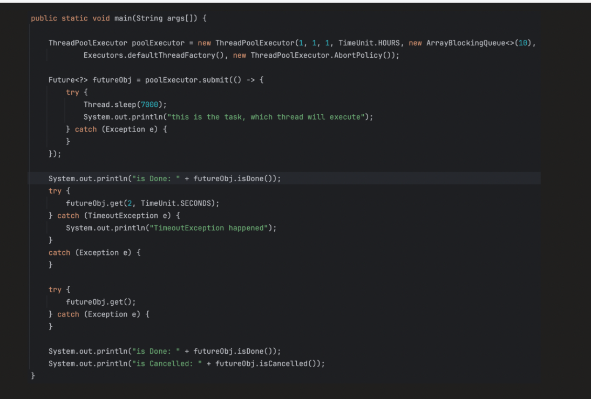
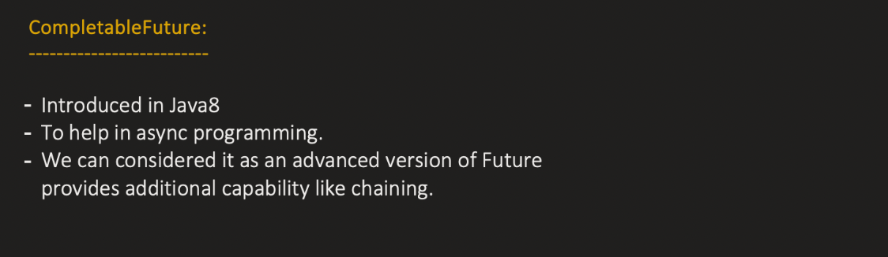

Async (Asynchronous) means:

    A task runs independently, and the caller does not wait for it to finish.
    The caller continues execution immediately.
    Async is about behavior, not about number of threads.


FUTURE :

    ---> is an interface that represents the result of an asynchronous computation.
When you submit a task to:

    Thread
    ExecutorService
    ThreadPoolExecutor

The task runs in another thread (async).

But how do you:

    Get the result?
    Check if it finished?
    Cancel it?
👉 That’s what Future provides.



```java
import java.util.concurrent.*;

public class Main {
    public static void main(String[] args) throws Exception {

        ExecutorService executor = Executors.newFixedThreadPool(2);

        Future<String> future = executor.submit(() -> {
            Thread.sleep(2000);
            return "Hello World";
        });

        System.out.println("Doing something else...");

        String result = future.get();  // blocks until result ready
        System.out.println("Result: " + result);

        executor.shutdown();
    }
}

```

METHODS :








Future<?> future = exec.submit(Runnable runnable)

---> Here submit method returns runnable future which is an interface which extends Future and Runnable

```java
 public Future<?> submit(Runnable task) {
        if (task == null) throw new NullPointerException();
        RunnableFuture<Void> ftask = newTaskFor(task, null);
        execute(ftask);
        return ftask;
    }


```

```java

public interface RunnableFuture<V> extends Runnable, Future<V> {
    void run();
}

```

Here Future Task is the implementation of RunnableFuture

In the neTaskFor() method the runnable is wrapped as a future task and returned

```java
public class FutureTask<V> implements RunnableFuture<V> {


    private volatile int state;
    private static final int NEW = 0;
    private static final int COMPLETING = 1;
    private static final int NORMAL = 2;
    private static final int EXCEPTIONAL = 3;
    private static final int CANCELLED = 4;
    private static final int INTERRUPTING = 5;
    private static final int INTERRUPTED = 6;

    private Callable<V> callable;


    public FutureTask(Runnable runnable, V result) {
        this.callable = Executors.callable(runnable, result);
        this.state = NEW;       // ensure visibility of callable
    }

    protected <T> RunnableFuture<T> newTaskFor(Runnable runnable, T value) {
        return new FutureTask<T>(runnable, value);
    }
}

```

Future Task contains a field called callable so the runnable is wrapped as RunnableAdaptor which implements callable and overrides call()
method . Inside the call method() it calls runnable.run()


Executors.callable(.....)

```java

public static <T> Callable<T> callable(Runnable task, T result) {
        if (task == null)
            throw new NullPointerException();
        return new RunnableAdapter<T>(task, result);
    }

```


```java
private static final class RunnableAdapter<T> implements Callable<T> {
    private final Runnable task;
    private final T result;

    RunnableAdapter(Runnable task, T result) {
        this.task = task;
        this.result = result;
    }

    public T call() {
        task.run();
        return result;
    }
}
```

Inside execute method it calls futureTask.run()

```java

public void run() {
        if (state != NEW ||
            !RUNNER.compareAndSet(this, null, Thread.currentThread()))
            return;
        try {
            Callable<V> c = callable;
            if (c != null && state == NEW) {
                V result;
                boolean ran;
                try {
                    result = c.call();
                    ran = true;
                } catch (Throwable ex) {
                    result = null;
                    ran = false;
                    setException(ex);
                }
                if (ran)
                    set(result);
            }
        } finally {
            // runner must be non-null until state is settled to
            // prevent concurrent calls to run()
            runner = null;
            // state must be re-read after nulling runner to prevent
            // leaked interrupts
            int s = state;
            if (s >= INTERRUPTING)
                handlePossibleCancellationInterrupt(s);
        }
    }

    

```
in that run it calls callable.call() which is runnableAdaptor.call() ---> which internally calls runnable.run()


2. exec.submit(Callable call)

----> for submit of callable runnable Adaptor is not used in FutureTask.run() it calls callable.call() and the callable task directly executes


-------------------------------------------------------------------------------------------------------------------------------------------------------------------------


**_COMPLETABLE FUTURE :_**


    ---> CompletableFuture is an advanced implementation of Future
    ---> A future result that can be manually completed and chained with other async computations.
    ---> It implements both: Future and CompletionStage



ADVANTAGES :


1. Future is blocking , say for example when we give future.get() main thread has to wait for async operation to complete
   But with completable future we have chainig operations like thenAccept, thenCompose etc which alllows us to work with async results without making main thread wait


1. SupplyAsync()

✅ What it does:

        Takes a Supplier<U>
        Runs it asynchronously
        Returns a CompletableFuture<U>

Completes the future with the result of supplier.get()


CompletableFuture wraps the Supplier inside a Runnable implementation (like AsyncSupply), and inside run(), it calls supplier.get().


```java

import java.util.concurrent.CompletableFuture;

public class Main {
    public static void main(String[] args) {

        System.out.println("Main thread: " + Thread.currentThread().getName());

        CompletableFuture<String> future =
                CompletableFuture.supplyAsync(() -> {
                    System.out.println("Async thread: " + Thread.currentThread().getName());

                    try {
                        Thread.sleep(2000); // simulate long task
                    } catch (InterruptedException e) {
                        e.printStackTrace();
                    }

                    return "Hello from Async Task";
                });

        future.thenAccept(result ->
                System.out.println("Result: " + result)
        );

        System.out.println("Main thread continues...");
    }
}

```

Here by default fork join pool is used by Completable Future
ForJoin Pool uses daemon threads by default 

We can provide custome executors too


2. thenApply?

thenApply is a completion stage method of
CompletableFuture that:

    Attaches a function to a CompletableFuture
    Executes after the previous stage completes normally
    Accepts a Function<T, U> (takes input, produces output)
    Returns a new CompletableFuture<U> representing the transformed result
(takes function functional interface as parameter)

----> It Applies a function to the reult of the prvios async completable future obj
----> Returns a new COmpetable Future Obj


```java
public void method1() throws InterruptedException {
        ThreadPoolExecutor exec = new ThreadPoolExecutor(2,3,5, TimeUnit.SECONDS,new ArrayBlockingQueue<>(5), Executors.defaultThreadFactory(), new ThreadPoolExecutor.AbortPolicy());
        System.out.println(Thread.currentThread().getName());

        CompletableFuture<Integer> fut = CompletableFuture.supplyAsync(() -> {
            System.out.println(Thread.currentThread().getName());
            return 1;
        });

//        Thread.sleep(500);
        CompletableFuture<String> fut1 = fut.thenApply((val) -> {
            System.out.println(Thread.currentThread().getName());

            return val + "World";
        });
    }

```


Here supply async will be done by seperate ForkJoinPool thread
And when it comes to accept by the time main hits then apply if the supply async task has been completed then main thread will execute the thenApply
else the same thread which executed supplyAsync() will execute this


thenApplyAsync() : Similar to thenApply() but not hte same thread will execute thenApplyAsync either a new thread or the existing thread which has returned to the pool will excecute it


1️⃣ What is thenCompose?

thenCompose is used when your continuation itself returns a CompletableFuture.
It flattens nested futures into a single CompletableFuture
Avoids having a CompletableFuture<CompletableFuture<T>>

Helps chain dependent async tasks sequentially