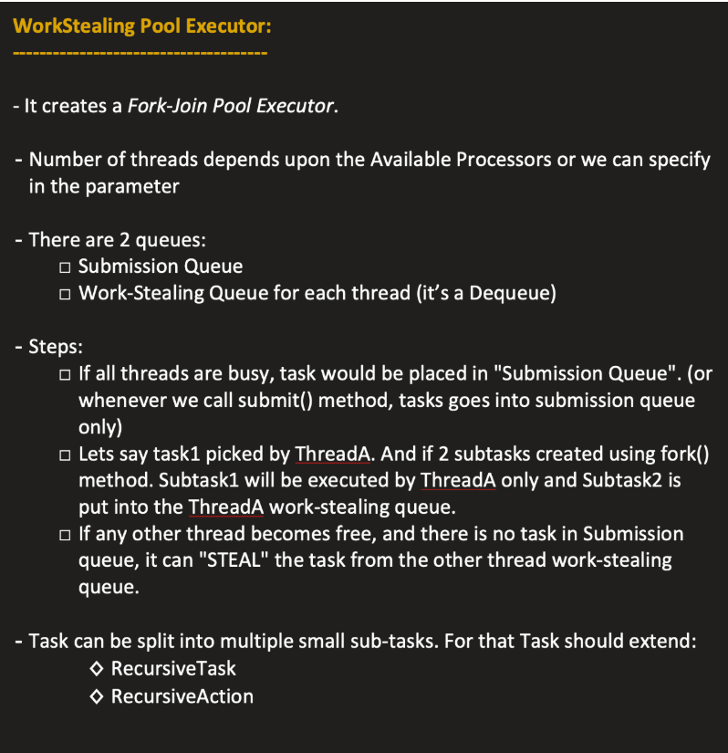
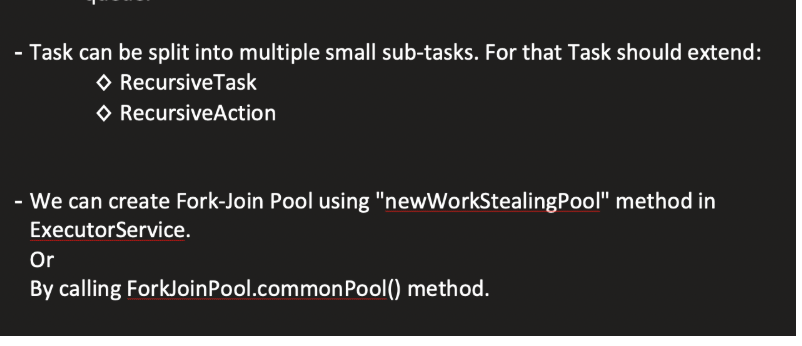
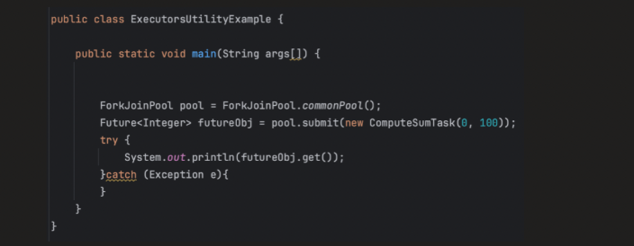
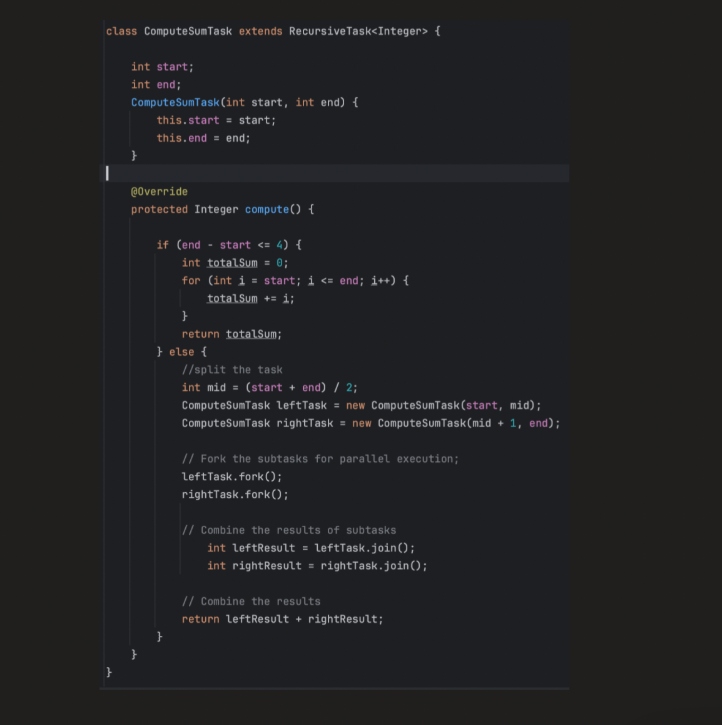

Executors :

    Utility Class
    Package: java.util.concurrent
    Purpose: Provides factory methods to create different types of Executor, ExecutorService, and ScheduledExecutorService instances easily.
    Why Use It: Instead of manually instantiating ThreadPoolExecutor or ScheduledThreadPoolExecutor, you can just call a method from Executors.


| Method                                     | Returns                    | Description                                                                                    | Implementation Class                                                       |
| ------------------------------------------ | -------------------------- | ---------------------------------------------------------------------------------------------- | -------------------------------------------------------------------------- |
| `newFixedThreadPool(int nThreads)`         | `ExecutorService`          | A pool with a fixed number of threads. Threads are reused for multiple tasks.                  | `ThreadPoolExecutor`                                                       |
| `newCachedThreadPool()`                    | `ExecutorService`          | A pool that creates new threads as needed and reuses idle threads. Good for short-lived tasks. | `ThreadPoolExecutor`                                                       |
| `newSingleThreadExecutor()`                | `ExecutorService`          | A single-threaded executor. Tasks are executed sequentially.                                   | `FinalizableDelegatedExecutorService` wrapping `ThreadPoolExecutor`        |
| `newScheduledThreadPool(int corePoolSize)` | `ScheduledExecutorService` | For scheduling tasks after a delay or periodically.                                            | `ScheduledThreadPoolExecutor`                                              |
| `newSingleThreadScheduledExecutor()`       | `ScheduledExecutorService` | Single-threaded scheduled executor.                                                            | `DelegatedScheduledExecutorService` wrapping `ScheduledThreadPoolExecutor` |
| `newWorkStealingPool()`                    | `ExecutorService`          | Uses multiple threads to maximize CPU usage (fork-join style).                                 | `ForkJoinPool`                                                             |

| Executor Method                            | Implementation Class                                                | Core Pool Size | Max Pool Size       | Keep-Alive Time                   | Work Queue                                  | Thread Factory                                    | Rejection Handler                  |
| ------------------------------------------ | ------------------------------------------------------------------- | -------------- | ------------------- | --------------------------------- | ------------------------------------------- | ------------------------------------------------- | ---------------------------------- |
| `newFixedThreadPool(int nThreads)`         | `ThreadPoolExecutor`                                                | `nThreads`     | `nThreads`          | 0L (no keep-alive)                | `LinkedBlockingQueue<Runnable>` (unbounded) | `Executors.defaultThreadFactory()`                | `AbortPolicy`                      |
| `newCachedThreadPool()`                    | `ThreadPoolExecutor`                                                | 0              | `Integer.MAX_VALUE` | 60 seconds                        | `SynchronousQueue<Runnable>`                | `Executors.defaultThreadFactory()`                | `AbortPolicy`                      |
| `newSingleThreadExecutor()`                | `FinalizableDelegatedExecutorService` → `ThreadPoolExecutor`        | 1              | 1                   | 0L                                | `LinkedBlockingQueue<Runnable>` (unbounded) | `Executors.defaultThreadFactory()`                | `AbortPolicy`                      |
| `newScheduledThreadPool(int corePoolSize)` | `ScheduledThreadPoolExecutor`                                       | `corePoolSize` | `Integer.MAX_VALUE` | N/A (uses scheduled tasks timing) | `DelayedWorkQueue`                          | `Executors.defaultThreadFactory()`                | `AbortPolicy`                      |
| `newSingleThreadScheduledExecutor()`       | `DelegatedScheduledExecutorService` → `ScheduledThreadPoolExecutor` | 1              | 1                   | N/A                               | `DelayedWorkQueue`                          | `Executors.defaultThreadFactory()`                | `AbortPolicy`                      |
| `newWorkStealingPool()`                    | `ForkJoinPool`                                                      | N/A            | N/A                 | N/A                               | Internal `ForkJoinTask` queues              | `ForkJoinPool.defaultForkJoinWorkerThreadFactory` | N/A (tasks are managed internally) |

Synchronous QUeue means ) sized queue

```java

import java.util.concurrent.SynchronousQueue;

public class SynchronousQueueExample {
    public static void main(String[] args) throws InterruptedException {
        SynchronousQueue<String> queue = new SynchronousQueue<>();

        // Producer thread
        new Thread(() -> {
            try {
                System.out.println("Putting task...");
                queue.put("Task1"); // Blocks until taken
                System.out.println("Task put!");
            } catch (InterruptedException e) { }
        }).start();

        // Consumer thread
        new Thread(() -> {
            try {
                Thread.sleep(1000); // simulate delay
                System.out.println("Taking task: " + queue.take());
            } catch (InterruptedException e) { }
        }).start();
    }
}
```


| Executor                                   | Implementation                                                      | Key Characteristics                                                                                                  | Example Use Cases                                                                                                                                                                           |
| ------------------------------------------ | ------------------------------------------------------------------- | -------------------------------------------------------------------------------------------------------------------- | ------------------------------------------------------------------------------------------------------------------------------------------------------------------------------------------- |
| `newFixedThreadPool(int nThreads)`         | `ThreadPoolExecutor`                                                | Fixed number of threads, tasks queue in `LinkedBlockingQueue`, core = max threads, no thread termination             | 1. Processing a fixed number of file uploads<br>2. Serving HTTP requests in a small web server<br>3. Executing database queries concurrently but limited to n threads                       |
| `newCachedThreadPool()`                    | `ThreadPoolExecutor`                                                | Core threads = 0, max threads = `Integer.MAX_VALUE`, idle threads terminate after 60s, queue = `SynchronousQueue`    | 1. Handling bursts of short-lived tasks (like async logging)<br>2. Running background jobs triggered unpredictably<br>3. Parallel execution of independent microtasks that complete quickly |
| `newSingleThreadExecutor()`                | `FinalizableDelegatedExecutorService` → `ThreadPoolExecutor`        | Single thread, tasks queued sequentially, guaranteed order of execution                                              | 1. Writing to a single log file to avoid race conditions<br>2. Executing scheduled sequential updates<br>3. Serializing tasks that must run one by one                                      |
| `newScheduledThreadPool(int corePoolSize)` | `ScheduledThreadPoolExecutor`                                       | Multiple threads, supports delayed or periodic execution, queue = `DelayedWorkQueue`                                 | 1. Running periodic cleanup tasks<br>2. Scheduling cache refresh every 5 minutes<br>3. Retry mechanisms with delay for failed network requests                                              |
| `newSingleThreadScheduledExecutor()`       | `DelegatedScheduledExecutorService` → `ScheduledThreadPoolExecutor` | Single thread, delayed or periodic execution, sequential execution                                                   | 1. Single-threaded periodic data sync<br>2. Scheduling heartbeat messages in a system<br>3. Sequential timed notifications or reminders                                                     |
| `newWorkStealingPool()`                    | `ForkJoinPool`                                                      | Uses multiple threads, tasks can be split (if RecursiveTask), work-stealing enabled, ideal for CPU-bound parallelism | 1. Parallel processing of large collections<br>2. CPU-heavy computations like matrix multiplication<br>3. Recursive divide-and-conquer algorithms like mergesort or parallel search         |


**_FORKJOINPOOL EXECUTOR:_**


🔹 What is ForkJoinPool?

ForkJoinPool is a special thread pool introduced in Java Platform, Standard Edition 7 as part of the java.util.concurrent package.
It is designed for:

        🚀 Parallelizing tasks that can be split into smaller independent subtasks and then combined.
        It follows the Fork–Join framework and is based on the Divide and Conquer algorithm.


For Example Say we have a task to add 100 nos

In normal threadpool executor this is a single task and only one threa adds from 1 to 100
In fork Join pool this adding is divided into multiple subtasks like add 1 to 10 one thread 2 to 20 another thread and son on
say if u have multiple processors the tim taken will be much faster


🔹 How it Works Internally
1️⃣ Work-Stealing Algorithm (Very Important)

Each thread has its own deque (double-ended queue).
A thread pushes and pops tasks from its own queue.
If a thread becomes idle:

    It steals work from another thread’s queue.

👉 This improves CPU utilization and reduces contention.

🔹 Why Do We Need ForkJoinPool?

Normal thread pools (like ExecutorService) are good for:

    Independent tasks

But ForkJoinPool is better for:

    Recursive tasks
    CPU-intensive parallel computation
    Large data processing

Because:

    It minimizes idle threads
    It reduces locking
    It scales efficiently with CPU cores


1️⃣ Efficient CPU Utilization (Work-Stealing)

Each worker thread has its own queue.

    If a thread finishes early:
    It steals tasks from another thread.

This means:

        ✅ Less idle time
        ✅ Better load balancing
        ✅ High CPU utilization

This is the biggest advantage.


It is used in stream for parallel processing









```java
import java.util.concurrent.*;

class SumTask extends RecursiveTask<Long> {

    private static final int THRESHOLD = 10_000;

    private final int[] arr;
    private final int start;
    private final int end;

    public SumTask(int[] arr, int start, int end) {
        this.arr = arr;
        this.start = start;
        this.end = end;
    }

    @Override
    protected Long compute() {

        // Base case: small enough → compute directly
        if (end - start <= THRESHOLD) {
            long sum = 0;
            for (int i = start; i < end; i++) {
                sum += arr[i];
            }
            return sum;
        }

        // Split into two subtasks
        int mid = (start + end) / 2;

        SumTask left = new SumTask(arr, start, mid);
        SumTask right = new SumTask(arr, mid, end);

        // Fork left task (submit asynchronously)
        left.fork();

        // Compute right task directly
        long rightResult = right.compute();

        // Wait for left task result
        long leftResult = left.join();

        return leftResult + rightResult;
    }
}
```

```java

public class Main {
    public static void main(String[] args) {

        int[] arr = new int[1_000_000];
        Arrays.fill(arr, 1);

        ForkJoinPool pool = new ForkJoinPool();

        SumTask task = new SumTask(arr, 0, arr.length);

        long result = pool.invoke(task);

        System.out.println("Sum: " + result);
    }
}
```


ForkJoinPool pool = new ForkJoinPool();

        This: Creates worker threads (≈ number of CPU cores)
        Each worker has its own deque (double-ended queue)
        Uses work-stealing algorithm
        It manages execution.

🧩 Component 2: RecursiveTask
class SumTask extends RecursiveTask<Long>

Two main types:

        RecursiveTask<V> → returns result
        RecursiveAction → no result

It defines:

        protected Long compute()
        This is where splitting logic lives.

🧩 Component 3: compute()

This method decides:

        Should I solve directly?
        Or split into smaller subtasks?
        This is the divide-and-conquer logic.

🧩 Component 4: fork()
left.fork();

What it does:

        Pushes task into worker’s deque
        Allows another worker to steal it
        Returns immediately (non-blocking)
        Think: "Schedule this subtask to run in parallel"

🧩 Component 5: compute() (on right side)
long rightResult = right.compute();

Important pattern: We fork one task, compute the other.

Why?

        Because: Current thread stays busy
        Avoids unnecessary task overhead
        This is optimal ForkJoin pattern.

🧩 Component 6: join()
long leftResult = left.join();

            This: Waits for left task to finish
            If not finished, worker may help execute it
            Returns its result
            Join = combine phase.

🔥 Complete Execution Flow

Assume:

        4 CPU cores
        1,000,000 elements
        
        Step 1: Root Task
        Sum(0..1000000)
        Too large → split
        
        Step 2: First Split
        Left:  0..500000
        Right: 500000..1000000
        
        Left → forked
        Right → computed immediately
        
        Step 3: More Splits

Right also too large → split again:

            500k..750k
            750k..1000k

This continues until chunk size ≤ THRESHOLD.

Step 4: Work Stealing

Suppose:

        Thread-1 owns left task.
        Thread-2 becomes idle.
        Thread-2 steals from Thread-1’s deque.
        This balances load.

Step 5: Join Phase

After base tasks compute sums:

        Combine small results
        Combine bigger results
        Combine root result

Final result returned to invoke().

        🔥 Internal Structure (Simplified Tree)
        0..1000000
        /              \
        0..500k           500k..1000k
        /     \             /       \
        ...       ...         ...       ...

This is a task tree.

        Fork = branch
        Join = combine

🔥 Why Fork One and Compute One?

Instead of:

        left.fork();
        right.fork();
        left.join();
        right.join();

Better:

        left.fork();
        right.compute();
        left.join();

Because:

        Avoids creating too many queued tasks
        Current thread does useful work
        Reduces scheduling overhead

🔥 Work-Stealing Mechanism

Each worker:

        Has its own deque
        Pushes new tasks at top
        Pops from top
        Other threads steal from bottom

Submission queue is also unbounded deque