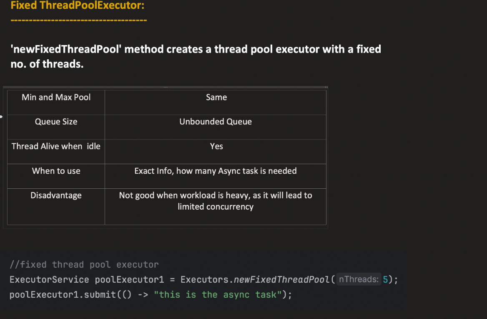
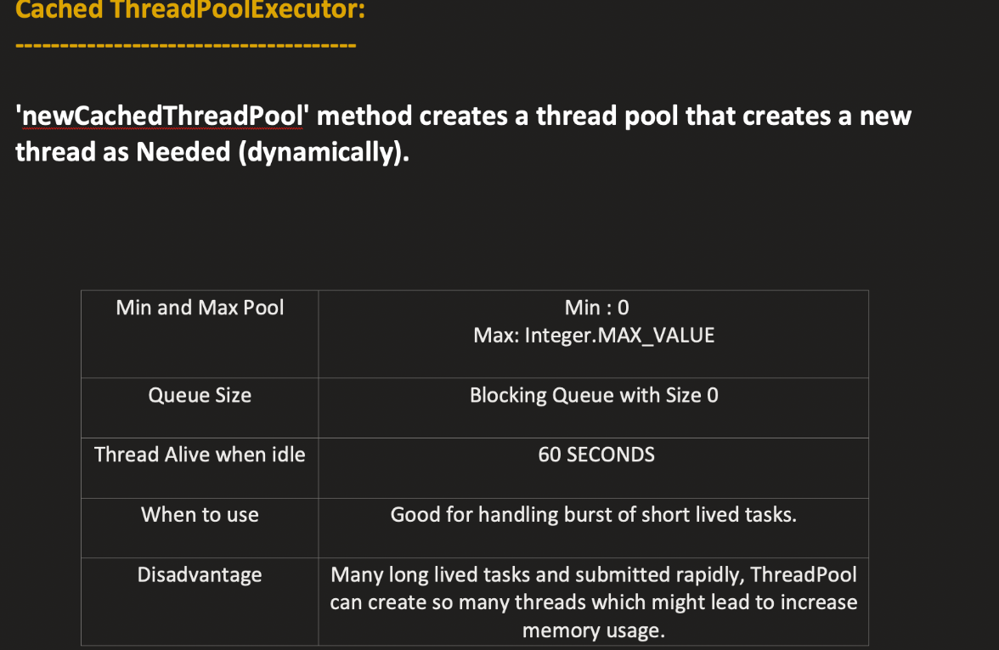
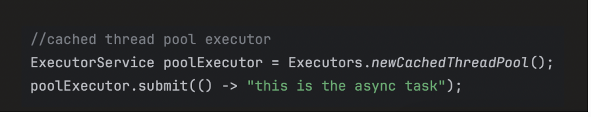
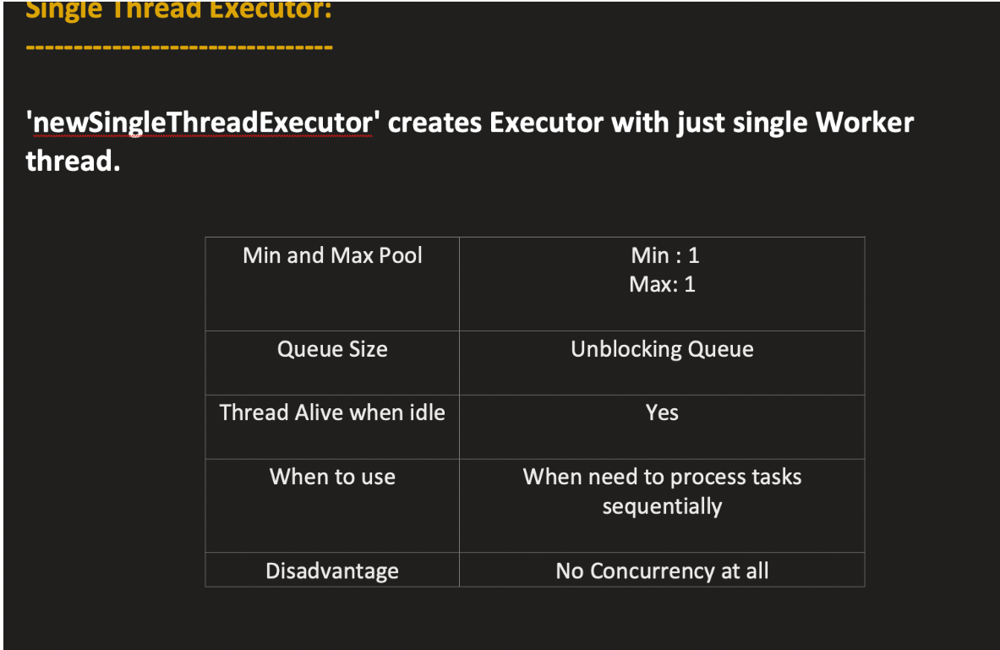

Executors :

    Utility Class
    Package: java.util.concurrent
    Purpose: Provides factory methods to create different types of Executor, ExecutorService, and ScheduledExecutorService instances easily.
    Why Use It: Instead of manually instantiating ThreadPoolExecutor or ScheduledThreadPoolExecutor, you can just call a method from Executors.


| Method                                     | Returns                    | Description                                                                                    | Implementation Class                                                       |
| ------------------------------------------ | -------------------------- | ---------------------------------------------------------------------------------------------- | -------------------------------------------------------------------------- |
| `newFixedThreadPool(int nThreads)`         | `ExecutorService`          | A pool with a fixed number of threads. Threads are reused for multiple tasks.                  | `ThreadPoolExecutor`                                                       |
| `newCachedThreadPool()`                    | `ExecutorService`          | A pool that creates new threads as needed and reuses idle threads. Good for short-lived tasks. | `ThreadPoolExecutor`                                                       |
| `newSingleThreadExecutor()`                | `ExecutorService`          | A single-threaded executor. Tasks are executed sequentially.                                   | `FinalizableDelegatedExecutorService` wrapping `ThreadPoolExecutor`        |
| `newScheduledThreadPool(int corePoolSize)` | `ScheduledExecutorService` | For scheduling tasks after a delay or periodically.                                            | `ScheduledThreadPoolExecutor`                                              |
| `newSingleThreadScheduledExecutor()`       | `ScheduledExecutorService` | Single-threaded scheduled executor.                                                            | `DelegatedScheduledExecutorService` wrapping `ScheduledThreadPoolExecutor` |
| `newWorkStealingPool()`                    | `ExecutorService`          | Uses multiple threads to maximize CPU usage (fork-join style).                                 | `ForkJoinPool`                                                             |

| Executor Method                            | Implementation Class                                                | Core Pool Size | Max Pool Size       | Keep-Alive Time                   | Work Queue                                  | Thread Factory                                    | Rejection Handler                  |
| ------------------------------------------ | ------------------------------------------------------------------- | -------------- | ------------------- | --------------------------------- | ------------------------------------------- | ------------------------------------------------- | ---------------------------------- |
| `newFixedThreadPool(int nThreads)`         | `ThreadPoolExecutor`                                                | `nThreads`     | `nThreads`          | 0L (no keep-alive)                | `LinkedBlockingQueue<Runnable>` (unbounded) | `Executors.defaultThreadFactory()`                | `AbortPolicy`                      |
| `newCachedThreadPool()`                    | `ThreadPoolExecutor`                                                | 0              | `Integer.MAX_VALUE` | 60 seconds                        | `SynchronousQueue<Runnable>`                | `Executors.defaultThreadFactory()`                | `AbortPolicy`                      |
| `newSingleThreadExecutor()`                | `FinalizableDelegatedExecutorService` → `ThreadPoolExecutor`        | 1              | 1                   | 0L                                | `LinkedBlockingQueue<Runnable>` (unbounded) | `Executors.defaultThreadFactory()`                | `AbortPolicy`                      |
| `newScheduledThreadPool(int corePoolSize)` | `ScheduledThreadPoolExecutor`                                       | `corePoolSize` | `Integer.MAX_VALUE` | N/A (uses scheduled tasks timing) | `DelayedWorkQueue`                          | `Executors.defaultThreadFactory()`                | `AbortPolicy`                      |
| `newSingleThreadScheduledExecutor()`       | `DelegatedScheduledExecutorService` → `ScheduledThreadPoolExecutor` | 1              | 1                   | N/A                               | `DelayedWorkQueue`                          | `Executors.defaultThreadFactory()`                | `AbortPolicy`                      |
| `newWorkStealingPool()`                    | `ForkJoinPool`                                                      | N/A            | N/A                 | N/A                               | Internal `ForkJoinTask` queues              | `ForkJoinPool.defaultForkJoinWorkerThreadFactory` | N/A (tasks are managed internally) |

Synchronous QUeue means ) sized queue

```java

import java.util.concurrent.SynchronousQueue;

public class SynchronousQueueExample {
    public static void main(String[] args) throws InterruptedException {
        SynchronousQueue<String> queue = new SynchronousQueue<>();

        // Producer thread
        new Thread(() -> {
            try {
                System.out.println("Putting task...");
                queue.put("Task1"); // Blocks until taken
                System.out.println("Task put!");
            } catch (InterruptedException e) { }
        }).start();

        // Consumer thread
        new Thread(() -> {
            try {
                Thread.sleep(1000); // simulate delay
                System.out.println("Taking task: " + queue.take());
            } catch (InterruptedException e) { }
        }).start();
    }
}
```


| Executor                                   | Implementation                                                      | Key Characteristics                                                                                                  | Example Use Cases                                                                                                                                                                           |
| ------------------------------------------ | ------------------------------------------------------------------- | -------------------------------------------------------------------------------------------------------------------- | ------------------------------------------------------------------------------------------------------------------------------------------------------------------------------------------- |
| `newFixedThreadPool(int nThreads)`         | `ThreadPoolExecutor`                                                | Fixed number of threads, tasks queue in `LinkedBlockingQueue`, core = max threads, no thread termination             | 1. Processing a fixed number of file uploads<br>2. Serving HTTP requests in a small web server<br>3. Executing database queries concurrently but limited to n threads                       |
| `newCachedThreadPool()`                    | `ThreadPoolExecutor`                                                | Core threads = 0, max threads = `Integer.MAX_VALUE`, idle threads terminate after 60s, queue = `SynchronousQueue`    | 1. Handling bursts of short-lived tasks (like async logging)<br>2. Running background jobs triggered unpredictably<br>3. Parallel execution of independent microtasks that complete quickly |
| `newSingleThreadExecutor()`                | `FinalizableDelegatedExecutorService` → `ThreadPoolExecutor`        | Single thread, tasks queued sequentially, guaranteed order of execution                                              | 1. Writing to a single log file to avoid race conditions<br>2. Executing scheduled sequential updates<br>3. Serializing tasks that must run one by one                                      |
| `newScheduledThreadPool(int corePoolSize)` | `ScheduledThreadPoolExecutor`                                       | Multiple threads, supports delayed or periodic execution, queue = `DelayedWorkQueue`                                 | 1. Running periodic cleanup tasks<br>2. Scheduling cache refresh every 5 minutes<br>3. Retry mechanisms with delay for failed network requests                                              |
| `newSingleThreadScheduledExecutor()`       | `DelegatedScheduledExecutorService` → `ScheduledThreadPoolExecutor` | Single thread, delayed or periodic execution, sequential execution                                                   | 1. Single-threaded periodic data sync<br>2. Scheduling heartbeat messages in a system<br>3. Sequential timed notifications or reminders                                                     |
| `newWorkStealingPool()`                    | `ForkJoinPool`                                                      | Uses multiple threads, tasks can be split (if RecursiveTask), work-stealing enabled, ideal for CPU-bound parallelism | 1. Parallel processing of large collections<br>2. CPU-heavy computations like matrix multiplication<br>3. Recursive divide-and-conquer algorithms like mergesort or parallel search         |










