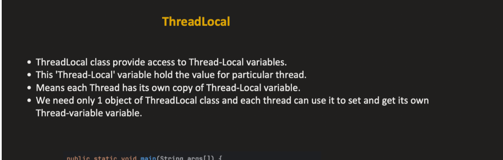
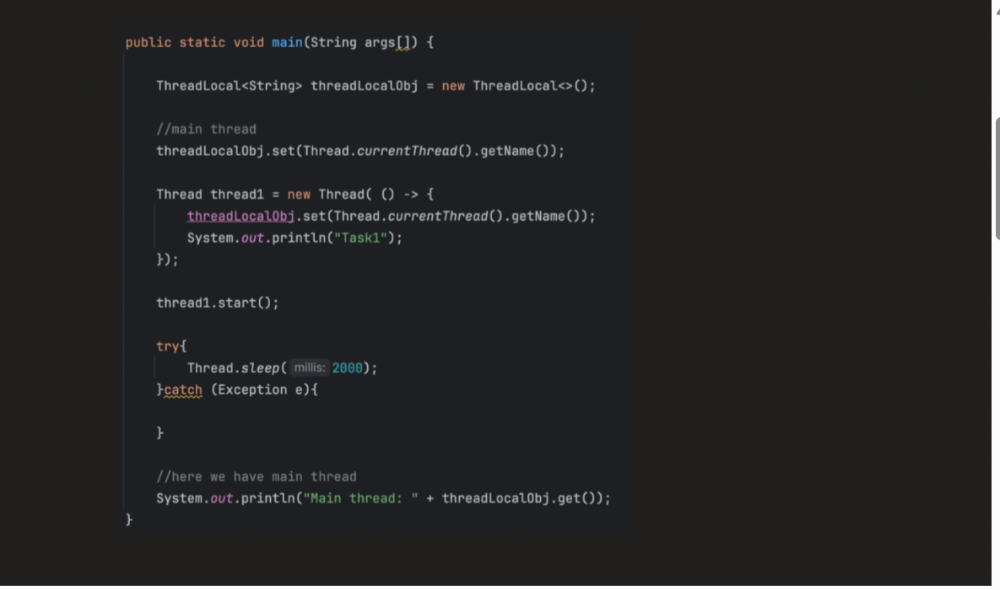
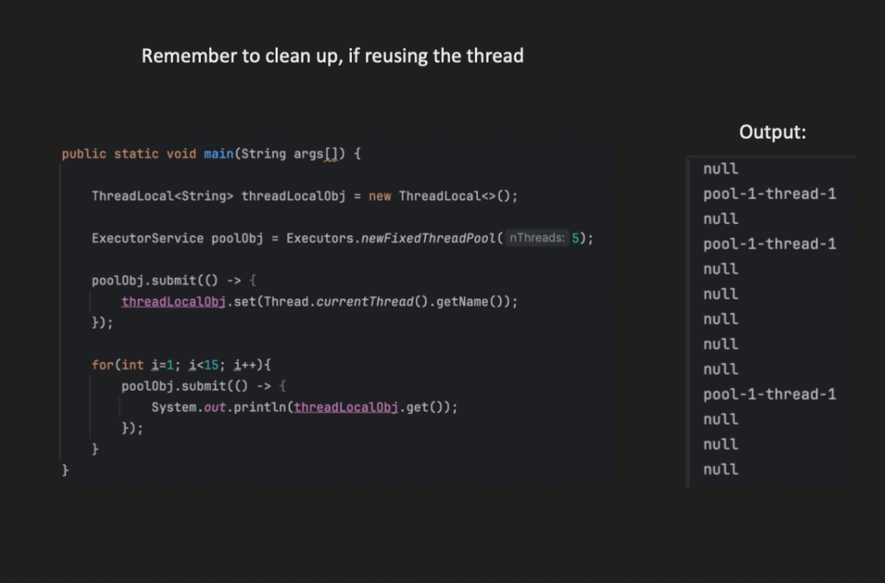
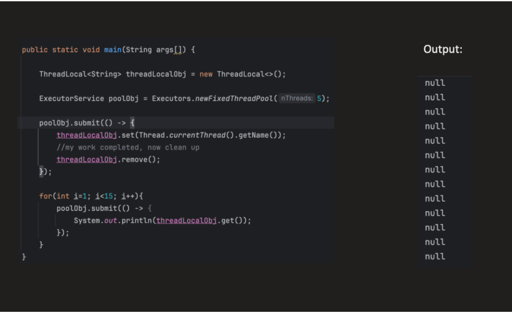
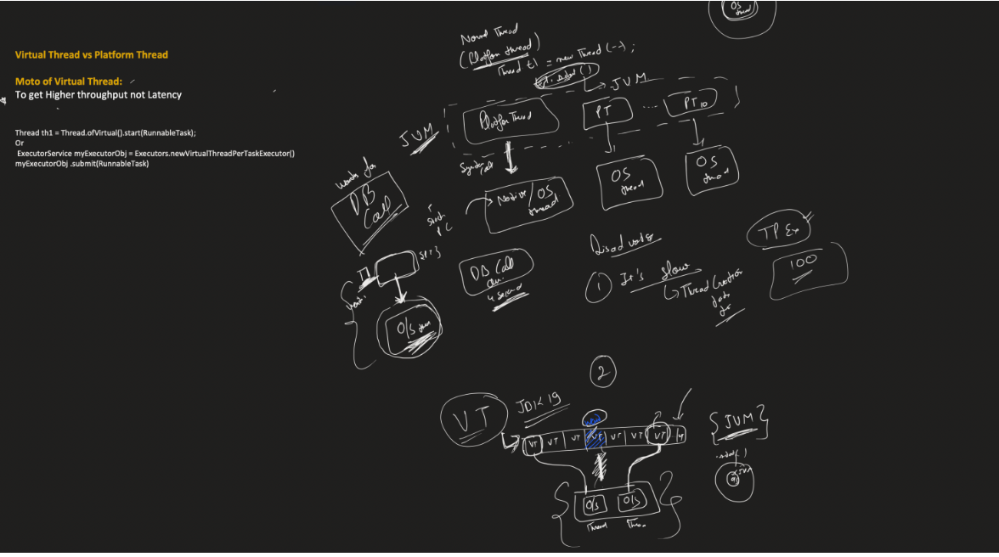

**_ThreadLocal :**_

    ThreadLocal<T> provides variables that are local to a thread. Each thread accessing the variable gets its own independent copy.

Key points:

        Each thread sees its own value.
        Values are not shared across threads.
        Thread-local values are attached to the thread itself, not the ThreadLocal object.

2️⃣ How it works internally

Every Java thread has a thread-local map:

        Thread ──> ThreadLocalMap ──> (ThreadLocal key, value)

    Each Thread object has a ThreadLocalMap.
    The key is the ThreadLocal instance, and the value is the thread-specific value.
    When you do threadLocal.get(), it looks up its value in the thread’s map.
    So even if two threads use the same ThreadLocal object, they get different values.

3️⃣ Why use ThreadLocal?

We use ThreadLocal when we need:

        Per-thread context/state accessible throughout the thread without passing as a parameter.
        Avoid synchronization for thread-specific data.
        Maintain consistency in tasks that span multiple methods.

Typical Use Cases
A. User / Request Context (Web apps)

1️⃣ Security context in a web application

    In frameworks like Spring Security, the current user / authentication info is stored in a ThreadLocal.
    This works perfectly within the same thread handling the request.

```java

ThreadLocal<SecurityContext> contextHolder;
SecurityContext context = contextHolder.get(); // current user info

```

Why useful:

        Every request handled by a thread can access the current user anywhere in the call stack.
        No need to pass user parameter to every method.
        When we are sending it to another ms we need to send the auth details which is in security context if we made the security context as threadlocal it will be in thread itself
        No need to pass security context as an argument from one metho dto another or get from where it is stored.
       Here, you can read the ThreadLocal security context and attach it to the outgoing request headers.


        A single database connection per request or per unit of work.
        That all methods in the call stack use the same connection.
        We don’t want to pass the connection as a parameter to every method.
        We don’t want multiple threads interfering, so synchronization is unnecessary.

```java

Without ThreadLocal
void methodA() {
    Connection conn = dataSource.getConnection();
    methodB(conn);
}

void methodB(Connection conn) {
    conn.prepareStatement("...");
}


```


    Every method now must receive conn as a parameter.
    In a large codebase, this becomes cumbersome.

```java

public class TransactionManager {
    private static ThreadLocal<Connection> connHolder = new ThreadLocal<>();

    public static void startTransaction() throws SQLException {
        // create a new connection and store it for this thread
        connHolder.set(dataSource.getConnection());
    }

    public static void commit() throws SQLException {
        connHolder.get().commit(); // same connection as startTransaction
    }

    public static void rollback() throws SQLException {
        connHolder.get().rollback();
    }

    public static void close() throws SQLException {
        connHolder.get().close();
        connHolder.remove(); // clean up
    }
}
```

How it works:

ThreadLocal stores the connection per thread.
Thread-0 has its own connection.
Thread-1 has its own connection.
Any method called later in the same thread can access the connection:


```java
void serviceMethod() throws SQLException {
    TransactionManager.startTransaction();
    try {
        dao.insertData();      // uses connHolder.get()
        dao.updateData();      // uses same connection
        TransactionManager.commit();
    } catch (Exception e) {
        TransactionManager.rollback();
    } finally {
        TransactionManager.close(); // important!
    }
}
```










**_VIRTUAL THREADS :**_

Virtual threads are a new type of lightweight thread introduced in Java (Project Loom).

Key points:
        
        Managed by the JVM, not the OS.
        Many virtual threads can share a small number of OS threads.
        Ideal for I/O-bound tasks where threads spend most time waiting.
        Allows writing blocking-style code (read, write) that scales to millions of threads without memory or scheduling overhead.

Before virtual threads:

        Platform threads (normal threads) in Java map 1-to-1 with OS threads.
        Each thread requires OS resources (memory stack, kernel scheduling).
        Creating thousands of threads is expensive in memory and scheduling overhead.

Example Problem:
    
    Server needs to handle 100,000 concurrent connections.
    - Using platform threads, you need 100,000 OS threads.
      - Memory usage = huge (each thread ~1 MB stack by default)
      - Scheduling overhead = high
      - Many threads will be blocked on I/O → CPU idle

✅ Key issue: threads are expensive and inefficient for I/O-bound workloads.

2️⃣ Virtual Threads (Project Loom)

Definition:
    
    Virtual threads are lightweight threads managed by the Java runtime (JVM) instead of the OS.
    They allow millions of threads to run concurrently with minimal overhead.


3️⃣ How Virtual Threads Work (Internally)
    
    Many-to-One Mapping
    Virtual threads do not have a dedicated OS thread.
    JVM maintains a scheduler that assigns virtual threads to available OS threads when they need to execute.

Example:

        - 10 Virtual Threads (V1–V10)
          - 2 OS threads (O1, O2)
          - Execution:
              - V1 runs on O1
              - V2 runs on O2
              - V3 waits → gets scheduled on O1 when V1 blocks on I/O

Blocking Operations Are Handled Efficiently
    
    In traditional threads: If a thread performs blocking I/O, its OS thread is idle.
    In virtual threads: JVM pauses the virtual thread, frees the OS thread, and lets another virtual thread run.
    This allows high concurrency without needing thousands of OS threads.

4️⃣ Why Virtual Threads Are Ideal for I/O-bound Tasks
        
        I/O-bound tasks spend most time waiting for data (network, DB, file).
        Traditional threads: OS threads sit idle → waste resources.
        Virtual threads: JVM detaches the waiting thread, runs another virtual thread → CPU stays busy.


1️⃣ What are carrier threads?

        A carrier thread is a real OS thread that the JVM uses to execute virtual threads.
        Virtual threads themselves are lightweight and don’t need their own OS thread.
        When a virtual thread runs, the JVM schedules it onto a carrier thread.
        Think of it as “a real worker (OS thread) running lightweight tasks (virtual threads)”.

2️⃣ Who creates the carrier threads?

JVM creates and manages carrier threads automatically.
Default behavior:
    
    Number of carrier threads is usually proportional to the number of CPU cores.
    JVM uses an internal executor / ForkJoinPool to run virtual threads.
    You do not create or manage carrier threads yourself; you only create virtual threads.

3️⃣ How it works internally
    
    You create a virtual thread:
    Thread vThread = Thread.startVirtualThread(() -> doSomeWork());
    JVM schedules this virtual thread onto a carrier thread.
    If the virtual thread blocks (e.g., waiting for I/O), the JVM detaches it from the carrier thread:
    Carrier thread is free to run other virtual threads.
    Virtual thread is paused until ready.
    Millions of virtual threads can run concurrently on a small number of carrier threads.


Carrier thread is created and managed by the JVM only when virtual thread is needed



Advantages:

    High scalability (millions of threads).
    Cheap to create and schedule.
    Simplified code: blocking I/O works naturally.
    No need for complex reactive frameworks for concurrency.