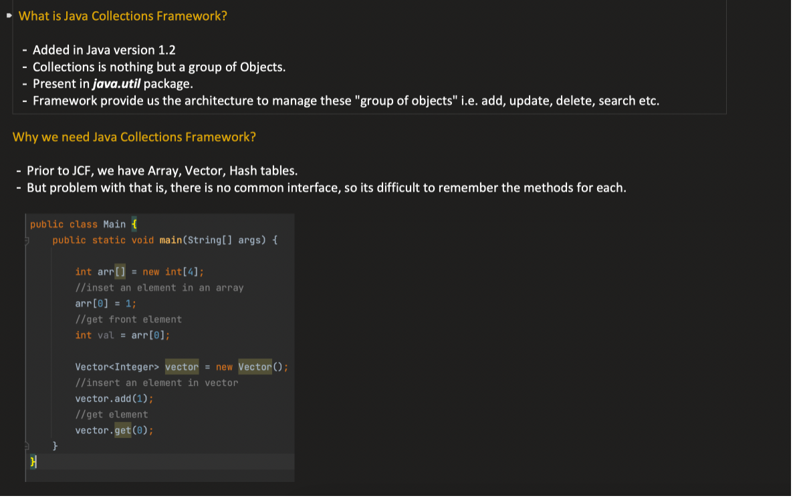
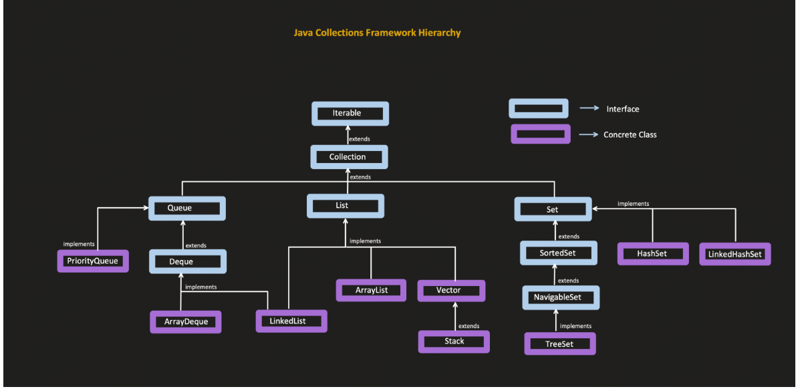
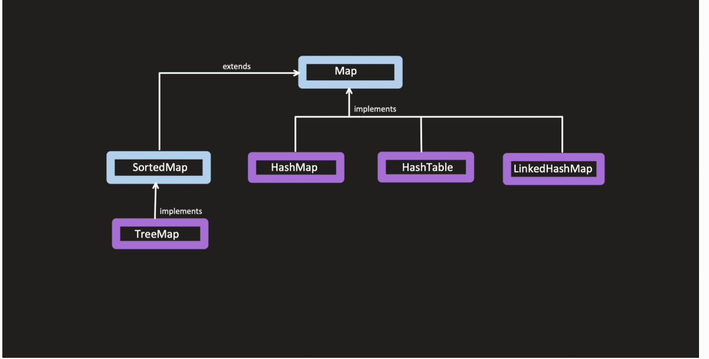
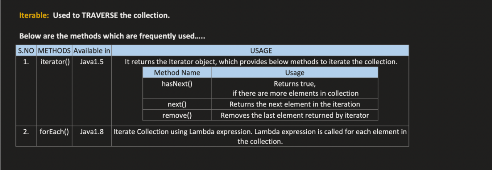
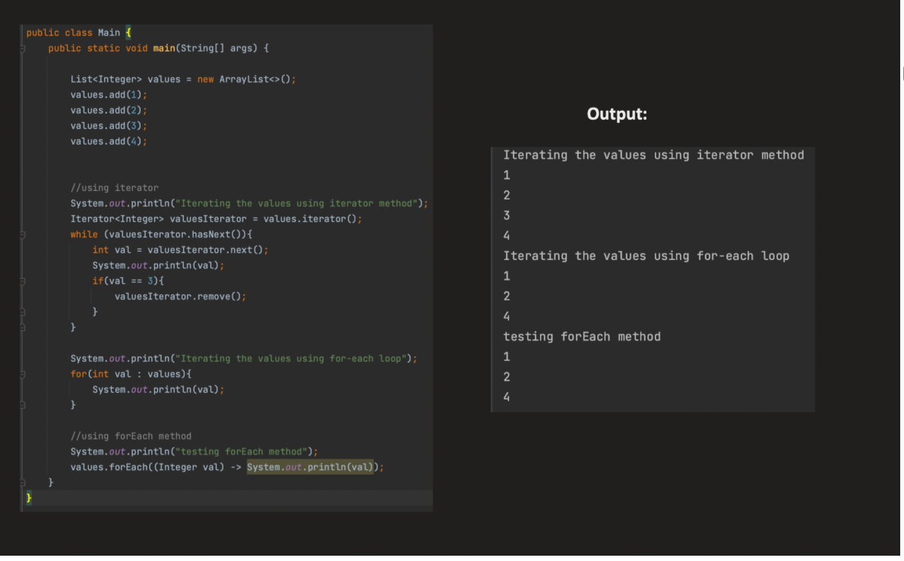

JAVA COLLECTION FRAMEWORK :`

        The Java Collection Framework (JCF) is a set of classes and interfaces in Java that provide a ready-made architecture for storing and manipulating groups of objects efficiently.
        The Java Collection Framework is a unified architecture for representing and manipulating collections — groups of objects — such as lists, sets, and maps.

Why JCF?

1️⃣ What problem existed before JCF?

Before JCF, Java had classes like:

        Vector
        Hashtable
        Stack

Problems:

        No common interface
        Hard to reuse code
        Different APIs for similar operations
        Not flexible

So Java introduced the Java Collections Framework.

1️⃣ No Common Interface

Each data structure had its own API, meaning methods were inconsistent.

Example:

Vector

        Vector v = new Vector();
        v.addElement("A");
        v.addElement("B");
Hashtable

        Hashtable ht = new Hashtable();
        ht.put("id", 1);
Stack

        Stack s = new Stack();
        s.push("A");

Notice the methods:

        Class	     Method
        Vector	    addElement()
        Stack	    push()
        Hashtable	put()

There was no common interface like Collection or List.

    So generic code like this was impossible:
    
    void print(Collection c)
    because Collection didn't exist yet.

2️⃣ Hard to Write Reusable Code

        Because there was no common parent interface, you couldn't write code that works for multiple collections.
        Example problem:
        
            void processVector(Vector v)
        
        If later you wanted to pass a Stack or Hashtable, you had to write new methods.
        So developers wrote many duplicate functions:
        
            processVector(Vector v)
            processStack(Stack s)
            processHashtable(Hashtable h)
        
        This was bad design and hard to maintain.

3️⃣ No Standard Algorithms

        Before JCF, there was no standard sorting or searching utility.
        If you wanted to sort a Vector, you had to write your own sorting logic.

    After JCF we got: Collections
    Example today:
            Collections.sort(list);
    
    But earlier developers wrote their own sorting implementations every time.

4️⃣ No Data Structure Hierarchy

        Before JCF there was no organized hierarchy.
        Everything looked like separate classes:
        
                Vector
                Stack
                Hashtable
        
        After JCF we got a proper hierarchy:
        
        Collection
        |
        |---- List
        |---- Set
        |---- Queue
        
        Map
        
        Implementations include:
        
            ArrayList
            LinkedList
            HashMap
        
        Now everything follows standard interfaces.

5️⃣ Flexibility Problem

Before JCF:

        Vector v = new Vector();
        Your code depended directly on Vector.
        
        After JCF:
        
        List list = new ArrayList();
        Now you can easily change implementation:
        
        List list = new LinkedList();
        
        Your program still works.
        This is called programming to interfaces.

6️⃣ Synchronization Problem

Old collections like:

        Vector
        Hashtable
        were always synchronized, which made them slower.

JCF introduced:

        ArrayList
        HashMap
        which are not synchronized by default, improving performance.









**_ITERABLE INTERFACE :_**

    Iterable is the root interface in the Java Collection Framework hierarchy — it represents a collection of elements that can be iterated (looped) one by one.

## 🧩 **Purpose**

The purpose of Iterable is simple:

    To provide a standard way to iterate (loop through) all elements in a collection using an Iterator or enhanced for-each loop.







Before the Iterable interface existed in Java collections, iteration was mainly done using the Enumeration interface.

        Vector v = new Vector();
        v.add("A");
        v.add("B");
        v.add("C");
        
        Enumeration e = v.elements();
        
        while(e.hasMoreElements()) {
        System.out.println(e.nextElement());
        }

3️⃣ Problems with Enumeration

Enumeration had several limitations.

    ❌ Cannot remove elements

You could only read elements, not modify the collection.

Example:

        e.remove();  // not possible
        ❌ Not part of a standard hierarchy

Since collections didn't share a common interface, iteration APIs were inconsistent.

        ❌ No fail-fast behavior

If the collection changed during iteration, it would not detect concurrent modification.


```java

public interface Iterable<T> {
    Iterator<T> iterator();
    
    default void forEach(Consumer<? super T> action) { ... }

    default Spliterator<T> spliterator() { ... }
}
```


forEach :


```java
default void forEach(Consumer<? super T> action) {

	Objects.requireNonNull(action);
	for (T t : this) {
		action.accept(t);
	}

}

```

    Consumer is a functional interface with accept() as abstract method


## Enhanced for-loop (for-each) rules

In Java, the enhanced for loop syntax:

    for (ElementType element : iterableObject)
is syntactic sugar(compiler feature).  

The compiler automatically translates it into a loop using the iterator() method from the Iterable interface.


## ⚙️ What the compiler actually does

When the compiler sees:

    for (T t : this)

it rewrites it internally as:

```
Iterator<Integer> it = arrayList.iterator();

while(it.hasNext()) {
    int a = it.next();
    System.out.println(a);
}

```

