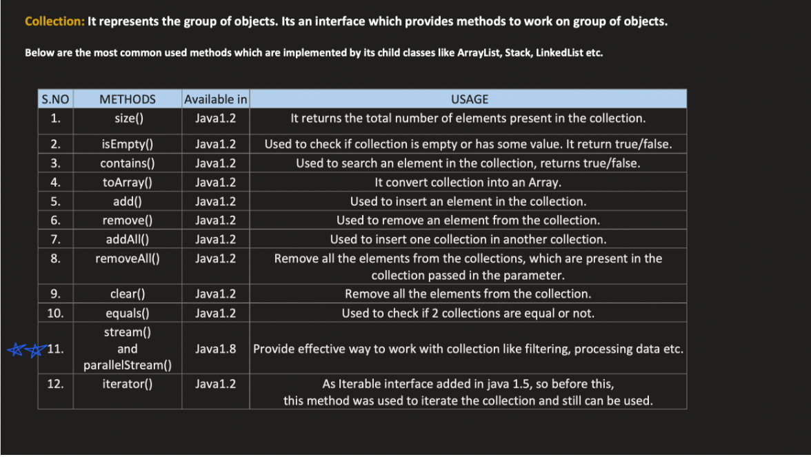
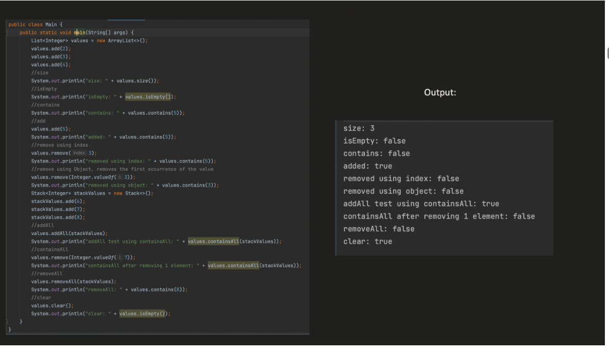
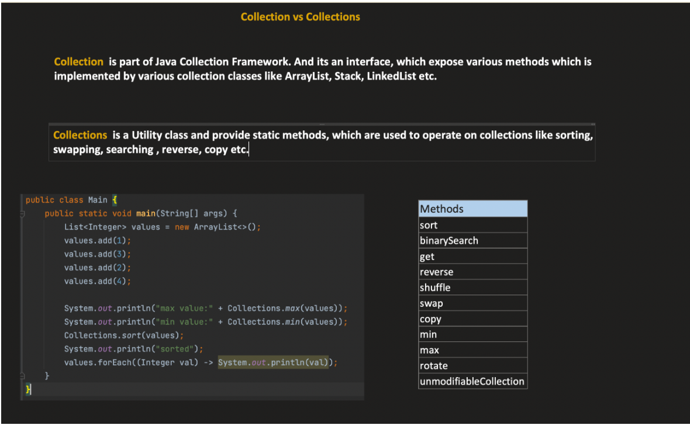

JAVA COLLECTION FRAMEWORK :`

        The Java Collection Framework (JCF) is a set of classes and interfaces in Java that provide a ready-made architecture for storing and manipulating groups of objects efficiently.
        The Java Collection Framework is a unified architecture for representing and manipulating collections — groups of objects — such as lists, sets, and maps.

Why JCF?

1️⃣ What problem existed before JCF?

Before JCF, Java had classes like:

        Vector
        Hashtable
        Stack

Problems:

        No common interface
        Hard to reuse code
        Different APIs for similar operations
        Not flexible

So Java introduced the Java Collections Framework.

1️⃣ No Common Interface

Each data structure had its own API, meaning methods were inconsistent.

Example:

Vector

        Vector v = new Vector();
        v.addElement("A");
        v.addElement("B");
Hashtable

        Hashtable ht = new Hashtable();
        ht.put("id", 1);
Stack

        Stack s = new Stack();
        s.push("A");

Notice the methods:

        Class	     Method
        Vector	    addElement()
        Stack	    push()
        Hashtable	put()

There was no common interface like Collection or List.

    So generic code like this was impossible:
    
    void print(Collection c)
    because Collection didn't exist yet.

2️⃣ Hard to Write Reusable Code

        Because there was no common parent interface, you couldn't write code that works for multiple collections.
        Example problem:
        
            void processVector(Vector v)
        
        If later you wanted to pass a Stack or Hashtable, you had to write new methods.
        So developers wrote many duplicate functions:
        
            processVector(Vector v)
            processStack(Stack s)
            processHashtable(Hashtable h)
        
        This was bad design and hard to maintain.

3️⃣ No Standard Algorithms

        Before JCF, there was no standard sorting or searching utility.
        If you wanted to sort a Vector, you had to write your own sorting logic.

    After JCF we got: Collections
    Example today:
            Collections.sort(list);
    
    But earlier developers wrote their own sorting implementations every time.

4️⃣ No Data Structure Hierarchy

        Before JCF there was no organized hierarchy.
        Everything looked like separate classes:
        
                Vector
                Stack
                Hashtable
        
        After JCF we got a proper hierarchy:
        
        Collection
        |
        |---- List
        |---- Set
        |---- Queue
        
        Map
        
        Implementations include:
        
            ArrayList
            LinkedList
            HashMap
        
        Now everything follows standard interfaces.

5️⃣ Flexibility Problem

Before JCF:

        Vector v = new Vector();
        Your code depended directly on Vector.
        
        After JCF:
        
        List list = new ArrayList();
        Now you can easily change implementation:
        
        List list = new LinkedList();
        
        Your program still works.
        This is called programming to interfaces.

6️⃣ Synchronization Problem

Old collections like:

        Vector
        Hashtable
        were always synchronized, which made them slower.

JCF introduced:

        ArrayList
        HashMap
        which are not synchronized by default, improving performance.


**_ITERABLE INTERFACE :_**

    Iterable is the root interface in the Java Collection Framework hierarchy — it represents a collection of elements that can be iterated (looped) one by one.

## 🧩 **Purpose**

The purpose of Iterable is simple:

    To provide a standard way to iterate (loop through) all elements in a collection using an Iterator or enhanced for-each loop.


Before the Iterable interface existed in Java collections, iteration was mainly done using the Enumeration interface.

        Vector v = new Vector();
        v.add("A");
        v.add("B");
        v.add("C");
        
        Enumeration e = v.elements();
        
        while(e.hasMoreElements()) {
        System.out.println(e.nextElement());
        }

3️⃣ Problems with Enumeration

Enumeration had several limitations.

    ❌ Cannot remove elements

You could only read elements, not modify the collection.

Example:

        e.remove();  // not possible
        ❌ Not part of a standard hierarchy

Since collections didn't share a common interface, iteration APIs were inconsistent.

        ❌ No fail-fast behavior

If the collection changed during iteration, it would not detect concurrent modification.


```java

public interface Iterable<T> {
    Iterator<T> iterator();
    
    default void forEach(Consumer<? super T> action) { ... }

    default Spliterator<T> spliterator() { ... }
}
```


forEach :

Inside Iterable
```java
default void forEach(Consumer<? super T> action) {

	Objects.requireNonNull(action);
	for (T t : this) {
		action.accept(t);
	}

}

```

    Consumer is a functional interface with accept() as abstract method


## Enhanced for-loop (for-each) rules

In Java, the enhanced for loop syntax:

    for (ElementType element : iterableObject)
is syntactic sugar(compiler feature).  

The compiler automatically translates it into a loop using the iterator() method from the Iterable interface.


## ⚙️ What the compiler actually does

When the compiler sees:

    for (T t : this)

it rewrites it internally as:

```
Iterator<Integer> it = arrayList.iterator();

while(it.hasNext()) {
    int a = it.next();
    System.out.println(a);
}

```


====> ModCount and Expected ModCount :

    
    Every Collection Objects will have modCount in their classes  and expecetdModCount which comes from iterator
    So whenever there is a change in the collection modCount will be changed and when we are iterating through the collection we are comparing the modCount with expectedModCount if they are not same it will throw concurrentModificationException
    This is called fail-fast behavior.


Expected ModCount is only used by iterator and modCount is used by collection class to keep track of changes in the collection

Whenever we do arrayList.add(1) or arrayList.remove(1) modCount will be changed and , here expectedModcount wont be used

But whenever we are iterating through the collection using iterator 

    Iterator<Integer> it = arrayList.iterator();

Here expectedModCount will be set to modCount value (expectedModCount = modCount)  
And whenever we make a change while iterating modCount alone changes and when we call next()/remove() etc it will check if modCount and expectedModCount are
same or not if they are not same it will throw concurrentModificationException


Why it behave likes this?

Say when we are deleting an element while iterating 

Ex :

```
import java.util.Iterator;

ArraList<Integer> arr = new ArrayList<>();
arr.add(1);
arr.add(2);
arr.add(3);
Iterator<Integer> it = arr.iterator();
while(it.hasNext()) {
    int a = it.next();      
    if(a == 2) {
        arr.remove(1);  // modCount changes but expectedModCount does not change
    }
}   


```

        In the above example say we remove 2 it will be pointing to 1 and size becones 2 
        if expextedModcount was not there it will point to 1 and when we call next() it will end loop instead of 3 which is wrong so to avoid this concurrentModificationException is thrown


but when we do iterator.remove() it will update both modCount and expectedModCount so it will not throw concurrentModificationException
as well as it will point to 3 and not end loop.


```java

private class Itr implements Iterator<E> {

    int cursor;       // index of next element to return
    int lastRet = -1; // index of last returned element
    int expectedModCount = modCount;

    public boolean hasNext() {
        return cursor != size;
    }

    public E next() {
        checkForComodification();
        int i = cursor;
        cursor = i + 1;
        return elementData[lastRet = i];
    }

    public void remove() {
        checkForComodification();
        ArrayList.this.remove(lastRet);
        cursor = lastRet;
        lastRet = -1;
        expectedModCount = modCount;
    }

    final void checkForComodification() {
        if (modCount != expectedModCount)
            throw new ConcurrentModificationException();
    }
}

```

ArrayList implemtation 

```java
public Iterator<E> iterator() {
    return new Itr();
}
```


----------------------------------------------------------------------------------------------------------------------------------------------------------------------------------------------------------------------------


COLLECTION INTERFACE

    Collection is the root interface in the Java Collections Framework hierarchy. It represents a group of objects, known as elements, and defines basic operations for working with them.
    Collection is an interface that defines basic operations for storing and manipulating groups of objects.


| Method                                  | Return Type      | Purpose / What it does                                                   |
| --------------------------------------- | ---------------- | ------------------------------------------------------------------------ |
| `add(E e)`                              | `boolean`        | Adds an element to the collection. Returns `true` if collection changed. |
| `addAll(Collection<? extends E> c)`     | `boolean`        | Adds all elements from another collection.                               |
| `remove(Object o)`                      | `boolean`        | Removes a specific element if present.                                   |
| `removeAll(Collection<?> c)`            | `boolean`        | Removes all elements that exist in another collection.                   |
| `retainAll(Collection<?> c)`            | `boolean`        | Keeps only elements present in the given collection.                     |
| `clear()`                               | `void`           | Removes all elements from the collection.                                |
| `contains(Object o)`                    | `boolean`        | Checks if a specific element exists.                                     |
| `containsAll(Collection<?> c)`          | `boolean`        | Checks if all elements of another collection exist in this one.          |
| `size()`                                | `int`            | Returns number of elements in the collection.                            |
| `isEmpty()`                             | `boolean`        | Returns `true` if collection has no elements.                            |
| `iterator()`                            | `Iterator<E>`    | Returns an iterator to traverse the collection.                          |
| `toArray()`                             | `Object[]`       | Converts collection to array.                                            |
| `toArray(T[] a)`                        | `T[]`            | Converts collection to typed array.                                      |
| `removeIf(Predicate<? super E> filter)` | `boolean`        | Removes elements that satisfy a condition. (Java 8)                      |
| `stream()`                              | `Stream<E>`      | Returns sequential stream for processing elements.                       |
| `parallelStream()`                      | `Stream<E>`      | Returns parallel stream for parallel processing.                         |
| `spliterator()`                         | `Spliterator<E>` | Returns a spliterator used by streams for parallel traversal.            |

Both removeAll() and retainALL()  methods return true only if the collection was modified.(if atleast any one element was removed or retained)

Ex for toArray(T[] a) :
```java
import java.util.*;

public class Test {
    public static void main(String[] args) {

        List<Integer> list = new ArrayList<>();
        list.add(10);
        list.add(20);
        list.add(30);

        Integer[] arr = list.toArray(new Integer[0]);

        System.out.println(Arrays.toString(arr));
    }
}
```
For newInteger[0] it will create an array of size equal to list size and copy the elements 
If newInteger[6] it will create an array of size 6 and copy the elements and remaining will be null







From Object class(Collection does not extend or implemnt only clases like array list implement obj)
| Method             | Return Type | Purpose                                          |
| ------------------ | ----------- | ------------------------------------------------ |
| `equals(Object o)` | `boolean`   | Checks equality with another object.             |
| `hashCode()`       | `int`       | Returns hash code for hashing structures.        |
| `toString()`       | `String`    | Returns string representation of the collection. |


**COLLECTIONS (UTILITY CLASS):**

    Collections is a utility class in Java that provides static methods for working with collections. It offers algorithms for sorting, searching, and manipulating collections.
    provides static methods to operate on collections.


| Method                                              | Return Type | Use                                    |
| --------------------------------------------------- | ----------- | -------------------------------------- |
| `sort(List<T> list)`                                | void        | Sorts list in natural order            |
| `sort(List<T>, Comparator)`                         | void        | Sorts using custom comparator          |
| `reverse(List<?> list)`                             | void        | Reverses elements                      |
| `shuffle(List<?> list)`                             | void        | Randomly shuffles elements             |
| `swap(List<?> list,int i,int j)`                    | void        | Swaps two elements                     |
| `rotate(List<?> list,int distance)`                 | void        | Rotates elements                       |
| `binarySearch(List<? extends Comparable> list,key)` | int         | Searches element in sorted list        |
| `max(Collection<T> coll)`                           | T           | Returns maximum element                |
| `min(Collection<T> coll)`                           | T           | Returns minimum element                |
| `frequency(Collection<?> c,Object o)`               | int         | Counts occurrences                     |
| `disjoint(Collection<?> c1,Collection<?> c2)`       | boolean     | Checks if collections share elements   |
| `copy(List dest,List src)`                          | void        | Copies elements from src to dest       |
| `fill(List list,Object obj)`                        | void        | Replaces all elements with given value |




```java
import java.util.*;

public class CollectionsExample {

    public static void main(String[] args) {

        // Creating a List
        List<Integer> list = new ArrayList<>(Arrays.asList(5, 3, 8, 1, 3, 9));

        System.out.println("Original List: " + list);
        // Output: [5, 3, 8, 1, 3, 9]

        // 1️⃣ Sorting
        Collections.sort(list);
        //Collections.sort(list, Collections.reverseOrder()); // Sort in reverse order
        System.out.println("Sorted: " + list);
        // Output: [1, 3, 3, 5, 8, 9]

        // 2️⃣ Reverse
        Collections.reverse(list);
        System.out.println("Reversed: " + list);
        // Output: [9, 8, 5, 3, 3, 1]

        // 3️⃣ Shuffle (random order every run)
        Collections.shuffle(list);
        System.out.println("Shuffled: " + list);
        // Example Output: [3, 1, 9, 3, 8, 5]

        // 4️⃣ Max and Min
        System.out.println("Max: " + Collections.max(list));
        // Output: 9

        System.out.println("Min: " + Collections.min(list));
        // Output: 1

        // 5️⃣ Frequency
        System.out.println("Frequency of 3: " + Collections.frequency(list, 3));
        // Output: 2

        // 6️⃣ Binary Search (must be sorted first)
        Collections.sort(list);
        int index = Collections.binarySearch(list, 8);
        System.out.println("Index of 8: " + index);
        // Output: 4

        // 7️⃣ Swap elements
        Collections.swap(list, 0, 1);
        System.out.println("After Swap: " + list);
        // Example Output: [3, 1, 3, 5, 8, 9]

        // 8️⃣ Rotate elements
        Collections.rotate(list, 2);
        System.out.println("After Rotate: " + list);
        // Example Output: [8, 9, 3, 1, 3, 5]

        // 9️⃣ Fill list with value
        List<Integer> fillList = new ArrayList<>(Arrays.asList(1,2,3,4));
        Collections.fill(fillList, 10);
        System.out.println("Filled List: " + fillList);
        // Output: [10, 10, 10, 10]

        // 🔟 Copy elements
        List<Integer> src = Arrays.asList(1,2,3);
        List<Integer> dest = new ArrayList<>(Arrays.asList(0,0,0));
        Collections.copy(dest, src);
        System.out.println("Copied List: " + dest);
        // Output: [1, 2, 3]

        // 1️⃣1️⃣ Disjoint check
        Set<Integer> set1 = new HashSet<>(Arrays.asList(1,2,3));
        Set<Integer> set2 = new HashSet<>(Arrays.asList(4,5,6));

        System.out.println("Disjoint: " + Collections.disjoint(set1, set2));
        //disjoint() checks whether two collections have NO elements in common.
        // Output: true

        // 1️⃣2️⃣ Synchronized collection
        List<Integer> syncList = Collections.synchronizedList(new ArrayList<>());
        syncList.add(100);
        syncList.add(200);
        System.out.println("Synchronized List: " + syncList);
        // Output: [100, 200]

        // 1️⃣3️⃣ Unmodifiable list
        List<Integer> unmodifiable = Collections.unmodifiableList(list);
        System.out.println("Unmodifiable List: " + unmodifiable);
        // Output: same as list (but cannot modify)

        // unmodifiable.add(10); // ❌ throws UnsupportedOperationException

        // 1️⃣4️⃣ Singleton collection
        List<Integer> single = Collections.singletonList(99);
        System.out.println("Singleton List: " + single);
        // Output: [99]

        // 1️⃣5️⃣ Empty collection
        List<Integer> empty = Collections.emptyList();
        System.out.println("Empty List: " + empty);
        // Output: []
    }
}
```

