**_QUEUE :_**

    - Queue is an interface in the Java Collections Framework that represents a collection which follows the First In First Out (FIFO) principle.
      - Elements are added at the rear (tail) and removed from the front (head).

    - Common implementations include:
        - LinkedList: A doubly-linked list implementation that can be used as a queue.
        - ArrayDeque: A resizable array implementation that can be used as a queue.
        - PriorityQueue: A queue that orders its elements based on their natural ordering or a provided
            Comparator. 
        - ConcurrentLinkedQueue: A thread-safe queue based on linked nodes.

| Method       | Return Type | What it Does                            | When to Use                                   |
| ------------ | ----------- | --------------------------------------- | --------------------------------------------- |
| `add(E e)`   | `boolean`   | Inserts element into queue              | When you want insertion and exception if full |
| `offer(E e)` | `boolean`   | Inserts element into queue              | Preferred for capacity-restricted queues      |
| `remove()`   | `E`         | Removes and returns head element        | Throws exception if queue empty               |
| `poll()`     | `E`         | Removes and returns head element        | Returns `null` if queue empty                 |
| `element()`  | `E`         | Retrieves head element without removing | Throws exception if empty                     |
| `peek()`     | `E`         | Retrieves head element without removing | Returns `null` if empty                       |


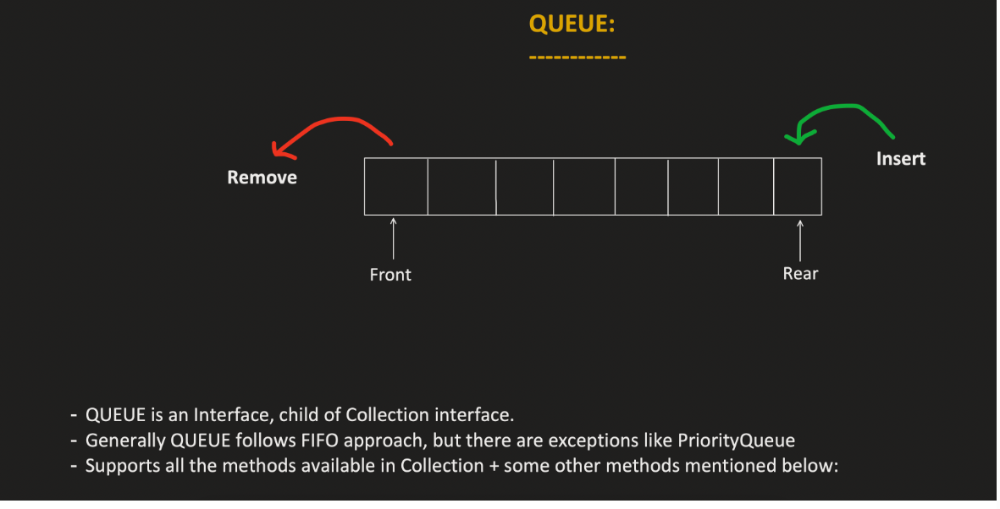

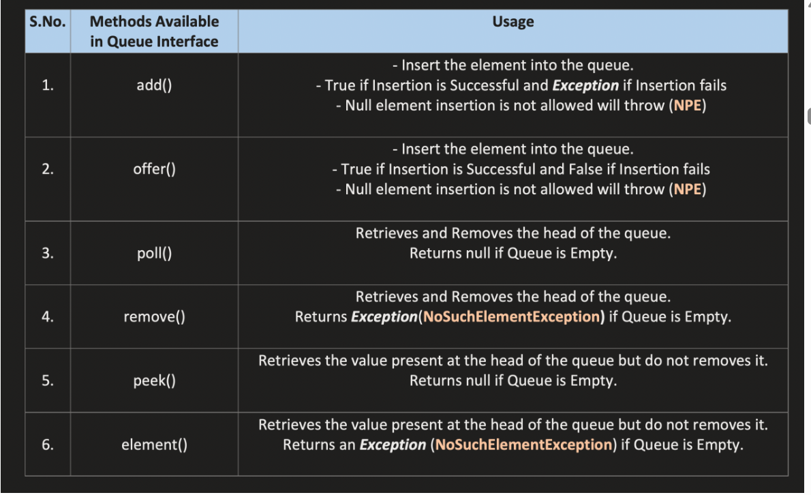


```java

import java.util.*;

public class Main {
    public static void main(String[] args) {

        Queue<Integer> q = new LinkedList<>();

        q.offer(10); // add element
        q.offer(20);
        q.offer(30);

        System.out.println(q.peek()); 
        // 10 → first element

        System.out.println(q.poll()); 
        // 10 → removed

        System.out.println(q); 
        // [20, 30]
    }
}
```


**_Priority Queue :_**

    A java.util.PriorityQueue is a special type of java.util.Queue in the Java Collections Framework where elements are not ordered by insertion (FIFO).
    Instead, elements are ordered based on priority.

Priority is determined by:

    Natural ordering (Comparable)
    Custom comparator

    The smallest element (highest priority) is always at the head of the queue by default.

| Method         | Return Type             | Use                                                                                            |
| -------------- | ----------------------- | ---------------------------------------------------------------------------------------------- |
| `comparator()` | `Comparator<? super E>` | Returns the comparator used to order elements. If natural ordering is used, it returns `null`. |


    PriorityQueue internally uses a Binary Heap (Min Heap)/(Max Heap) data structure to maintain the priority order efficiently.
    It uses an array to store the elements(which defines a Complete binary tree) and maintains the heap property to ensure that the highest priority element is always at the front of the queue.
    
    Complete binary tree:
    - All levels are fully filled except possibly the last level, which is filled from left to right.

Complexity:

    - Insertion: O(log n)
    - Removal of head: O(log n)
    - Peek: O(1)


A Binary Heap is a complete binary tree where:
    
    The tree is completely filled except possibly the last level, which is filled from left to right.
    The heap property is maintained.

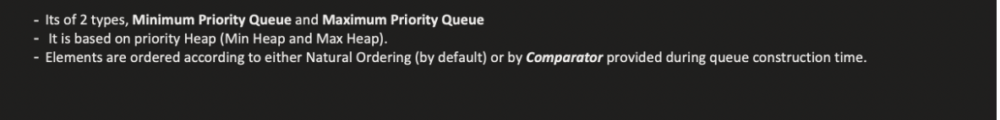

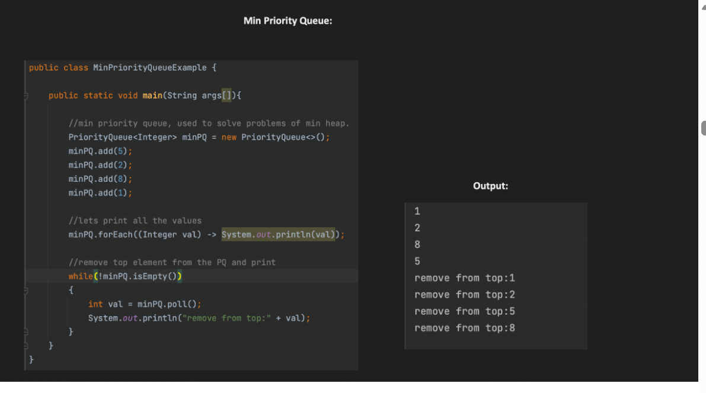

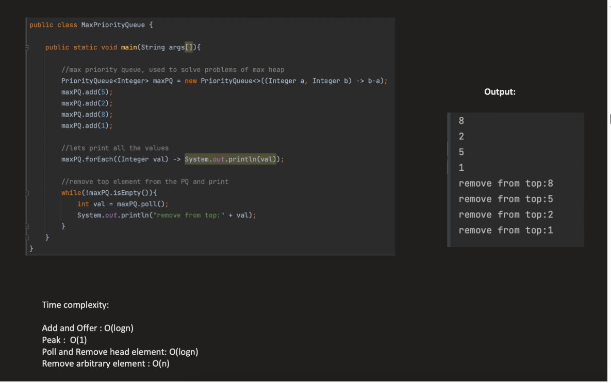

PriorityQueue doesnot allow u to store null because it uses compare ot compareto which doesnot compare null

-------------------------------------------------------------------------------------------------------------------------------------


**_COMPARATOR AND COMPARABLE:**_

Comparable:

    java.lang.Comparable is an interface used to define the natural ordering of objects of a class.
    It is widely used in the Java Collections Framework for sorting and ordering elements.
    When a class implements Comparable, it must implement the compareTo() method that tells Java how to compare two objects.


```java

import java.util.*;

class Student implements Comparable<Student> {

    int marks;
    String name;

    Student(int marks, String name) {
        this.marks = marks;
        this.name = name;
    }

    @Override
    public int compareTo(Student s) {
        return this.marks - s.marks; // sorting by marks
    }
}

public class Main {
    public static void main(String[] args) {

        List<Student> list = new ArrayList<>();

        list.add(new Student(80, "A"));
        list.add(new Student(60, "B"));
        list.add(new Student(90, "C"));

        Collections.sort(list); // uses compareTo()
        for(Student s : list) {
            System.out.println(s.marks);
        }
    }
}

```
in the above example collections.sort if no comparator is given internally uses compareTo method of comparable to sort the list of students based on their marks.

```java
private static void mergeSort(Object[] src,
                                  Object[] dest,
                                  int low,
                                  int high,
                                  int off) {

    // Insertion sort on smallest arrays
    if (length < INSERTIONSORT_THRESHOLD) {
        for (int i = low; i < high; i++)
            for (int j = i; j > low &&
                    ((Comparable) dest[j - 1]).compareTo(dest[j]) > 0; j--)
                swap(dest, j, j - 1);
        return;
    }

}
       

```


When objects are stored in structures that require ordering, Java must know how to compare them.
So when we dont give comparator JVM should know default way to compare objects and that is done by implementing Comparable interface and overriding compareTo method.
All Objects like Integer, String, etc implement Comparable interface and override compareTo method to define their natural ordering.


```java
public interface Comparable<T> {
    public int compareTo(T o);
}


```


**_COMPARABLE :_**

        java.util.Comparator is an interface used to define custom ordering for objects.
        It is heavily used in the Java Collections Framework when we want different ways to sort objects.


    Comparable allows only one natural ordering.
    But in real applications we may need multiple sorting strategies.
    
            Example: Student
            
                    Student
                    name
                    marks
                    age
            
            Possible sorting:
            
                    by name
                    by marks
                    by age
    
    One class cannot implement Comparable multiple times, so we use Comparator.

```java

@FunctionalInterface
public interface Comparator<T> {

    int compare(T o1, T o2);
}

```

| Method                | Type      | Return Type     | Purpose             |
| --------------------- | --------- | --------------- | ------------------- |
| `compare(T o1, T o2)` | abstract  | `int`           | Compare two objects |
| `reversed()`          | default   | `Comparator<T>` | Reverse ordering    |
| `thenComparing()`     | default   | `Comparator<T>` | Secondary sorting   |
| `equals(Object obj)`  | inherited | `boolean`       | Compare comparators |


| Method              | Return Type     | Purpose                     |
| ------------------- | --------------- | --------------------------- |
| `comparing()`       | `Comparator<T>` | Create comparator using key |
| `comparingInt()`    | `Comparator<T>` | Compare using int key       |
| `comparingLong()`   | `Comparator<T>` | Compare using long key      |
| `comparingDouble()` | `Comparator<T>` | Compare using double key    |
| `naturalOrder()`    | `Comparator<T>` | Natural ordering            |
| `reverseOrder()`    | `Comparator<T>` | Reverse ordering            |
| `nullsFirst()`      | `Comparator<T>` | Null values first           |
| `nullsLast()`       | `Comparator<T>` | Null values last            |


```java

import java.util.*;

class Student {
    int marks;
    String name;

    Student(int marks, String name){
        this.marks = marks;
        this.name = name;
    }
}

public class Main {

    public static void main(String[] args) {

        List<Student> list = new ArrayList<>();

        list.add(new Student(80,"A"));
        list.add(new Student(60,"B"));
        list.add(new Student(90,"C"));

        Comparator<Student> marksComparator =
                (a,b) -> a.marks - b.marks;

        Collections.sort(list, marksComparator);

        for(Student s : list)
            System.out.println(s.marks);
    }
}

```

```java

Comparator<Student> comp =
        Comparator.comparingInt(s -> s.marks)
                  .thenComparing(s -> s.name);
```

1st ---> Sort using marks then name

Comparator works only with objects

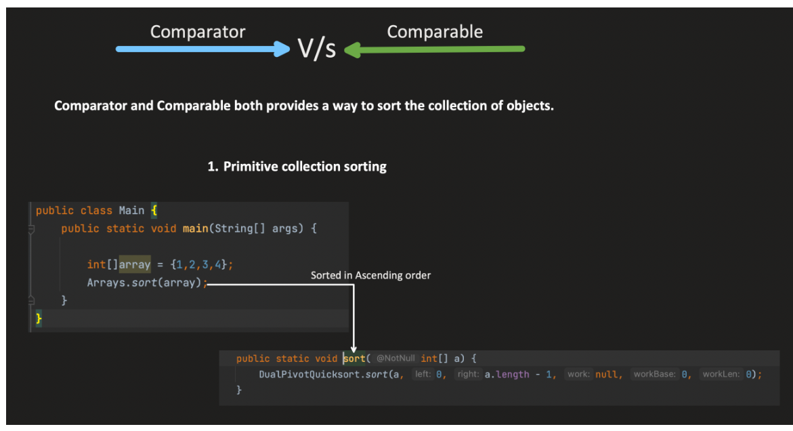

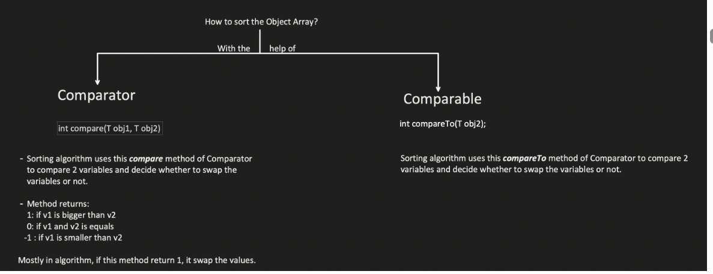

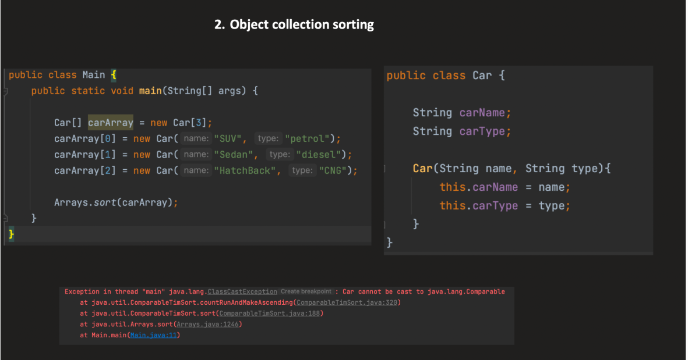

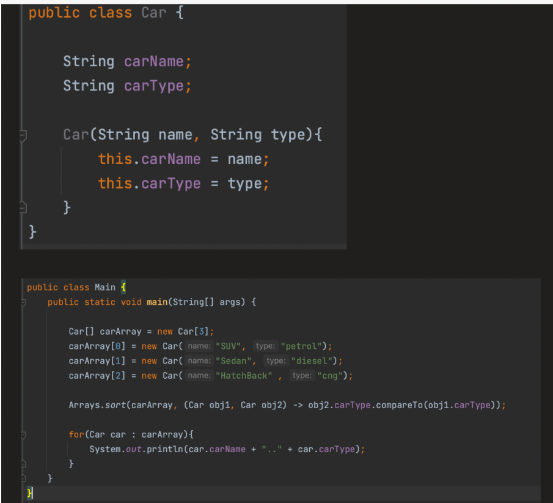


------------------------------------------------------------------------------------------------------------------------------------


_**DEQUE :**_

        java.util.Deque stands for Double-Ended Queue.
        It is a Queue that allows insertion and removal of elements from both ends: front and rear.
        Combines stack and queue behavior.
        Useful when you need FIFO and LIFO operations in the same data structure.

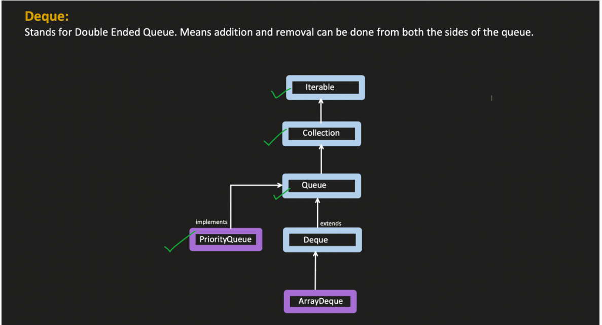

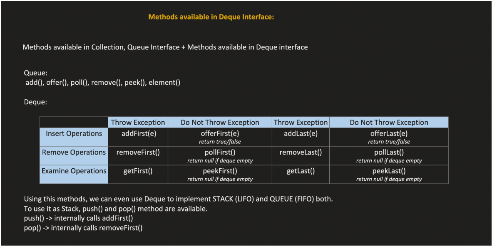

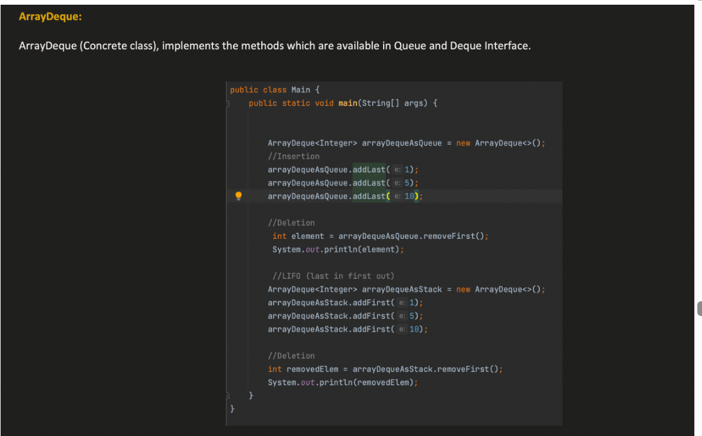

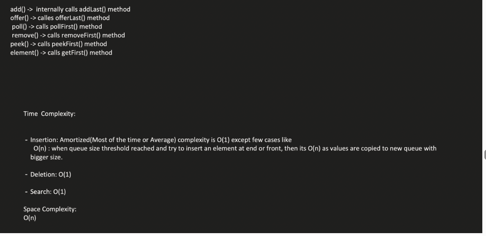

| Method               | Return Type | Description                         | Notes                                    |
| -------------------- | ----------- | ----------------------------------- | ---------------------------------------- |
| `addFirst(E e)`      | boolean     | Inserts element at front            | Throws exception if full (bounded deque) |
| `addLast(E e)`       | boolean     | Inserts element at rear             | Throws exception if full                 |
| `offerFirst(E e)`    | boolean     | Inserts at front                    | Returns false if fails                   |
| `offerLast(E e)`     | boolean     | Inserts at rear                     | Returns false if fails                   |
| `removeFirst()`      | E           | Removes and returns front element   | Throws exception if empty                |
| `removeLast()`       | E           | Removes and returns rear element    | Throws exception if empty                |
| `pollFirst()`        | E           | Removes and returns front element   | Returns null if empty                    |
| `pollLast()`         | E           | Removes and returns rear element    | Returns null if empty                    |
| `getFirst()`         | E           | Returns front element               | Throws exception if empty                |
| `getLast()`          | E           | Returns rear element                | Throws exception if empty                |
| `peekFirst()`        | E           | Returns front element               | Returns null if empty                    |
| `peekLast()`         | E           | Returns rear element                | Returns null if empty                    |
| `push(E e)`          | void        | Pushes element at front             | Stack-like operation                     |
| `pop()`              | E           | Removes element from front          | Stack-like operation                     |
| `remove(Object o)`   | boolean     | Removes first occurrence of element |                                          |
| `contains(Object o)` | boolean     | Checks if element exists            |                                          |

```java

import java.util.*;


public class Main {
    public static void main(String[] args) {
        Deque<Integer> deque = new ArrayDeque<>();

        deque.addFirst(10);  // front: 10
        deque.addLast(20);   // front: 10, rear: 20
        deque.offerFirst(5); // front: 5, 10, rear: 20

        System.out.println(deque); // [5, 10, 20]
        System.out.println(deque.removeLast()); // 20
        System.out.println(deque.pollFirst());  // 5

        deque.push(30); // stack-like push
        System.out.println(deque.pop()); // 30
    }
}

```

| Class                       | Description                                       | Notes                                                               |
| --------------------------- | ------------------------------------------------- | ------------------------------------------------------------------- |
| **`ArrayDeque`**            | Resizable array-based deque                       | Fast, non-thread-safe, no null elements                             |
| **`LinkedList`**            | Doubly-linked list implementation                 | Can be used as `Deque` or `List`, allows null                       |
| **`ConcurrentLinkedDeque`** | Lock-free, thread-safe deque                      | For concurrent, non-blocking applications                           |
| **`LinkedBlockingDeque`**   | Blocking deque                                    | Bounded/unbounded, thread-safe, used in producer-consumer scenarios |
| **`PriorityBlockingQueue`** | Not exactly Deque, but implements Queue interface | Thread-safe, for priority-based tasks                               |


ARRAYDEQUE:

    - ArrayDeque is a resizable array implementation of the Deque interface.
    - It does not have capacity restrictions and grows as needed.
    - It is not thread-safe, so it should be used in single-threaded contexts or with external synchronization.
    - It provides better performance than LinkedList for queue operations due to better cache locality.


ConcurrentLinkedDeque uses lock free mechanism like CAS (Compare and Swap) to achieve thread safety without blocking threads, making it suitable for high-concurrency scenarios.
LinkedBlockingDeque and PriorityBlockingQueue are blocking queues(both use Reentrant Lock) that use locks to ensure thread safety, which can lead to contention under high load but provide stronger consistency guarantees.

2️⃣ Why LinkedBlockingDeque is still needed

Blocking behavior:

        Many producer-consumer patterns need threads to wait when the deque is empty (consumer) or full (producer).
        ConcurrentLinkedDeque cannot block threads, so you’d need to implement your own waiting logic.

| Feature       | Description                                      |
| ------------- | ------------------------------------------------ |
| Storage       | Array internally, grows automatically            |
| Null elements | **Not allowed** (throws `NullPointerException`)  |
| Thread safety | No (must synchronize externally)                 |
| Performance   | Constant-time `O(1)` for add/remove at both ends |
| Implements    | `Deque<E>`, `Serializable`, `Cloneable`          |


3️⃣ Why Use ArrayDeque?

        Stack replacement → push() and pop() instead of Stack class (Stack is legacy).
        Queue replacement → FIFO operations instead of LinkedList for queues.
        Efficient double-ended operations → insert/remove at both front and rear.
        No capacity limit → automatically resizes (unlike ArrayBlockingQueue which is bounded).
        Internally it uses a circular array.
        No random access like ArrayList.
        So get(index) or set(index, value) does not exist in the public API.
        To access elements by position, you need to iterate → O(n).

    
    for(int i = head; i != tail; i = (i + 1) & (elements.length - 1)) {
        print(elements[i]);
    }   

| Method                       | Return Type     | Time Complexity | Description                                                                                |
| ---------------------------- | --------------- | --------------- | ------------------------------------------------------------------------------------------ ||
| `clone()`                    | `ArrayDeque<E>` | O(n)            | Creates shallow copy of deque                                                              |


| Operation                       | Method                          | Complexity     | Notes                    |
| ------------------------------- | ------------------------------- | -------------- | ------------------------ |
| **Insert at front**             | `addFirst(e)` / `offerFirst(e)` | O(1) amortized | May resize array if full |
| **Insert at rear**              | `addLast(e)` / `offerLast(e)`   | O(1) amortized | May resize array if full |
| **Remove from front**           | `removeFirst()` / `pollFirst()` | O(1)           | Direct removal           |
| **Remove from rear**            | `removeLast()` / `pollLast()`   | O(1)           | Direct removal           |
| **Access first element**        | `getFirst()` / `peekFirst()`    | O(1)           | Direct access            |
| **Access last element**         | `getLast()` / `peekLast()`      | O(1)           | Direct access            |
| **Search / iterate / contains** | `contains(o)` / `iterator()`    | O(n)           | Need to traverse array   |
| **Size**                        | `size()`                        | O(1)           | Stored internally        |
| **Random access by index**      | Not supported                   | O(n)           | Must iterate manually    |
| **Clear all elements**          | `clear()`                       | O(n)           | Sets references to null  |

When you remove elements from the front, ArrayDeque does not shift the array (that would be O(n)).
Instead, it just moves the head pointer.

Say if head is at 0 and we do addFisrst(10), it adds 10 to last index and moves head to last index and tail will remain at lastIndex -1

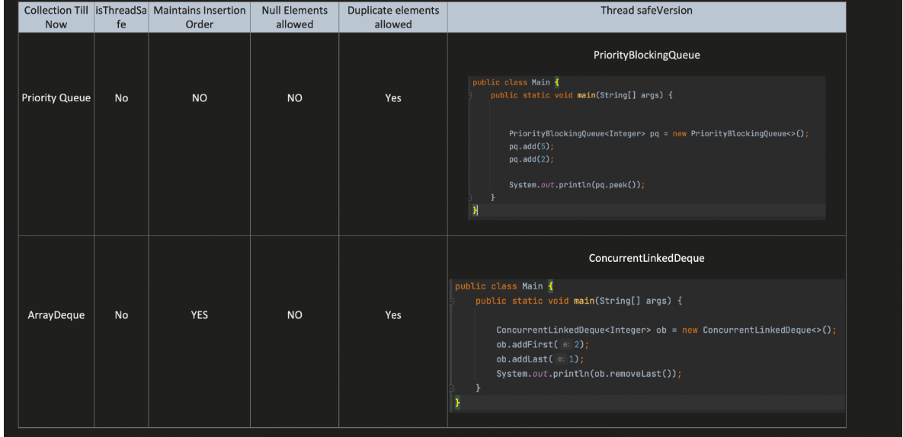


In Java, queues generally do not allow null.

Why? Because null is used as a special return value for some queue operations:

        Operation	Meaning of null
        poll()	Returns null if queue is empty
        peek()	Returns null if queue is empty

If null were allowed as a normal element, you cannot distinguish between “queue is empty” and “queue contains a null element.”


🔹 Key Idea First

👉 ArrayDeque uses:

circular array
two pointers:
head → points to first element
tail → points to next insertion position at end
🔹 Assume initial state

Let’s assume capacity = 8 (for easy visualization)

Index:   0 1 2 3 4 5 6 7
- - - - - - - -
🔸 Step 1: Add 1,2,3,4,5 (addLast)
dq.addLast(1);
dq.addLast(2);
dq.addLast(3);
dq.addLast(4);
dq.addLast(5);

👉 State:

Index:   0 1 2 3 4 5 6 7
1 2 3 4 5 - - -

head = 0
tail = 5   (next free position)
🔸 Step 2: addFirst(6)
dq.addFirst(6);

👉 Head moves backward (circular)

head = (0 - 1 + 8) % 8 = 7

👉 State:

Index:   0 1 2 3 4 5 6 7
1 2 3 4 5 - - 6

head = 7
tail = 5
🔸 Step 3: addLast(7)
dq.addLast(7);

👉 Insert at tail, then move tail forward:

Index:   0 1 2 3 4 5 6 7
1 2 3 4 5 7 - 6

head = 7
tail = 6
🔹 Final Logical Order

👉 Start from head and move circular:

6 → 1 → 2 → 3 → 4 → 5 → 7
🔹 How iteration works

👉 Iteration starts from head

Loop:
i = head = 7 → 6
i = 0        → 1
i = 1        → 2
i = 2        → 3
i = 3        → 4
i = 4        → 5
i = 5        → 7

👉 Stops when i == tail

🔹 Important Rule

👉 Iteration:

for (int i = head; i != tail; i = (i + 1) % capacity)