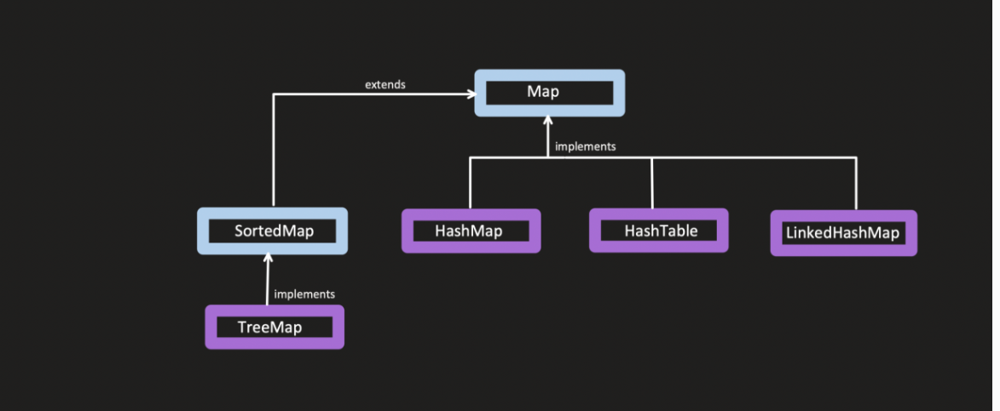
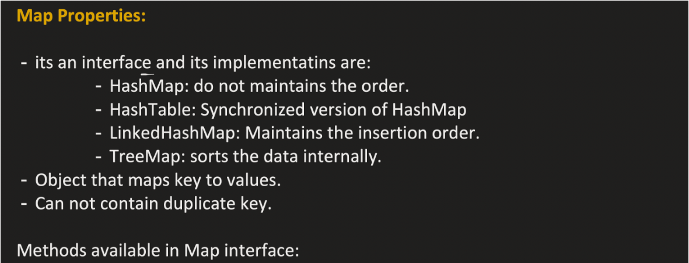
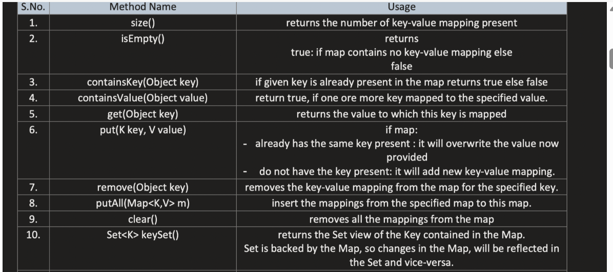
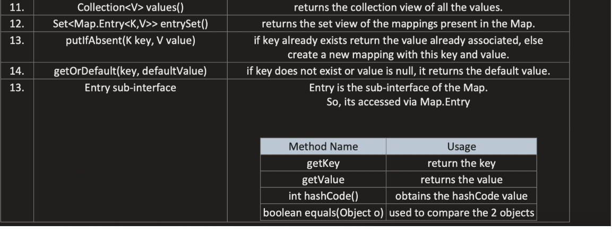
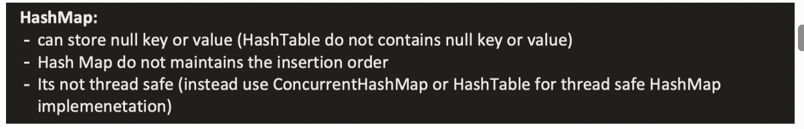
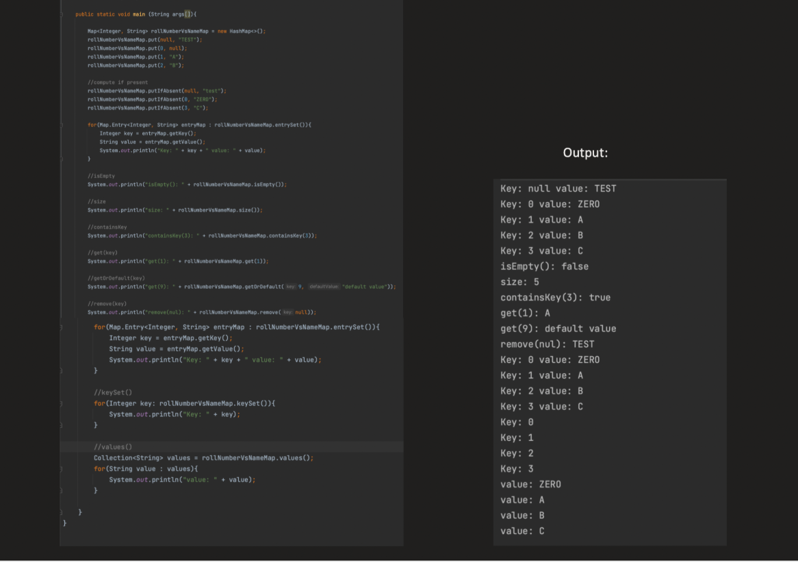
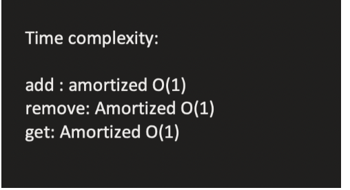

**_MAP :**_




        Map is not a Collection — it’s a separate interface in java.util.
        Stores key-value pairs.
        Keys are unique, values can be duplicate.
        Useful when you need to associate data with a unique key, e.g., a dictionary or lookup table.




| Implementation      | Key points                                               |
| ------------------- | -------------------------------------------------------- |
| `HashMap`           | Hash table-based, allows null key/value, unordered       |
| `LinkedHashMap`     | Maintains insertion order                                |
| `TreeMap`           | Sorted according to keys (natural order or `Comparator`) |
| `Hashtable`         | Legacy, synchronized, no null key/value                  |
| `ConcurrentHashMap` | Thread-safe, high-concurrency alternative to `HashMap`   |


| Method                                         | Return type     | Description                                                |
| ---------------------------------------------- | --------------- | ---------------------------------------------------------- |
| `V put(K key, V value)`                        | V               | Adds key-value pair; returns previous value if key existed |
| `V get(Object key)`                            | V               | Returns value associated with key, or null if none         |
| `V remove(Object key)`                         | V               | Removes key-value pair; returns previous value             |
| `boolean containsKey(Object key)`              | boolean         | Checks if key exists                                       |
| `boolean containsValue(Object value)`          | boolean         | Checks if value exists                                     |
| `Set<K> keySet()`                              | Set<K>          | Returns a set of all keys                                  |
| `Collection<V> values()`                       | Collection<V>   | Returns a collection of all values                         |
| `Set<Map.Entry<K,V>> entrySet()`               | Set<Entry<K,V>> | Returns a set of key-value mappings                        |
| `void putAll(Map<? extends K, ? extends V> m)` | void            | Adds all mappings from another map                         |
| `int size()`                                   | int             | Returns number of key-value mappings                       |
| `boolean isEmpty()`                            | boolean         | Checks if map is empty                                     |
| `void clear()`                                 | void            | Removes all mappings                                       |







HASHMAP :

    HashMap<K,V> is a hash table-based implementation of the Map interface.
    Stores key-value pairs, keys are unique, values can be duplicate.
    Hashing is used to store and retrieve elements efficiently.



| Property           | Description                                                                      |
| ------------------ | -------------------------------------------------------------------------------- |
| Null key/value     | Allows **one null key** and **multiple null values**                             |
| Ordering           | **No guaranteed order** (unordered)                                              |
| Thread-safety      | **Not synchronized** (use `ConcurrentHashMap` for thread-safe version)           |
| Performance        | Average **O(1)** for `get()` and `put()`; worst-case O(n) if many collisions     |
| Internal structure | Uses **array of buckets** + **linked list or tree (from Java 8)** for collisions |
| Load factor        | Default 0.75 → when threshold exceeds, **capacity doubles** (rehash occurs)      |
| Capacity           | Default initial capacity = 16 (number of buckets)                                |






| Method                                                                                     | Return Type | Description (what it returns)                                                                                                                  |
| ------------------------------------------------------------------------------------------ | ----------- | ---------------------------------------------------------------------------------------------------------------------------------------------- |
| `V getOrDefault(Object key, V defaultValue)`                                               | V           | Returns the **value for the key**, or `defaultValue` if key is not present.                                                                    |
| `V putIfAbsent(K key, V value)`                                                            | V           | Adds value **only if key is not already mapped**. Returns the **existing value** if key was already present, or `null` if new value was added. |
| `boolean remove(Object key, Object value)`                                                 | boolean     | Removes entry **only if key maps to the specified value**. Returns `true` if removed, `false` otherwise.                                       |
| `V replace(K key, V value)`                                                                | V           | Replaces the value **for the key if it exists**. Returns the **previous value**, or `null` if key did not exist.                               |
| `boolean replace(K key, V oldValue, V newValue)`                                           | boolean     | Replaces value **only if current value matches oldValue**. Returns `true` if replaced, `false` otherwise.                                      |
| `V computeIfAbsent(K key, Function<? super K,? extends V> mappingFunction)`                | V           | Computes value and **adds it if key is not present**. Returns the **current (existing or computed) value**.                                    |
| `V computeIfPresent(K key, BiFunction<? super K,? super V,? extends V> remappingFunction)` | V           | Updates value **if key exists**. Returns the **new value** or `null` if mapping is removed.                                                    |
| `V compute(K key, BiFunction<? super K,? super V,? extends V> remappingFunction)`          | V           | Computes new value **regardless of presence**. Returns the **new value** or `null` if mapping is removed.                                      |
| `V merge(K key, V value, BiFunction<? super V,? super V,? extends V> remappingFunction)`   | V           | If key exists, merges new value with existing. Returns the **new value associated with key** (after merge) or `null` if mapping is removed.    |


| Method       | What it returns         | Usage                                           | Notes                                                                                  |
| ------------ | ----------------------- | ----------------------------------------------- | -------------------------------------------------------------------------------------- |
| `keySet()`   | Set of keys             | Iterate over keys; get value via `map.get(key)` | If you need **key + value**, this is **less efficient** because `get()` does a lookup. |
| `values()`   | Collection of values    | Iterate values only                             | Cannot get keys.                                                                       |
| `entrySet()` | Set of `Map.Entry<K,V>` | Iterate keys and values efficiently             | Most efficient for key+value iteration, avoids extra lookup.                           |


```

Map<String, Integer> map = new HashMap<>();
map.put("A", 1);
map.put("B", 2);

for(String key : map.keySet()) {
    Integer value = map.get(key); // extra lookup
    System.out.println(key + " = " + value);
}

Iterator<String> it = map.keySet().iterator();
while(it.hasNext()) {
    String key = it.next();
    System.out.println(key + " = " + map.get(key));
}

```

```
for(Integer value : map.values()) {
    System.out.println(value);
}
```


``` 
for(Map.Entry<String, Integer> entry : map.entrySet()) {
    System.out.println(entry.getKey() + " = " + entry.getValue());
}

Iterator<Map.Entry<String, Integer>> it = map.entrySet().iterator();
while(it.hasNext()) {
    Map.Entry<String, Integer> entry = it.next();
    System.out.println(entry.getKey() + " = " + entry.getValue());
}
```
HASHMAP INTERNALS :

    HashMap uses an array of buckets to store key-value pairs.
    Each bucket can contain multiple entries (key-value pairs) that hash to the same index (collision).
    Before Java 8, collisions were handled with a linked list; from Java 8, if a bucket has too many entries, it converts to a balanced tree for better performance.
    Each entries was a node containing key, value, hash, and pointer to next node (for linked list) or left/right child (for tree).

    When adding a key-value pair, HashMap calculates the hash of the key, determines the bucket index, and either adds it to the bucket or updates existing entry if key already exists.
    
What is hash of a key?

hashCode() is a method defined in java.lang.Object:

    public int hashCode()

It returns an integer (32-bit) representing the object’s hash value.
Used in hash-based collections (HashMap, HashSet, Hashtable) to decide bucket placement.

Contract of hashCode():
    
    If two objects are equal (equals() returns true) → they must have same hashCode.
    If two objects are not equal → hashCodes can be same (collision possible).

2️⃣ How HashMap Uses hashCode

    Compute hashCode for the key → key.hashCode()
    Spread bits to reduce collisions internally → h ^ (h >>> 16)
    Modulo with table size (number of buckets) → index = (n-1) & hash

```java
static final int hash(Object key) {
    int h;
    return (key == null) ? 0 : (h = key.hashCode()) ^ (h >>> 16);
}
```


        If 2 or more keys have same hashCode → they go to same bucket → collision occurs.
        Bucket can contain multiple entries → handled with linked list or tree.
        Collision means multiple keys map to same bucket index → performance degrades if many collisions occur (worst-case O(n)).


1. Default hashCode() behavior

        Object.hashCode() returns an integer derived from the object’s memory address (or something unique to that object instance).
        Key point: Two different object instances will usually have different hash codes, even if their contents are identical.
Person p1 = new Person("Alice", 25);
Person p2 = new Person("Alice", 25);

p1.equals(p2);       // false (different objects)
p1.hashCode() != p2.hashCode(); // likely true (different memory addresses)

    Even though logically p1 and p2 are equal, HashMap treats them as different keys.
    Two objects that are “logically equal” should:
    Have the same hash code → so they end up in the same bucket in HashMap.
    Return true for equals() → so the HashMap can find the correct entry in that bucket.

Without overriding hashCode():

        Even if equals() is overridden, objects may end up in different buckets → retrieval fails.
        HashMap depends on hashCode() first, then uses equals() if there’s a collision.

So we need to override both equals() and hashCode() to ensure that logically equal objects are treated as the same key in a HashMap.

```java

import java.util.HashMap;
import java.util.Map;
import java.util.Objects;

class Person {
    private String name;
    private int age;

    public Person(String name, int age) {
        this.name = name;
        this.age = age;
    }

    // Override equals() to define logical equality
    @Override
    public boolean equals(Object o) {
        if (this == o) return true;               // same reference
        if (o == null || getClass() != o.getClass()) return false; 
        Person person = (Person) o;
        return age == person.age && Objects.equals(name, person.name);
    }

    // Override hashCode() to ensure logically equal objects go to same bucket
    @Override
    public int hashCode() {
        return Objects.hash(name, age);
    }

    @Override
    public String toString() {
        return name + " (" + age + ")";
    }
}

public class HashMapExample {
    public static void main(String[] args) {
        Map<Person, String> map = new HashMap<>();

        Person p1 = new Person("Alice", 25);
        Person p2 = new Person("Bob", 30);
        Person p3 = new Person("Alice", 25); // same as p1 logically

        map.put(p1, "Engineer");
        map.put(p2, "Doctor");

        // Retrieve using p3 (logically same as p1)
        System.out.println("p3 value: " + map.get(p3)); // ✅ Output: Engineer

        // Iterate entries
        for (Map.Entry<Person, String> entry : map.entrySet()) {
            System.out.println(entry.getKey() + " = " + entry.getValue());
        }
    }
}
```

String in Java already overrides both hashCode() and equals() in a way that makes it work perfectly as a key in HashMap

``` 

String s1 = new String("Hello");
String s2 = new String("Hello");

System.out.println(s1 == s2);       // false (different objects)
System.out.println(s1.equals(s2));  // true (contents are equal)

```

**_Load Factor and Rehashing :**_

    Load factor (LF) = measure of how full a hash table can get before it is resized.
    threshold = capacity × LF
     capacity = number of buckets (initially 16)
    default load factor (LF) = 0.75
     threshold = 16 × 0.75 = 12 → when size exceeds 12, HashMap resizes.(by default )

    Default load factor = 0.75 → when exceeded, HashMap resizes (doubles capacity) and rehashes all entries.
    Rehashing means recalculating bucket index for each entry based on new capacity → can be expensive operation.

    
    Higher LF → less memory, more collisions.
    Lower LF → more memory, fewer collisions


TREEIFY_THRESHOLD :

    If a bucket has more than 8 entries (TREEIFY_THRESHOLD), it converts from a linked list to a  balanced binary search tree (Red-Black Tree) for better performance.
    This reduces worst-case time complexity from O(n) to O(log n) for that bucket.
    In Java 8+, if a bucket’s linked list exceeds TREEIFY_THRESHOLD (8) and capacity ≥ MIN_TREEIFY_CAPACITY (64), the list is converted to a red-black tree → O(log n) lookup.


Original bucket 0: A → B → C → null

        Thread 1 moves A:
        newBucket[0] = A
        A.next = B
        
        Thread 2 moves B at the same time:
        newBucket[0] = B
        B.next = A  <-- points back to A instead of null
Now you have a cycle: A → B → A → B → ...

Any iteration over this bucket (like for-each) never ends → infinite loop


Options of Thread safety Map :

| Map Type                           | Thread-safety        | Notes                                                                                                                                              |
| ---------------------------------- | -------------------- | -------------------------------------------------------------------------------------------------------------------------------------------------- |
| `Collections.synchronizedMap(map)` | Synchronized wrapper | Locks on each method; simple but can block heavily under contention.                                                                               |
| `ConcurrentHashMap`                | Highly concurrent    | Uses **segment-based locking** (Java 7) or **bucket-level CAS/locks** (Java 8+); allows concurrent reads and updates without blocking all threads. |


| Feature         | SynchronizedMap                                                        | Hashtable                                                       |
| --------------- | ---------------------------------------------------------------------- | --------------------------------------------------------------- |
| Type            | Wrapper around any `Map`                                               | Legacy class, extends `Dictionary`                              |
| Null Keys       | **Allows 1 null key**, multiple null values (if underlying map allows) | **No null key or null value**                                   |
| Synchronization | Synchronizes **method calls** on the wrapper object                    | Synchronizes **all methods** internally                         |
| Iteration       | Needs **external synchronization**                                     | Needs external synchronization only for **compound actions**    |
| Legacy          | Modern, flexible                                                       | Legacy, considered obsolete in favor of `ConcurrentHashMap`     |
| Performance     | Slightly better because underlying map (HashMap) is faster             | Slightly slower due to intrinsic synchronization in all methods |
| Extensibility   | Can wrap **any Map** (HashMap, TreeMap)                                | Fixed implementation; cannot wrap other Maps                    |


----------------------------------------------------------------------------------------------------------------------------------------


HASHTABLE :

Exactly like HashMap but:

    Legacy class (before Java 1.2)
    Synchronized (thread-safe) → all methods are synchronized
    Does not allow null key or null value
    Generally slower than HashMap due to synchronization overhead


-----------------------------------------------------------------------------------------------------------------------------------------------


LINKEDHASHMAP :

    Maintains insertion order (or access order if configured).
    Slightly slower than HashMap due to maintaining a linked list of entries.
    Useful when you need predictable iteration order.


