LIST :

List is an ordered collection of elements (i.e) it maintains the order of insertion. It allows duplicate elements and provides indexed access to its elements. 
The List interface is a part of the Java Collections Framework and is implemented by various classes such as ArrayList, LinkedList, and Vector.

| Feature           | Description                            |
| ----------------- | -------------------------------------- |
| Ordered           | Maintains insertion order              |
| Indexed           | Elements accessed using index          |
| Allows Duplicates | Same element can appear multiple times |
| Allows Null       | Most implementations allow null        |
| Dynamic Size      | Size can grow or shrink                |


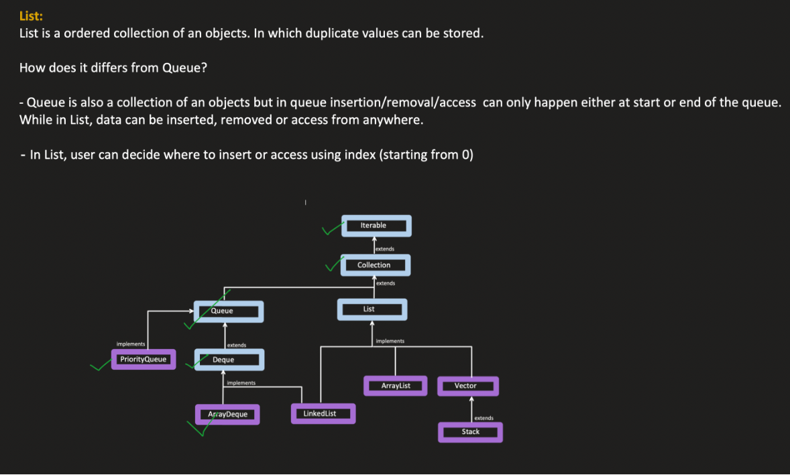


| Method                                         | Return Type       | Detailed Use                                                                                                                                                             |
| ---------------------------------------------- | ----------------- | ------------------------------------------------------------------------------------------------------------------------------------------------------------------------ |
| `add(int index, E element)`                    | `void`            | Inserts the specified element at the specified position in the list. Existing elements from that index are shifted to the right.                                         |
| `addAll(int index, Collection<? extends E> c)` | `boolean`         | Inserts all elements of the specified collection starting at the given index. Elements currently at that position are shifted right. Returns `true` if the list changes. |
| `get(int index)`                               | `E`               | Returns the element at the specified position in the list. Used when accessing elements using index.                                                                     |
| `set(int index, E element)`                    | `E`               | Replaces the element at the specified position with the specified element and returns the element previously at that position.                                           |
| `remove(int index)`                            | `E`               | Removes the element at the specified position in the list and shifts remaining elements left. Returns the removed element.                                               |
| `indexOf(Object o)`                            | `int`             | Returns the index of the **first occurrence** of the specified element in the list. Returns `-1` if the element is not found.                                            |
| `lastIndexOf(Object o)`                        | `int`             | Returns the index of the **last occurrence** of the specified element. Returns `-1` if not present.                                                                      |
| `listIterator()`                               | `ListIterator<E>` | Returns a **list iterator** that allows forward and backward traversal of elements.                                                                                      |
| `listIterator(int index)`                      | `ListIterator<E>` | Returns a list iterator starting from the specified index position.                                                                                                      |
| `subList(int fromIndex, int toIndex)`          | `List<E>`         | Returns a **view of the portion of the list** between the specified indices (`fromIndex` inclusive, `toIndex` exclusive).                                                |


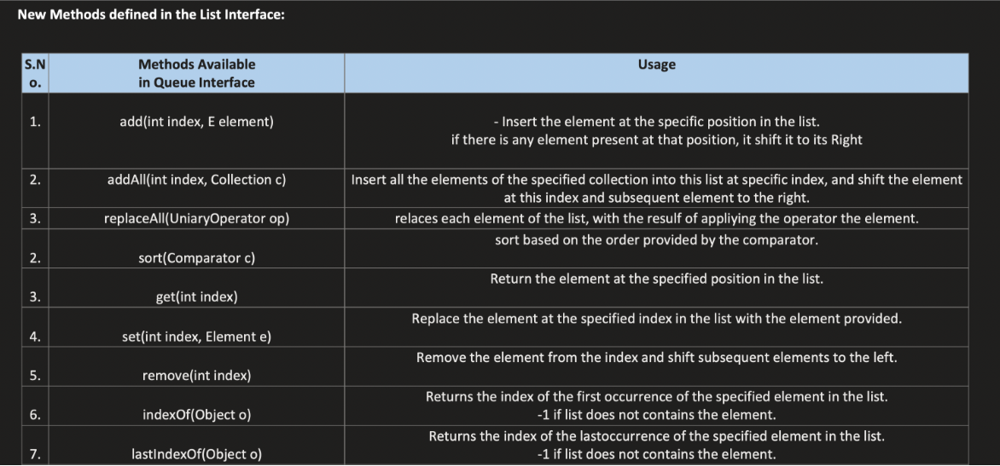

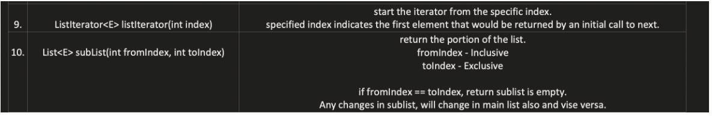

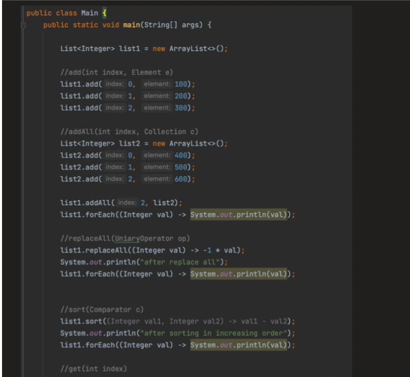

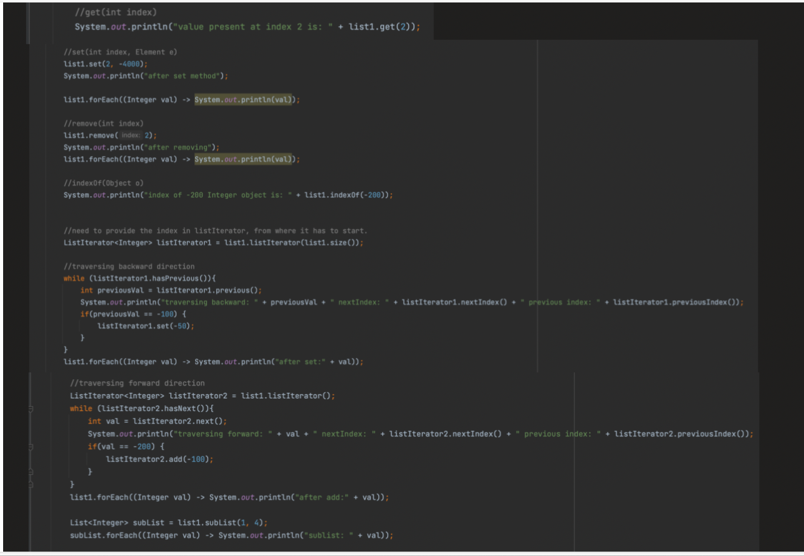


ARRAYLIST :

        An ArrayList is a resizable array implementation of the List interface in the Java Collections Framework.
        It stores elements in insertion order, allows duplicate elements, and allows index-based access.
        Internally it uses a dynamic array that automatically grows when capacity is exceeded.

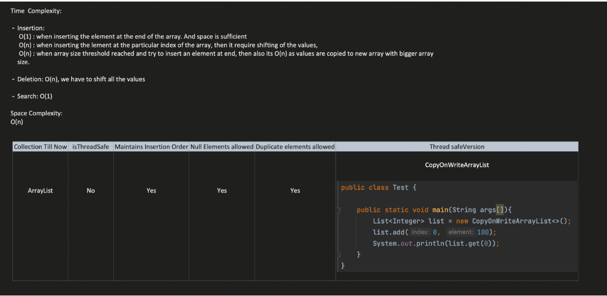

| Feature            | Description                            |
| ------------------ | -------------------------------------- |
| Dynamic Size       | Automatically resizes when full        |
| Ordered            | Maintains insertion order              |
| Allows Duplicates  | Same element can appear multiple times |
| Allows Null        | Can store null values                  |
| Fast Random Access | `get()` is very fast                   |


| Method                                    | Return Type | Purpose                                                                                                                                               |
| ----------------------------------------- | ----------- | ----------------------------------------------------------------------------------------------------------------------------------------------------- |
| `ensureCapacity(int minCapacity)`         | `void`      | Increases the internal array capacity if necessary to ensure it can hold at least the specified number of elements. Helps reduce resizing operations. |
| `trimToSize()`                            | `void`      | Trims the internal array capacity to match the current number of elements, freeing unused memory.                                                     |
| `clone()`                                 | `Object`    | Creates a shallow copy of the ArrayList. The elements themselves are not cloned.                                                                      |
| `removeRange(int fromIndex, int toIndex)` | `void`      | Removes elements in the specified range. It is **protected**, so mainly used internally or by subclasses.                                             |

    
    SHALLOW COPY : A shallow copy of an ArrayList creates a new ArrayList object, but the elements inside it are references to the same objects in the original list. Changes to mutable elements will affect both lists.
    DEEP COPY : A deep copy creates a new ArrayList and also creates new instances of the elements inside it. Changes to mutable elements in the deep copy do not affect the original list.

    
    FOr a shallow copy and deep copy ---> new object is created for both but in shallow copy the elements are not copied but in deep copy the elements are also copied
    means in shallow copy the elements inside obj reference the same objects but in deep copy the elements are different objects with same values


LINKEDLIST :

        A LinkedList is a doubly-linked list implementation of the List and Deque interfaces in Java. 
      It consists of nodes where each node contains data and references to the previous and next nodes. 
      LinkedList allows for efficient insertion and deletion at both ends of the list.

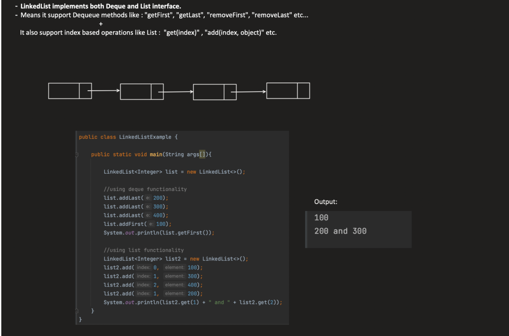

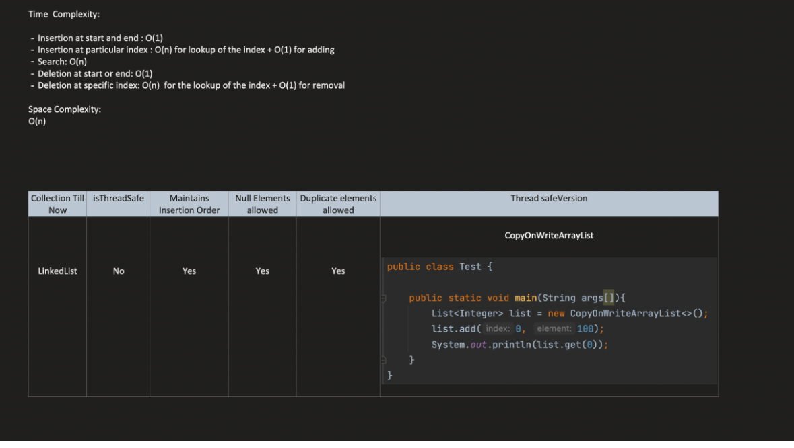


| Property                | Description                                         |
| ----------------------- | --------------------------------------------------- |
| Doubly Linked Structure | Each node has references to previous and next nodes |
| Dynamic Size            | Size grows and shrinks dynamically                  |
| Ordered                 | Maintains insertion order                           |
| Allows Duplicates       | Same element can appear multiple times              |
| Allows Null Values      | Can store null elements                             |
| Fast Insert/Delete      | No shifting required                                |
| Slow Random Access      | Access by index is slower (must traverse list)      |


So LinkedList can work as:

        List
        Queue
        Stack
        Deque

| Method                 | Return Type   | Purpose                                                                                                 |
| ---------------------- | ------------- | ------------------------------------------------------------------------------------------------------- |
| `clone()`              | `Object`      | Creates a shallow copy of the LinkedList. The list structure is copied but elements are not duplicated. |
| `descendingIterator()` | `Iterator<E>` | Returns an iterator that traverses the list in reverse order (from tail to head).                       |


VECTOR :

        A Vector is a synchronized, resizable array implementation of the List interface in Java. 
      It is similar to ArrayList but is thread-safe due to its synchronized methods. 
      However, because of synchronization overhead, it is generally slower than ArrayList and is considered legacy.


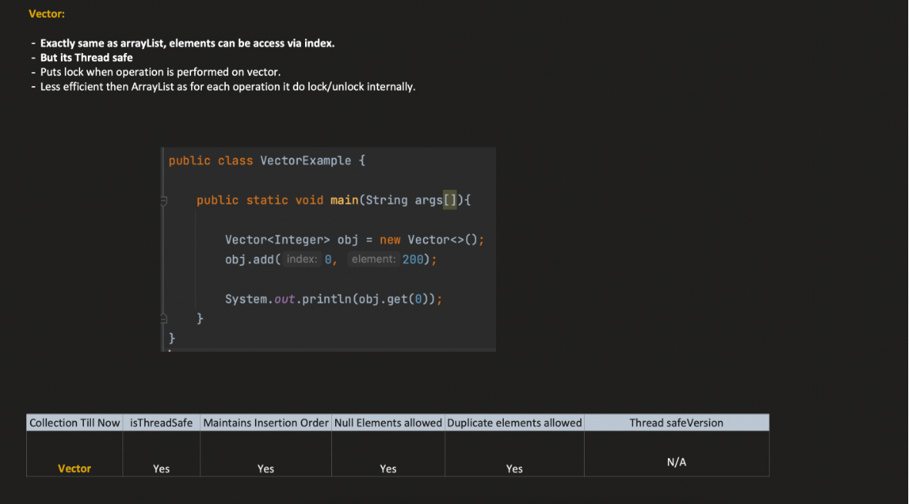


| Property          | Description                                      |
| ----------------- | ------------------------------------------------ |
| Thread-safe       | All methods are synchronized                     |
| Dynamic Size      | Automatically grows when capacity is exceeded    |
| Ordered           | Maintains insertion order                        |
| Allows Duplicates | Duplicate elements are allowed                   |
| Allows Null       | Can store null values                            |
| Indexed Access    | Elements accessed using index                    |
| Legacy Class      | Introduced before the Java Collections Framework |


| Method                      | Return Type | Purpose                      |
| --------------------------- | ----------- | ---------------------------- |
| `add(E e)`                  | boolean     | Adds element to vector       |
| `addElement(E obj)`         | void        | Adds element (legacy method) |
| `elementAt(int index)`      | E           | Returns element at index     |
| `removeElement(Object obj)` | boolean     | Removes element              |
| `capacity()`                | int         | Returns current capacity     |
| `size()`                    | int         | Returns number of elements   |
| `firstElement()`            | E           | Returns first element        |
| `lastElement()`             | E           | Returns last element         |


STACK :

        A Stack is a Last-In-First-Out (LIFO) data structure that extends the Vector class in Java. 
      It provides methods for pushing, popping, and peeking elements. 
      However, Stack is considered a legacy class and it is recommended to use Deque (e.g., ArrayDeque) for stack operations in modern Java.

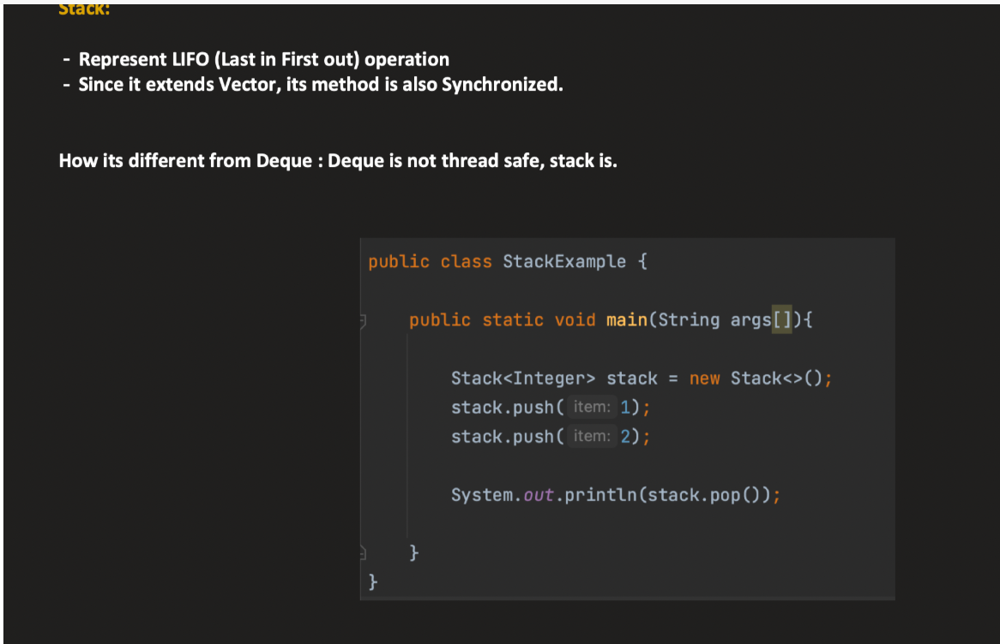

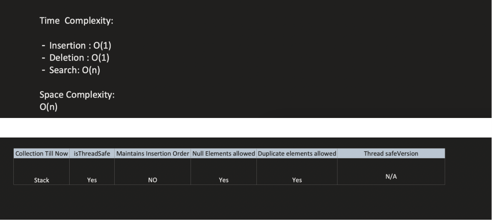


| Property          | Description                            |
| ----------------- | -------------------------------------- |
| LIFO Structure    | Last In First Out                      |
| Thread Safe       | Because it extends Vector              |
| Dynamic Size      | Can grow automatically                 |
| Allows Duplicates | Same element can appear multiple times |
| Allows Null       | Can store null values                  |
| Legacy Class      | Introduced before modern collections   |


| Method             | Return Type | Purpose                                  |
| ------------------ | ----------- | ---------------------------------------- |
| `push(E item)`     | `E`         | Adds an element to the top of the stack  |
| `pop()`            | `E`         | Removes and returns the top element      |
| `peek()`           | `E`         | Returns the top element without removing |
| `empty()`          | `boolean`   | Checks if stack is empty                 |
| `search(Object o)` | `int`       | Returns position of element from top     |


| Operation                   | ArrayList | LinkedList | Vector | Stack |
| --------------------------- | --------- | ---------- | ------ | ----- |
| Add element at end          | O(1)*     | O(1)       | O(1)*  | O(1)  |
| Add element at beginning    | O(n)      | O(1)       | O(n)   | O(n)  |
| Add element at middle       | O(n)      | O(n)       | O(n)   | O(n)  |
| Remove element at end       | O(1)      | O(1)       | O(1)   | O(1)  |
| Remove element at beginning | O(n)      | O(1)       | O(n)   | O(n)  |
| Remove element at middle    | O(n)      | O(n)       | O(n)   | O(n)  |
| Get element by index        | O(1)      | O(n)       | O(1)   | O(1)  |
| Search element              | O(n)      | O(n)       | O(n)   | O(n)  |
| Iterator traversal          | O(n)      | O(n)       | O(n)   | O(n)  |


When to use LinkedList over ArrayList:

        When you need frequent insertions and deletions at the beginning or middle of the list, LinkedList is more efficient than ArrayList because it does not require shifting elements.
        If you need fast random access by index, ArrayList is better since it provides O(1) access time, while LinkedList has O(n) access time due to traversal.
        For small lists or when memory overhead is a concern, ArrayList may be preferred as LinkedList uses more memory due to storing additional node references.

| Situation                        | Better Choice | Reason                             |
| -------------------------------- | ------------- | ---------------------------------- |
| Frequent insertions at beginning | LinkedList    | No element shifting                |
| Frequent deletions in middle     | LinkedList    | Only pointer update                |
| Implementing queue/deque         | LinkedList    | Has efficient head/tail operations |
| Frequent add/remove operations   | LinkedList    | O(1) at ends                       |


| Thread-safe Option               | How it Works                              | When to Use                            |
| -------------------------------- | ----------------------------------------- | -------------------------------------- |
| Vector                           | All methods are synchronized              | Legacy systems (not recommended today) |
| `Collections.synchronizedList()` | Wraps an ArrayList with synchronization   | When multiple threads modify list      |
| CopyOnWriteArrayList             | Creates a copy of array for modifications | Best for read-heavy concurrent apps    |


| Type      | Behavior                         | Example                                     |
| --------- | -------------------------------- | ------------------------------------------- |
| Fail-Fast | Throws exception on modification | `ArrayList`, `HashMap`                      |
| Fail-Safe | Iterates over snapshot copy      | `CopyOnWriteArrayList`, `ConcurrentHashMap` |


Example of Fail-Fast:

```java
import java.util.concurrent.CopyOnWriteArrayList;

public class TestCOW {

    public static void main(String[] args) {
        CopyOnWriteArrayList<Integer> list = new CopyOnWriteArrayList<>();

        // Initial write
        list.add(10);  // Array1 created: [10]
        list.add(20);  // Array2 created: [10, 20]

        System.out.println("Initial list: " + list);

        // Iteration starts
        for (Integer i : list) {
            System.out.println("Iterating: " + i);

            // Modify during iteration
            list.add(30);  // Array3 created: [10, 20, 30]
        }

        System.out.println("Final list: " + list);
    }
}
```


Time t0:
list.array -> [10, 20]      (Array2)

Time t1: iteration starts
iterator.snapshot -> [10, 20] (Array2)

Time t2: add(30)
list.array -> [10, 20, 30]   (Array3)
iterator.snapshot -> [10, 20] (still Array2)

Output of iteration: 10, 20


While writing alone it puts lock on the array and creates a new array with the new element and updates the reference to point to the new array but the iterator is still iterating over the old array so it does not see the new element and does not throw any exception.

1️⃣ How CopyOnWriteArrayList Handles Writes
        
        When a thread writes (e.g., add, remove, set):
        The thread acquires a lock to prevent multiple writes from conflicting.
        A new copy of the array is created.
        The internal array reference is updated atomically.
        Lock is released.
        
        Writer thread:
        lock.lock()
        newArray = copy of old array + modifications
        array = newArray
        lock.unlock()
2️⃣ How Reads Work
        
        Reads (get(index)) do NOT acquire the lock.
        They just read the current array reference.
        This is safe because the reference is volatile, and the old array never changes.


```java
CopyOnWriteArrayList<Integer> list = new CopyOnWriteArrayList<>();
list.add(10);  // Array1: [10]
list.add(20);  // Array2: [10, 20]

Iterator<Integer> it = list.iterator(); // snapshot -> Array2: [10, 20]

list.add(30);  // New array is created: Array3 -> [10, 20, 30]
```

| Array                 | Purpose                 | Who sees it                             |
| --------------------- | ----------------------- | --------------------------------------- |
| Array2 `[10, 20]`     | Snapshot for iterator   | Thread using iterator `it`              |
| Array3 `[10, 20, 30]` | Newly created for write | `list` reference, new readers/iterators |

The iterator takes a reference to the current internal array inside the CopyOnWriteArrayList.
This reference is called a snapshot.
When the iterator is created, it captures the current array (e.g., Array2).
No new array object is created.

WHen on write it creates a new array and updates the reference to point to the new array but the iterator is still iterating over the old array so it does not see the new element and does not throw any exception.
