STREAMS :

    Stream is a pipeline used to process data from a source (like a collection) through a sequence of operations (like filter, map, reduce) in a functional style without modifying the source. 
    It allows you to perform complex data processing tasks in a concise and readable way.
    
    In Streams pipeline means a chain of operations through which data flows. 
    Each operation transforms the data and passes it to the next operation in the chain.


Streams in Java (programming language) (introduced in Java SE 8) were created to make data processing easier, shorter, and more powerful when working with collections like List, Set, or Map.

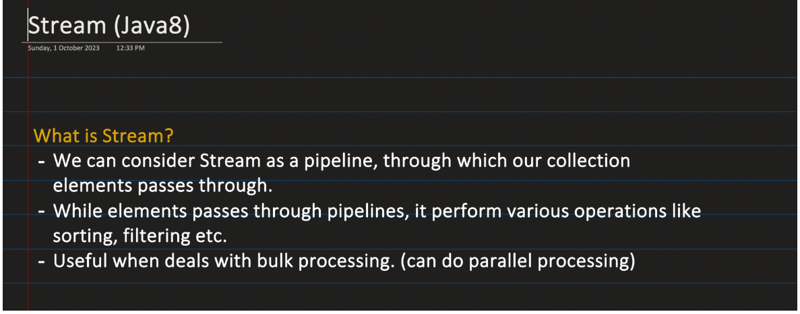

Uses :

| Benefit             | Explanation           |
| ------------------- | --------------------- |
| Less code           | No loops needed       |
| Readable            | Express logic clearly |
| Functional style    | Uses lambdas          |
| Parallel processing | Easy multi-threading  |
| Pipeline processing | Efficient data flow   |

      Streams in Java (programming language) do not store data themselves.
      They process data from another source like a List, Set, or array.
      
      So the idea is:
      
      Streams do not hold elements in memory like collections do.
      They take elements from a source and process them one by one.


1️⃣ Main Purpose of Streams

        Streams allow you to process collections of data in a declarative and functional way.
        Instead of writing how to do the iteration, you just say what you want to do.

2️⃣ Problem Before Streams

        Before streams, we used loops.
        Example: Print even numbers.

        List<Integer> list = List.of(1,2,3,4,5,6);

        for(Integer n : list){
            if(n % 2 == 0){
                System.out.println(n);
            }
        }

Problems:

        More code
        Harder to read
        Harder to combine operations

3️⃣ With Streams

        list.stream()
        .filter(n -> n % 2 == 0)
        .forEach(System.out::println);

Much shorter and cleaner.

4️⃣ Major Uses of Streams
1. Filtering Data

Selecting specific elements.

Example: Get even numbers.

    list.stream()
    .filter(n -> n % 2 == 0)
    .forEach(System.out::println);

Used in:

    searching
    validation
    filtering records

2. Transforming Data (Mapping)

Example: Multiply numbers by 2.

    list.stream()
    .map(n -> n * 2)
    .forEach(System.out::println);

Used in:

        converting data
        formatting values
        DTO mapping

3. Aggregation (Calculations)

Example: Sum of numbers.

    int sum = list.stream()
    .reduce(0, Integer::sum);

Used for:

        totals
        averages
        statistics

4. Collecting Results

Convert stream results into another collection.

        List<Integer> even = list.stream()
        .filter(n -> n % 2 == 0)
        .toList();

Used for:

    building new collections
    transforming data sets

5. Sorting Data

       list.stream()
       .sorted()
       .forEach(System.out::println);

Used in:

        ordering records
        ranking results

6. Parallel Processing

        Streams allow easy parallel execution.
        
            list.parallelStream()
            .forEach(System.out::println);
        
        Uses multiple CPU cores.


**_Stream Pipeline Structure:**_

A Stream Pipeline has 3 parts:

    Source → Intermediate Operations → Terminal Operation
1️⃣ Source

    Where the data comes from.

Examples

        List
        Set
        Array
        Files

List<Integer> list = List.of(1,2,3,4,5);
2️⃣ Intermediate Operations

    These transform the stream and return another stream.

Examples:

        filter()
        map()
        sorted()
        distinct()

Example

        list.stream()
        .filter(n -> n % 2 == 0)
        .map(n -> n * 2)

Important:

    They do not execute immediately because they are lazy.
    They build the pipeline

3️⃣ Terminal Operation

    This triggers execution of the pipeline.

Examples:

    forEach()
    collect()
    count()
    reduce()

Example

    list.stream()
    .filter(n -> n % 2 == 0)
    .map(n -> n * 2)
    .forEach(System.out::println);

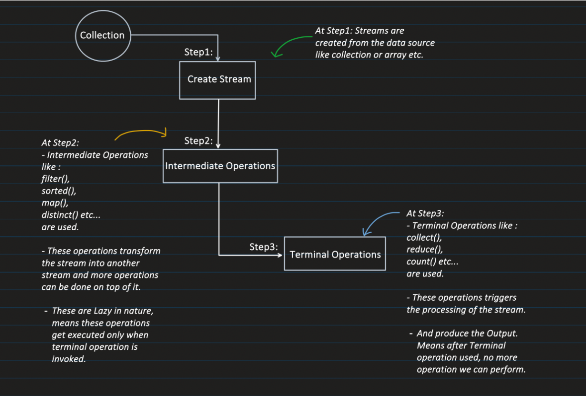

How Pipeline Actually Works Internally

Streams process one element at a time.

Example:

      list.stream()
      .filter(n -> n % 2 == 0)
      .map(n -> n * 2)
      .forEach(System.out::println);

For list [1,2,3,4]

Actual flow:

      1 → filter → rejected
      2 → filter → map → print
      3 → filter → rejected
      4 → filter → map → print

Not like this:

      filter all → map all → print all

This makes Streams very memory efficient.

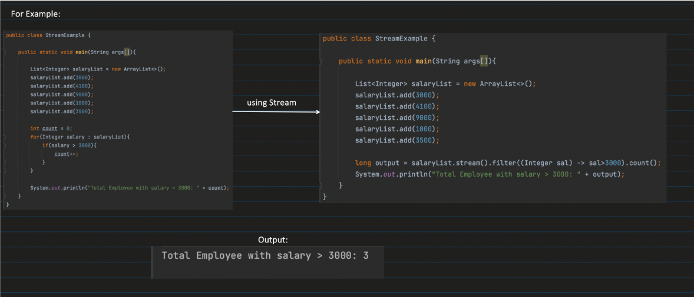


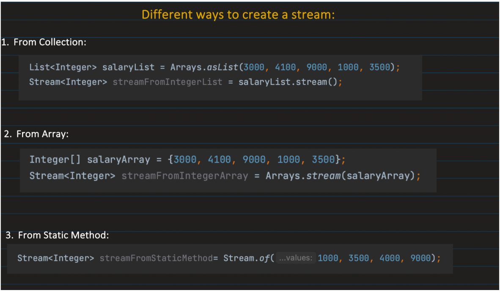

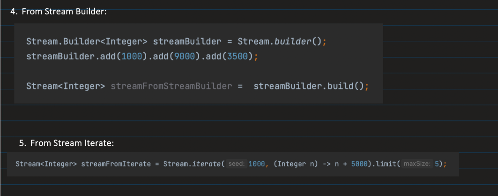

1️⃣ What Happens When You Call Intermediate Operations

Example:

      list.stream()
      .filter(n -> n % 2 == 0)
      .map(n -> n * 2)
      .forEach(System.out::println);

Steps internally:

   Step 1 — Create Stream
   list.stream()

A Stream object is created with:
      
      Source = list
      Pipeline = empty

Step 2 — Add filter()

   .filter(n -> n % 2 == 0)
      
      The stream does not execute filtering.
      Instead it adds a stage to the pipeline.

Conceptually:

      Source = list
      Pipeline = [filter]

Step 3 — Add map()

   .map(n -> n * 2)

Again, nothing executes.
Pipeline becomes:
      
      Source = list
      Pipeline = [filter → map]

Each call returns another Stream object representing the next stage.

2️⃣ When Terminal Operation Happens
.forEach(System.out::println)

Now the stream says:
      
      Pipeline is complete
      Start processing

      Execution begins.

3️⃣ How Elements Flow Through Pipeline

List:

[1,2,3,4]

Actual execution:

      1 → filter → rejected
      2 → filter → map → print
      3 → filter → rejected
      4 → filter → map → print

So operations are applied element by element.

4️⃣ How Stream Remembers Operations

Internally the stream builds something like:

      StreamStage
      ↓
      StreamStage
      ↓
      StreamStage

Each stage stores:

operation type (filter, map, etc.)

lambda function

Conceptually:
      
      Stage1 : filter(n -> n % 2 == 0)
      Stage2 : map(n -> n * 2)
      Stage3 : forEach(System.out::println)

5️⃣ Real Internal Classes (High Level)

Java internally uses classes like:

      AbstractPipeline
      ReferencePipeline
      StatelessOp
      TerminalOp

Each intermediate operation creates a new pipeline stage object that holds:

      previousStage + currentOperation
      So the stream remembers the whole chain.


| Operation                 | Functional Interface       | Method Signature                                                       | Used For                             | Example                                      | Stateful / Stateless            |
| ------------------------- | -------------------------- | ---------------------------------------------------------------------- |--------------------------------------| -------------------------------------------- | ------------------------------- |
| **filter()**              | `Predicate<T>`             | `Stream<T> filter(Predicate<? super T> predicate)`                     | Select elements matching a condition | `stream.filter(x -> x > 10)`                 | Stateless                       |
| **map()**                 | `Function<T,R>`            | `Stream<R> map(Function<? super T,? extends R> mapper)`                | Transform elements                   | `stream.map(x -> x * 2)`                     | Stateless                       |
| **mapToInt()**            | `ToIntFunction<T>`         | `IntStream mapToInt(ToIntFunction<? super T>)`                         | Convert to `IntStream`               | `stream.mapToInt(x -> x.getAge())`           | Stateless                       |
| **mapToLong()**           | `ToLongFunction<T>`        | `LongStream mapToLong(ToLongFunction<? super T>)`                      | Convert to `LongStream`              | `stream.mapToLong(x -> x.getSalary())`       | Stateless                       |
| **mapToDouble()**         | `ToDoubleFunction<T>`      | `DoubleStream mapToDouble(ToDoubleFunction<? super T>)`                | Convert to `DoubleStream`            | `stream.mapToDouble(x -> x.getPrice())`      | Stateless                       |
| **flatMap()**             | `Function<T,Stream<R>>`    | `Stream<R> flatMap(Function<? super T,? extends Stream<? extends R>>)` | Flatten nested streams               | `list.stream().flatMap(x -> x.stream())`     | Stateless                       |
| **flatMapToInt()**        | `Function<T, IntStream>`   | `IntStream flatMapToInt(...)`                                          | Flatten to `IntStream`               | `stream.flatMapToInt(x -> Arrays.stream(x))` | Stateless                       |
| **distinct()**            | —                          | `Stream<T> distinct()`                                                 | Remove duplicate elements            | `stream.distinct()`                          | **Stateful**                    |
| **sorted()**              | `Comparator<T>` (optional) | `Stream<T> sorted()` / `sorted(Comparator)`                            | Sort elements                        | `stream.sorted()`                            | **Stateful**                    |
| **peek()**                | `Consumer<T>`              | `Stream<T> peek(Consumer<? super T>)`                                  | Debug / inspect elements             | `stream.peek(System.out::println)`           | Stateless                       |
| **limit()**               | —                          | `Stream<T> limit(long maxSize)`                                        | Restrict number of elements          | `stream.limit(5)`                            | **Stateful (short-circuiting)** |
| **skip()**                | —                          | `Stream<T> skip(long n)`                                               | Skip first n elements                | `stream.skip(3)`                             | **Stateful**                    |
| **takeWhile()** (Java 9+) | `Predicate<T>`             | `Stream<T> takeWhile(Predicate)`                                       | Take elements while condition true   | `stream.takeWhile(x -> x < 10)`              | **Stateful**                    |
| **dropWhile()** (Java 9+) | `Predicate<T>`             | `Stream<T> dropWhile(Predicate)`                                       | Skip while condition true            | `stream.dropWhile(x -> x < 10)`              | **Stateful**                    |
| **unordered()**           | —                          | `BaseStream unordered()`                                               | Remove ordering constraint           | `stream.unordered()`                         | Stateless                       |
| **parallel()**            | —                          | `BaseStream parallel()`                                                | Convert stream to parallel           | `stream.parallel()`                          | Stateless                       |
| **sequential()**          | —                          | `BaseStream sequential()`                                              | Convert to sequential stream         | `stream.sequential()`                        | Stateless                       |


Stateless Operations

Process one element at a time

      filter
      map
      flatMap
      peek
      mapToInt / mapToLong / mapToDouble

They do not store previous elements.


Stateful Operations

Need previous elements or buffering

      sorted
      distinct
      limit
      skip
      takeWhile
      dropWhile

They may store elements internally before continuing the pipeline.


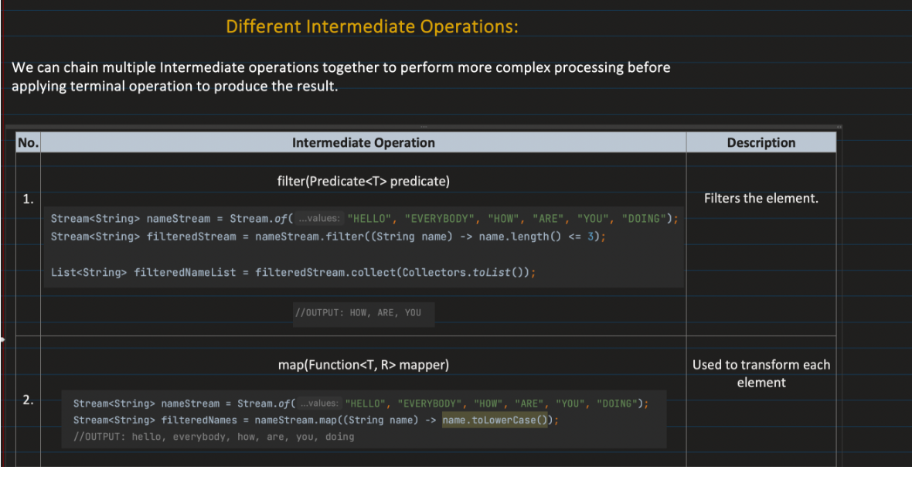

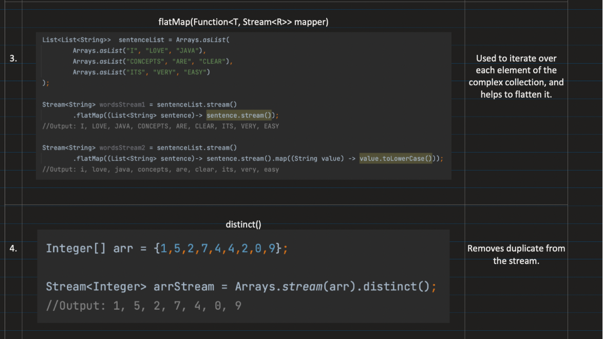

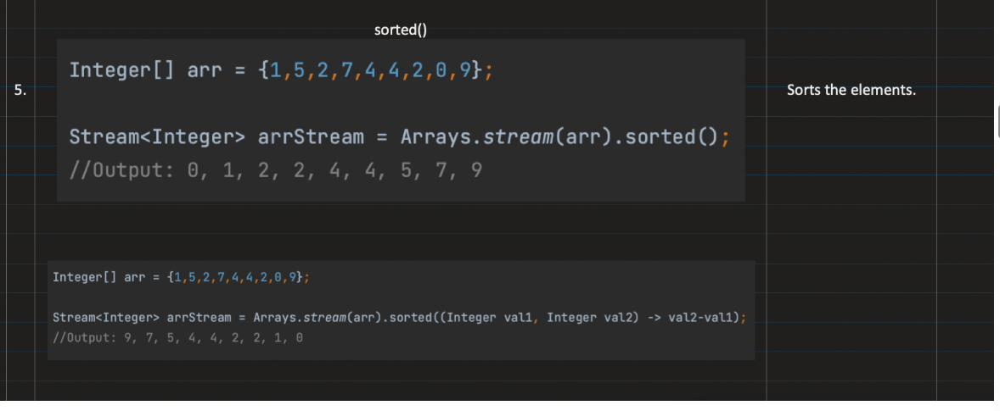

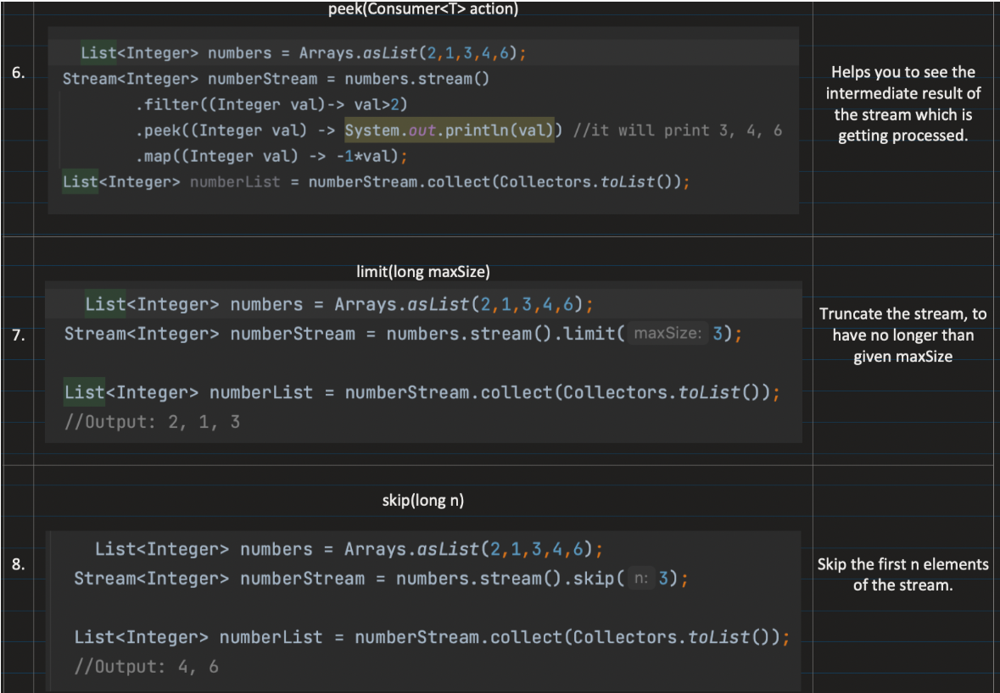

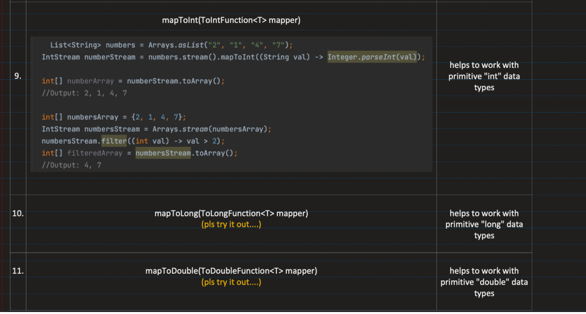

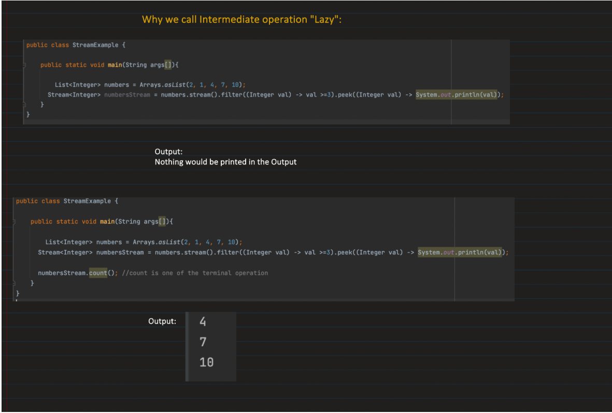

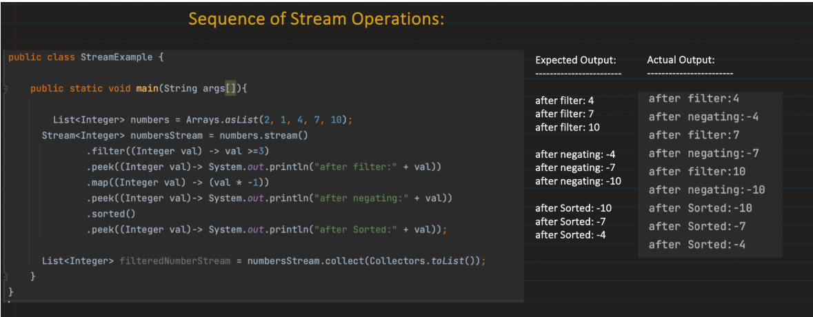

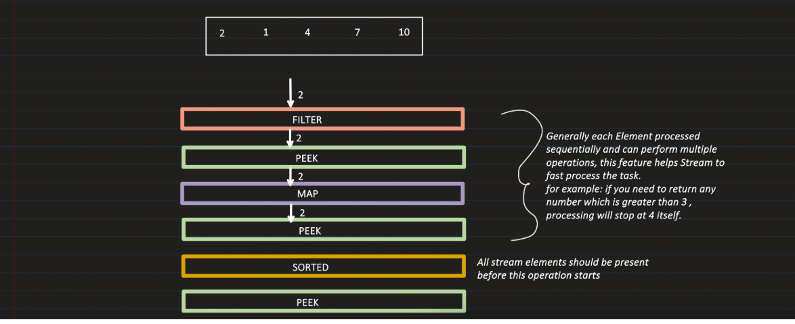


TERMINAL OPERATIONS :

      Terminal operations are the operations that trigger execution of the stream pipeline and produce a final result or side effect.
      After a terminal operation runs, the stream cannot be reused.


| Operation            | Functional Interface               | Method Signature (Simplified)                              | Used For                                                            | Example                                      | Return Type           |
| -------------------- | ---------------------------------- | ---------------------------------------------------------- | ------------------------------------------------------------------- | -------------------------------------------- | --------------------- |
| **forEach()**        | `Consumer<T>`                      | `void forEach(Consumer<? super T> action)`                 | Perform action on each element                                      | `stream.forEach(System.out::println)`        | `void`                |
| **forEachOrdered()** | `Consumer<T>`                      | `void forEachOrdered(Consumer<? super T>)`                 | Process elements in encounter order (important in parallel streams) | `stream.forEachOrdered(System.out::println)` | `void`                |
| **toArray()**        | `IntFunction<A[]>`                 | `Object[] toArray()` / `<A> A[] toArray(IntFunction<A[]>)` | Convert stream to array                                             | `stream.toArray()`                           | `Object[]`            |
| **reduce()**         | `BinaryOperator<T>` / `BiFunction` | `Optional<T> reduce(BinaryOperator<T>)`                    | Combine elements into one value                                     | `stream.reduce((a,b) -> a+b)`                | `Optional<T>`         |
| **collect()**        | `Collector<T,A,R>`                 | `<R,A> R collect(Collector)`                               | Convert stream to collection or custom result                       | `stream.collect(Collectors.toList())`        | `Collection / Object` |
| **min()**            | `Comparator<T>`                    | `Optional<T> min(Comparator)`                              | Find smallest element                                               | `stream.min(Integer::compare)`               | `Optional<T>`         |
| **max()**            | `Comparator<T>`                    | `Optional<T> max(Comparator)`                              | Find largest element                                                | `stream.max(Integer::compare)`               | `Optional<T>`         |
| **count()**          | —                                  | `long count()`                                             | Count number of elements                                            | `stream.count()`                             | `long`                |
| **anyMatch()**       | `Predicate<T>`                     | `boolean anyMatch(Predicate)`                              | Check if any element matches condition                              | `stream.anyMatch(x -> x > 10)`               | `boolean`             |
| **allMatch()**       | `Predicate<T>`                     | `boolean allMatch(Predicate)`                              | Check if all elements match condition                               | `stream.allMatch(x -> x > 10)`               | `boolean`             |
| **noneMatch()**      | `Predicate<T>`                     | `boolean noneMatch(Predicate)`                             | Check if no elements match condition                                | `stream.noneMatch(x -> x > 10)`              | `boolean`             |
| **findFirst()**      | —                                  | `Optional<T> findFirst()`                                  | Get first element                                                   | `stream.findFirst()`                         | `Optional<T>`         |
| **findAny()**        | —                                  | `Optional<T> findAny()`                                    | Get any element (good for parallel streams)                         | `stream.findAny()`                           | `Optional<T>`         |
| **iterator()**       | —                                  | `Iterator<T> iterator()`                                   | Convert stream to iterator                                          | `stream.iterator()`                          | `Iterator<T>`         |
| **spliterator()**    | —                                  | `Spliterator<T> spliterator()`                             | Create spliterator for parallel processing                          | `stream.spliterator()`                       | `Spliterator<T>`      |


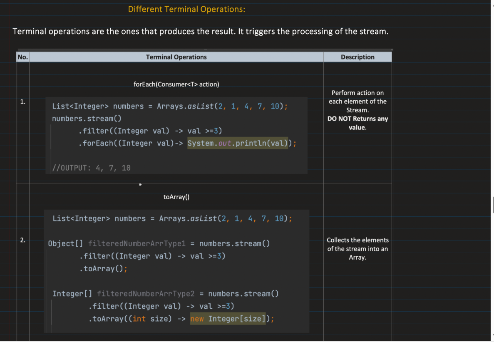

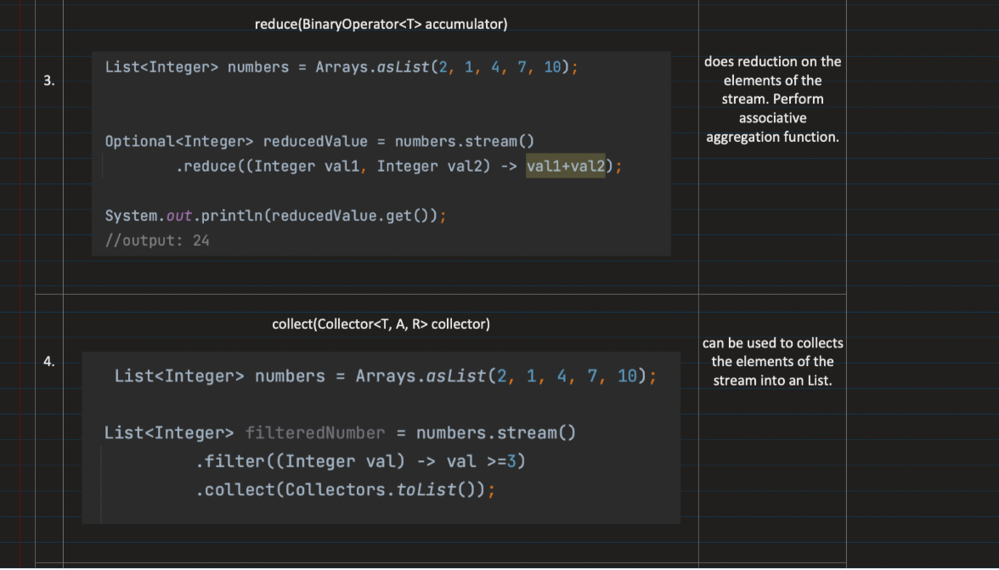

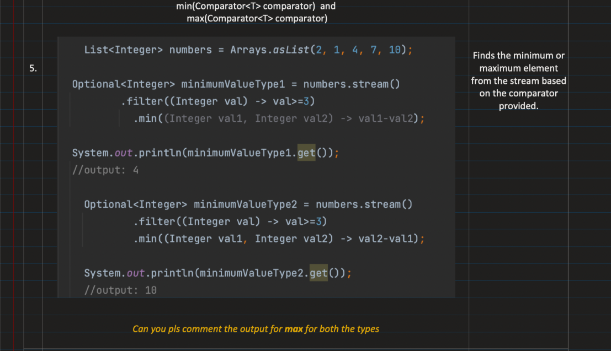

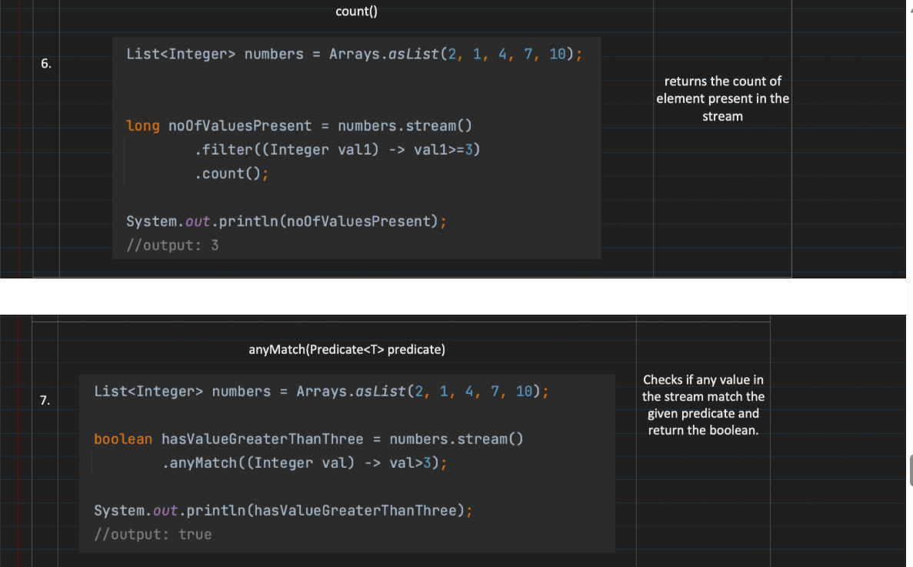

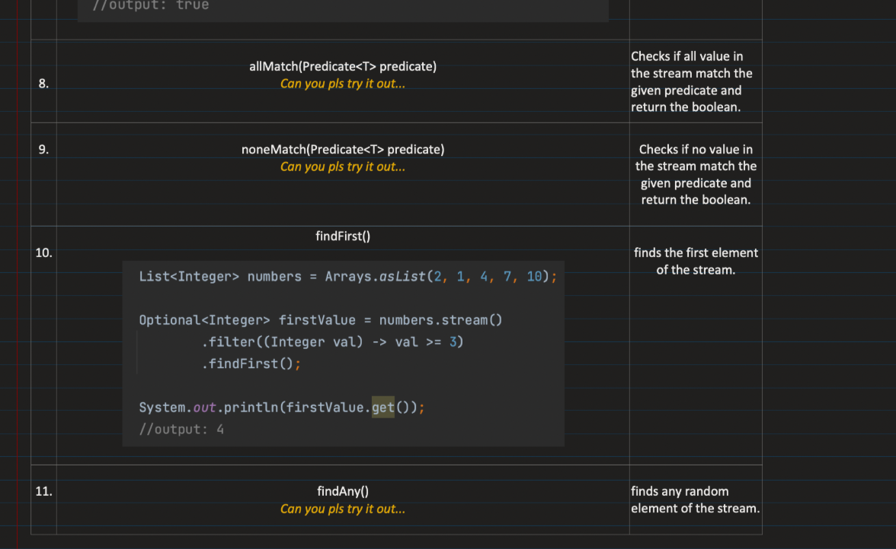


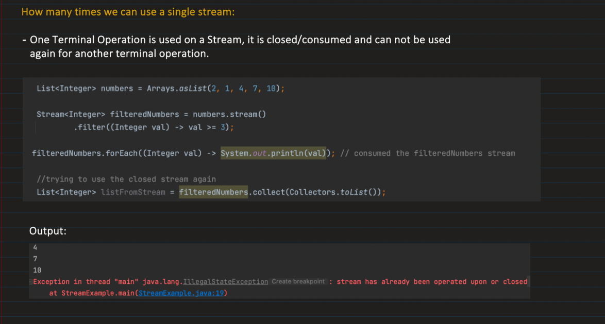


PARALLEL STREAMS :

      Parallel streams allow you to process data in parallel using multiple CPU cores.
      They can significantly improve performance for large data sets and computationally intensive operations.
      However, they may not always be faster than sequential streams, especially for small data sets or simple operations.
      Parallel Streams allow a stream to process elements using multiple threads at the same time instead of a single thread.
      Normally, streams are sequential (one element processed after another).
      Parallel streams split the data and process parts simultaneously using multiple CPU cores.


1️⃣ Who Splits the Data?

      Splitting is done by java.util.Spliterator.

Spliterator has a method:

      trySplit()

This method divides the data source into smaller parts.

Example idea:

      [1,2,3,4,5,6,7,8]
      |
      trySplit()

Result:

[1,2,3,4]   [5,6,7,8]
2️⃣ What Does ForkJoinPool Do?

After splitting:

   ForkJoinPool assigns chunks to worker threads
   Threads execute the operations in parallel.

So roles are:


| Component       | Responsibility                             |
| --------------- | ------------------------------------------ |
| `Spliterator`   | Splits the data                            |
| `ForkJoinPool`  | Executes tasks in parallel                 |
| Stream pipeline | Applies operations (`map`, `filter`, etc.) |


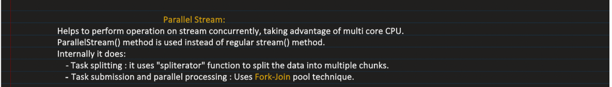

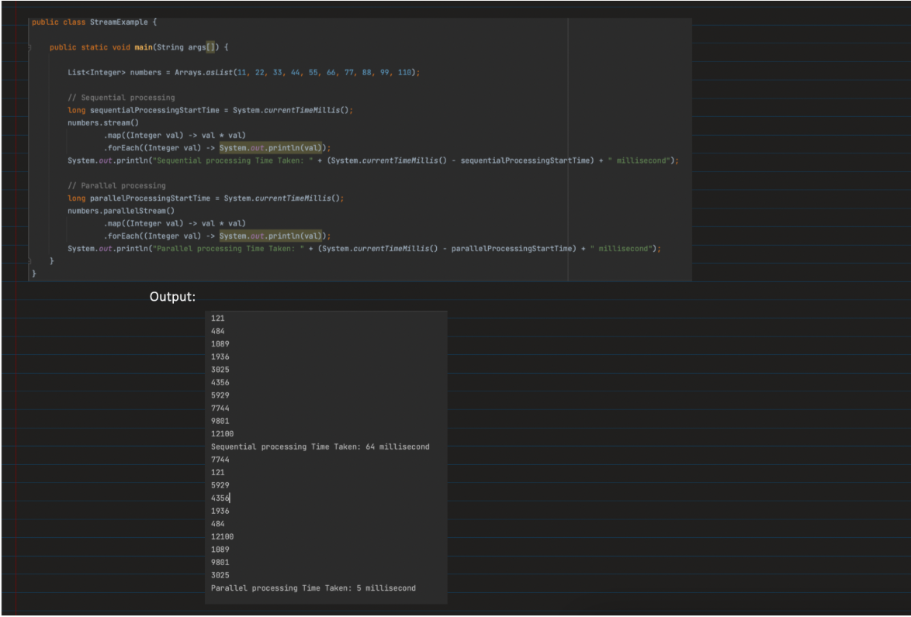


1️⃣ Convert Stream → List

      List<Integer> list =
      stream.collect(Collectors.toList());
Result type

      List<T>
2️⃣ Convert Stream → Set

      Set<Integer> set =
      stream.collect(Collectors.toSet());
Result

      Set<T>
3️⃣ Convert Stream → Map

      Map<Integer, String> map =
      stream.collect(
         Collectors.toMap(
            x -> x,
            x -> "Value " + x
         )
      );

Example

      Stream: 1,2,3
      Map: {1=Value 1, 2=Value 2, 3=Value 3}

Here:

      Lambda	Meaning
      x -> x	key
      x -> "Value"+x	value
4️⃣ Convert Stream → String (joining)

      String result =
      stream.collect(Collectors.joining(","));

Example

      Stream: ["A","B","C"]

      Result: "A,B,C"
5️⃣ Group elements

      Map<Integer, List<String>> map =
      names.stream()
      .collect(Collectors.groupingBy(String::length));

Example

      ["Java","Go","Python"]

Result

      {
      2=[Go],
      4=[Java],
      6=[Python]
      }
6️⃣ Count elements

      long count =
      stream.collect(Collectors.counting());
7️⃣ Sum values

      int sum =
      numbers.stream()
      .collect(Collectors.summingInt(x -> x));


| Collector      | Result          |
| -------------- | --------------- |
| `toList()`     | List            |
| `toSet()`      | Set             |
| `toMap()`      | Map             |
| `joining()`    | String          |
| `groupingBy()` | Map with groups |
| `counting()`   | Count           |
| `summingInt()` | Sum             |

```java
public static <T> Collector<T, ?, List<T>> toList() {
return Collector.of(
   ArrayList::new,                 // supplier
   List::add,                      // accumulator
   (left, right) -> {              // combiner
        left.addAll(right);
         return left;
   }
);}
```

Accumulator uses the functional interface BiConsumer<A,T> from java.util.function.BiConsumer.
Combiner uses the functional interface BinaryOperator<A> from java.util.function.BinaryOperator.
Combiner is used in parallel processing to merge partial results from different threads.
collect() method internally uses supplier to create a new collection, accumulator to add elements, and combiner to merge results in parallel processing.


