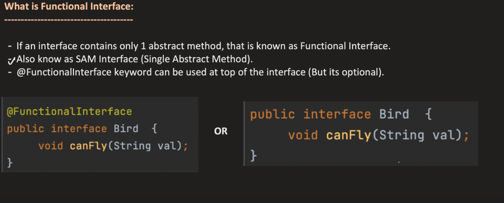
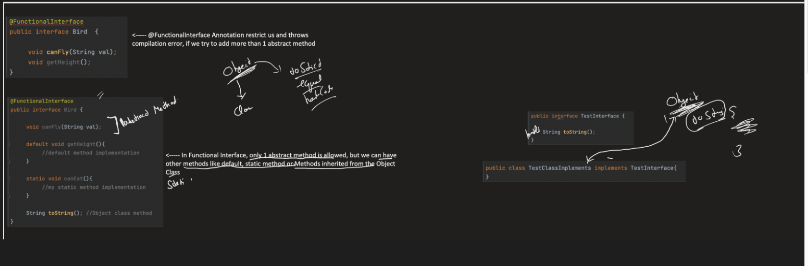
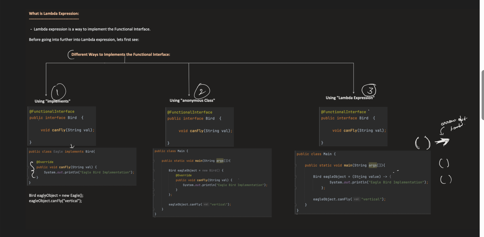
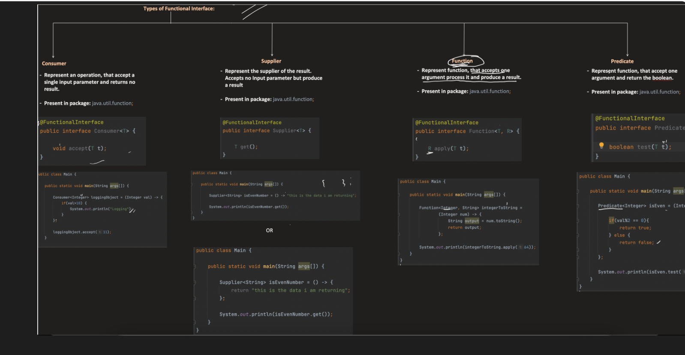
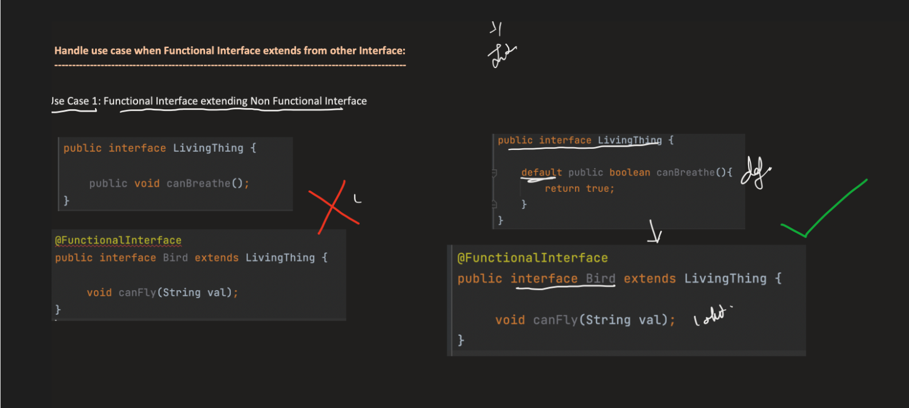
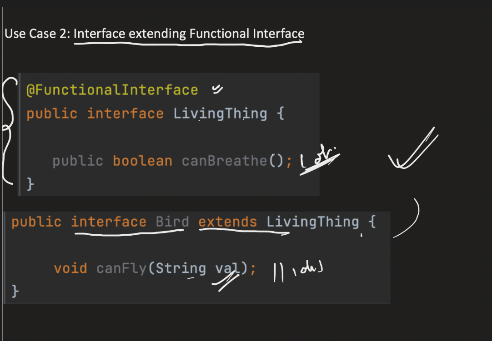
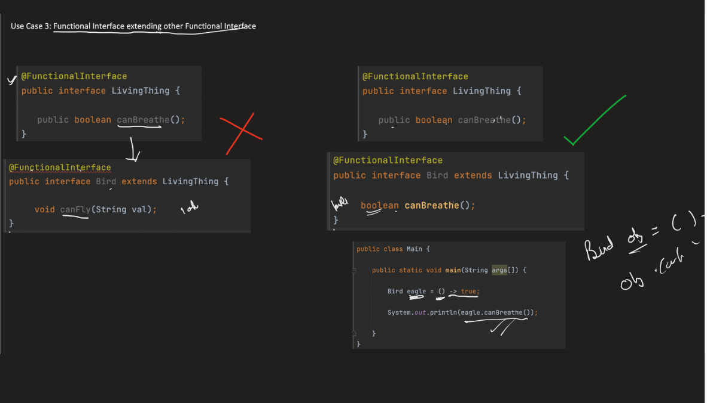

FUNCTIONAL INTERFACE :

    A Functional Interface in Java is an interface that contains exactly one abstract method.
    It can have multiple default methods, static methods, and methods from Object, but only one abstract method.
    Gives compile-time error if another abstract method is added





USES :

    Functional interfaces are used as the basis for lambda expressions and method references in Java.
    They allow you to treat functions as first-class citizens, enabling functional programming paradigms in Java.
    Common functional interfaces include Runnable, Callable, Comparator, Function, Consumer, Supplier, etc.

Before Java 8, if you wanted to pass behavior (logic) as a parameter, you had to create a class or anonymous class.

```java
Runnable r = new Runnable() {
    public void run() {
        System.out.println("Running");
    }
};
```

With Java 8 and functional interfaces, you can use lambda expressions to pass behavior more concisely:

```java
Runnable r = () -> System.out.println("Running");
``` 
Much shorter and cleaner.

So the main reason is:

👉 To support lambda expressions and functional programming in Java.
    
    Functional programming allows you to write more concise and flexible code by treating functions as first-class citizens. Functional interfaces are the foundation for this in Java.
    It enables you to pass behavior (logic) as parameters, return functions from methods, and use method references, making your code more expressive and easier to read.

3. Flow Internally

Step-by-step:

    Step 1 – Lambda expression written
        () -> System.out.println("Task executed")
    Step 2 – Compiler checks functional interface
        Runnable -> run()
    Step 3 – Compiler maps lambda body to that method
        run() {
        System.out.println("Task executed");
        }
    Step 4 – JVM creates a functional interface instance
    Step 5 – Object passed as parameter
        process(runnableObject)
        Step 6 – Method invoked
        r.run()


LAMBDA EXPRESSION :

    A lambda expression is a concise way to represent an anonymous function (a function without a name) in Java.
    It provides a clear and concise syntax for writing instances of functional interfaces.
    Lambda expressions are used primarily to implement the single abstract method of a functional interface, allowing you to pass behavior as data.
    A lambda expression is an anonymous function used to implement a functional interface.
    It has:
    
        No name
        No return type declaration
        Short syntax  












| Functional Interface  | Abstract Method         | Takes (Input) | Returns       | Purpose                                    | Example Lambda                         |
| --------------------- | ----------------------- | ------------- | ------------- | ------------------------------------------ | -------------------------------------- |
| **Predicate<T>**      | `boolean test(T t)`     | 1 object      | boolean       | Check a condition                          | `n -> n > 10`                          |
| **BiPredicate<T,U>**  | `boolean test(T t,U u)` | 2 objects     | boolean       | Compare/check condition between two values | `(a,b) -> a.equals(b)`                 |
| **Function<T,R>**     | `R apply(T t)`          | 1 object      | result object | Transform value                            | `x -> x * 2`                           |
| **BiFunction<T,U,R>** | `R apply(T t,U u)`      | 2 objects     | result object | Convert two inputs into a result           | `(a,b) -> a + b`                       |
| **Consumer<T>**       | `void accept(T t)`      | 1 object      | nothing       | Perform an action                          | `x -> System.out.println(x)`           |
| **BiConsumer<T,U>**   | `void accept(T t,U u)`  | 2 objects     | nothing       | Action on two values                       | `(k,v) -> System.out.println(k+":"+v)` |
| **Supplier<T>**       | `T get()`               | nothing       | object        | Produce a value                            | `() -> new Random().nextInt()`         |
| **UnaryOperator<T>**  | `T apply(T t)`          | 1 object      | same type     | Modify value                               | `x -> x * x`                           |
| **BinaryOperator<T>** | `T apply(T t,T t)`      | 2 objects     | same type     | Combine values                             | `(a,b) -> a + b`                       |


| Functional Interface  | Method                        | Takes    | Returns | Purpose                 | Example                      |
| --------------------- | ----------------------------- | -------- | ------- | ----------------------- | ---------------------------- |
| **IntPredicate**      | `boolean test(int value)`     | int      | boolean | condition check         | `x -> x > 5`                 |
| **LongPredicate**     | `boolean test(long value)`    | long     | boolean | condition check         | `x -> x > 100`               |
| **DoublePredicate**   | `boolean test(double value)`  | double   | boolean | condition check         | `x -> x > 1.5`               |
| **IntFunction<R>**    | `R apply(int value)`          | int      | object  | transform int to object | `x -> "Num:"+x`              |
| **ToIntFunction<T>**  | `int applyAsInt(T value)`     | object   | int     | object → int            | `s -> s.length()`            |
| **IntConsumer**       | `void accept(int value)`      | int      | nothing | perform action          | `x -> System.out.println(x)` |
| **IntSupplier**       | `int getAsInt()`              | nothing  | int     | generate int            | `() -> 5`                    |
| **IntUnaryOperator**  | `int applyAsInt(int operand)` | int      | int     | modify int              | `x -> x * x`                 |
| **IntBinaryOperator** | `int applyAsInt(int a,int b)` | two ints | int     | combine ints            | `(a,b) -> a + b`             |


| Interface         | Method                 | Takes     | Returns | Purpose                      | Example                            |
| ----------------- | ---------------------- | --------- | ------- | ---------------------------- | ---------------------------------- |
| **Runnable**      | `void run()`           | nothing   | nothing | execute task/thread          | `() -> System.out.println("Task")` |
| **Callable<T>**   | `T call()`             | nothing   | result  | async tasks returning result | `() -> 10`                         |
| **Comparator<T>** | `int compare(T a,T b)` | 2 objects | int     | sorting                      | `(a,b) -> a-b`                     |
