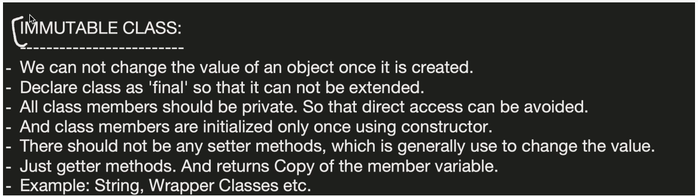
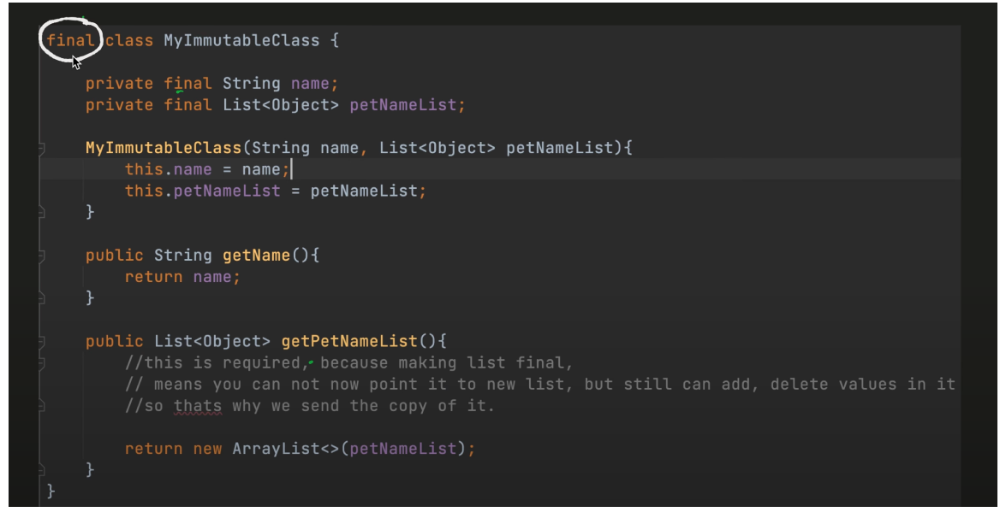
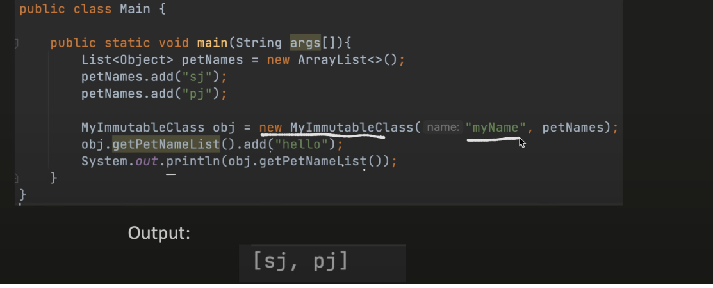

Immutable class :

1. A class whose state cannot be changed after it is created is called an immutable class.
2. Once an object of an immutable class is created, its fields cannot be modified.
3. Immutable classes are useful for creating objects that represent fixed values, such as strings, numbers, and dates.
4. Any modification-like operation creates a **new object**.








## 1️⃣ `final` reference to a mutable list

`final List<String> list = new ArrayList<>(); list.add("Hello"); // ✅ allowed list.add("World"); // ✅ allowed`

- `final` **prevents reassigning the reference**:


`list = new ArrayList<>(); // ❌ compilation error`

- But the **object itself is mutable**, so you **can add, remove, or modify elements**.


✅ So here, you **can add extra data**.

---

## 2️⃣ Immutable list (cannot add/remove)

### Using `Collections.unmodifiableList`:

`List<String> list = new ArrayList<>(); List<String> immutableList = Collections.unmodifiableList(list);  immutableList.add("Hello"); // ❌ throws UnsupportedOperationException`

### Using Java 9+ `List.of()`:

`List<String> immutableList = List.of("A", "B", "C"); immutableList.add("D"); // ❌ throws UnsupportedOperationException`

- Here, the **object itself is immutable**, so you **cannot add or remove elements**, regardless of whether the reference is `final` or not.
- ------------------------------------------------------------------------------


class Person {
private final List<String> hobbies;

    Person(List<String> hobbies) {
        this.hobbies = Collections.unmodifiableList(
            new ArrayList<>(hobbies)
        );
    }

    public List<String> getHobbies() {
        return hobbies; // safe now
    }
}s
# ✅ **1. What is an Unmodifiable List?**

It’s **NOT** a new list.

It is a **wrapper** around an existing list that:

- Allows reading (get, size, contains)

- **Blocks ALL modifications** (add, remove, clear)

- Throws **UnsupportedOperationException** for any modifying operation


---

# 🔍 **2. How is it implemented internally?**

Inside Java, there is a class like this:
```
static class UnmodifiableList<E> implements List<E> {
    final List<? extends E> list;

    UnmodifiableList(List<? extends E> list) {
        this.list = Objects.requireNonNull(list);
    }
}

```

### ✔ It stores the original list inside

### ✔ It does NOT copy the list

### ✔ It delegates read operations

### ✔ It throws exceptions for write operations

---

# 🧠 **3. How each method works internally**

### **Read methods → delegated**

```
public E get(int index) {
    return list.get(index);   // delegate to original list
}

public int size() {
    return list.size();
}

```

### **Write methods → blocked**

```
public void add(int index, E element) {
    throw new UnsupportedOperationException();
}

public boolean add(E e) {
    throw new UnsupportedOperationException();
}

public E remove(int index) {
    throw new UnsupportedOperationException();
}

public void clear() {
    throw new UnsupportedOperationException();
}

```

This applies to:

- add()

- addAll()

- remove()

- removeAll()

- retainAll()

- set()

- sort()

- replaceAll()


All modifying operations **just throw exceptions.**

Best way to handle lists that should not be modified after creation.
class Person {
private final List<String> hobbies;

    Person(List<String> hobbies) {
        this.hobbies = new ArrayList<>(hobbies); // defensive copy
    }

    public List<String> getHobbies() {
        return new ArrayList<>(hobbies); // return copy
    }
}