SEQUENCED COLLECTION :

    Sequenced collection is a collection that maintains the order of elements. It is a collection that allows duplicate elements and maintains the order of insertion. The most common implementation of a sequenced collection is the List interface in Java.
    👉 They are collections that maintain a well-defined order (sequence) and give standard methods to access elements from both ends.

Core Problem (Before Java 21)

👉 Java had ordered collections… but:

    ❌ No common API
    ❌ Different ways to do the same thing
    ❌ Some operations were awkward / hacky

🔹 1. SequencedCollection — Why needed?
❌ Problem Before

Example with List

    List<Integer> list = List.of(10, 20, 30);
    
    // First element
    list.get(0);
    
    // Last element
    list.get(list.size() - 1);

👉 Problems:

    Not readable
    Error-prone (size()-1)
    Works only for List, not for Set
Example with LinkedHashSet

    LinkedHashSet<Integer> set = new LinkedHashSet<>(List.of(10, 20, 30));

// Get first element

        Integer first = set.iterator().next();  // 😵 hack

👉 Problems:

    No direct API
    Ugly + confusing
✅ Solution (SequencedCollection)

    SequencedCollection<Integer> col = new ArrayList<>(List.of(10, 20, 30));

    col.getFirst();  // 10
    col.getLast();   // 30
    col.reversed();  // [30, 20, 10]

👉 Now:
    
    Same API for List & Set
    Clean + readable
🔹 2. SequencedSet — Why needed?

    ❌ Problem Before
    Set<Integer> set = new LinkedHashSet<>(List.of(10, 20, 30));

👉 Even though order exists:

    No getFirst()
    No getLast()
    No reverse view
✅ Solution

    SequencedSet<Integer> set = new LinkedHashSet<>(List.of(10, 20, 30));

    set.getFirst();   // 10
    set.getLast();    // 30
    set.reversed();   // [30, 20, 10]

👉 Now:

    Set behaves like an ordered structure properly
🔹 3. SequencedMap — Why needed?
❌ Problem Before

    LinkedHashMap<Integer, String> map = new LinkedHashMap<>();
    map.put(1, "A");
    map.put(2, "B");

👉 Want first entry?

    map.entrySet().iterator().next();  // 😵 hack

👉 Want last entry?

// No direct way ❌
✅ Solution

    SequencedMap<Integer, String> map = new LinkedHashMap<>();

    map.put(1, "A");
    map.put(2, "B");
    
    map.firstEntry();  // 1=A
    map.lastEntry();   // 2=B
    map.reversed();    // reverse order view

👉 Now:

    Direct APIs
    No hacks
🔥 BIG PICTURE (Why ALL 3 were needed)
Problem	Solution

    No common interface for ordered collections	SequencedCollection
    Ordered sets lacked APIs	SequencedSet
    Ordered maps had hacky access	SequencedMap
🔹 Real-World Use Case
Example: Recent items (like browser history)

Before:

    list.get(list.size() - 1);

After:

    collection.getLast();
Example: LRU Cache

Before:

    Hard to get oldest entry

After:

    map.firstEntry(); // oldest
    map.lastEntry();  // newest
🔥 Key Insight (MOST IMPORTANT)

👉 Java already had ordering
👉 But NOT uniform operations on order

👉 Sequenced collections =
“Make ordering first-class + consistent”

🔹 Interview One-Liner

    👉    Sequenced collections were introduced to provide a consistent and standard way to access the first, last, and reversed elements across all ordered collections, eliminating inconsistent and hacky approaches.
    
    🔥 Simple Memory Trick

👉 Before:

    “Order exists, but accessing it is messy”

👉 After:

    “Order + clean API everywhere”

If you want next:

    `👉 I can give tricky comparison: List vs Deque vs SequencedCollection (very confusing in interviews)
    👉 Or show real coding questions using these`

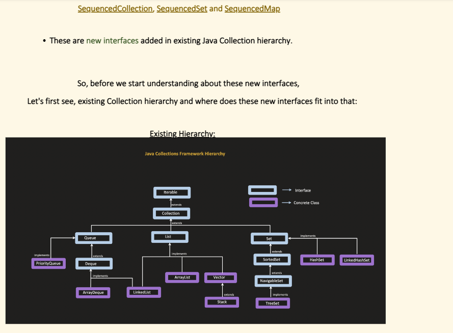

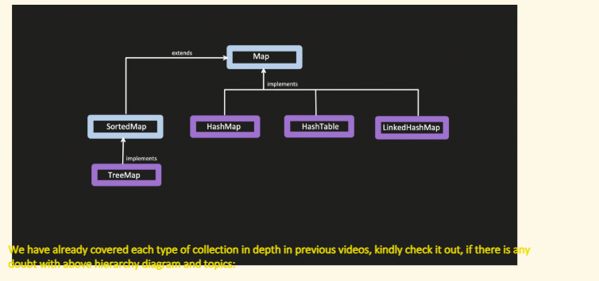

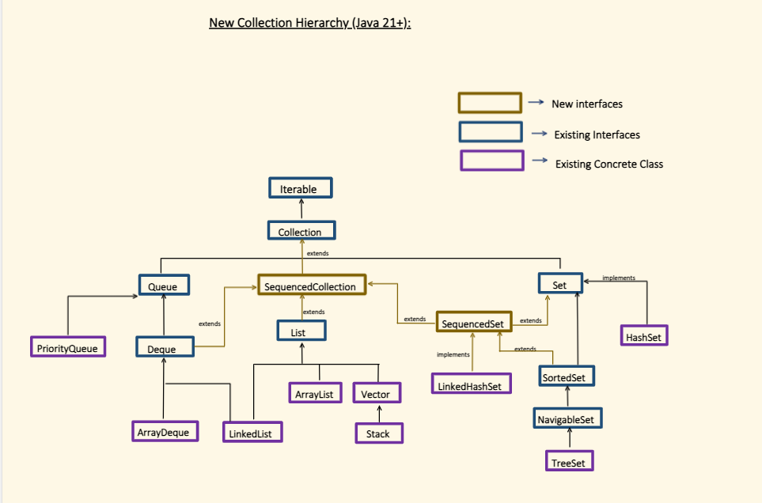

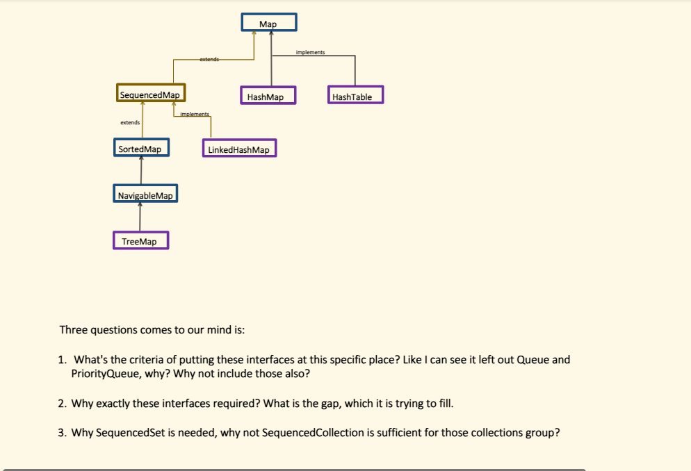

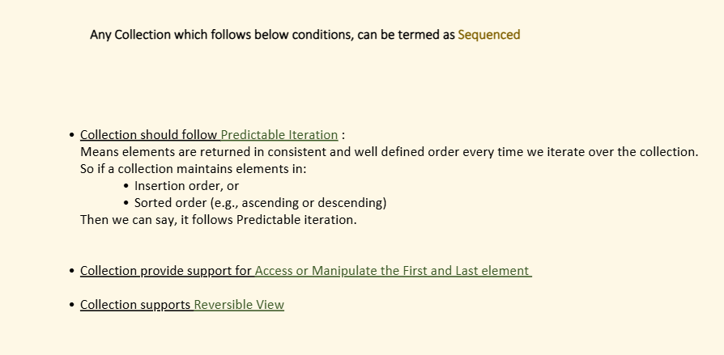

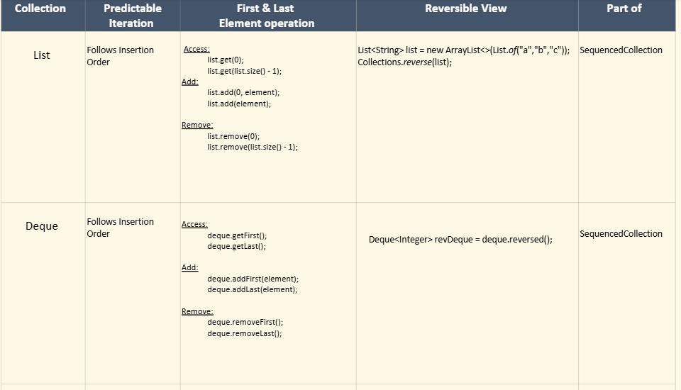

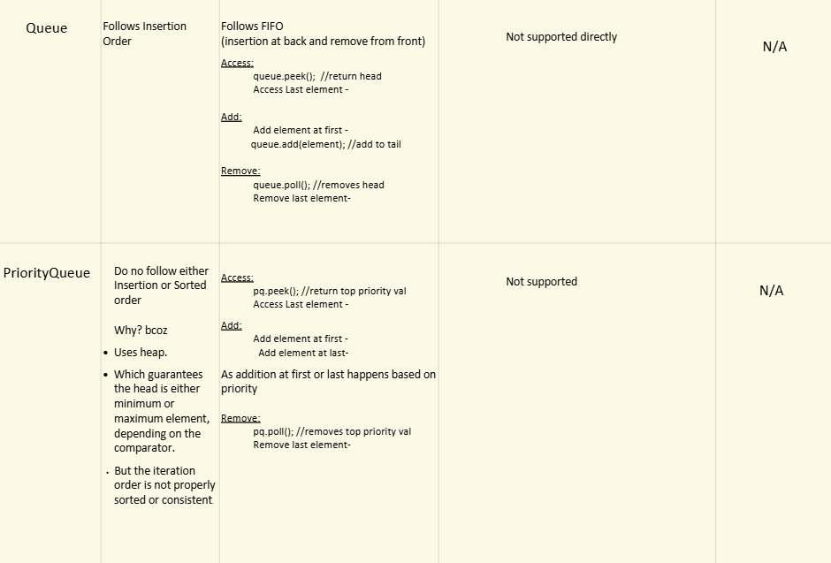

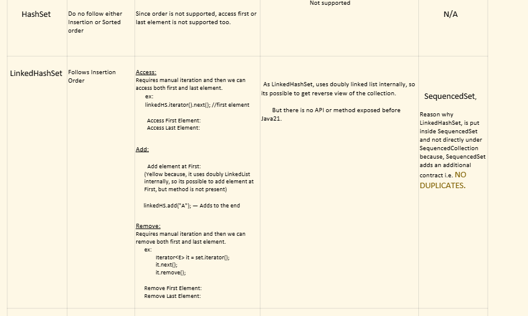

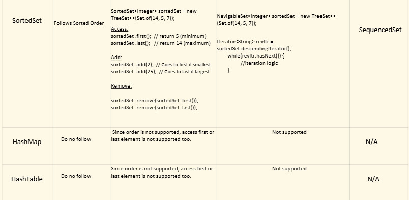

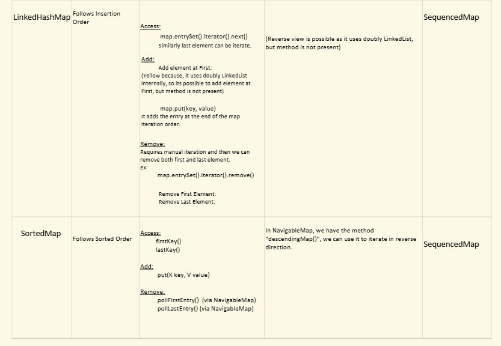

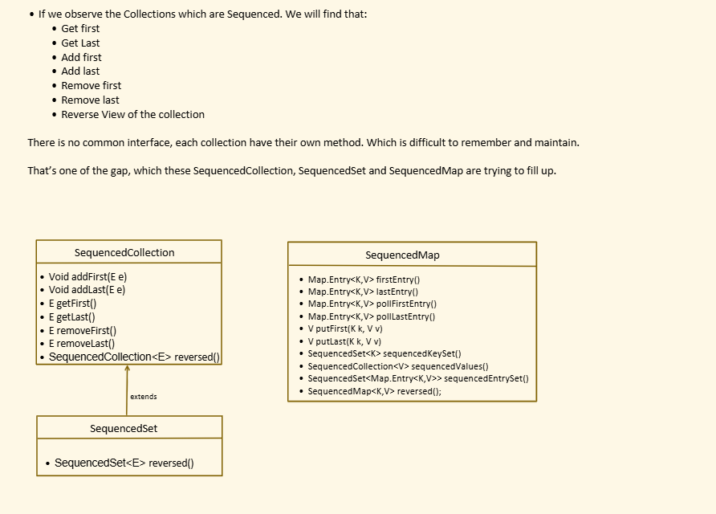

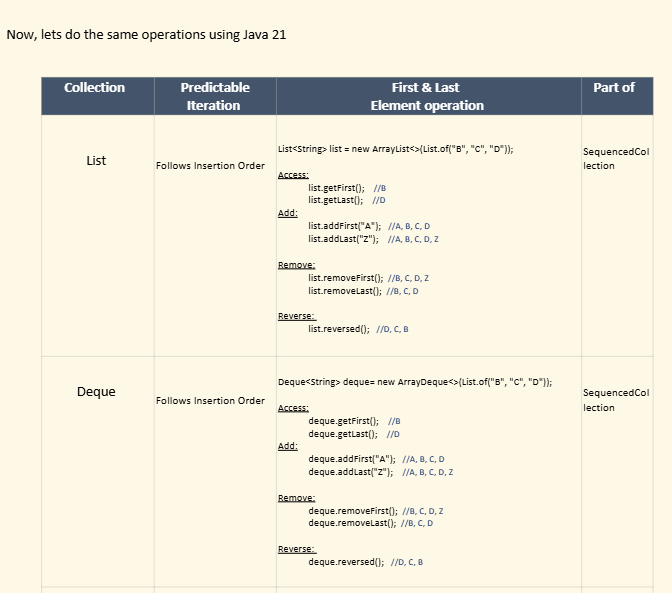

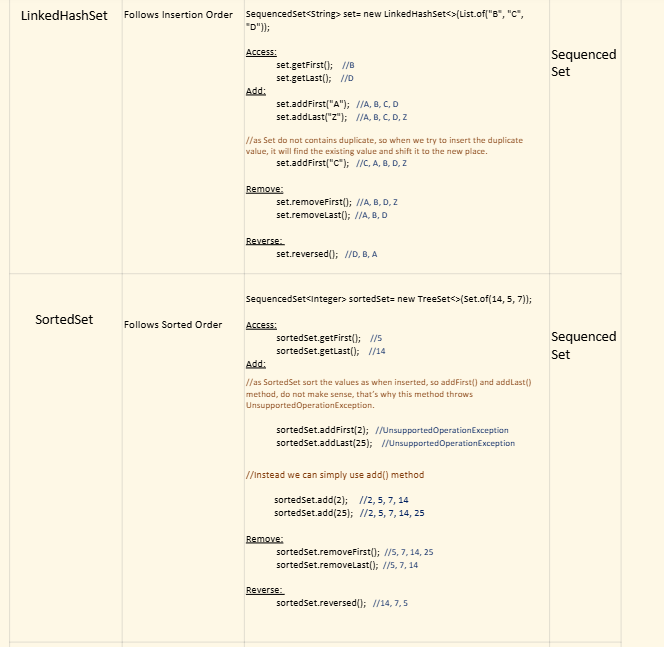

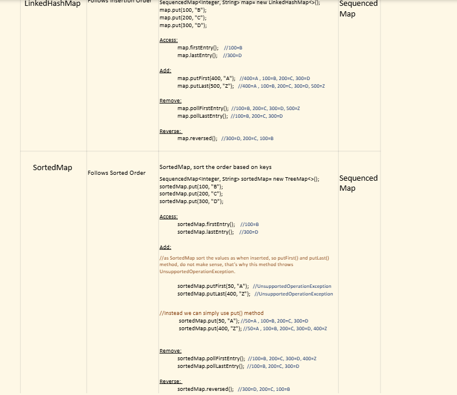

