**_Optional :_**

Optional is a container object that may or may not contain a non-null value. It provides methods to handle the presence or absence of a value without using null references.
Java 8 introduced the Optional class in the java.util package to handle the problem of null values more gracefully. Instead of risking NullPointerException (NPE), Optional provides a container object that may or may not hold a non-null value.

Key points:

    Optional is a container that can hold a value or be empty.
    It provides methods to check for presence, retrieve the value, or provide a default.
    It helps avoid null checks and NPEs by providing a more expressive API.

🔥 1. Represent “value may be absent” (PRIMARY USE)
❌ Problem (with null)

    User findUser(int id); // ❓ may return null

Caller:

    User user = findUser(1);
    if (user != null) {
        System.out.println(user.getName());
    }

👉 Problem:

    Unclear contract
    Easy to forget null check

✅ Solution (Optional)

    Optional<User> findUser(int id);

Usage:

findUser(1).ifPresent(u -> System.out.println(u.getName()));

    👉 ✔ Makes absence explicit
    👉 ✔ Forces developer awareness

🔥 2. Avoid NullPointerException (top-level safety)

❌ Problem

    User user = repo.findById(1);
    System.out.println(user.getName()); // 💥 if null
✅ Solution

    Optional<User> user = repo.findById(1);
    user.ifPresent(u -> System.out.println(u.getName()));

👉 ✔ No accidental direct access

🔥 3. Provide default values
❌ Problem

    User user = repo.findById(1);
    String name = (user != null) ? user.getName() : "Default";
✅ Solution

    String name = repo.findById(1)
    .map(User::getName)
    .orElse("Default");

    👉 ✔ Cleaner
    👉 ✔ No manual checks

🔥 4. Lazy default computation (performance)
    
    ❌ Problem
    User user = repo.findById(1);
    User result = (user != null) ? user : createUser(); // always evaluates?
✅ Solution

    User result = repo.findById(1)
    .orElseGet(() -> createUser());
    
    👉 ✔ createUser() runs ONLY if needed

🔥 5. Throw exception if absent
❌ Problem

    User user = repo.findById(1);
    if (user == null) {
    throw new RuntimeException("Not found");
    }
✅ Solution

    User user = repo.findById(1)
    .orElseThrow(() -> new RuntimeException("Not found"));

👉 ✔ Cleaner + expressive

🔥 6. Transform values safely (map)
❌ Problem

        User user = repo.findById(1);
        String name = null;
        
        if (user != null) {
        name = user.getName();
        }
✅ Solution

    Optional<String> name = repo.findById(1)
    .map(User::getName);

👉 ✔ No null checks
👉 ✔ Safe transformation

🔥 7. Handle nested objects (BIG WIN)
❌ Problem (null-check hell)

    if (user != null &&
    user.getAddress() != null &&
    user.getAddress().getCity() != null) {
    
        System.out.println(user.getAddress().getCity());
    }
✅ Solution

    Optional.ofNullable(user)
    .map(User::getAddress)
    .map(Address::getCity)
    .ifPresent(System.out::println);

👉 ✔ Clean chaining
👉 ✔ No deep null checks

🔥 8. Conditional execution (ifPresent)
❌ Problem

    if (user != null) {
    sendEmail(user);
    }
✅ Solution

    Optional.ofNullable(user)
    .ifPresent(this::sendEmail);
    
    👉 ✔ Functional style
    👉 ✔ Cleaner intent

🔥 9. Filtering values (filter)
❌ Problem

    if (user != null && user.getAge() > 18) {
    System.out.println("Adult");
    }
✅ Solution

    Optional.ofNullable(user)
    .filter(u -> u.getAge() > 18)
    .ifPresent(u -> System.out.println("Adult"));

👉 ✔ Combines condition + presence

🔥 10. Avoid nested Optional (flatMap)

❌ Problem

        Optional<Optional<String>> name =
        Optional.ofNullable(user)
        .map(u -> Optional.ofNullable(u.getName()));
        
        😵 Nested Optional

✅ Solution

    Optional<String> name =
    Optional.ofNullable(user)
    .flatMap(u -> Optional.ofNullable(u.getName()));
    
    👉 ✔ Flattens structure

🔥 11. Stream integration
❌ Problem

    List<Optional<String>> list;
    
    Handling manually is messy

✅ Solution

    list.stream()
    .flatMap(Optional::stream)
    .forEach(System.out::println);

👉 ✔ Removes empty values automatically

🔥 12. Fallback chaining (or)

    Optional<User> user =
    repo.findInDb(id)
    .or(() -> repo.findInCache(id));

👉 ✔ Try multiple sources

⚠️ What Optional DOES NOT solve

Very important 👇

        ❌ Nested nulls automatically
        user.ifPresent(u -> u.getName().length()); // 💥 possible NPE

👉 You must still use map()

❌ Misuse with get()

        user.get(); // 💥 if empty
        ❌ Overuse
        class User {
        Optional<String> name; // ❌ bad practice
        }

🧠 Final Summary (Interview Gold)
🔥 What Optional solves:

        ✔ Makes absence explicit
        ✔ Reduces accidental null usage
        ✔ Eliminates nested null checks
        ✔ Enables functional style
        ✔ Improves API design
        ✔ Provides safe defaults & error handling

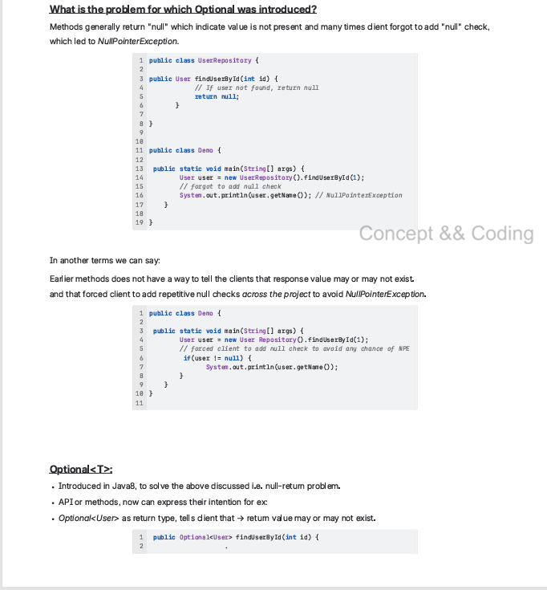

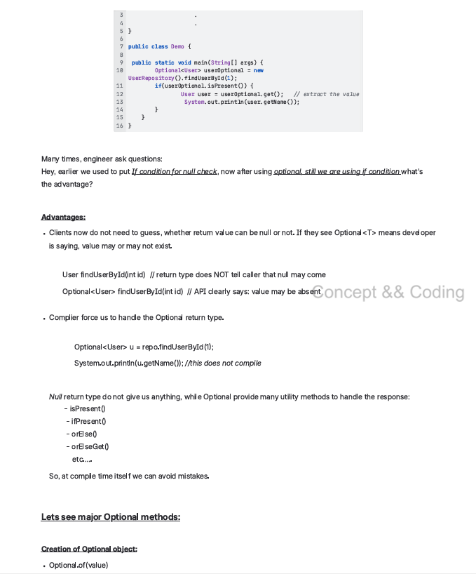

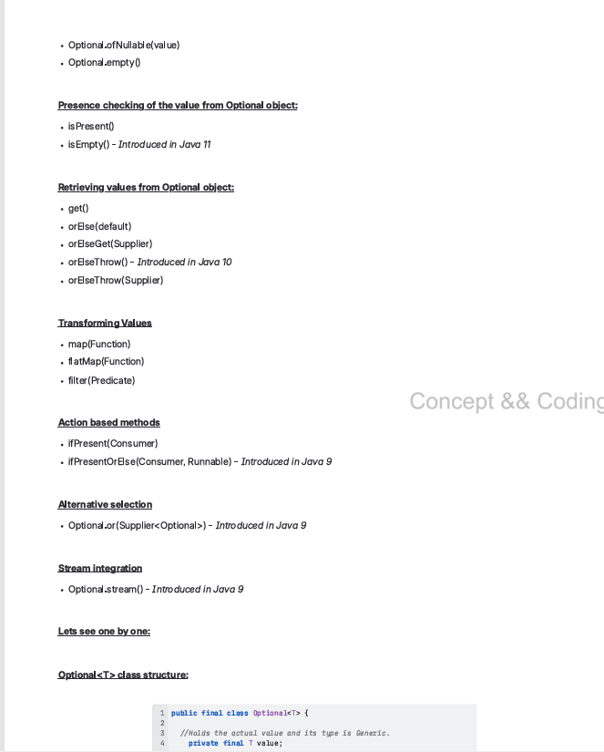

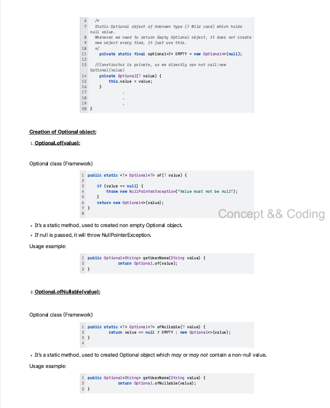

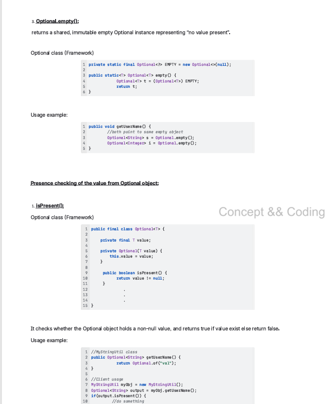

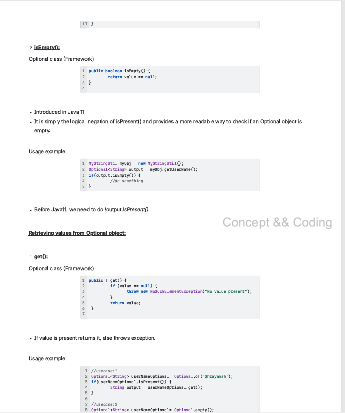

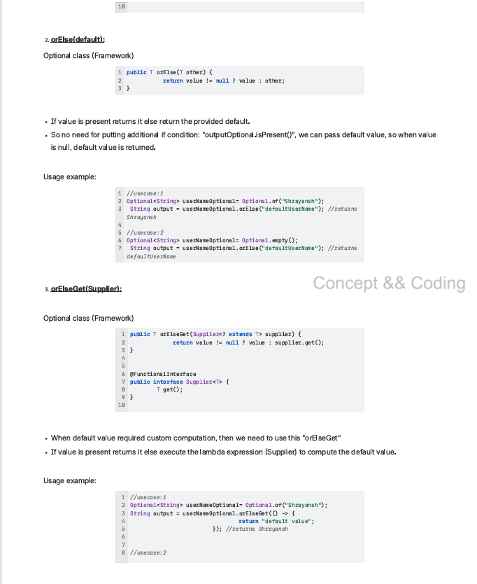

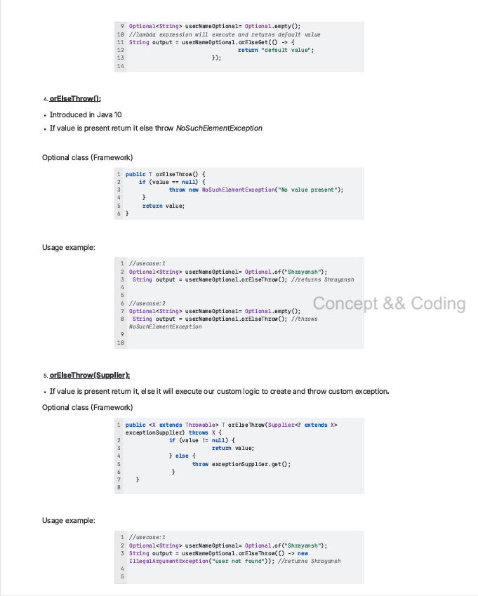

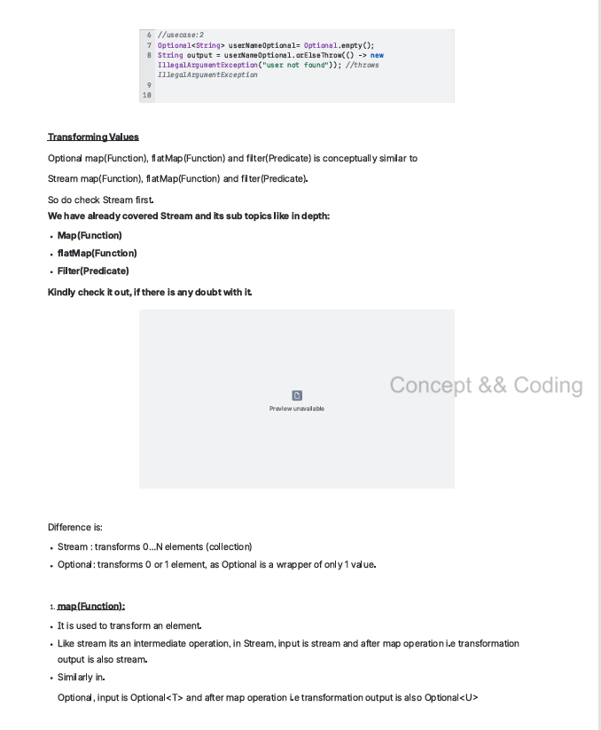

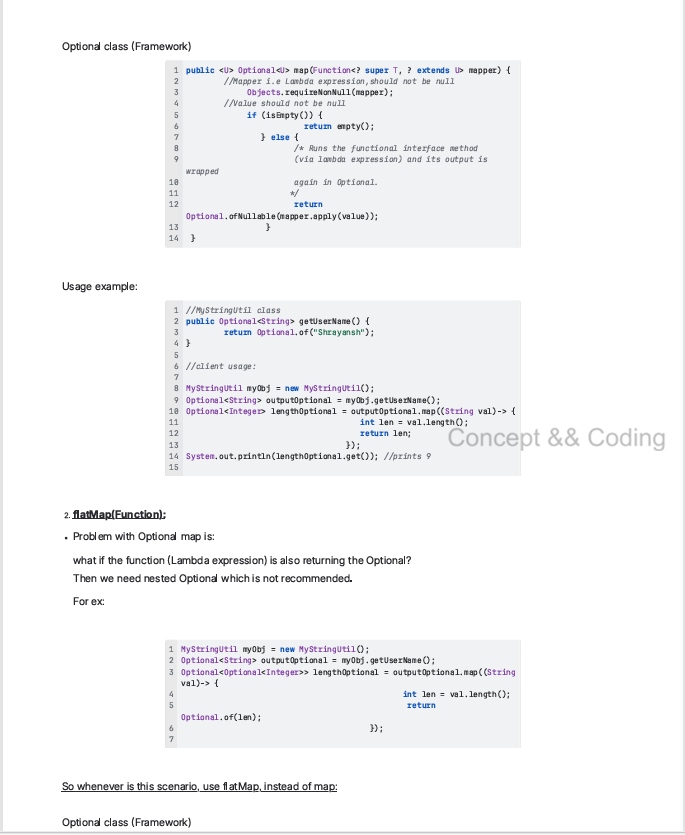

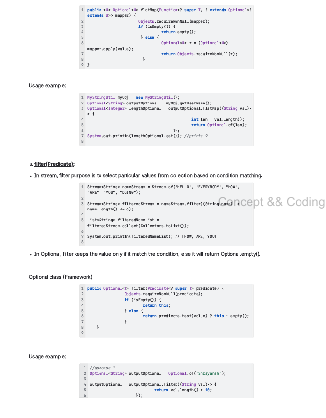

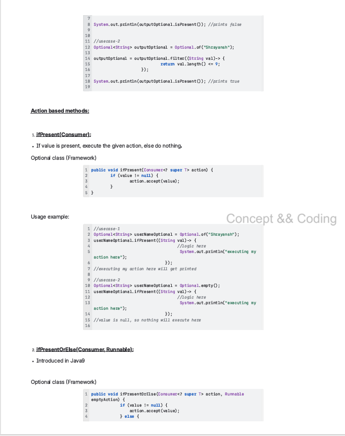

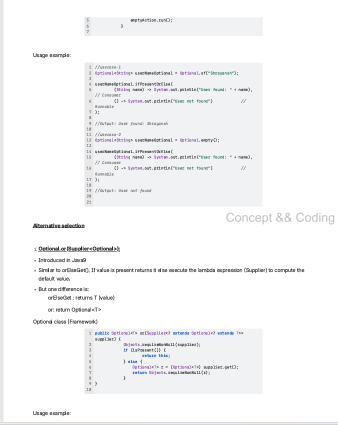

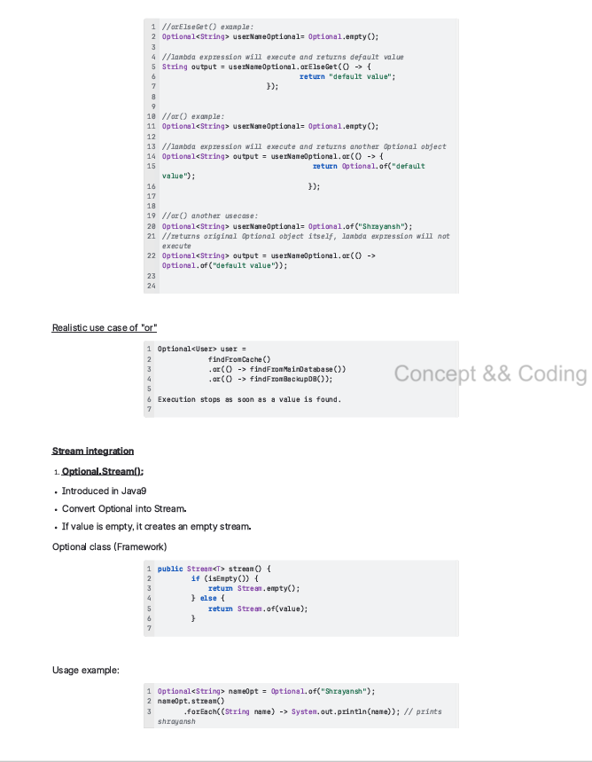

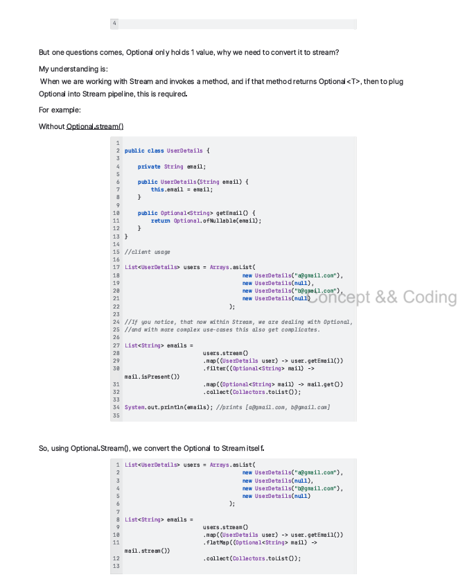

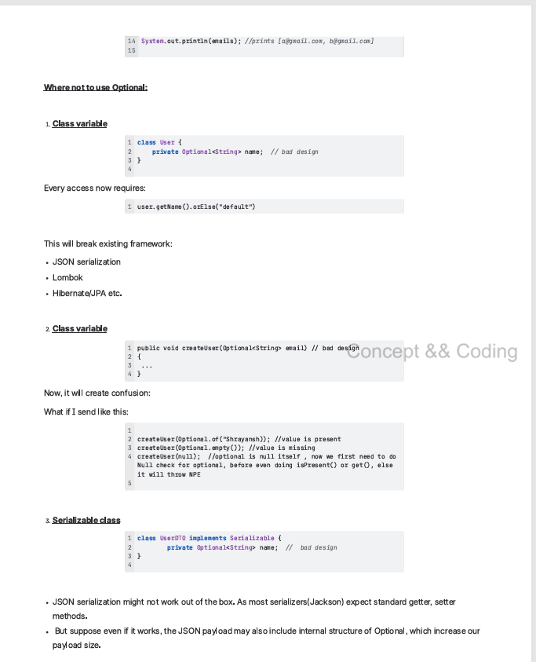

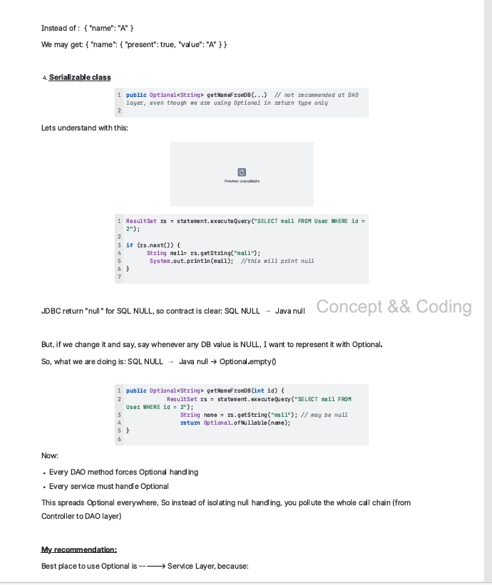

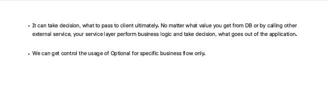