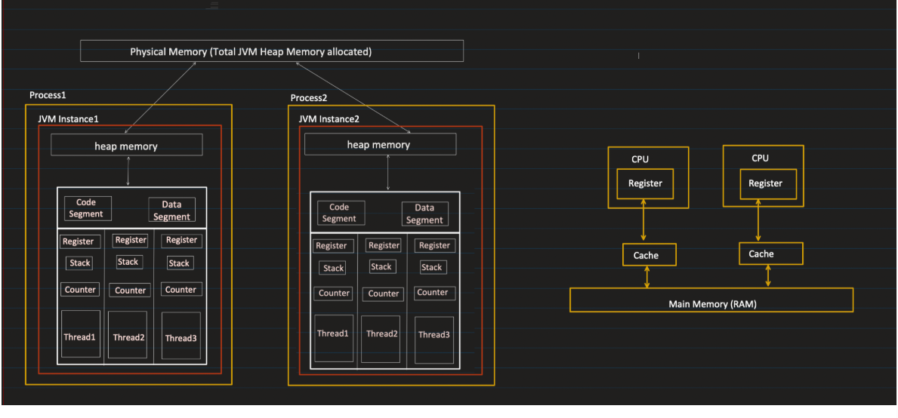
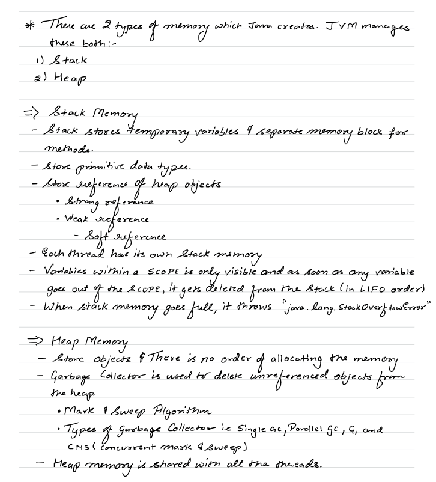
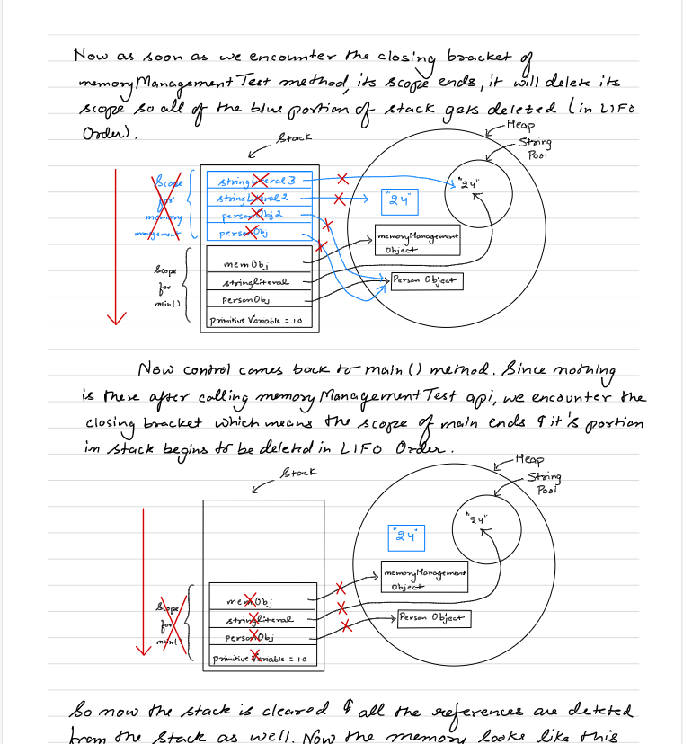
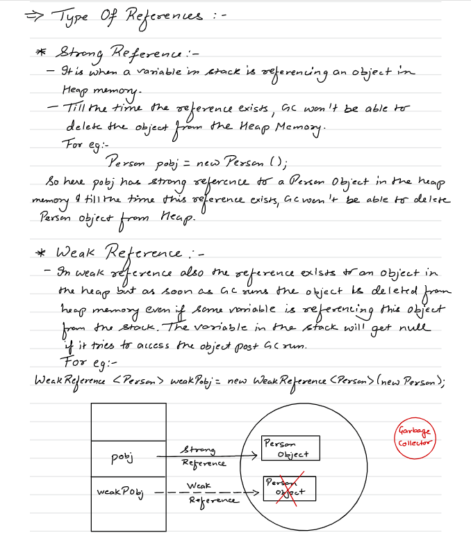
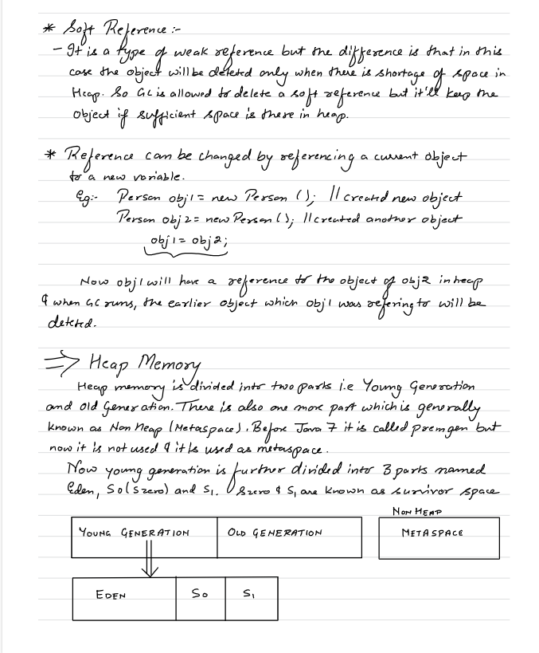
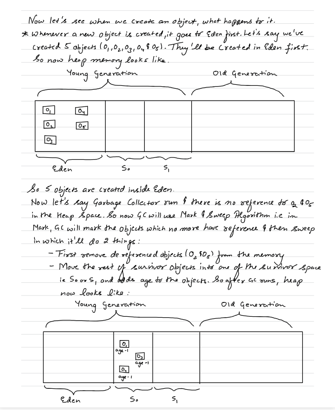
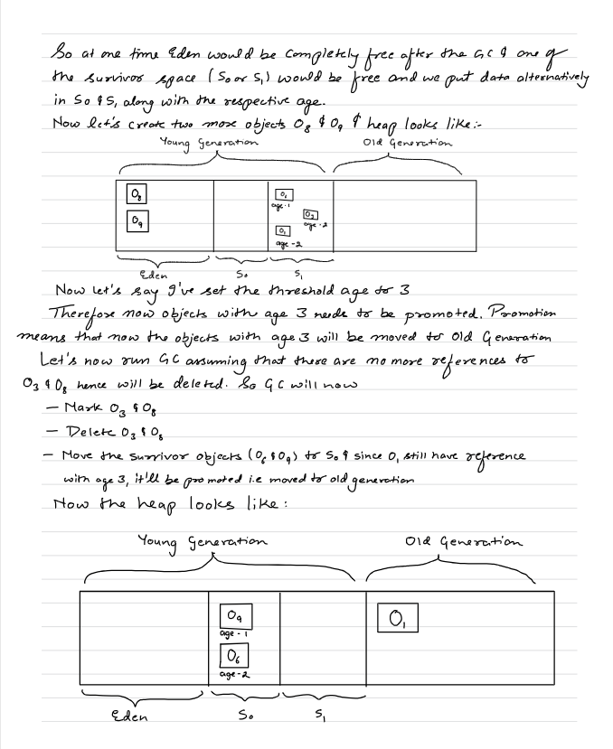
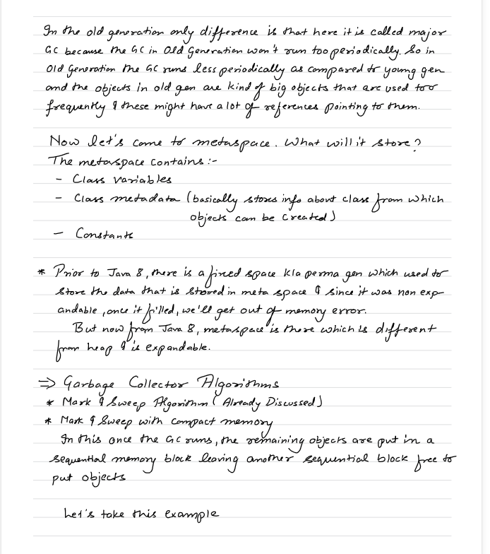
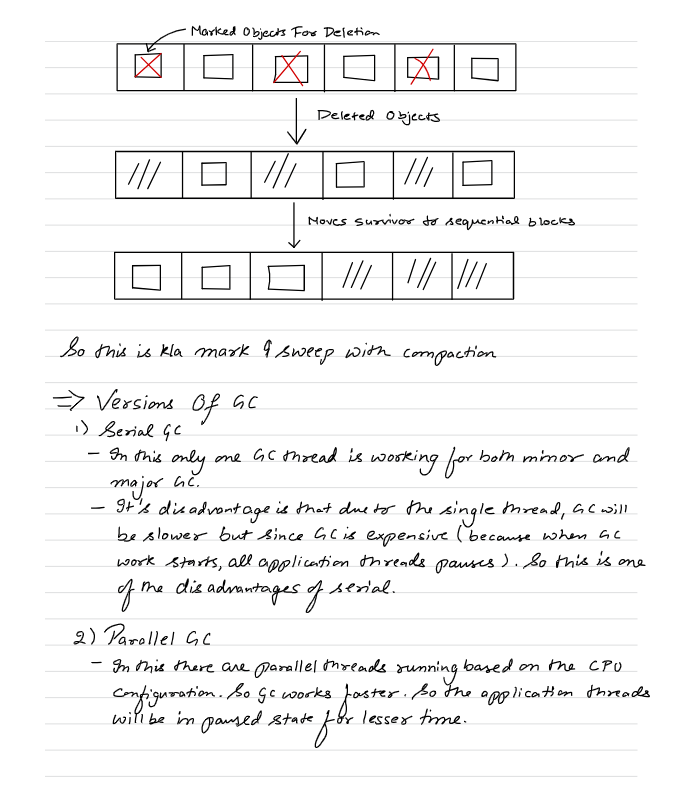

                JVM
                │
    ┌───────────┴───────────┐
    │                       │
Class Loader          Runtime Data Areas
Subsystem                   │
│                       │
│               ┌───────┴────────┐
│               │                │
│             Heap            Method Area
│               │                │
│             Stack          Metaspace
│
└──────────────→ Execution Engine
│
┌─────┼─────┐
│     │     │
Interpreter JIT  GC
│
Code Cache


JVM Memory
│
├── Heap (Shared)
│     ├── Young Gen (Eden + S0 + S1)
│     ├── Old Gen
│     └── String Pool
│
├── Method Area (Shared)
│     ├── Class Metadata
│     ├── Method Metadata
│     ├── Static Variables
│     ├── Runtime Constant Pool
│     └── Bytecode
│
├── Stack (Per Thread)
│     └── Stack Frames
│
├── PC Register (Per Thread)
│
└── Native Method Stack




Process Memory
│
├── JVM Managed Memory
│     ├── Runtime Data Areas
│     │     ├── Heap
│     │     ├── Metaspace
│     │     ├── Stack
│     │     ├── PC Register
│     │     └── Native Stack
│     │
│     ├── Code Cache
│     ├── Direct Memory
│     └── GC Structures
│
└── Other OS Memory


**_RUNTIME DATA AREAS :_**

1. Stack : 


---> Each thread in Java consists of seperate Stack
---> Stack is not shared between 2 threads
---> Whenever a method is called a new stack frame is created

---> A Stack Frame is: A single method execution block inside the stack.

Top of Stack
┌──────────────┐
│ methodB()    │  ← Stack Frame
├──────────────┤
│ methodA()    │  ← Stack Frame
├──────────────┤
│ main()       │  ← Stack Frame
└──────────────┘
Bottom of Stack


Each stack frame contains:

    1️⃣ Local Variables
    2️⃣ Method Parameters
    3️⃣ Operand Stack Operand Stack – temporary storage for computation.
    4️⃣ Return Address(the method which it needs to return)
    5. Reference variables

         --> Strong reference
         --> Weak reference
         --> Soft reference

        ---> Reference variables hold the address of the objects like below
       User u = new User()
        u → 0x7f12a0

    The return variable is added inside the caller method's stack frame befor this method gets popped
    Variables are visible only within the scope (that is within the stack frame)
    When goes out of stack(method gets completed) variables gets deleted in LIFO order


When stack memory becomes full it throws java.lang.StackOverFlow error


🔹 1️⃣ Strong References (Default)

What it is: The normal references you use every day.

Syntax:

        User u = new User();  // strong reference

GC Behavior:

        As long as a strong reference exists, object is never garbage collected.

Example:

    User u = new User();
    u = null;  // Now object is eligible for GC

Default in Java, used 99% of the time.

🔹 2️⃣ Soft References

    Purpose: Useful for caching objects.

Syntax:

    SoftReference<User> softUser = new SoftReference<>(new User());

GC Behavior:

    Object is collected only if JVM needs memory
    Otherwise, it stays in memory

Use Case:

    Caches that can be cleared if memory is low, e.g., image cache, computed values

Example:

    SoftReference<byte[]> cache = new SoftReference<>(new byte[1024*1024]);
    System.gc();  // JVM may or may not clear it depending on memory

🔹 3️⃣ Weak References

Purpose:

    Allow objects to be collected more aggressively than soft references.

Syntax:

    WeakReference<User> weakUser = new WeakReference<>(new User());

GC Behavior:

    Object is eligible for GC as soon as there are no strong references
    Used in maps or listeners where you don’t want memory leaks

Example:

    WeakHashMap<String, User> map = new WeakHashMap<>();
    map.put("key", new User());  // entry will disappear when key is no longer strongly referenced

🔹 4️⃣ Phantom References

For completeness (less commonly used):

    Purpose: Track objects after finalization but before actual memory is reclaimed

Syntax:

    PhantomReference<User> phantom = new PhantomReference<>(new User(), referenceQueue);

GC Behavior:

    Cannot get the object (get() always returns null)
    Mainly used to clean up resources manually


HEAP : 

    ---> A shared memory area where all Java objects and arrays are allocated at runtime.
    ---> It is managed by JVM Garbage Collector
    ---> Shared among all threads


| Item                          | Stored Where | Notes                              |
| ----------------------------- | ------------ | ---------------------------------- |
| Objects                       | Heap         | All instance variables live here   |
| Arrays                        | Heap         | Even primitive arrays              |
| String literals (String Pool) | Heap         | Inside special pool area           |
| Class instances               | Heap         | References to them stored in stack |


---> Garbage Collector is used to clean unreferenced heap objects

---> Heap is divided into 2 parts : Young Generation and Old Generation
---> Young Generation is divided into Eden , S0, S1(S0 and S1 are called survivor space)


Whenever we create an object newly the object is stored in eden
Whenever Garbage Collector runs it does something called mark and sweep algortihm

First it marks all the objects from young generation which doesnot have any reference , 
Then it removes the marked objects from memory 
Then it sweeps all the remaining objects from eden to S0 with age = 1
After removing the objects from memory and sweeping there will be holes in middle where memory is free so it does compaction i.e gps are filled with subsequent memory and the gaps are always at the end

The second time GC runs same thing happens when sweeping it also sweeps S0 to S1 with age = 2 and nextime S1 to S0 with incrementing ages

When the age reaches some threshold these objects are moved from young generation to old generation


This process of Garbage Collector doing mark and sweep in young generation is called minor Garbage collection


This process of Garbage Collector marking and removing objects in older generation is called major Garbage collection
Major gc occurs less frequently than minor gc

    When heap gets full it throws Out of Memory error


Types of GC;

1. Serial GC :

---> Only one thread is used for GC
----> GC is expensive since all other threads is passed when GC happens
----> If one thread is there will be more pause time

2. Parallel GC :


---> Multiple threads is used for GC
---> It will reduce the pause time very much lesser

3. COncurrent Mark and Sweep :

----> It tries to run concurrntly both GC thread and other threads but does not gaurantee 100%
---> It doesnot do compaction
--->Next allocation of a large object may fail if there’s no large enough contiguous space, even if total free memory is enough.

4. G1 Garbage COllection:

---> SImilar to Concurrent Mark and Sweep with compaction


🔹 1️⃣ Manual GC Invocation

In Java, you can hint to the JVM that you want garbage collection:

    System.gc();
    
    or
    
    Runtime.getRuntime().gc();

This does not guarantee that GC will run immediately.
It’s only a request, JVM may ignore it.
Modern JVMs generally manage GC automatically for efficiency.

🔹 3️⃣ When JVM Runs GC Automatically

    JVM triggers GC based on memory usage and garbage accumulation. Some common triggers:

1️⃣ Heap is getting full

    If Eden space (Young Generation) or Old Generation is full, JVM runs Minor or Major GC.

2️⃣ Allocation Failure

    When new cannot allocate enough contiguous memory in heap.

3️⃣ Soft Reference cleanup

    JVM may run GC to clear soft references if memory is low.


Java 9 and above uses G1 GC by default


--------------------------------------------------------------------------------------------------------------


## ⚙️ 2. **Runtime Data Areas**

This is the **memory layout** of JVM at runtime.  
It includes both **shared** and **thread-specific** areas.

### 🧮 A. Method Area (shared)

- Stores:

    - Class-level data (metadata)

    - Static variables

    - Method and field names

    - Runtime constant pool (literal and symbolic references)

- One per JVM.

- Garbage collected (in modern JVMs — part of **Metaspace** in Java 8+).
  ### 🔹 **2.1 Method Area (a.k.a Class Area / MetaSpace in Java 8+)**

- Stores **class metadata**, static variables, method bytecode, constant pool.

- Shared across all threads.

  ### ✔ **Static variable VALUES are stored in the HEAP.**

This surprises many people — but it is 100% correct for Java 8 and later
- The **value `10` of static variable `x` is stored in the Heap.**

- The **metadata “static int x” is stored in Metaspace** (because Metaspace stores class structure).

---

### 💾 B. Heap (shared)

- Stores **objects and arrays**.

- Common to all threads.

- Managed by **Garbage Collector (GC)**.


Divided into:

1. **Young Generation**

    - Eden + Survivor spaces (S0, S1)

    - New objects created here.

    - Minor GC happens frequently.

2. **Old (Tenured) Generation**

    - Long-lived objects.

    - Major GC occurs less frequently.

3. **Metaspace**

    - Stores class metadata (replaces PermGen since Java 8).


---

### 🧵 C. Java Stack (per thread)

- Stores **stack frames** for each method call.

- Each frame holds:

    - Local variables

    - Operand stack (for intermediate calculations)

    - Frame data (return address, etc.)


When a method call ends, its frame is **popped** off the stack.

🧠 **Errors:**

- `StackOverflowError`: if recursion is too deep.

- `OutOfMemoryError`: if stack cannot be expanded.


---

### 💻 D. PC (Program Counter) Register (per thread)

- Points to **current instruction** being executed in the method.

- If executing a native method → value is undefined.


---

### 🔧 E. Native Method Stack (per thread)

- Used for **native (non-Java)** methods written in C/C++.

- Supports JNI (Java Native Interface).


---

## 🧠 3. **Execution Engine**

This is the **heart of JVM**, responsible for actually **running bytecode**.

It has three key parts:

### (a) **Interpreter**

- Reads bytecode instructions **one by one** and executes them.

- Slow for repeated instructions.


### (b) **JIT (Just-In-Time) Compiler**

- Converts frequently executed bytecode (hot code) into **native machine code**.

- Greatly improves performance.

- Includes techniques like:

    - **Inlining** (replace method calls with body)

    - **Loop unrolling**

    - **Escape analysis**

    - **Dead code elimination**


### (c) **Garbage Collector (GC)**

- Reclaims memory of unreachable objects.

- Algorithms include:

    - Serial GC

    - Parallel GC

    - G1 GC

    - ZGC / Shenandoah (low latency)


---

## 🌉 4. **Java Native Interface (JNI)**

- Allows Java code to **interact with native code** (C/C++).

- Provides a bridge between JVM and OS-level libraries.


Example use: accessing hardware or optimized native libraries.

---

## 📚 5. **Native Method Libraries**

- Actual implementation of native methods required by the JVM.

- Typically `.dll`, `.so`, or `.dylib` files loaded during startup.


----------------------------------------------------------------------------------------------------------------------------------


🔹 1️⃣ What is Metaspace?

    Metaspace is a special area of memory in the JVM that stores class metadata.
    Introduced in Java 8 (replacing PermGen)
    Unlike PermGen, it lives in native memory (outside the heap)
    Managed by the JVM automatically
    No fixed size by default; can grow as needed, limited by OS memory

| Component                            | Description                                                                                       |
| ------------------------------------ | ------------------------------------------------------------------------------------------------- |
| **Class Metadata**                   | Information about loaded classes: methods, fields, modifiers, superclass, interfaces, annotations |
| **Method Metadata**                  | Bytecode for methods, method descriptors, and related info                                        |
| **Runtime Constant Pool**            | Class-level constants (strings, numbers, method references, etc.)                                 |
| **Static Variables**                 | Class-level static fields                                                                         |
| **Native pointers / auxiliary data** | JVM internal data structures for classes                                                          |


    Method Area = what the JVM conceptually requires to store class-level info.
    Metaspace = the physical implementation of Method Area in modern JVMs (Java 8+).

   Here only static variable metadat is present that is this class contains this staic variables
   Actual value is stored in heap in class Object

💡 Analogy:

    Method Area → blueprint of a house (concept)
    Metaspace → the actual land and building where the blueprint is realized


🔹 1️⃣ What is PC Register and COunters?
      
      CPU Register: Program Counter (PC) → points to next machine instruction (interpreter or JIT)
      JVM Counter: bytecodePC → tracks the next bytecode instruction 

        PC = Program Counter Register
        It is a small memory area per thread that stores the address of the current bytecode instruction being executed.
        Each thread in Java has its own PC register.

🔹 3️⃣ What Does It Store?

It stores:

        The address (or index) of the current bytecode instruction
        Only for Java methods
        If a thread is executing a native method, the PC register value is undefined.

🔹 What REALLY happens

Every Java thread has:

      CPU Program Counter (real hardware register)
      JVM Bytecode PC (a value stored inside the thread structure)

🔸 In Interpreter Mode

      Hardware level
      CPU PC → points to interpreter machine code
      JVM level
      Thread structure contains:
      
         bytecodePC → points to next bytecode instruction

The interpreter does:
      
      read bytecode[bytecodePC]
      increment bytecodePC
      execute handler

So:

      CPU executes interpreter code

Interpreter reads bytecode using bytecodePC

🔸 In JIT Mode

After compilation:

      Method converted to native machine code
      Stored in Code Cache
      CPU PC now jumps directly to compiled code

Now:

      There is no bytecode loop anymore for that method.


🔹 JVM-Level PC vs CPU PC
              ConceptName	            Points To	              Where Stored
CPU-level	Program Counter (PC)	Next machine instruction	CPU register
JVM-level	Bytecode PC / Counter	Next bytecode instruction	Thread’s JVM data structure


**_Code Segment And Data Segment :**_ 


      ---> Code Segment and Data Segment are not controlled by JVM rather managed directly by OS
      ---> When you run a Java code
      The OS loads:
         The JVM executable (compiled C/C++ machine code)
         That machine code goes into the code segment  
         It will be like read byte code of our app
         and it interprets byte code and has machine code instructions based on our code
         Interprettor contains machine code to handle data based on our byte code


      Your Java bytecode is stored in metadata, not in the code segment.
      
      Only when JIT happens:
      
            Your Java method gets compiled into machine code
            That machine code goes into Code Cache
            Not the original OS code segment


      ---> Data Segment contains the static and global variables of JVM executbblae(C/C++ code)
      
      🏗 What Happens During Interpretation?
      
      Suppose bytecode says:
      
      iadd
      That is just a number inside the .class file.
      CPU cannot execute iadd.
      So what happens?
      
         CPU executes JVM interpreter code (from code segment)
         Interpreter reads bytecode
         Interpreter switches on opcode
         Interpreter runs corresponding native logic
      
      
      🏗 Step 1: JVM Is Just a Native Program
      
      The JVM (for example java.exe on Windows or java on Linux) is:
      
            Written in C/C++
            Compiled by a C/C++ compiler
            Converted into machine instructions (0s and 1s)
            So it becomes a normal executable file like:
      
      java.exe
      
      At this point, it is just a binary file stored on disk.
      
      🧠 Step 2: When You Run java MyProgram
      
      When you type:java MyProgram
      
      The OS does this:
      
            Creates a new process
            Loads the java executable into memory
            Maps its sections into memory
      The memory layout looks like:
      
      Process Memory
      ---------------------------------
      Code Segment     ← JVM machine instructions
      Data Segment     ← JVM global variables
      Heap             ← dynamic memory
      Stack            ← thread stacks

        1️⃣ JVM itself is a native program
        Written in C/C++
        Loaded into:
        Code segment → JVM machine code
        Data segment → JVM internal data
        
        👉 So code segment = JVM code, NOT your Java code


      The important part:
      
         The Code Segment is marked as executable memory
      
      ⚡ Step 3: How CPU Starts Executing It
      
      Every process has an entry point.
      For JVM, that entry point is a native function like:
      int main(int argc, char* argv[])
      When OS loads the process:
      
         It sets the CPU instruction pointer (IP / RIP register)
         Points it to the JVM’s main function
         CPU begins executing machine instructions from the Code Segment
      
      So:
      
      CPU → fetch instruction from code segment
      CPU → decode
      CPU → execute
      
      This continues instruction by instruction.
      
      🔥 Step 4: Inside JVM Execution
      
      Now JVM native code starts running.
      
      It does:
      
      Initializes memory areas (Heap, MetaSpace, Code Cache)
      Creates main Java thread
      Loads your .class file
      Starts interpreting bytecode
      So even when interpreting:
      
            CPU executes JVM machine instructions
            JVM reads bytecode
            JVM performs operation
      
      The CPU is always executing native JVM machine code.
      
      🧠 Extremely Important Realization
      
      The CPU never executes:
      
            Java source code ❌
            Bytecode ❌
      
      It executes only:
      
            Native machine instructions from executable memory

      
      🔥 1️⃣ Is Bytecode Ever Converted to Machine Code?
      
      It depends.
      
      ✅ If JIT is enabled (which it normally is)
      
      Then:
      
            Bytecode is converted into machine code
            by the JIT compiler.
            That machine code is stored in the Code Cache and executed directly by the CPU.
            So bytecode is sometimes converted to machine code.
      ✅ If Running Only in Interpreter Mode
      
      Then:
      
      Bytecode is NOT converted into machine code.
      
      Instead:
      
         CPU executes interpreter machine code
         Interpreter reads bytecode
         Interpreter performs actions
         No new machine code is generated for your method.


-----------------------------------------------------------------------------------------------------------------------------------


## 🧩 1. **Class Loader Subsystem**

Responsible for **loading class files into JVM memory**.

It goes through **three phases**:

### (a) **Loading**

- Loads `.class` files from disk, network, or JAR. to heap memory

- Converts bytecode into `Class` objects in memory.

- Uses **ClassLoader hierarchy**:

    1. **Bootstrap ClassLoader** – loads core Java classes (from `rt.jar` / `java.base`).

    2. **Extension (Platform) ClassLoader** – loads extension libraries (`lib/ext`).

    3. **Application (System) ClassLoader** – loads classes from your classpath.


📌 **Delegation Model:**  
Each class loader first delegates the loading request to its parent before trying itself — this prevents core classes from being overridden.

---

### (b) **Linking**

Ensures the class is **ready to use**.

1. **Verification:** Checks bytecode for security and format errors.  
   (e.g., illegal access, stack underflow/overflow)

2. **Preparation:** Allocates memory for static variables and sets default values.

3. **Resolution:** Replaces symbolic references (like class names) with direct references (like memory addresses).


---

### (c) **Initialization**

- Assigns **actual values** to static variables.

- Executes static blocks (`static { ... }`).


---


🔥 STEP 1 — Class Loading

When JVM first needs Person (for example new Person(...) or Person.population):

JVM does:

        Reads Person.class bytecode
        Creates metadata structure in Metaspace
        Creates a Class<Person> object in Heap
        Links them

Metadata contains :

        Person Metadata:
        
        Class name: Person
        Superclass: Object
        
        Fields:
        static int population
        String name
        int age
        
        Methods:
        <init>(String,int)
        sayHello()
        
        Runtime constant pool
        Field offsets
        Method table
        Bytecode


🔹 What Gets Created in Heap?

A special object:

Heap:

    Class<Person> object


+--------------------------------------+
|   Class<Person> object               |
|--------------------------------------|
| name = "Person"                     |
| superclass = Class<Object>          |
| classLoader = AppClassLoader        |
| pointer → Person metadata (Metaspace)
|                                      |
| static variable storage:             |
|     population = 0                   |
+--------------------------------------+


🔥 STEP 2 — Linking Phase

During linking:

        population → allocated
        default value = 0
        
        Still no constructor run.

        ✔ Memory for static variables is allocated
        ✔ Default values are assigned

🔥 STEP 3 — Initialization Phase

Now static initializers run.

If you had:

    static int population = 100;

JVM internally does:

    population = 100

This value is stored inside:  Class<Person> object but the value is refernced in metaspace  which in turn references heap if object

🔥 STEP 4 — Creating an Instance

Now: Person p = new Person("John", 25);

JVM does:

        Looks at Class<Person>
        Follows pointer to metadata
        Reads field layout
        Allocates memory in heap
Instance looks like:

Heap:

Person instance:
+------------------+
| name = "John"    |
| age = 25         |
+------------------+

Notice:

No metadata inside instance.
It uses metadata via Class object.


Example 2:


🔥 Example to Prove They Are Different

```java
class Demo {
static {
System.out.println("Initialized");
}

    Demo() {
        System.out.println("Object Created");
    }
}
```

Now:

System.out.println(Demo.class);

👉 Loads class
👉 Links
❌ Does NOT initialize
❌ Does NOT create object

Now:

Class.forName("Demo");

Output:

Initialized

👉 Class initialized
❌ No object created

Now:

new Demo();

Output:

Initialized
Object Created

👉 Class initialized (if not already)
👉 Object created


----------------------------------------------------------------------------------------------------------------------------------


### **1️⃣ JVM Execution**

- JVM has its **own view of memory** (the heap for objects, stack for local variables).

- When a thread executes, JVM loads the variable it needs into the **CPU register** (via the JIT-compiled machine code).


---

### **2️⃣ CPU Register Update**

- CPU performs operations on the **register copy** of the variable.

- At this point:

    - **Only the executing core’s register** has the updated value.

    - **Other threads/cores don’t see it**.


---

### **3️⃣ Writing to CPU Cache**

- Eventually, CPU writes the updated value from its register into **L1/L2 cache** (still core-local).

- The cache **temporarily holds the updated value** before it goes to main memory.


---

### **4️⃣ Cache Coherence Protocol**

- Modern CPUs have protocols like **MESI** (Modified, Exclusive, Shared, Invalid) to maintain **cache coherence**.

- When the variable is in L1/L2 cache in **Modified state**, other cores’ caches that have the same variable get **invalidated**, so next time they read, they fetch the latest value from memory or updated cache.


---

### **5️⃣ Writing Back to Main Memory (Heap)**

- Eventually, the CPU writes the updated value to **main memory (Java heap)**.

- Timing is **not deterministic** unless:

    - You use `volatile` → forces immediate write to main memory and visibility to other threads.

    - You use `synchronized` → flushes caches on lock release/acquire.


---

### **6️⃣ Other Threads Reading**

- Another thread running on another core will:

    1. Check its **own cache** for the variable.

    2. If invalid or not present, fetch the **latest value from main memory or via cache coherence**.

- Without `volatile`/synchronization, **other threads may see stale values**.


### **Think of it like a classroom with notebooks**

1. **Main memory = blackboard in classroom**

    - Everyone can see it if they look at it.

2. **CPU cache / registers = each student’s personal notebook**

    - Each student copies what’s on the blackboard into their notebook to work faster.

3. **Updating a variable = student changes their notebook**


---

#### Step-by-step scenario

- **Thread A (Student A)** writes `x = 10`:

    1. Student A changes the value in **their notebook** first (CPU register / cache).

    2. They **haven’t copied it to the blackboard** (main memory) yet.

- **Thread B (Student B)** reads `x`:

    1. Student B looks in **their own notebook** first (cache).

    2. If they haven’t looked at the blackboard since Thread A’s change, they see the **old value** (stale).

- **When does it update on the blackboard?**

    - Only when Student A writes back (flushes cache or via memory barrier) does the main memory get updated.

    - Other students see the new value only **after they check the blackboard or their cache is updated**.


-----------------------------------------------------------------------------------------

## **Step 0: The Starting Point – JVM Memory**

- JVM stores variables in:

    1. **Heap** → shared memory for objects.

    2. **Stack** → private memory per thread for local variables.

- At this point, **nothing has touched the CPU yet**.


---

## **Step 1: JVM Loads Variable for Execution**

- When a thread executes bytecode, JVM **compiles it (JIT)** to machine code.

- The machine code **loads the variable from heap/stack into a CPU register** for computation.

- At this point:

    - **CPU register** holds the value.

    - Other threads still see the value in heap (or possibly stale in their caches).


---

## **Step 2: CPU Operates on Register**

- CPU executes instructions on the **register value**:

    - e.g., `x = x + 1`

- Changes happen **only inside the register**, fast and local.

- L1/L2 caches may eventually store this value, but **other cores don’t see it yet**.


---

## **Step 3: CPU Cache (L1/L2) Update**

- Registers often write back to **L1/L2 cache** (per-core).

- At this stage:

    - Core-local cache has the latest value.

    - Other cores may have **stale copies** in their caches.

- **Cache coherence protocol (MESI)** ensures:

    - Other caches invalidate old copies.

    - Future reads fetch updated value.


---

## **Step 4: Write-Back to Main Memory (Heap)**

- CPU may **flush cache lines** to main memory.

- Timing is **not immediate** — depends on:

    - CPU optimization

    - JIT-generated memory barriers

    - Java constructs (`volatile`, `synchronized`)

- After flushing:

    - Heap now has the updated value.

    - Other threads reading from main memory can see it.


---

## **Step 5: Other Threads Read the Value**

- Another thread executing on a different core:

    1. Checks **its own L1/L2 cache**.

    2. If the cache is invalid, fetches value from **main memory** (or via coherence protocol).

- Without `volatile` or `synchronized`, this thread may still read a **stale value** if the update hasn’t been flushed yet.


---

## **Step 6: Ensuring Visibility**

- Java guarantees visibility when you use:

    - `volatile` → forces register/cache → memory write & memory barriers.

    - `synchronized` → flushes caches on lock release/acquire.

    - `Atomic*` classes → atomic read/write with memory semantics.


---

## **Full Flow Diagram (Conceptual)**

```
JVM Memory (Heap/Stack)
        │
        ▼  (load)
CPU Register (per-thread/core)
        │
        ▼  (compute)
CPU L1/L2 Cache (per-core)
        │
        ▼  (cache coherence + write-back)
Main Memory (Heap)
        │
        ▼  (other thread reads)
Other Thread CPU Register → L1/L2 Cache

```

---

### ✅ **Key Points**

1. **Registers and L1/L2 cache are core-local**, so updates are **not instantly visible** to other threads.

2. **Stale values happen** when a thread reads from its cache/register before the write-back occurs.

3. **Main memory (heap)** is shared, but writes to it are **deferred** for performance.

4. **Volatile, synchronized, Atomic** enforce immediate visibility.


---

If you want, I can make a **visual diagram showing two threads on two cores, with registers, caches, heap, and the stale value scenario** — it makes the whole flow crystal clear.

Do you want me to do that?

##### You said:

we have jvm registers right why thatisnot mntioned

###### ChatGPT said:

Ah! Yes, you’re right — sometimes people talk about “JVM registers,” but let’s clarify what that really means and where it fits in the flow.

---

### **1️⃣ What JVM Registers Are**

- **JVM registers** are a **conceptual/virtual thing inside the JVM**:

    - When the JVM interprets bytecode, it uses a **stack-based model**.

    - The “registers” in this context are **operand stack slots and local variables in the stack frame**.

    - They are **not physical CPU registers** — just JVM’s internal bookkeeping.


---

### **2️⃣ How JVM Registers Map to CPU Registers**

1. JVM bytecode execution:

    - JVM “registers” (local variables, operand stack) hold values **logically**.

2. JIT compilation:

    - The JIT compiler converts bytecode into **native machine code**.

    - JVM registers are then **mapped to physical CPU registers** for execution.

    - Some may stay in CPU registers, others may spill to CPU cache or memory if needed.


So “JVM registers” **exist at the JVM level**, but the actual computation happens in **CPU registers**.

---

### **3️⃣ Updated Flow Including JVM Registers**
```
JVM Registers (stack frame / local variables)
        │  (JIT loads)
        ▼
CPU Registers (per-thread/core)
        │  (compute)
        ▼
CPU L1/L2 Cache (per-core)
        │  (cache coherence / write-back)
        ▼
Main Memory (Heap)
        │
        ▼
Other Thread CPU Registers / Cache / Heap read

```

- JVM registers are **virtual**, exist **inside the JVM stack frame**, and are **mapped to CPU registers** during execution.

- If you skip this mapping, it looks like JVM just “writes straight to CPU registers,” which is not exactly accurate.

------------------------------------------------------------------------------------


| Memory Region          | Purpose                                       | Shared/Thread-private | Location                    |
| ---------------------- | --------------------------------------------- | --------------------- | --------------------------- |
| **Heap**               | Objects/arrays                                | Shared                | RAM, managed by JVM GC      |
| **Stack**              | Local variables, method calls                 | Thread-private        | RAM, per-thread             |
| **Data Segment**       | Static/global variables                       | Shared                | RAM, part of program memory |
| **Code Segment**       | Program instructions                          | Shared                | RAM, loaded by OS           |
| **Registers**          | Fast computation                              | Per-core              | CPU                         |
| **Metadata/Metaspace** | Class definitions, method info, constant pool | Shared                | Native memory outside heap  |


# 🔥 **1. Strong, Weak, Soft, Phantom References — Complete Explanation**

Java has **4 types of references**—they tell the Garbage Collector _how aggressively_ an object can be removed.

---

# ⭐ 1. **Strong Reference (Default)**

### ✔ What it is:

Normal references you create every day:

`Object obj = new Object();   // strong reference`

### ✔ GC Behavior:

- **Never collected** as long as a strong reference exists.

- Most powerful reference.

- Leads to **memory leaks** if unused objects are still strongly reachable.


### ✔ Example:

`List<Object> list = new ArrayList<>(); list.add(new Object());  // object CAN'T be GC’d`

📌 **If you forget to remove objects from collections → Memory leak.**

---

# ⭐ 2. **Weak Reference**

### ✔ Definition:

Garbage Collector **collects object immediately** when **no strong references** remain.

### How to create:

`WeakReference<MyObject> weakRef = new WeakReference<>(new MyObject());`

### ✔ When GC collects?

- Collected **as soon as memory is scanned**.


### ✔ Used For:

- WeakHashMap (keys are weak)

- Caches

- Avoiding memory leaks


### ✔ Real Use Case:

`WeakHashMap<Object, String> map = new WeakHashMap<>();`

If the key has no strong reference → entry automatically removed.

---

# ⭐ 3. **Soft Reference**

### ✔ Definition:

Object is collected **ONLY when JVM is about to run out of memory.**

### How to create:

`SoftReference<MyObject> softRef = new SoftReference<>(new MyObject());`

### ✔ GC Behavior:

- **Long-lived**

- GC removes them only if:

    - Heap memory is low

    - GC wants to free memory


### ✔ Use Case:

- Caching (LRU, memory-sensitive caches)

- Image caches (Android)


📌 Soft references survive more GC cycles than weak references.

---

# ⭐ 4. **Phantom Reference**

### ✔ Most advanced reference

### ✔ Collected **only after finalization**, but before memory is fully reclaimed.

### Cannot get object using `get()` → always returns null.

`PhantomReference<MyObject> phantomRef =     new PhantomReference<>(new MyObject(), referenceQueue);`

### ✔ Used For:

- Tracking object’s GC lifecycle

- Cleaning native memory (off-heap)

- Implementing resource deallocation frameworks


📌 You always need a **ReferenceQueue** with phantom references.

---

# 🎯 GC Strength Ranking (Strong → Weakest)

`Strong > Soft > Weak > Phantom`

GC frees memory in this order.

---

# 🧩 Example Comparison Table

| Type        | GC Behavior                                   | Good For                    |get() Works?|
|-------------|-----------------------------------------------|-----------------------------|---|
| **Strong**  | Never collected                               | Normal objects              |✔ Yes|
| **Soft**    | Collected when memory is low                  | Caches                      |✔ Yes|
| **Weak**    | Collected immediately (no strong refs)        | WeakHashMap, avoiding leaks |✔ Yes|
| **Phantom** | After finalization, before memory reclamation | Cleanup tasks               |❌ No|

---

# 🚨 **2. Memory Leaks in Java**

Memory leaks happen when objects are **no longer used** but still **strongly referenced**, so GC cannot remove them.

### Common Causes:

---

## ⭐ 1. Static Fields

Static fields live for the entire JVM lifetime → easiest source of leaks.

`public static List<Object> list = new ArrayList<>();`

---

## ⭐ 2. Long-Lived Collections

When objects are added but not removed.

- ArrayList

- HashMap

- ConcurrentHashMap

- Cache without eviction policy


---

## ⭐ 3. Listeners / Observers not unregistered

If you forget to unregister GUI listeners, thread listeners, callbacks.

---

## ⭐ 4. Inner classes holding outer class reference

Non-static inner classes automatically hold a reference to the outer class.

---

## ⭐ 5. Threads & ThreadLocals

If ThreadLocal’s value is never removed → leak.

---

## ⭐ 6. Poorly implemented Singletons

Singletons often hold strong references forever.


# ✅ **What is `finalize()` in Java?**

`finalize()` is a **method in the Object class** that the **Garbage Collector (GC)** _used to call_ **before destroying an object**.

Signature:

`protected void finalize() throws Throwable`

---

# ✅ **What does `finalize()` _do_?**

Originally, the idea of `finalize()` was:

- If an object is about to be garbage-collected,

- JVM gives the object **one last chance** to clean up resources (like closing files, sockets, DB connections).


So, you could override it like:

`@Override protected void finalize() throws Throwable {     System.out.println("Object is being destroyed…"); }`

Then GC would call this method **before deleting the object** from memory.


# **2. What happens if you don’t close them**

1. **Resource leak occurs**

    - The object may eventually be garbage-collected.

    - But the **underlying resource** (file handle, socket, native memory) may remain **open until finalization** or JVM shutdown.

2. **Delayed cleanup**

    - GC may call `finalize()` if defined (deprecated now).

    - Cleanup is **unpredictable and slow**.

3. **Resource exhaustion**

    - If your program opens many files/sockets and doesn’t close them:

        - `java.io.FileNotFoundException: Too many open files`

        - `OutOfMemoryError` if off-heap memory is leaking

        - Application may crash or become unresponsive

---

# ⚠️ **BUT… finalize() is broken and dangerous**

And that’s why it is **deprecated in Java 9** and **removed in Java 18**.

Here’s why:

---

## ❌ 1. **No guarantee that finalize() will run**

GC _may choose not to call it at all_.

If JVM shuts down early → finalize never runs.

Nothing is predictable.

---

## ❌ 2. Finalize causes **performance issues**

Objects with `finalize()` go into a special queue called **Finalization Queue**, delaying garbage collection.

GC has to:

1. Detect object eligible for GC

2. Move it to finalizer queue

3. Call `finalize()` in a separate thread

4. Wait for completion

5. THEN collect it


This makes GC _much slower_.

---

## ❌ 3. Can cause **resurrection**

Inside finalize(), you can "revive" the object:

`static MyObject ref;  @Override protected void finalize() {     ref = this; // Object becomes reachable again! }`

Now GC has to track it again → **complex + dangerous**.

---

## ❌ 4. Can cause **memory leaks**

If finalize takes time, objects remain in memory waiting for finalization → memory leak.


# ⭐ **1. What is a Phantom Reference?**

A **PhantomReference** in Java is:

- The **weakest type of reference**.

- Always returns **null** from `get()`.

- Used **only to know when an object is _about to be garbage-collected_**.

- Works **together with a ReferenceQueue**.


> It is **not for accessing the object** — it’s for **cleanup and lifecycle notification**.


1️⃣ What is finalize()?
finalize() is a method in java.lang.Object that is called by the Garbage Collector (GC) before reclaiming an object’s memory.
Signature:
protected void finalize() throws Throwable
Purpose: to give the object a last chance to clean up resources before GC.
2️⃣ Example
class MyResource {
@Override
protected void finalize() throws Throwable {
System.out.println("Finalize called for MyResource");
super.finalize();
}
}

public class FinalizeDemo {
public static void main(String[] args) {
MyResource res = new MyResource();
res = null; // make object eligible for GC

        System.gc(); // suggest GC
        System.out.println("End of main");
    }
}

Possible Output:

End of main
Finalize called for MyResource

Note: System.gc() is just a hint. The JVM may not run GC immediately.

3️⃣ Important Points About finalize()
No guarantee of execution
GC may never call finalize() before program exits.
It’s unreliable for critical resource cleanup (like closing files or DB connections).
Performance overhead
Objects with finalize() take longer to be collected because GC does extra work.
Dangerous if misused
Can resurrect objects (make them reachable again), which can cause memory leaks.
Deprecated in Java 9+
It’s officially deprecated because there are better alternatives:
try-with-resources for AutoCloseable objects
Cleaner / PhantomReference for more controlled cleanup

# ✅ **1. Using `System.gc()`**

`System.gc();`

- Suggests JVM to run garbage collection.

- JVM **may or may not** actually run GC immediately.

- It’s just a **hint** to the JVM.


### Example:

`public class GCDemo {     public static void main(String[] args) {         String str = new String("Hello");         str = null; // remove strong reference          System.gc(); // request GC          System.out.println("GC requested");     } }`

> The object may or may not be collected immediately.

---

# ✅ **2. Using `Runtime.getRuntime().gc()`**

`Runtime.getRuntime().gc();`

- Same as `System.gc()` (because internally System.gc() calls this).

- JVM may ignore it.


-------------------------------------------------------------------------------------------------------------------------------------------






















A PhantomReference is a special type of reference in Java that gives you a notification when an object is about to be collected, but does not allow you to access the object. It’s mostly used for advanced resource management. Let’s break it down with examples.


import java.lang.ref.PhantomReference;
import java.lang.ref.ReferenceQueue;

class MyObject {
@Override
protected void finalize() {
System.out.println("MyObject is being finalized");
}
}

public class PhantomExample {
public static void main(String[] args) {
ReferenceQueue<MyObject> queue = new ReferenceQueue<>();
MyObject obj = new MyObject();

        // Create a phantom reference
        PhantomReference<MyObject> phantomRef = new PhantomReference<>(obj, queue);

        // Clear strong reference
        obj = null;

        // Suggest GC
        System.gc();

        // Check the queue
        if (queue.poll() != null) {
            System.out.println("MyObject is ready to be GCed");
        } else {
            System.out.println("MyObject not yet GCed");
        }
    }
}

MyObject is the class.
obj is the instance of MyObject.
The phantom reference is tracking that particular instance obj, not the class itself.

So, the JVM doesn’t care about the class MyObject, it’s tracking the single object we created. When obj becomes unreachable (eligible for GC), the phantomRef will be enqueued into queue to let you know “this object is about to be collected.”
1️⃣ The ReferenceQueue

When you create a phantom reference, you provide a ReferenceQueue:

ReferenceQueue<MyObject> queue = new ReferenceQueue<>();
PhantomReference<MyObject> phantomRef = new PhantomReference<>(obj, queue);
queue is just a normal queue object provided by Java, specifically java.lang.ref.ReferenceQueue.
JVM uses this queue to notify you after the object becomes phantom reachable — meaning it’s eligible for GC but not yet collected.
2️⃣ When does it get enqueued?
You have an object obj:
MyObject obj = new MyObject();
PhantomReference<MyObject> phantomRef = new PhantomReference<>(obj, queue);
If obj is no longer strongly reachable (e.g., you do obj = null;) and the GC runs:
JVM notices that obj is only reachable through phantom references.
JVM cannot give you the object (phantom refs always return null on get()), but it enqueues the phantom reference itself into the ReferenceQueue you provided.


Bootstrap ClassLoader
Role: It is the primordial loader; loads the core Java classes (java.lang.*, java.util.*, java.io.*) from the JDK’s rt.jar (or modules in newer Java).
Implemented in native code, not Java.
Parent of all other class loaders.
Example:
ClassLoader cl = String.class.getClassLoader();
System.out.println(cl); // Output: null
Why null? String is loaded by the Bootstrap loader, which is not a Java object, so Java prints null.

Summary: Loads classes from JDK core libraries, no parent above it.

2. Extension ClassLoader (Platform ClassLoader in newer Java)
   Role: Loads classes from <JAVA_HOME>/lib/ext or modules outside core JDK but still part of JDK extensions.
   Parent: Bootstrap ClassLoader.
   Example:
   ClassLoader cl = javax.crypto.Cipher.class.getClassLoader();
   System.out.println(cl); // Typically sun.misc.Launcher$ExtClassLoader@xxxx
   These are classes provided as optional extensions to Java.
3. Application (System) ClassLoader
   Role: Loads classes from your classpath (e.g., compiled .class files, jars in -cp path).
   Parent: Extension ClassLoader.
   Example:
   ClassLoader cl = MyClass.class.getClassLoader();
   System.out.println(cl); // Usually sun.misc.Launcher$AppClassLoader@xxxx
   Hierarchy
   Bootstrap ClassLoader
   ↑
   Extension ClassLoader
   ↑
   Application ClassLoader
   Delegation model: Each loader asks its parent first before trying to load a class itself.


1. What is Code Cache?
   The Code Cache is a memory area in the JVM that stores compiled native code generated by the Just-In-Time (JIT) compiler.
   When Java code is executed, the JVM can:
   Interpret bytecode (slow path)
   Compile bytecode to native machine code (fast path), which is stored in the Code Cache.
   This improves performance because subsequent calls can execute directly as machine instructions, bypassing the interpreter.
2. Memory Location
   The Code Cache is part of the JVM process memory, separate from:
   Heap (objects)
   Stack (per-thread frames)
   Metaspace (class metadata)
   It is off-heap, meaning it’s not managed by the garbage collector like normal Java objects.
   Typical categories inside Code Cache (HotSpot JVM):
   Non-Profiled Code – freshly compiled code
   Profiled Code – optimized based on runtime profiling
   Non-entrant Code – code ready to be discarded
   NMethod storage – compiled native methods
3. Example: Viewing Code Cache Usage

You can check code cache usage using JVM flags:

java -XX:+PrintFlagsFinal -version | grep CodeCache

Common flags:

-XX:InitialCodeCacheSize=32m – initial size
-XX:ReservedCodeCacheSize=240m – max size
-XX:+PrintCodeCache – prints code cache stats at runtime
4. Why it matters
   If the code cache fills up, the JVM may de-optimize methods or flush old compiled code.
   Usually happens if you have large applications with many classes or hot methods.
   JVM automatically manages it, but can be tuned if needed.
   Summary of Memory Areas
   Area	Stores	Managed By
   Heap	Java objects	GC
   Stack	Method frames, local vars	Per thread, LIFO
   Metaspace	Class metadata	GC (class unloading)
   Code Cache	JIT-compiled native code	JVM, not GC
   Registers	CPU registers	CPU hardware

💡 Key point: Code Cache is JIT native code storage, off-heap, and resides in the JVM process memory, separate from heap/metaspace.

If you want, I can make a full JVM memory layout diagram showing Heap, Stack, Metaspace, and Code Cache so you can see exactly where each piece lives.

Do you want me to make that diagram?


🔍 Examples of what Extension Class Loader loads

In older Java (Java 8):

JARs placed inside:

$JAVA_HOME/lib/ext
Example libraries:
Security providers
Cryptography extensions (like JCE)
XML parsers