## 🧠 1. What is an `enum`?

`enum` (short for **enumeration**) is a **special Java type** that represents a **fixed set of constants**.
Think of it as a **type-safe way** to define a group of related values.

For example: directions, days of the week, states, colors, etc.

---

### ✅ Example

`public enum Day {     MONDAY, TUESDAY, WEDNESDAY, THURSDAY, FRIDAY, SATURDAY, SUNDAY }`

- Here, `Day` is an **enum type**.

- `MONDAY, TUESDAY, ...` are the **constants**.

- You cannot create any value outside these constants.

## Features of `enum`

1. **Type-safe**  
   You cannot assign an invalid value:

   `Day today = "FUNDAY"; // ❌ Compile-time error`

2. **Enum constants are objects**  
   Each constant is actually an **instance of the enum class**.

3. **Can have fields, constructors, and methods**


✅ Every enum constant is a **final, singleton, immutable instance**.

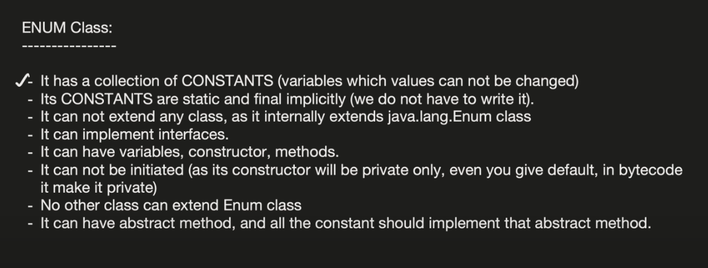

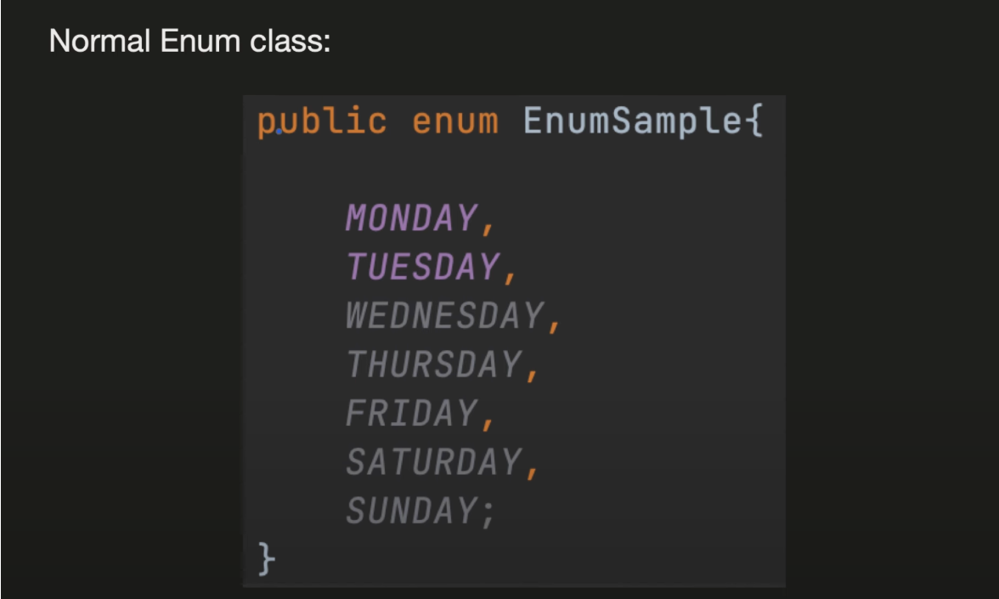

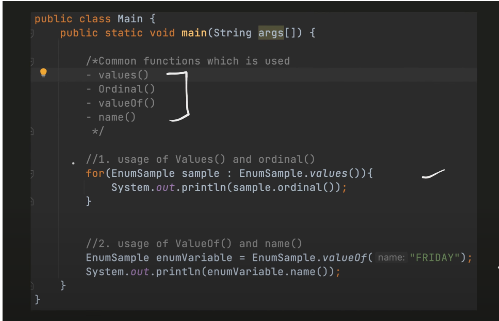

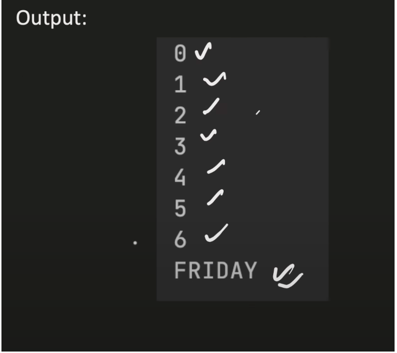

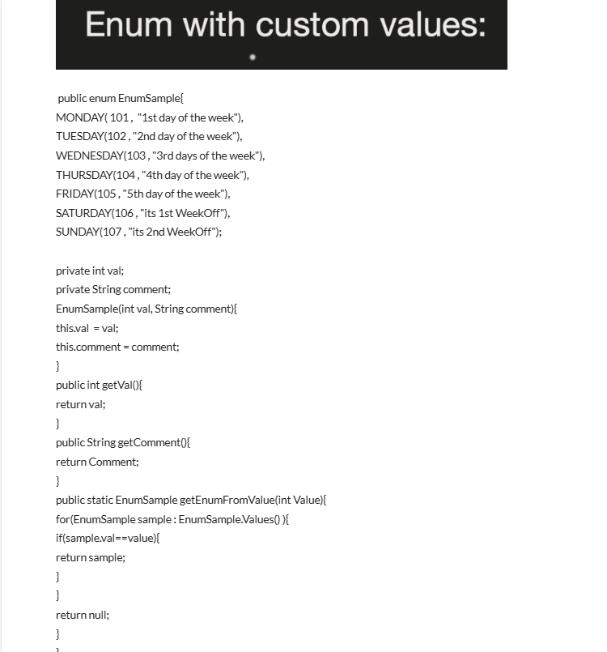

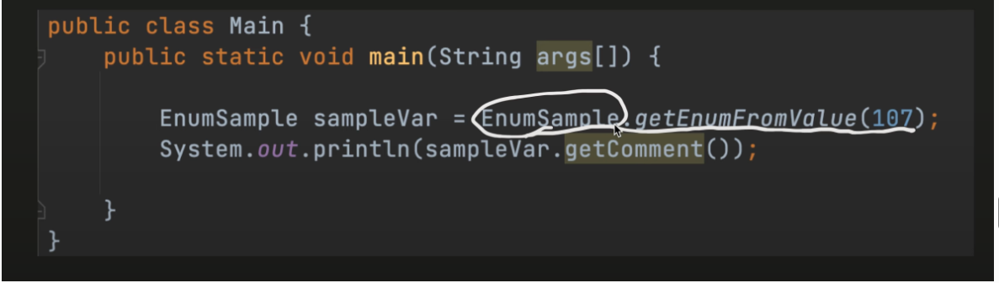

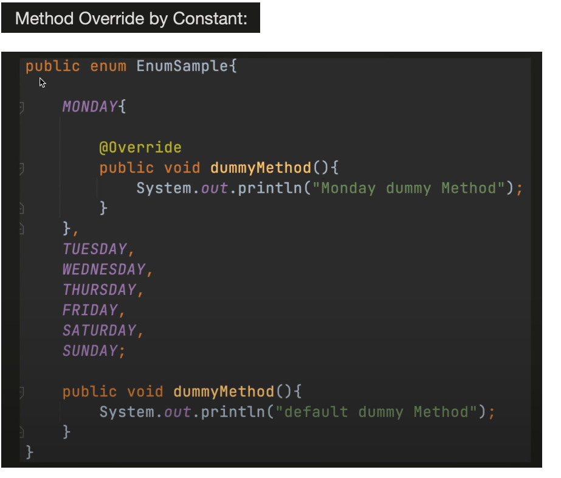

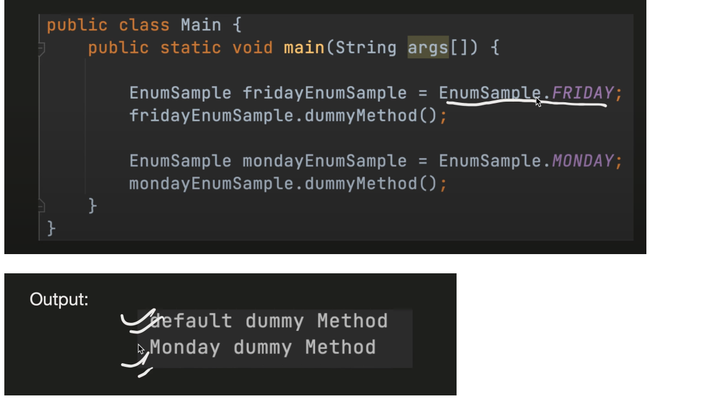

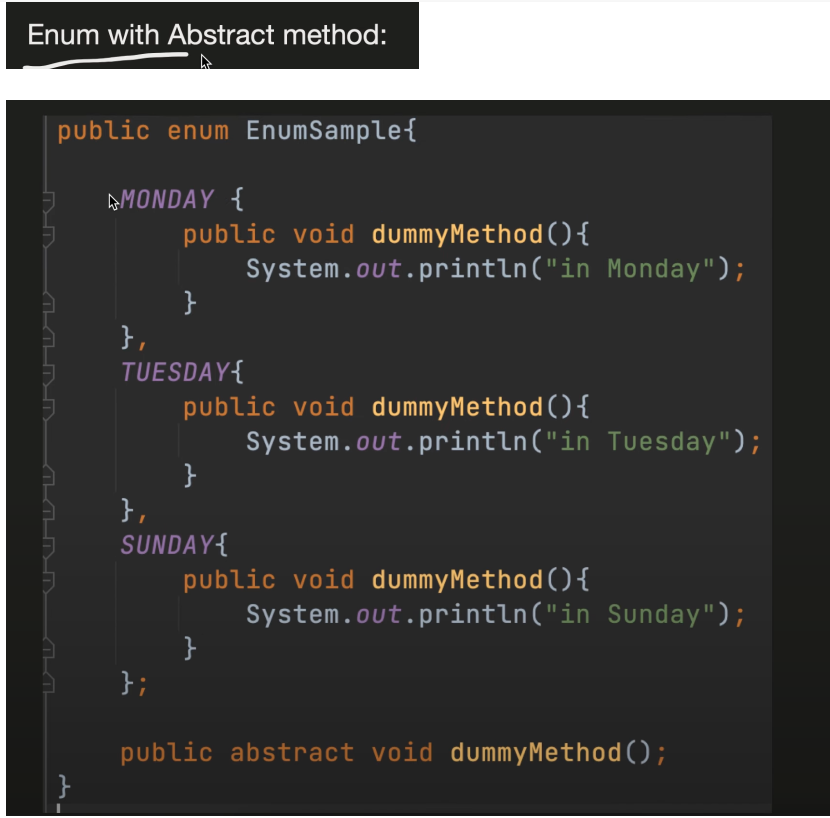

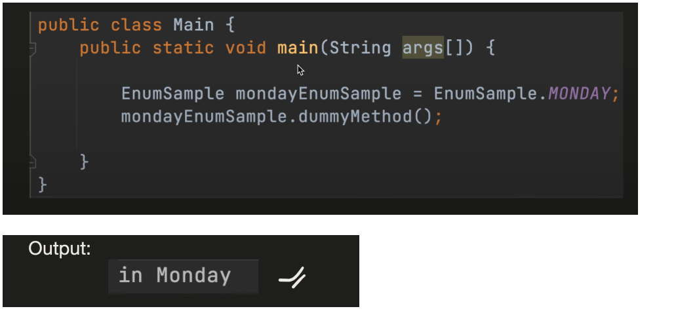

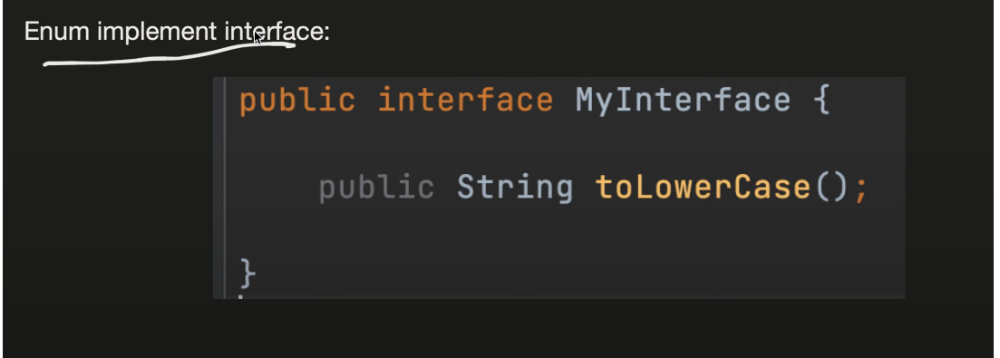

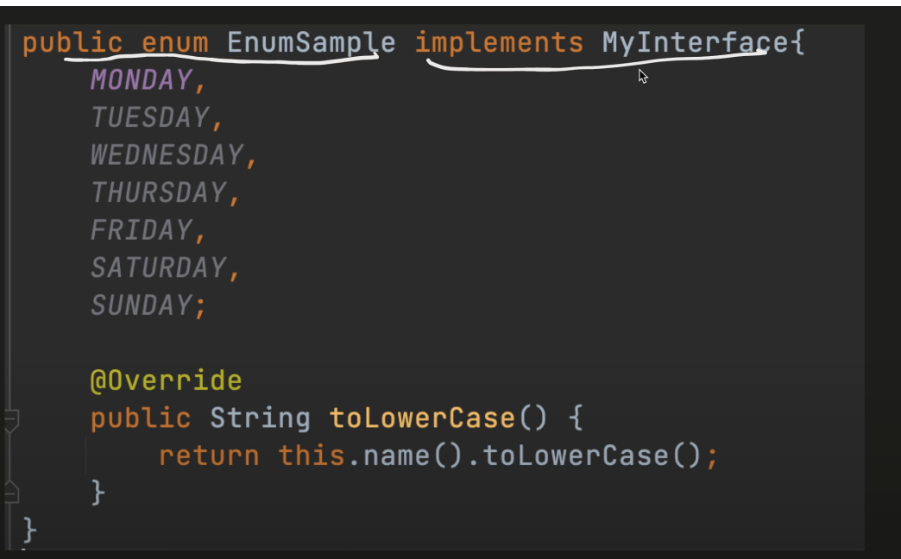

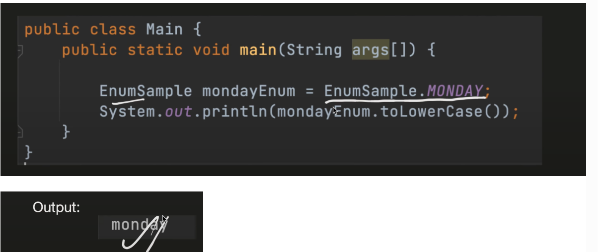

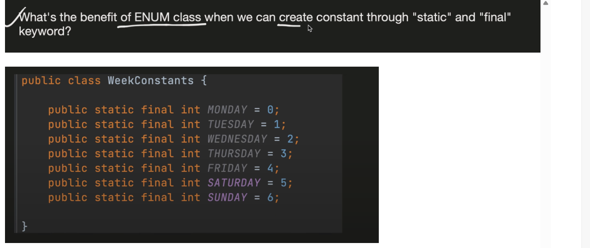

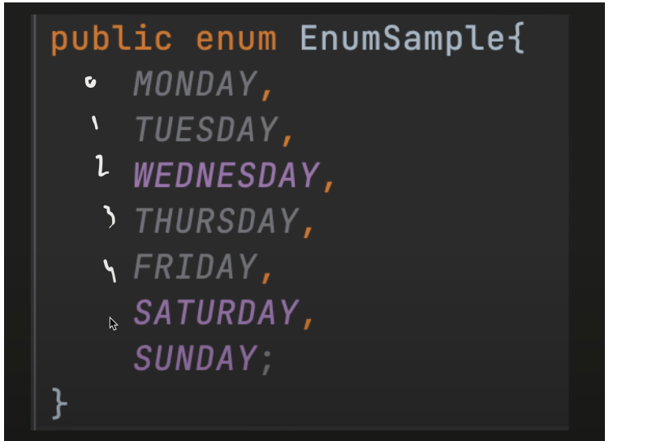

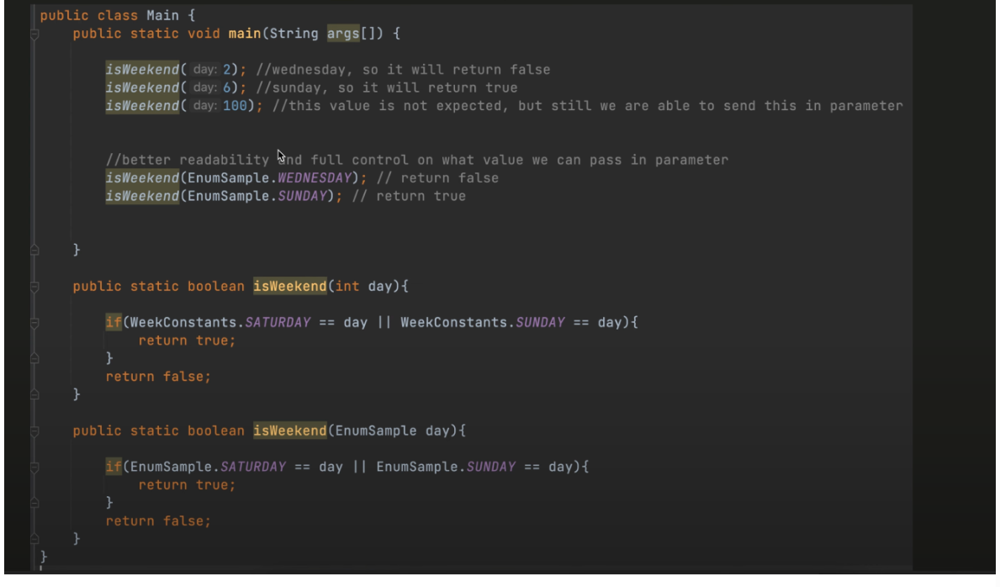


public enum ---> should be always public or default so that can e accessed from diff class

constructor should always be private ----> so that we cannot mannually create obj

Example:


```
enum Color {
    RED, GREEN, BLUE;
}

```


Internally this is like


```
public final class Color extends Enum<Color> {

    // 1. Public static final objects for each constant
    public static final Color RED = new Color("RED", 0);
    public static final Color GREEN = new Color("GREEN", 1);
    public static final Color BLUE = new Color("BLUE", 2);

    // 2. Private array holding all constants (used by values())
    private static final Color[] VALUES = { RED, GREEN, BLUE };

    // 3. Private constructor
    private Color(String name, int ordinal) {
        super(name, ordinal); // calls Enum constructor
    }

    // 4. values() method to get all constants
    public static Color[] values() {
        return VALUES.clone(); // returns a copy of constants array
    }

    // 5. valueOf() method to get constant by name
    public static Color valueOf(String name) {
        for (Color c : VALUES) {
            if (c.name().equals(name)) return c;
        }
        throw new IllegalArgumentException("No enum constant " + name);
    }
}

```


Every colour RED , GREEN, BLUE is an instance of Color

Every enum by default will have an ordinal that is value 0,1,2 in the above example
Java converts this enum into a **final class** that extends `java.lang.Enum`.


Enum with Custom Values

```
public enum EnumSample{  

		MONDAY( 101 ,  "1st day of the week"),  
		
		TUESDAY(102 , "2nd day of the week"),  
		
		WEDNESDAY(103 , "3rd days of the week"),  
		
		THURSDAY(104 , "4th day of the week"),  
		
		FRIDAY(105 , "5th day of the week"),  
		
		SATURDAY(106 , "its 1st WeekOff"),  
		
		SUNDAY(107 , "its 2nd WeekOff");  
		
		private int val;  
		
		private String comment;  
		
		EnumSample(int val, String comment){  
		
			this.val  = val;  
			
			this.comment = comment;  
		
		}  
		
		public int getVal(){  
		
			return val;  
		
		}  
		
		public String getComment(){  
		
			return Comment;  
		
		}  
		
		public static EnumSample getEnumFromValue(int Value){  
			
			for(EnumSample sample : EnumSample.Values() ){  
			
				if(sample.val==value){  
				
					return sample;  
				
				}  
			
			}  
		
		return null;  
		
		}  

}
```


## 🧩 2️⃣ The Hidden Constructor Parameters

Every enum constant automatically gets two **hidden parameters**:

|Hidden Field|Description|
|---|---|
|`name`|the name of the constant (`"NORTH"`)|
|`ordinal`|the order in which it’s declared (0 for first, 1 for second, etc.)|

So when the compiler creates:

`Direction.NORTH`

It actually becomes:

`new Direction("NORTH", 0);`

---

## 🧠 3️⃣ What If You Add Your Own Constructor?

When you do this:

```
public enum Direction {
    NORTH("Up"), SOUTH("Down");
    private final String desc;

    Direction(String desc) { this.desc = desc; }
}

```

Then **your constructor** is added _on top of_ the hidden one.  
But Java still calls `super(name, ordinal)` internally before your constructor runs.

So effectively:

```
private Direction(String name, int ordinal, String desc) {
    super(name, ordinal);
    this.desc = desc;
}

```
---

## 🔍 4️⃣ You Can’t Call the Constructor Yourself

Because:

- Enum constructors are **always private** (or package-private).

- You can’t do `new Direction()` — only the JVM creates them.

- The compiler instantiates them exactly once at class loading time.


That’s why all enum instances are **singletons**.


If Java allowed inheritance:

class ExtendedStatus extends Status {  // imagine this was allowed ❌
static final Status PENDING = ...
}

👉 Now the set is no longer fixed
👉 This breaks the core idea of enums


“Ordinal should NOT be used in business logic because order changes can break behavior.”

-------------------------------------------------------------------------------------


## 🧩 1️⃣ `System.out.println(d)` Calls `toString()`

When you print any object in Java:

`System.out.println(d);`

it actually calls:

`System.out.println(d.toString());`

---

## ⚙️ 2️⃣ `Enum` Class Defines `toString()`

All enums implicitly extend `java.lang.Enum`, and that class defines:

`public abstract class Enum<E extends Enum<E>> implements Comparable<E>, Serializable {     private final String name;     private final int ordinal;      public final String name() {         return name;     }      public String toString() {         return name;     } }`

So by default,  
👉 `toString()` just returns the `name` of the enum constant — which is `"NORTH"`, `"SOUTH"`, etc.

---

## ✅ 3️⃣ So These Are Equivalent

`System.out.println(d);          // Calls toString() → "NORTH" System.out.println(d.toString()); // Same → "NORTH" System.out.println(d.name());     // Same → "NORTH"`

All three print the same thing **by default**.

---

## ⚙️ 4️⃣ You Can Override `toString()` If You Want Custom Output

Example:
```
public enum Direction {
    NORTH("Upwards"), SOUTH("Downwards"), EAST("Rightwards"), WEST("Leftwards");

    private final String desc;

    Direction(String desc) {
        this.desc = desc;
    }

    @Override
    public String toString() {
        return desc;
    }
}

```


Now:

`System.out.println(Direction.NORTH); // Upwards System.out.println(Direction.NORTH.name()); // NORTH System.out.println(Direction.NORTH.toString()); // Upwards`

✅ You can see the difference now:

- `.name()` → always gives the exact identifier name (`"NORTH"`)

- `.toString()` → can be customized (default = same as `name()`)


---

## 🧠 5️⃣ Internal Flow (When You Call `valueOf()` and Print)

Here’s what happens line-by-line:

`Direction d = Direction.valueOf("NORTH");`

1. The compiler calls the auto-generated static method:

```
    public static Direction valueOf(String name) {
    return Enum.valueOf(Direction.class, name);
}

```

2. `Enum.valueOf()` looks up `"NORTH"` in the internal constant map.

3. It returns the same singleton instance `Direction.NORTH`.

4. When you print `d`, it calls `toString()` → `"NORTH"`.


----------------------------------------------------------------------------------------


## 🚨 **19. What happens if you clone an Enum?**

You **can’t clone** an enum.  
The `clone()` method is overridden in `Enum` to throw `CloneNotSupportedException`.


🧭 16. Can Enums be used in collections like HashMap or Set? Yes — and very efficiently. Because enum constants are immutable and have a fast hashCode

```
enum Day { MONDAY, TUESDAY, WEDNESDAY, THURSDAY, FRIDAY }

public class EnumMapExample {
    public static void main(String[] args) {
        EnumMap<Day, String> schedule = new EnumMap<>(Day.class);

        schedule.put(Day.MONDAY, "Start strong");
        schedule.put(Day.FRIDAY, "Finish work");

        for (Day d : schedule.keySet()) {
            System.out.println(d + " → " + schedule.get(d));
        }
    }
}

```


--------------------------------------------------------------------------------------


# 🧭 ENUM USAGE IN SPRING BOOT

---

## 1️⃣ **Representing Fixed States or Roles**

Enums are perfect for defining **constants** like:

- Order statuses

- User roles

- Payment methods

- Error codes


### Example – User Roles

`public enum Role {     ADMIN,     USER,     GUEST }`

### Usage in Entity:

```
@Entity
public class User {
    @Id
    @GeneratedValue
    private Long id;

    private String name;

    @Enumerated(EnumType.STRING)  // Important: store name, not ordinal
    private Role role;
}

```

👉 Why `EnumType.STRING`?

- `EnumType.ORDINAL` saves numbers (0,1,2...) — breaks if order changes.

- `EnumType.STRING` saves actual names ("ADMIN", "USER") — safer and readable.


---

## 2️⃣ **Mapping Enum in JPA / Hibernate**

### Example – Order Status

`public enum OrderStatus {     NEW,     PROCESSING,     COMPLETED,     CANCELLED }`

### Entity:

```
@Entity
public class Order {
    @Id
    @GeneratedValue
    private Long id;

    @Enumerated(EnumType.STRING)
    private OrderStatus status;
}

```

### Repository:
```
@Repository
public interface OrderRepository extends JpaRepository<Order, Long> {
    List<Order> findByStatus(OrderStatus status);
}

```


### Usage:

`List<Order> completed = orderRepository.findByStatus(OrderStatus.COMPLETED);`

✅ Type-safe  
✅ No magic strings  
✅ IDE autocompletion

---

## 3️⃣ **Enums in REST APIs**

### Controller Example

```
@RestController
@RequestMapping("/orders")
public class OrderController {

    @GetMapping("/status/{status}")
    public String getOrdersByStatus(@PathVariable OrderStatus status) {
        return "Orders with status: " + status;
    }
}

```

If you hit:

`GET /orders/status/COMPLETED`

You’ll get:

`Orders with status: COMPLETED`

🧠 Spring automatically converts the path variable `"COMPLETED"` to the enum constant `OrderStatus.COMPLETED`.

---

## 4️⃣ **Enums in Request Body (JSON)**

### Example DTO

```
`public class PaymentRequest {
    private PaymentType type;
    private double amount;
}

public enum PaymentType {
    CREDIT_CARD, DEBIT_CARD, UPI
}

```

### Controller

```
@PostMapping("/pay")
public String pay(@RequestBody PaymentRequest request) {
    return "Paid using " + request.getType();
}

```

### Request JSON:

`{   "type": "UPI",   "amount": 1500 }`

✅ Automatically converted from JSON string `"UPI"` → `PaymentType.UPI`.


------------------------------------------------------------------------------------------------------------------------------


🟢 What is EnumSet?

👉 EnumSet is a specialized Set implementation for enum types

EnumSet<Day> days = EnumSet.of(Day.MONDAY, Day.FRIDAY);
🎯 Key Idea

It is a Set designed ONLY for enums, optimized for performance.

⚙️ Why is it special?

👉 Internally:

Uses bitwise representation (bit vector)
Each enum constant → 1 bit
🔥 Why use EnumSet instead of HashSet?
Feature	EnumSet	HashSet
Performance	🚀 Very fast	Normal
Memory	Efficient	More
Type safety	Enum only	Any type
🎯 Interview Answer:

“EnumSet is faster and more memory-efficient than HashSet because it internally uses bitwise operations.”

🔵 What is EnumMap?

👉 EnumMap is a Map where keys are enums

EnumMap<Day, String> map = new EnumMap<>(Day.class);
map.put(Day.MONDAY, "Work");
🎯 Key Idea

It is a Map optimized for enum keys

⚙️ Why is it special?

👉 Internally:

Uses array indexed by enum ordinal
Very fast lookup
🔥 Why use EnumMap instead of HashMap?
Feature	EnumMap	HashMap
Performance	🚀 Faster	Slower
Null keys	❌ Not allowed	✅ Allowed
Internal	Array	Hashing
🎯 Interview Answer:

“EnumMap is faster than HashMap because it uses an internal array indexed by enum ordinal instead of hashing.”

🧠 When should you use them?
✅ Use EnumSet when:
You need a set of enum values

Example:

EnumSet<Day> weekend = EnumSet.of(Day.SATURDAY, Day.SUNDAY);
✅ Use EnumMap when:
You need mapping from enum → value

Example:

EnumMap<Day, String> schedule = new EnumMap<>(Day.class);


👉 EnumSet does NOT store ordinal as bits
👉 Instead:

It uses the ordinal to decide which bit position to set


⚙️ How it actually works

Suppose:

enum Day { MONDAY, TUESDAY, WEDNESDAY, THURSDAY }

Each enum has an ordinal:

Enum	Ordinal
MONDAY	0
TUESDAY	1
WEDNESDAY	2
THURSDAY	3
🔥 Internal Representation

EnumSet uses a binary number (bits):

Bit position:  3   2   1   0
Enum:        THU WED TUE MON
Example:
EnumSet.of(MONDAY, WEDNESDAY)

👉 Bit representation:

0101
MONDAY → bit 0 = 1
WEDNESDAY → bit 2 = 1


🔥 1. ADD → OR (|)
Example:

Add MONDAY and WEDNESDAY

MONDAY     → 0001
WEDNESDAY  → 0100
----------------
Result     → 0101

👉 Code idea:

bits = bits | (1 << ordinal);

👉 Explanation:

OR keeps existing bits + adds new one
0 | 1 = 1 → turns ON the bit
🧠 Interpretation

0101 means:

MONDAY ✔️
WEDNESDAY ✔️
🔥 2. REMOVE → AND (&) with NOT (~)
Example:

Remove MONDAY from 0101

Current     → 0101
Remove mask → ~(0001) = 1110
----------------------------
Result      → 0100

👉 Code idea:

bits = bits & ~(1 << ordinal);

👉 Explanation:

~ flips bits
AND removes that bit
🧠 Interpretation

0100 means:

Only WEDNESDAY ✔️
🔥 3. CONTAINS → AND check (&)
Example:

Check if MONDAY exists in 0101

Current → 0101
MONDAY  → 0001
----------------
Result  → 0001 (≠ 0 → present)

👉 Code idea:

(bits & (1 << ordinal)) != 0
Another Example:

Check TUESDAY:

Current → 0101
TUESDAY → 0010
----------------
Result  → 0000 (== 0 → not present)
🚀 Why this is FAST
❌ HashSet does:
hashCode()
bucket lookup
equals() comparison
✅ EnumSet does:
Bit shift (<<)
Bit OR (|)
Bit AND (&)

👉 These are CPU-level operations
👉 Extremely fast (nanoseconds)


🔵 EnumSet
Works ONLY with enums
Enums have:
Fixed number of values
Known at compile time
Each has an ordinal (0,1,2...)

👉 So Java can do:

Map each enum → bit position
Use bit operations
🔴 HashSet (normal set)
Works with any object
Objects can be:
Infinite
Dynamic
No fixed index

👉 So Java must use:

hashCode()
Buckets
equals()


⚙️ Internal Working (IMPORTANT)
Suppose:
enum Day { MONDAY, TUESDAY, WEDNESDAY }
Internally:
Object[] values = new Object[3]; // size = number of enum constants
Mapping:
Key	Ordinal	Index
MONDAY	0	values[0]
TUESDAY	1	values[1]
WEDNESDAY	2	values[2]
Example
map.put(Day.TUESDAY, "Meeting");

👉 Internally:

values[1] = "Meeting";
🚀 Operations (VERY FAST)
🔹 Put
values[key.ordinal()] = value;
🔹 Get
return values[key.ordinal()];
🔹 Contains
values[key.ordinal()] != null
⚡ Why it’s FAST
No hashing
No collisions
No equals() calls
Direct array access → O(1)


🔹 4. Enum comparison (IMPORTANT)
if (day == Day.MONDAY)  // ✅ preferred

👉 NOT .equals()

Why?

Enum instances are singleton
== is faster and safe


Can enum be cloned?

👉 ❌ No

💡 clone() throws exception


🧨 Trap 5
Day[] d1 = Day.values();
Day[] d2 = Day.values();

System.out.println(d1 == d2);

👉 ❌ false

💡 Different arrays


We can override toString of enum to return custom string instead of name, but we cannot override name() method of enum as it is final method in Enum class.