ABSTRACT CLASS :

In Java, an abstract class is a class that cannot be instantiated and is designed to be extended by other classes. 
It is used to achieve partial abstraction, where some methods are implemented while others are left for subclasses to define. 
An abstract class is declared using the abstract keyword. It may contain:

    Abstract methods (methods without a body)
    Concrete methods (methods with implementation)
    Constructors
    Instance variables
    Static and final methods

Properties of Abstract class

Observation 1

    In Java, just like in C++ an instance of an abstract class cannot be created, we can have references to abstract class type though. It is as shown below via the clean Java program.

```java
abstract class Base {
    abstract void fun();
}

// Class 2
class Derived extends Base {
    void fun()
    {
        System.out.println("Derived fun() called");
    }
}

// Class 3
// Main class
class Main {

    // Main driver method
    public static void main(String args[])
    {

        // Uncommenting the following line will cause
        // compiler error as the line tries to create an
        // instance of abstract class. Base b = new Base();

        // We can have references of Base type.
        Base b = new Derived();
        b.fun();
    }
}
```
Output
Derived fun() called

Observation 2
Like C++, an abstract class can contain constructors in Java. And a constructor of an abstract class is called when an instance of an inherited class is created. It is as shown in the program below as follows:


```java
abstract class Base {

    // Constructor of class 1
    Base()
    {
        // Print statement
        System.out.println("Base Constructor Called");
    }

    // Abstract method inside class1
    abstract void fun();
}

// Class 2
class Derived extends Base {

    // Constructor of class2
    Derived()
    {
        System.out.println("Derived Constructor Called");
    }

    // Method of class2
    void fun()
    {
        System.out.println("Derived fun() called");
    }
}

// Class 3
// Main class
class GFG {

    // Main driver method
    public static void main(String args[])
    {
        // Creating object of class 2
        // inside main() method
        Derived d = new Derived();
        d.fun();
    }
}
```
Output
Base Constructor Called
Derived Constructor Called
Derived fun() called


Observation 3
In Java, we can have an abstract class without any abstract method. This allows us to create classes that cannot be instantiated but can only be inherited. It is as shown below as follows with help of a clean java program.

```java

abstract class Base {

    // Demo method. This is not an abstract method.
    void fun()
    {
        // Print message if class 1 function is called
        System.out.println(
            "Function of Base class is called");
    }
}

// Class 2
class Derived extends Base {
    // This class only inherits the Base class methods and
    // properties
}

// Class 3
class Main {

    // Main driver method
    public static void main(String args[])
    {
        // Creating object of class 2
        Derived d = new Derived();

        // Calling function defined in class 1 inside main()
        // with object of class 2 inside main() method
        d.fun();
    }
}

```

Output
Function of Base class is called


Observation 4
Abstract classes can also have final methods (methods that cannot be overridden)

```java
abstract class Base {

    final void fun()
    {
        System.out.println("Base fun() called");
    }
}

// Class 2
class Derived extends Base {
  
}

// Class 3
// Main class
class GFG {

    // Main driver method
    public static void main(String args[])
    {
        {
            // Creating object of abstract class

            Base b = new Derived();
            // Calling method on object created above
            // inside main method

            b.fun();
        }
    }
}

```

Output
Base fun() called

Observation 5
For any abstract java class we are not allowed to create an object i.e., for an abstract class instantiation is not possible.


abstract class GFG {

    // Main driver method
    public static void main(String args[])
    {

        // Trying to create an object
        GFG gfg = new GFG();
    }
}
Output:

abstract class

Observation 6
Similar to the interface we can define static methods in an abstract class that can be called independently without an object.


```java
abstract class Helper {

    // Abstract method
    static void demofun()
    {

        // Print statement
        System.out.println("Geeks for Geeks");
    }
}

// Class 2
// Main class extending Helper class
public class GFG extends Helper {

    // Main driver method
    public static void main(String[] args)
    {

        // Calling method inside main()
        // as defined in above class
        Helper.demofun();
    }
}
```

Output
Geeks for Geeks
Observation 7
We can use the abstract keyword for declaring top-level classes (Outer class) as well as inner classes as abstract

```java
import java.io.*;

abstract class B {
    // declaring inner class as abstract with abstract
    // method
    abstract class C {
        abstract void myAbstractMethod();
    }
}
class D extends B {
    class E extends C {
        // implementing the abstract method
        void myAbstractMethod()
        {
            System.out.println(
                "Inside abstract method implementation");
        }
    }
}

public class Main {

    public static void main(String args[])
    {
        // Instantiating the outer class
        D outer = new D();

        // Instantiating the inner class
        D.E inner = outer.new E();
        inner.myAbstractMethod();
    }
}
```

Output
Inside abstract method implementation
Observation 8
If a class contains at least one abstract method, it must be declared as abstract; otherwise, a compile-time error occurs, since the class has an incomplete implementation and object creation must be restricted.

```java
import java.io.*;
// here if we remove the abstract 
// keyword then we will get compile
// time error due to abstract method
abstract class Demo {
    abstract void m1();
}

class Child extends Demo {
    public void m1() 
    { 
      System.out.print("Hello"); 
    }
}
class GFG {
    public static void main(String[] args)
    {
        Child c = new Child();
        c.m1();
    }
}
```

Output
Hello
Observation 9
If the Child class is unable to provide implementation to all abstract methods of the Parent class then we should declare that Child class as abstract so that the next level Child class should provide implementation to the remaining abstract method.

```java
import java.io.*;

abstract class Demo {
    abstract void m1();
    abstract void m2();
    abstract void m3();
}

abstract class FirstChild extends Demo {
    public void m1() {
      System.out.println("Inside m1"); 
    }
}

class SecondChild extends FirstChild {
    public void m2() {
      System.out.println("Inside m2"); 
    }
    public void m3() {
      System.out.println("Inside m3");
    }
}

class GFG {
    public static void main(String[] args)
    {
        // if we remove the abstract keyword from FirstChild
        // Class and uncommented below obj creation for
        // FirstChild then it will throw
        // compile time error as did't override all the
        // abstract methods

        // FirstChild f=new FirstChild();
        // f.m1();

        SecondChild s = new SecondChild();
        s.m1();
        s.m2();
        s.m3();
    }
}
```

Output
Inside m1
Inside m2
Inside m3


🔥 1. CLASS-LEVEL PROPERTIES

        ✅ Allowed Modifiers
        Modifier	               Allowed?	                                   Notes
        public	                     ✅	                                    Visible everywhere
        default	                     ✅	                                    Package-level
        protected	                 ❌	                                    Not allowed for top-level
        private	                     ❌                                  	Not allowed for top-level
        abstract	                 ✅	                                    Mandatory keyword
        final	                      ❌	                                Contradiction (cannot extend)
        static	                      ❌                                     (top-level)	Only for nested classes

❗ Key Rules
❌ Cannot instantiate:

    abstract class A {}
    A a = new A(); // ❌

✅ Can have reference:

    A a = new B();
🔥 2. METHODS IN ABSTRACT CLASS
🟢 Types of Methods Allowed
1️⃣ Abstract Methods

    abstract void m1();
Rules:

        No body
        Must be implemented by subclass
Cannot be:

    private
    final
    static

2️⃣ Concrete Methods

    void m2() {
    System.out.println("Hello");
    }
Rules:

    Can have any modifier:
    public, protected, default, private
    final, static

3️⃣ Static Methods

    static void m3() {}
Rules
    
    Belong to class, not object
    Cannot be overridden
    Can be hidden

4️⃣ Final Methods

        final void m4() {}
Rules:
    
    Cannot be overridden
    Used to prevent modification

5️⃣ Private Methods

    private void helper() {}
Rules:

    Not visible to subclass
    Cannot be overridden
    Used for internal logic

🔥 3. CONSTRUCTORS
✅ Allowed

        abstract class A {
        A() {
        System.out.println("Constructor");
        }
        }
Rules:

    Called when subclass object is created
    Used to initialize parent state

        ❌NOT ALLOWED
        Modifier	         Reason
        abstract	    Constructor must have body
        static	        Constructor is for object creation
        final	        Constructors cannot be overridden

🔥 4. VARIABLES (FIELDS)

✅ Allowed

    int x;
    static int y;
    final int z = 10;
Rules:
Can be:

    Instance variables
    Static variables
    Final variables
    Can be mutable
🔥 5. INHERITANCE RULES

    ✅ Must override abstract methods
    abstract class A {
    abstract void m1();
    }

    class B extends A {
    void m1() {} // required
    }
❗ If not:
        abstract class B extends A {}

👉 Subclass must also be abstract

🔥 6. OBJECT CREATION FLOW

    abstract class A {
    A() { System.out.println("A"); }
    }
    
    class B extends A {
    B() { System.out.println("B"); }
    }
Output:
A
B

👉 Parent constructor always runs first

🔥 7. IMPORTANT COMBINATIONS (INTERVIEW FAVORITES)

❌ Invalid

    abstract final class A {}   // ❌
    abstract static class A {}  // ❌ (top-level)
    abstract private class A {} // ❌ (top-level)
❌ Invalid methods

    abstract private void m(); // ❌
    abstract final void m();   // ❌
    abstract static void m();  // ❌
✅ Valid

    abstract class A {
    abstract void m1();
    final void m2() {}
    static void m3() {}
    private void m4() {}
    }
🔥 8. ABSTRACT CLASS CAN HAVE NO ABSTRACT METHODS

    abstract class A {
    void m() {}
    }

👉 Still valid ✔️

Why?

    To prevent instantiation but allow inheritance

🔥 9. ABSTRACT CLASS CAN IMPLEMENT INTERFACE
interface A {
void m();
}

abstract class B implements A {
// no implementation needed
}


-----------------------------------------------------------------------------------------------------------------------------------


## **What is an Interface in Java?**

An **interface** in Java is a **contract** or **blueprint** that defines **what methods a class must implement**, **but not how**.
It contains **abstract methods** (and optionally default or static methods) that a class **agrees to implement**.


1️⃣ **Abstraction** – Hides implementation details, shows only method definitions.  
2️⃣ **Loose Coupling** – Depends on interface, not concrete class (easy to switch implementations).  
3️⃣ **Polymorphism** – One interface type can refer to many implementing objects.  
4️⃣ **Multiple Inheritance (of Type)** – A class can implement multiple interfaces.  
5️⃣ **Code Reusability** – Common behavior defined once, reused across classes.


Interfaces cannot be private or protected because they are meant to be implemented by other classes, and restricting access would defeat their purpose. They can only be public or package-private (default).
But nested interfaces can be private or protected, as they are meant to be used only within the enclosing class.
Interfaces cannot be declared as final because they are meant to be implemented by other classes, and declaring them final would prevent that. However, nested interfaces can be declared as final, which means they cannot be extended by other interfaces, but they can still be implemented by classes.


Example:

    class Outer {
    
        private interface Inner {
            void test();
        }
    
        class Impl implements Inner {
            public void test() {
                System.out.println("Works!");
            }
        }
    }

Methods in an interface are implicitly public and abstract, so you cannot declare them as private or protected. The purpose of an interface is to define a contract that other classes can implement, and making methods private or protected would prevent other classes from accessing them.
Methods are abstract by default, so you cannot declare them as final. The whole point of an interface is to allow other classes to provide their own implementation of the methods, and making them final would prevent that.

from Java 8 onwards, interfaces can have default and static methods with implementations, but these methods are still implicitly public and cannot be private or protected.
SO from java 8 methods can also be final if they are default or static but abstract methods cannot be final because they need to be implemented by the implementing class and if we make them final then it will not allow to override them in the implementing class which is the main purpose of an interface to allow different implementations of the same method in different classes.
(can be called from default methods but not from static methods because static methods belong to the interface itself and cannot be overridden or called on instances of implementing classes, while default methods are inherited by implementing classes and can call other default methods in the same interface.)

Constructors are not allowed in interfaces because interfaces cannot be instantiated. They are meant to be implemented by classes, and the implementing classes are responsible for providing their own constructors if needed. Since you cannot create an instance of an interface directly, there is no need for a constructor in the interface itself.

Variables are ALWAYS constants
interface A {
    int x = 10;
}

👉 Internally:

    public static final int x = 10;
    Must be initialized
    Cannot be changed

abstract methods cannot be static since they must be implemented by the implementing class, and static methods belong to the interface itself rather than to instances of the implementing classes. If an abstract method were static, it would not be associated with any instance and could not be overridden by implementing classes, which contradicts the purpose of an abstract method. 
Therefore, the Java compiler does not allow abstract methods to be declared as static.


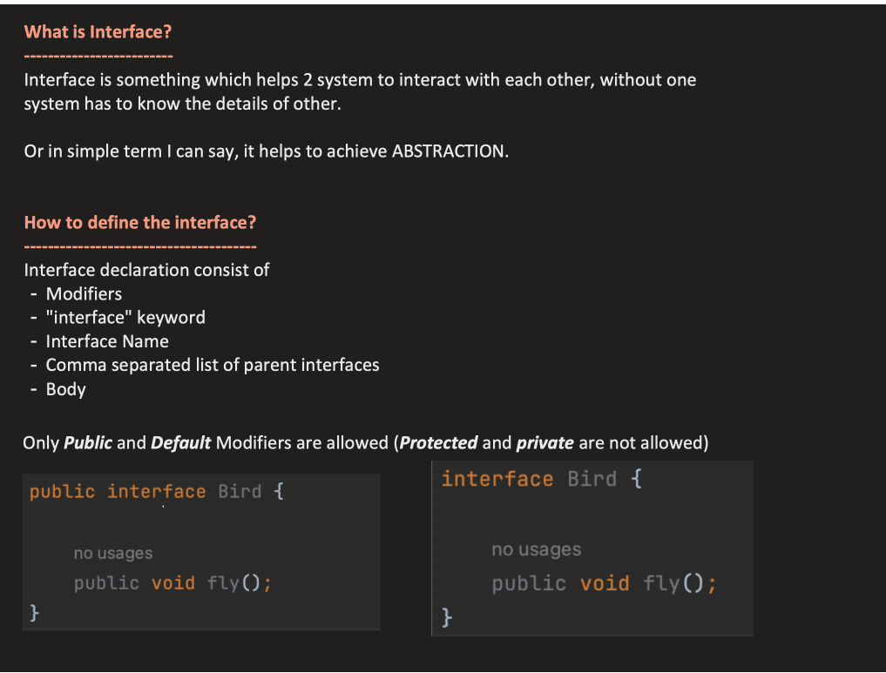

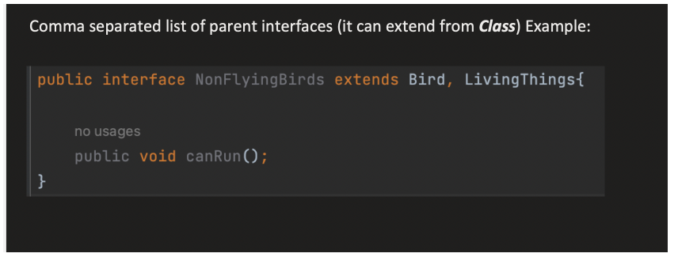

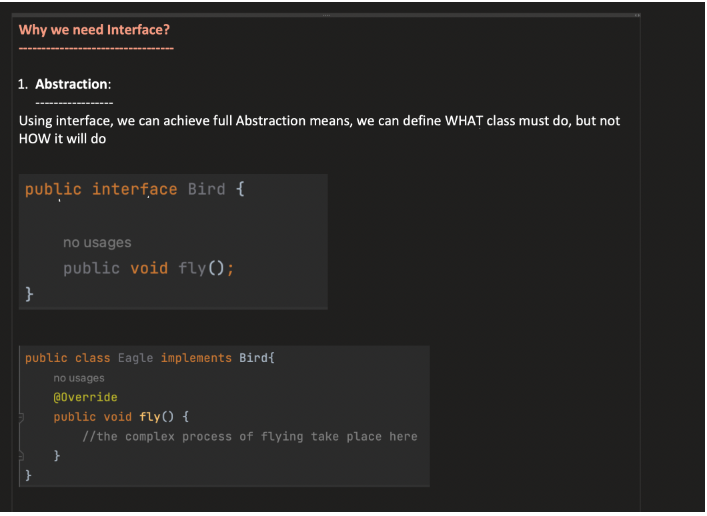

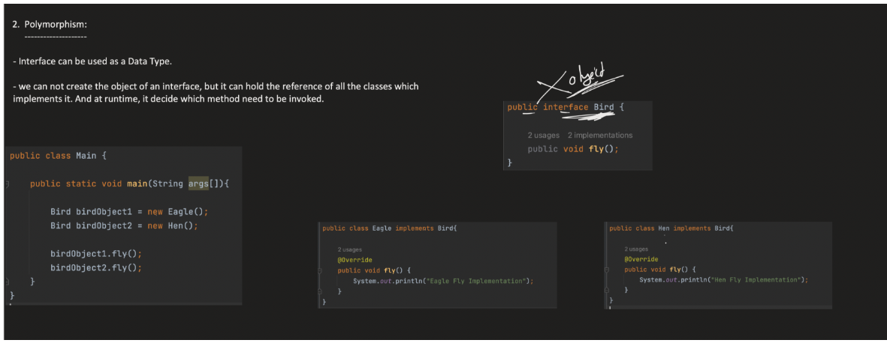

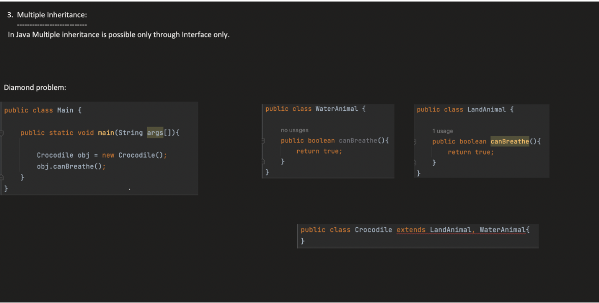

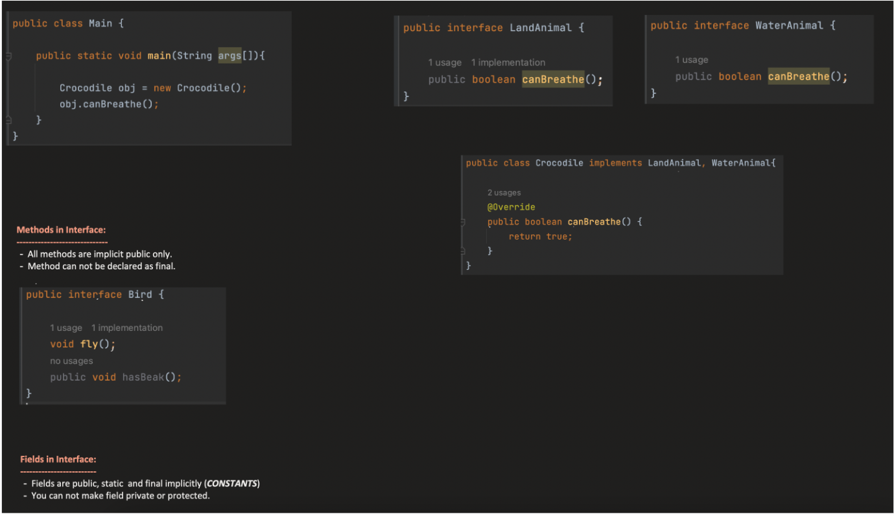

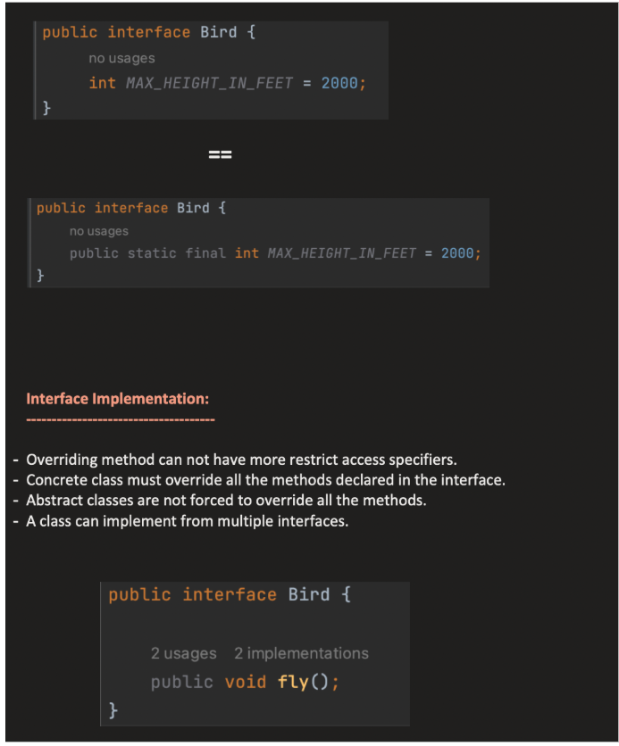

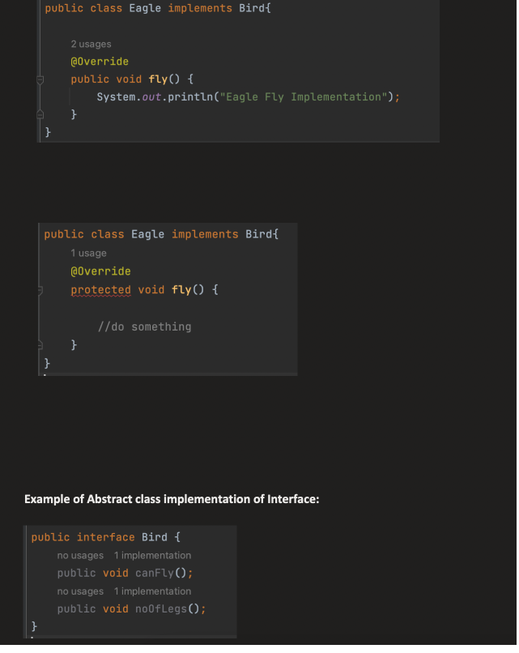

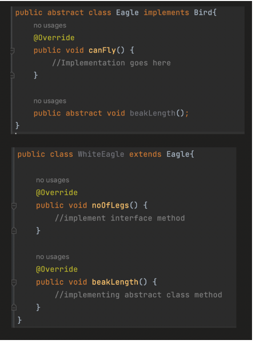

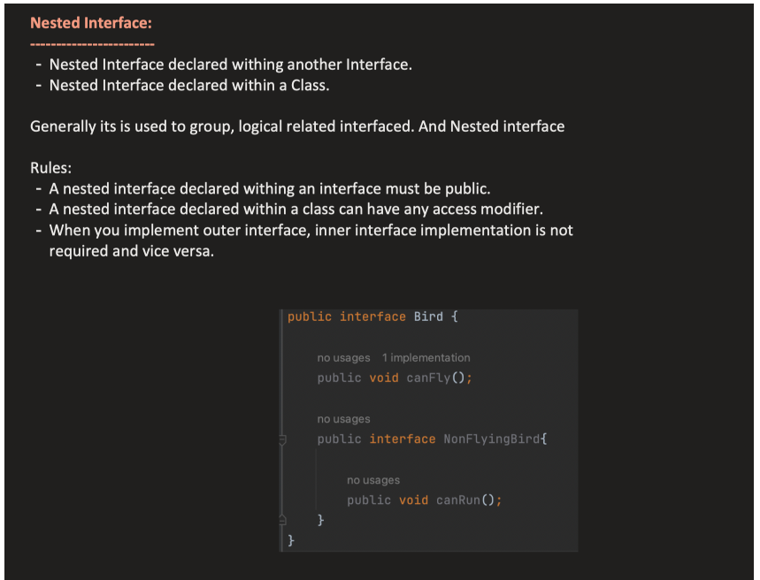

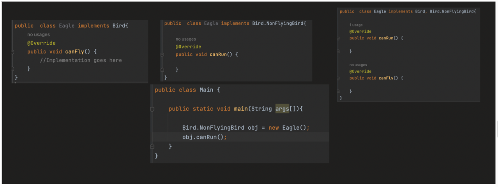

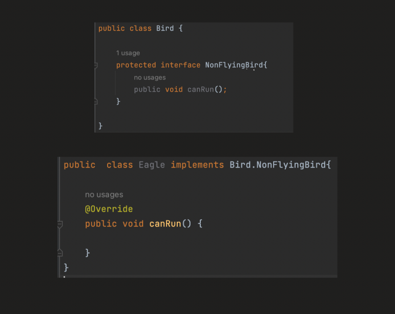

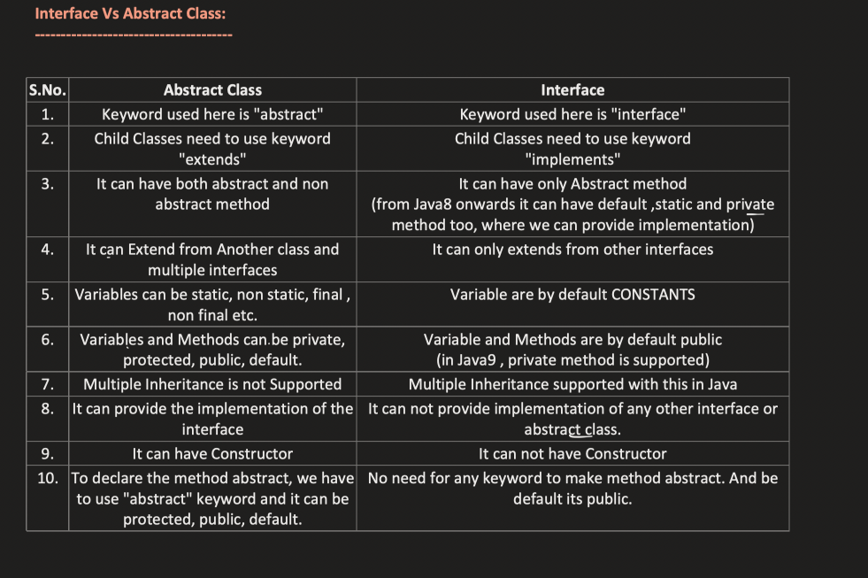

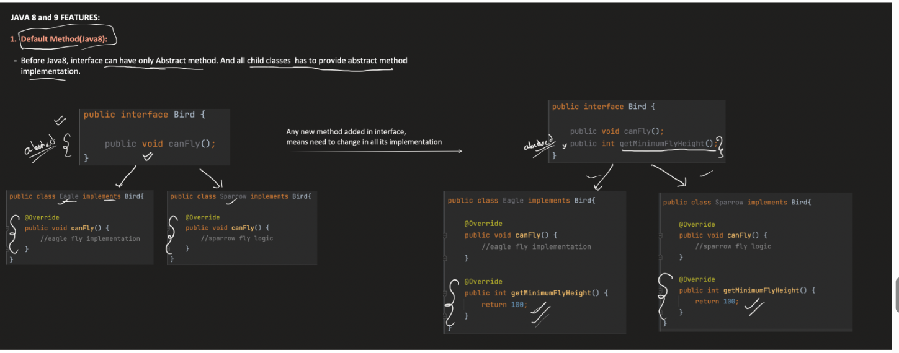

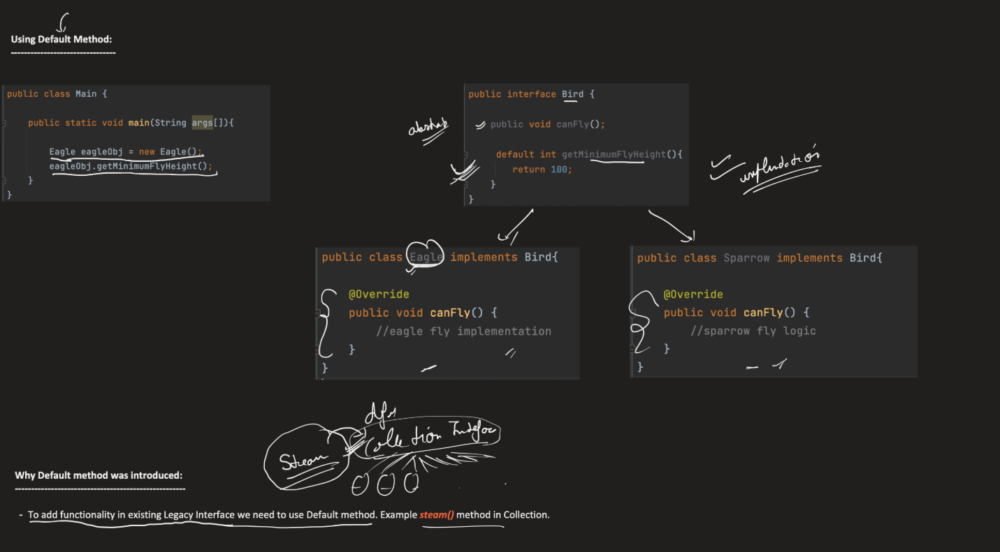

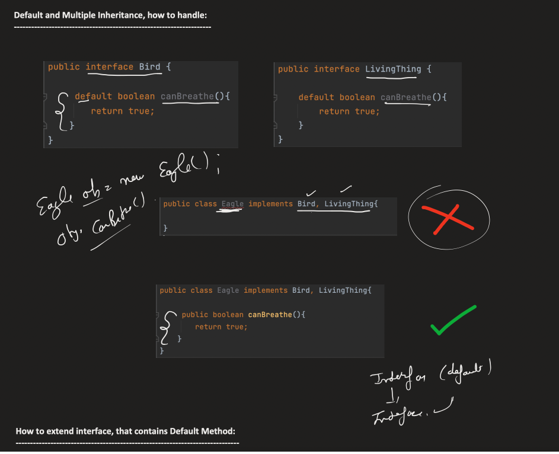

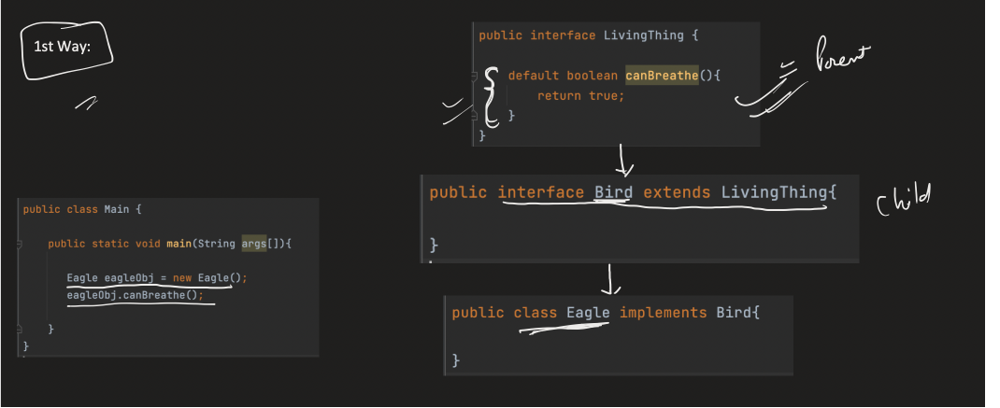

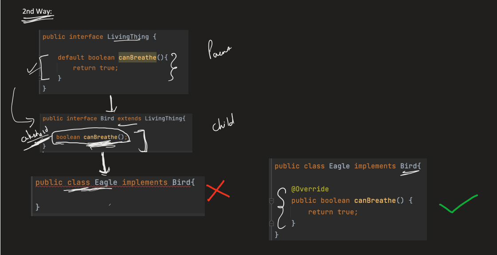


## 💡 **1️⃣ Class Level**

| Feature                         | Interface                                      | Abstract Class                                |
|---------------------------------|------------------------------------------------|-----------------------------------------------|
| **Access Modifier Allowed**     | Only `public` or **package-private** (default) | `public`, `protected`, or **package-private** |
| **Can be declared `final`?**    | ❌ No (cannot be instantiated or final)        | ❌ No (must be extendable)                     |
| **Can be declared `abstract`?** | Implicitly abstract (no need to mention)       | Must explicitly use `abstract` keyword        |


---

## 💡 **2️⃣ Methods**

| Feature                               | Interface                                                   | Abstract Class                                   |
|---------------------------------------|-------------------------------------------------------------|--------------------------------------------------|
| **Access Modifier (Abstract method)** | Always `public` (implicitly)                                | Can be `public`, `protected`, or package-private |
| **Default methods (Java 8+)**         | Must be `public`                                            | N/A                                              |
| **Static methods (Java 8+)**          | Must be `public`                                            | Any modifier (`public`, `protected`, `private`)  |
| **Private methods (Java 9+)**         | ✅ Allowed (only for reuse inside interface)                | ✅ Allowed                                        |
| **Final methods**                     | ❌ Not allowed                                              | ✅ Allowed                                        |
| **Abstract methods count**            | All methods are abstract by default (unless default/static) | Some can be abstract, others concrete            |

{ } }`

---

## 💡 **3️⃣ Fields (Variables)**

| Feature               | Interface                                | Abstract Class                                |
|-----------------------|------------------------------------------|-----------------------------------------------|
| **Access Modifier**   | Always `public static final` (constants) | Can be any (`private`, `protected`, `public`) |
| **Value Requirement** | Must be initialized at declaration       | Optional (can be uninitialized)               |
| **Mutable?**          | ❌ No (since `final`)                     | ✅ Yes (if not final)                        |


---

## ⚙️ **4️⃣ Object Rules**

| Feature                  | Interface                                       | Abstract Class                          |
|--------------------------|-------------------------------------------------|-----------------------------------------|
| **Instantiation**        | ❌ Not possible                                 | ❌ Not possible                          |
| **Implements / Extends** | Implemented by a class (`implements`)           | Extended by a class (`extends`)         |
| **Multiple inheritance** | ✅ Allowed (class can implement many interfaces) | ❌ Not allowed (only one abstract class) |
| **Constructors**         | ❌ Not allowed                                   | ✅ Allowed                               |


## **1️⃣ Can abstract classes have constructors?**

✅ **Yes**, abstract classes **can have constructors**.

`abstract class Vehicle {     Vehicle() {         System.out.println("Vehicle constructor called");     }     abstract void start(); }`

- You **can define constructors** in an abstract class.

- The constructor **runs when a subclass object is created**, not for the abstract class itself.


---

## **2️⃣ Why can’t you create an object of an abstract class?**

- Abstract classes are **incomplete** — they may have **abstract methods with no body**.

- If Java allowed `new Vehicle()`, there would be **no implementation for `start()`**, so what would the JVM run?

- **Cannot instantiate something that is incomplete**.


`Vehicle v = new Vehicle(); // ❌ Compilation Error`

---

## **3️⃣ Then what’s the purpose of a constructor in an abstract class?**

- **To initialize fields and run code** when a **subclass object** is created.

```
class Car extends Vehicle {
    Car() {
        super(); // Calls Vehicle constructor
        System.out.println("Car constructor called");
    }
    void start() {
        System.out.println("Car started");
    }
}

public class Test {
    public static void main(String[] args) {
        Vehicle v = new Car();
        // Output:
        // Vehicle constructor called
        // Car constructor called
    }
}

```


✅ Notice: `Vehicle()` runs **through the subclass**, never directly.


A nested class can have private but a top level class can be public or default only.
Private means it is acessible within a class if u declare a class as private u say that class is
private to what? it looks meaningless

Similarly for static also


Making a constructor `final` is meaningless because **constructors cannot be overridden**, so the compiler forbids it.

- **`static`** means: _belongs to the class, not an instance_.
- **Constructors are used to create instances**.
- If you made a constructor `static`, it would exist **without an instance**, which **contradicts its purpose**.


| Feature         | public     | protected   | default   | private   | final   | static   | abstract   |
| --------------- |------------|-------------|-----------|-----------|---------|----------|------------|
| Top-level class | ✅         | ❌          | ✅        | ❌       | ✅      | ❌       | ❌          |
| Concrete method | ✅         | ✅          | ✅        | ✅       | ✅      | ✅       | ❌          |
| Constructor     | ✅         | ✅          | ✅        | ✅       | ❌      | ❌       | ❌          |
-- A **private method** is visible **only within the class it is declared**.
- Subclasses **cannot see it**, so they **cannot override it**.
-----------------------------------------------------------------------------------------------------

An **abstract class** in Java is a **class that cannot be instantiated directly** and is intended to serve as a **base class for other classes**. It can contain **abstract methods (without a body) and concrete methods (with a body)**.


| Feature        | public | protected | default | private           | final             | static                    | abstract                      |
| -------------- | ------ | --------- | ------- | ----------------- | ----------------- | ------------------------- | ----------------------------- |
| Abstract class | ✅      | ❌         | ✅       | ❌                 | ❌                 | ❌ (top-level), ✅ (nested) | ✅                             |
| Method         | ✅      | ✅         | ✅       | ✅ (concrete only) | ✅ (concrete only) | ✅ (concrete only)         | ✅ (must override in subclass) |
| Constructor    | ✅      | ✅         | ✅       | ✅                 | ❌                 | ❌                         | ❌                             |


------------------------------------------------------------------------------------------


-------------------------------------------------------------------------------------

| Class Type         | public | protected | default | private | final | static | abstract | Notes                                           |
|--------------------|--------|-----------|---------|---------|-------|--------|----------|-------------------------------------------------|
| Top-level concrete | ✅      | ❌         | ✅       | ❌       | ✅     | ❌      | ❌        | Only public or package-private                  |
| Top-level abstract | ✅      | ❌         | ✅       | ❌       | ❌     | ❌      | ✅        | Cannot be final, static top-level not allowed   |
| Nested concrete    | ✅      | ✅         | ✅       | ✅       | ✅     | ✅      | ❌        | Can be private, static allowed                  |
| Nested abstract    | ✅      | ✅         | ✅       | ✅       | ❌     | ✅      | ✅        | Can be private/protected/public; static allowed |


| Method Type          | public              | protected | default | private | final | static | abstract | Notes                          |
|----------------------|---------------------|-----------|---------|---------|-------|--------|----------|--------------------------------|
| Concrete method      | ✅                  | ✅        | ✅     | ✅      | ✅    | ✅     | ❌      | Can combine static/final       |
| Abstract method      | ✅                  | ✅        | ✅     | ❌      | ❌    | ❌     | ✅      | Must be overridden by subclass |
| Nested class methods | Same rules as above |           |         |         |       |        |          | Inherited rules apply          |


| Constructor Type | public   | protected | default | private | final | static | Notes                                       |
| ---------------- |----------| --------- | ------- | ------- | ----- | ------ | ------------------------------------------- |
| Concrete class   | ✅       | ✅        | ✅     | ✅      | ❌    | ❌     | Private used for Singleton/factory patterns |
| Abstract class   | ✅       | ✅        | ✅     | ✅      | ❌    | ❌     | Called via `super()` from subclass          |


1. When to use Abstract Class vs Interface (MOST IMPORTANT)
   🧠 Core Thinking

👉 Abstract Class = “IS-A relationship (base type with shared state)”
👉 Interface = “CAN-DO capability (behavior contract)”

✅ Example
abstract class Vehicle {
int speed; // shared state

    abstract void start();
}
interface Flyable {
void fly();
}
class Plane extends Vehicle implements Flyable {
void start() {}
public void fly() {}
}
🎯 Interview Answer

“Use abstract class when you need shared state and partial implementation. Use interface when you define capabilities that multiple unrelated classes can implement.”

🔥 2. Diamond Problem (Java 8+)
❗ Problem
interface A {
default void show() { System.out.println("A"); }
}

interface B {
default void show() { System.out.println("B"); }
}
class C implements A, B {
// ❌ Compile error
}

👉 JVM confused:

Should it call A.show() or B.show()?

✅ Solution
class C implements A, B {
public void show() {
A.super.show(); // explicitly resolve
}
}
🎯 Interview Answer

“If multiple interfaces provide the same default method, the implementing class must override it and resolve the conflict explicitly.”

🔥 3. Functional Interface (CRITICAL)
🧠 Definition

Interface with exactly ONE abstract method

Example
@FunctionalInterface
interface MyFunc {
void run();
}
Why important?

👉 Used in:

Lambda expressions
Streams
Spring APIs
Example
MyFunc f = () -> System.out.println("Hello");
f.run();
🎯 Interview Answer

“Functional interfaces enable lambda expressions and are widely used in Java 8 features like streams and in Spring APIs.”

🔥 4. Deep Difference (REAL understanding)
❌ Weak answer:

Interface vs abstract class differences…

✅ Strong answer:

“Abstract class represents a base type with shared behavior and state, while interface represents a contract or capability that can be implemented by multiple unrelated classes.”

🔥 5. Private methods in Interface (Java 9+)
Why needed?

👉 To avoid duplicate code in default methods

Example
interface A {

    default void m1() {
        common();
    }

    default void m2() {
        common();
    }

    private void common() {
        System.out.println("Common logic");
    }
}
🎯 Interview Answer

“Private methods in interfaces are used to reuse logic between default methods.”

🔥 6. Abstract class implementing Interface
Example
interface A {
void m1();
}
abstract class B implements A {
// no implementation
}

👉 Valid ✔️

Why?

👉 Abstract class is allowed to be incomplete

🎯 Interview Answer

“An abstract class can implement an interface without providing method implementations, leaving it to subclasses.”

🔥 7. Why Interface variables are static final
Code
interface A {
int x = 10;
}

👉 Internally:

public static final int x = 10;
🧠 Reason
Interface has no instance
So variable cannot be per-object
Must be:
Shared → static
Constant → final
🎯 Interview Answer

“Interface variables are static final because interfaces do not have instances, so variables must be shared constants.”


🧠 1. Difference between default and static methods (in interface)
🔵 Default Method

    interface A {
    default void m1() {
    System.out.println("Default method");
    }
    }
✅ Key points:

    Has implementation ✔️
    Belongs to object (instance)
    Inherited by implementing class ✔️
    Can be overridden ✔️

🔴 Static Method

    interface A {
    static void m2() {
    System.out.println("Static method");
    }
    }
✅ Key points:

    Has implementation ✔️
    Belongs to interface itself (class-level)
    NOT inherited ❌
    Cannot be overridden ❌
🔥 Usage Difference
class B implements A {}

B obj = new B();

    obj.m1();      // ✅ default method
    A.m2();        // ✅ static method
🎯 Core Difference
        
        Feature	        Default Method	    Static Method
        Belongs to      	Object	            Interface
        Inherited	        ✅ Yes	            ❌ No
        Overridable     	✅ Yes	            ❌ No

Call	obj.m1()	Interface.m2()
🔥 2. Why BOTH must be public?

👉 This is the real interview question

🧠 Core Idea

Interface = contract for outside world

So anything inside it must be:
👉 accessible to implementing classes

🔵 Default Method

👉 It is inherited by class:

class B implements A {}

👉 If it was protected or private:

Subclass might not see it ❌
Contract breaks ❌
🔴 Static Method

👉 Called like:

A.m2();

👉 If not public:

Other classes cannot call it ❌
Interface utility breaks ❌
❗ Important Correction (VERY IMPORTANT)


✅ Correct Rules (Java 9+)   

        Method Type	        Allowed Modifiers
        default	                public only
        static	                public, private
        private	                allowed (helper methods only)