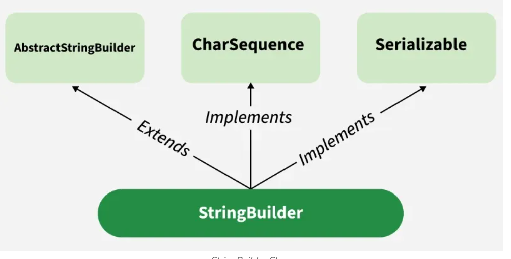

Strings :

    
    - String is a sequence of characters.
      - String is immutable (cannot be changed after creation).
      - String is a class in java.lang package.
      - String literals are stored in a special area of memory called the String Pool.
      - String concatenation can be done using the + operator or StringBuilder for better performance.
      - String has many useful methods like length(), charAt(), substring(), equals(), etc.
      - String is widely used in Java for representing text data.
    
    A String in Java is an object used to store a sequence of characters enclosed in double quotes. It uses UTF-16 encoding and provides methods for handling text data.
    
    Each character in a string is stored using 16-bit Unicode (UTF-16) encoding.
    Strings are immutable, meaning their value cannot be changed after creation.
    Java provides a rich API for manipulation, comparison, and concatenation of strings.

Ways of Creating a Java String
There are two ways to create a string in Java:

1. String literal (Static Memory)

       To make Java more memory efficient (because no new objects are created if it exists already in the string constant pool).

Example:

String str = “GeeksforGeeks”;

2. Using new keyword (Heap Memory)

           Using the new keyword creates a new object in heap memory, even if the same string already exists in the pool.
        
        One object is created in the heap memory
        The string literal is stored in the string pool (if not already present)
        The reference variable points to the heap object, not the pool
        Example:
        
        String str = new String (“GeeksforGeeks”);
        
        In Java, a string literal is stored in the String Constant Pool (SCP), which is part of the heap memory.

| Method                                         | What it Does                           | Return Type |
| ---------------------------------------------- | -------------------------------------- | ----------- |
| `length()`                                     | Returns number of characters in string | `int`       |
| `charAt(int index)`                            | Returns character at given index       | `char`      |
| `substring(int begin)`                         | Returns substring from index to end    | `String`    |
| `substring(int begin, int end)`                | Returns substring from begin to end-1  | `String`    |
| `equals(Object obj)`                           | Compares content (case-sensitive)      | `boolean`   |
| `equalsIgnoreCase(String str)`                 | Compares content (ignore case)         | `boolean`   |
| `compareTo(String str)`                        | Lexicographical comparison             | `int`       |
| `contains(CharSequence s)`                     | Checks if substring exists             | `boolean`   |
| `startsWith(String prefix)`                    | Checks starting characters             | `boolean`   |
| `endsWith(String suffix)`                      | Checks ending characters               | `boolean`   |
| `toLowerCase()`                                | Converts to lowercase                  | `String`    |
| `toUpperCase()`                                | Converts to uppercase                  | `String`    |
| `trim()`                                       | Removes leading/trailing spaces        | `String`    |
| `replace(char old, char new)`                  | Replaces characters                    | `String`    |
| `replace(CharSequence old, CharSequence new)`  | Replaces substring                     | `String`    |
| `split(String regex)`                          | Splits string into array               | `String[]`  |
| `indexOf(String str)`                          | First occurrence index                 | `int`       |
| `lastIndexOf(String str)`                      | Last occurrence index                  | `int`       |
| `isEmpty()`                                    | Checks if string is empty (`""`)       | `boolean`   |
| `concat(String str)`                           | Concatenates strings                   | `String`    |
| `valueOf(int/char/etc)` *(static)*             | Converts to String                     | `String`    |
| `join(CharSequence delimiter, ...)` *(static)* | Joins multiple strings                 | `String`    |
| `intern()`                                     | Returns reference from String Pool     | `String`    |

Most methods return a new string object since strings are immutable. For example, `toUpperCase()` creates a new string with uppercase characters, leaving the original string unchanged.

equals in String checks the content whereas == checks the reference (memory address). So, two different String objects with the same content will be equal using equals() but not using ==.


String Builder :

    StringBuilder is a mutable sequence of characters. It is used when we need to modify strings frequently, as it is more efficient than using String for concatenation.

    Key points:
    
        StringBuilder is not thread-safe (not synchronized).
        It provides methods like append(), insert(), delete(), reverse(), etc.
        It is faster than String when performing multiple modifications.
        It does not create new objects for each modification, unlike String.


StringBuilder sb = new StringBuilder("Initial String");



StringBuilder Constructors
StringBuilder class provides multiple constructors for different use cases.
    
    StringBuilder() : Creates an empty builder with a default capacity of 16 characters.
    StringBuilder(int capacity) : Creates an empty builder with a specified initial capacity.
    StringBuilder(String str) : Initializes the builder with the content of the given String.
    StringBuilder(CharSequence cs) : Initializes the builder with the given CharSequence (for example, String or StringBuffer).
    
    
```java
public class Geeks {
    public static void main(String[] args) {
        StringBuilder sb = new StringBuilder("GeeksforGeeks");
        System.out.println("Initial: " + sb);

        sb.append(" is awesome!");
        System.out.println("After append: " + sb);

        sb.insert(13, " Java");
        System.out.println("After insert: " + sb);

        sb.replace(0, 5, "Welcome to");
        System.out.println("After replace: " + sb);

        sb.delete(8, 14);
        System.out.println("After delete: " + sb);

        sb.reverse();
        System.out.println("After reverse: " + sb);

        System.out.println("Capacity: " + sb.capacity());
        System.out.println("Length: " + sb.length());

        char c = sb.charAt(5);
        System.out.println("Character at index 5: " + c);

        sb.setCharAt(5, 'X');
        System.out.println("After setCharAt: " + sb);

        String sub = sb.substring(5, 10);
        System.out.println("Substring (5–10): " + sub);

        sb.reverse(); // Revert for search
        System.out.println("Index of 'Geeks': " + sb.indexOf("Geeks"));

        sb.deleteCharAt(5);
        System.out.println("After deleteCharAt: " + sb);

        String result = sb.toString();
        System.out.println("Final String: " + result);
    }
}

```


| Method                                    | What it Does                 | Return Type     |
| ----------------------------------------- | ---------------------------- | --------------- |
| `append(data)`                            | Adds data to the end         | `StringBuilder` |
| `insert(int offset, data)`                | Inserts data at given index  | `StringBuilder` |
| `replace(int start, int end, String str)` | Replaces substring           | `StringBuilder` |
| `delete(int start, int end)`              | Deletes characters in range  | `StringBuilder` |
| `deleteCharAt(int index)`                 | Deletes single character     | `StringBuilder` |
| `reverse()`                               | Reverses the string          | `StringBuilder` |
| `charAt(int index)`                       | Returns character at index   | `char`          |
| `setCharAt(int index, char ch)`           | Updates character at index   | `void`          |
| `length()`                                | Returns number of characters | `int`           |
| `capacity()`                              | Returns current capacity     | `int`           |
| `ensureCapacity(int min)`                 | Increases capacity if needed | `void`          |
| `substring(int start)`                    | Returns substring            | `String`        |
| `substring(int start, int end)`           | Returns substring            | `String`        |
| `toString()`                              | Converts to String           | `String`        |
| `indexOf(String str)`                     | First occurrence index       | `int`           |
| `lastIndexOf(String str)`                 | Last occurrence index        | `int`           |


Advantages of StringBuilder

    Performs faster string manipulations in single-threaded environments.
    Reduces memory overhead by modifying content in place.
    Automatically increases capacity when needed.
    Suitable for operations inside loops where strings are frequently changed.

Disadvantages of StringBuilder

    Not synchronized; unsuitable for multi-threaded environments.
    May allocate extra memory if the initial capacity is set too high.
    Requires manual synchronization if used across multiple threads.


🔥 Core Idea

StringBuilder is basically:

    👉    a mutable wrapper over a resizable character array (char[])

🧠 Internal Structure

Simplified version:

    class StringBuilder {
    char[] value;   // actual storage
    int count;      // number of characters used
    }
    value → holds characters
    count → current length (like size)

⚙️ How Append Works
Example:

    StringBuilder sb = new StringBuilder();
    sb.append("Hello");
    sb.append("World");
    Step-by-step:

Initial capacity (default = 16)

value = [ _ _ _ _ _ _ _ _ _ _ _ _ _ _ _ _ ]
count = 0

After "Hello":

value = [ H e l l o _ _ _ _ _ _ _ _ _ _ _ ]
count = 5

After "World":

value = [ H e l l o W o r l d _ _ _ _ _ _ ]
count = 10

👉 No new object created → same array reused

🚀 What if capacity is exceeded?

When array is full:

🔁 Resize Logic
newCapacity = (oldCapacity * 2) + 2

So:

16 → 34 → 70 → ...
Steps:
Create new bigger array
Copy old data
Replace reference


**_String Buffer :**_

    StringBuffer is a thread-safe, mutable sequence of characters. It is similar to StringBuilder but synchronized, making it suitable for use in multi-threaded environments.

    Key points:
    
        StringBuffer is synchronized (thread-safe).
        It provides methods like append(), insert(), delete(), reverse(), etc.
        It is slower than StringBuilder due to synchronization overhead.
        It does not create new objects for each modification, unlike String.

Advantages of StringBuffer

    Mutable: Its content can be modified after creation while String remains immutable.
    Better for Repeated Updates: Frequent concatenations perform efficiently because no new objects are created for each change.
    Thread-Safe: All methods are synchronized making it safe in multithreaded environments.
Disadvantages of StringBuffer
    
    Slower in Single-Threaded Code: Synchronization adds overhead when thread safety is not needed.
    Less Efficient Than StringBuilder: StringBuilder provides the same features with better performance in non-threaded scenarios.

| Feature           | String 🧊                     | StringBuilder 🚀                    | StringBuffer 🔒                    |
| ----------------- | ----------------------------- | ----------------------------------- | ---------------------------------- |
| Mutability        | ❌ Immutable                   | ✅ Mutable                           | ✅ Mutable                          |
| Thread Safety     | ❌ Not thread-safe             | ❌ Not thread-safe                   | ✅ Thread-safe (synchronized)       |
| Performance       | 🐢 Slow (creates new objects) | 🚀 Fastest                          | 🐢 Slower (sync overhead)          |
| Internal Storage  | `byte[]` (Java 9+)            | `char[]`                            | `char[]`                           |
| Object Creation   | New object on every change    | Same object reused                  | Same object reused                 |
| Memory Usage      | Higher (due to immutability)  | Efficient                           | Slightly higher than builder       |
| String Pool       | ✅ Yes                         | ❌ No                                | ❌ No                               |
| Synchronization   | ❌ None                        | ❌ None                              | ✅ All major methods                |
| Introduced In     | Java 1.0                      | Java 5                              | Java 1.0                           |
| Use Case          | Constants, read-only data     | Single-threaded string manipulation | Multi-threaded string manipulation |
| Resizable Buffer  | ❌ No                          | ✅ Yes                               | ✅ Yes                              |
| append() behavior | Creates new object            | Modifies same object                | Modifies same object               |
| equals()          | Compares content              | Inherited (reference)               | Inherited (reference)              |


String s1 = new String("hello");
String s2 = "hello";

System.out.println(s1 == s2);           // ❌ false
System.out.println(s1.intern() == s2);  // ✅ true

here s1 will still reference a different object in heap memory, but s1.intern() will return the reference to the string literal "hello" in the String Pool, which is the same as s2.

if u do s1 = s1.intern(); then s1 will also reference the same string literal in the String Pool, and s1 == s2 will be true.


intern() method returns a canonical representation for the string object. 
It checks if an identical string already exists in the String Pool. 
If it does, it returns the reference to that string; otherwise, it adds the string to the pool and returns its reference. This allows for memory optimization by reusing string literals.