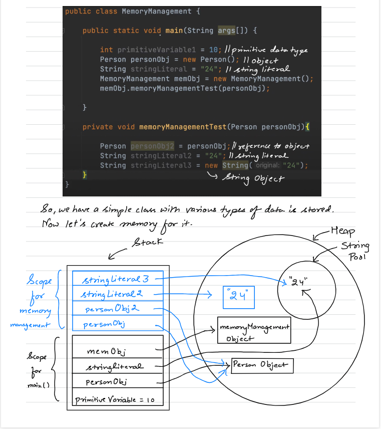
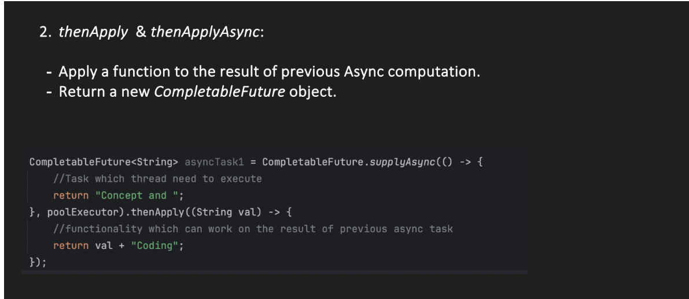
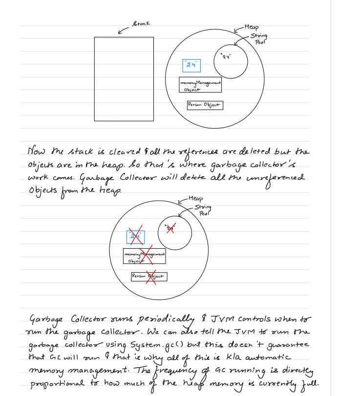
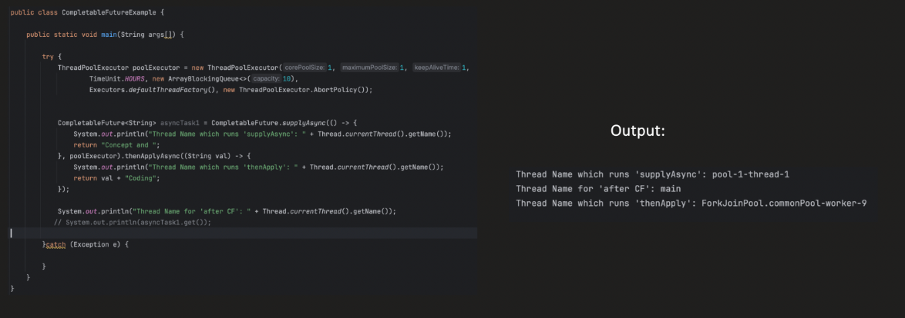
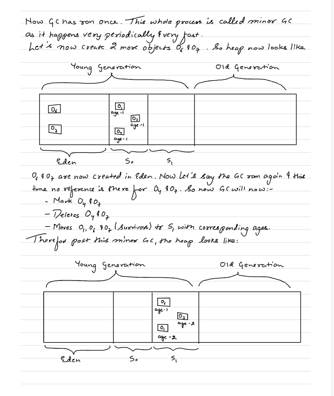
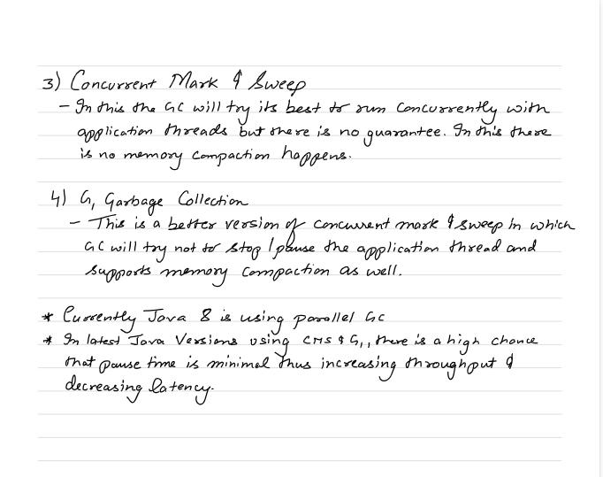

## 🧠 JVM Architecture Overview

When you run a Java program, the **Java Virtual Machine (JVM)** performs three main functions:

1. **Loads** the `.class` files (bytecode)

2. **Verifies and executes** them

3. **Manages memory and system resources**


---

### 🏗 High-Level JVM Architecture


---

## 🧩 1. **Class Loader Subsystem**

Responsible for **loading class files into JVM memory**.

It goes through **three phases**:

### (a) **Loading**

- Loads `.class` files from disk, network, or JAR.

- Converts bytecode into `Class` objects in memory.

- Uses **ClassLoader hierarchy**:

    1. **Bootstrap ClassLoader** – loads core Java classes (from `rt.jar` / `java.base`).

    2. **Extension (Platform) ClassLoader** – loads extension libraries (`lib/ext`).

    3. **Application (System) ClassLoader** – loads classes from your classpath.


📌 **Delegation Model:**  
Each class loader first delegates the loading request to its parent before trying itself — this prevents core classes from being overridden.

---

### (b) **Linking**

Ensures the class is **ready to use**.

1. **Verification:** Checks bytecode for security and format errors.  
   (e.g., illegal access, stack underflow/overflow)

2. **Preparation:** Allocates memory for static variables and sets default values.

3. **Resolution:** Replaces symbolic references (like class names) with direct references (like memory addresses).


---

### (c) **Initialization**

- Assigns **actual values** to static variables.

- Executes static blocks (`static { ... }`).


---

## ⚙️ 2. **Runtime Data Areas**

This is the **memory layout** of JVM at runtime.  
It includes both **shared** and **thread-specific** areas.

### 🧮 A. Method Area (shared)

- Stores:

    - Class-level data (metadata)

    - Static variables

    - Method and field names

    - Runtime constant pool (literal and symbolic references)

- One per JVM.

- Garbage collected (in modern JVMs — part of **Metaspace** in Java 8+).
  ### 🔹 **2.1 Method Area (a.k.a Class Area / MetaSpace in Java 8+)**

- Stores **class metadata**, static variables, method bytecode, constant pool.

- Shared across all threads.

  ### ✔ **Static variable VALUES are stored in the HEAP.**

This surprises many people — but it is 100% correct for Java 8 and later
- The **value `10` of static variable `x` is stored in the Heap.**

- The **metadata “static int x” is stored in Metaspace** (because Metaspace stores class structure).

---

### 💾 B. Heap (shared)

- Stores **objects and arrays**.

- Common to all threads.

- Managed by **Garbage Collector (GC)**.


Divided into:

1. **Young Generation**

    - Eden + Survivor spaces (S0, S1)

    - New objects created here.

    - Minor GC happens frequently.

2. **Old (Tenured) Generation**

    - Long-lived objects.

    - Major GC occurs less frequently.

3. **Metaspace**

    - Stores class metadata (replaces PermGen since Java 8).


---

### 🧵 C. Java Stack (per thread)

- Stores **stack frames** for each method call.

- Each frame holds:

    - Local variables

    - Operand stack (for intermediate calculations)

    - Frame data (return address, etc.)


When a method call ends, its frame is **popped** off the stack.

🧠 **Errors:**

- `StackOverflowError`: if recursion is too deep.

- `OutOfMemoryError`: if stack cannot be expanded.


---

### 💻 D. PC (Program Counter) Register (per thread)

- Points to **current instruction** being executed in the method.

- If executing a native method → value is undefined.


---

### 🔧 E. Native Method Stack (per thread)

- Used for **native (non-Java)** methods written in C/C++.

- Supports JNI (Java Native Interface).


---

## 🧠 3. **Execution Engine**

This is the **heart of JVM**, responsible for actually **running bytecode**.

It has three key parts:

### (a) **Interpreter**

- Reads bytecode instructions **one by one** and executes them.

- Slow for repeated instructions.


### (b) **JIT (Just-In-Time) Compiler**

- Converts frequently executed bytecode (hot code) into **native machine code**.

- Greatly improves performance.

- Includes techniques like:

    - **Inlining** (replace method calls with body)

    - **Loop unrolling**

    - **Escape analysis**

    - **Dead code elimination**


### (c) **Garbage Collector (GC)**

- Reclaims memory of unreachable objects.

- Algorithms include:

    - Serial GC

    - Parallel GC

    - G1 GC

    - ZGC / Shenandoah (low latency)


---

## 🌉 4. **Java Native Interface (JNI)**

- Allows Java code to **interact with native code** (C/C++).

- Provides a bridge between JVM and OS-level libraries.


Example use: accessing hardware or optimized native libraries.

---

## 📚 5. **Native Method Libraries**

- Actual implementation of native methods required by the JVM.

- Typically `.dll`, `.so`, or `.dylib` files loaded during startup.

------------------------------------------------------------------------------------------


   


   


   


   


### **1️⃣ JVM Execution**

- JVM has its **own view of memory** (the heap for objects, stack for local variables).

- When a thread executes, JVM loads the variable it needs into the **CPU register** (via the JIT-compiled machine code).


---

### **2️⃣ CPU Register Update**

- CPU performs operations on the **register copy** of the variable.

- At this point:

    - **Only the executing core’s register** has the updated value.

    - **Other threads/cores don’t see it**.


---

### **3️⃣ Writing to CPU Cache**

- Eventually, CPU writes the updated value from its register into **L1/L2 cache** (still core-local).

- The cache **temporarily holds the updated value** before it goes to main memory.


---

### **4️⃣ Cache Coherence Protocol**

- Modern CPUs have protocols like **MESI** (Modified, Exclusive, Shared, Invalid) to maintain **cache coherence**.

- When the variable is in L1/L2 cache in **Modified state**, other cores’ caches that have the same variable get **invalidated**, so next time they read, they fetch the latest value from memory or updated cache.


---

### **5️⃣ Writing Back to Main Memory (Heap)**

- Eventually, the CPU writes the updated value to **main memory (Java heap)**.

- Timing is **not deterministic** unless:

    - You use `volatile` → forces immediate write to main memory and visibility to other threads.

    - You use `synchronized` → flushes caches on lock release/acquire.


---

### **6️⃣ Other Threads Reading**

- Another thread running on another core will:

    1. Check its **own cache** for the variable.

    2. If invalid or not present, fetch the **latest value from main memory or via cache coherence**.

- Without `volatile`/synchronization, **other threads may see stale values**.


### **Think of it like a classroom with notebooks**

1. **Main memory = blackboard in classroom**

    - Everyone can see it if they look at it.

2. **CPU cache / registers = each student’s personal notebook**

    - Each student copies what’s on the blackboard into their notebook to work faster.

3. **Updating a variable = student changes their notebook**


---

#### Step-by-step scenario

- **Thread A (Student A)** writes `x = 10`:

    1. Student A changes the value in **their notebook** first (CPU register / cache).

    2. They **haven’t copied it to the blackboard** (main memory) yet.

- **Thread B (Student B)** reads `x`:

    1. Student B looks in **their own notebook** first (cache).

    2. If they haven’t looked at the blackboard since Thread A’s change, they see the **old value** (stale).

- **When does it update on the blackboard?**

    - Only when Student A writes back (flushes cache or via memory barrier) does the main memory get updated.

    - Other students see the new value only **after they check the blackboard or their cache is updated**.


-----------------------------------------------------------------------------------------

## **Step 0: The Starting Point – JVM Memory**

- JVM stores variables in:

    1. **Heap** → shared memory for objects.

    2. **Stack** → private memory per thread for local variables.

- At this point, **nothing has touched the CPU yet**.


---

## **Step 1: JVM Loads Variable for Execution**

- When a thread executes bytecode, JVM **compiles it (JIT)** to machine code.

- The machine code **loads the variable from heap/stack into a CPU register** for computation.

- At this point:

    - **CPU register** holds the value.

    - Other threads still see the value in heap (or possibly stale in their caches).


---

## **Step 2: CPU Operates on Register**

- CPU executes instructions on the **register value**:

    - e.g., `x = x + 1`

- Changes happen **only inside the register**, fast and local.

- L1/L2 caches may eventually store this value, but **other cores don’t see it yet**.


---

## **Step 3: CPU Cache (L1/L2) Update**

- Registers often write back to **L1/L2 cache** (per-core).

- At this stage:

    - Core-local cache has the latest value.

    - Other cores may have **stale copies** in their caches.

- **Cache coherence protocol (MESI)** ensures:

    - Other caches invalidate old copies.

    - Future reads fetch updated value.


---

## **Step 4: Write-Back to Main Memory (Heap)**

- CPU may **flush cache lines** to main memory.

- Timing is **not immediate** — depends on:

    - CPU optimization

    - JIT-generated memory barriers

    - Java constructs (`volatile`, `synchronized`)

- After flushing:

    - Heap now has the updated value.

    - Other threads reading from main memory can see it.


---

## **Step 5: Other Threads Read the Value**

- Another thread executing on a different core:

    1. Checks **its own L1/L2 cache**.

    2. If the cache is invalid, fetches value from **main memory** (or via coherence protocol).

- Without `volatile` or `synchronized`, this thread may still read a **stale value** if the update hasn’t been flushed yet.


---

## **Step 6: Ensuring Visibility**

- Java guarantees visibility when you use:

    - `volatile` → forces register/cache → memory write & memory barriers.

    - `synchronized` → flushes caches on lock release/acquire.

    - `Atomic*` classes → atomic read/write with memory semantics.


---

## **Full Flow Diagram (Conceptual)**

```
JVM Memory (Heap/Stack)
        │
        ▼  (load)
CPU Register (per-thread/core)
        │
        ▼  (compute)
CPU L1/L2 Cache (per-core)
        │
        ▼  (cache coherence + write-back)
Main Memory (Heap)
        │
        ▼  (other thread reads)
Other Thread CPU Register → L1/L2 Cache

```

---

### ✅ **Key Points**

1. **Registers and L1/L2 cache are core-local**, so updates are **not instantly visible** to other threads.

2. **Stale values happen** when a thread reads from its cache/register before the write-back occurs.

3. **Main memory (heap)** is shared, but writes to it are **deferred** for performance.

4. **Volatile, synchronized, Atomic** enforce immediate visibility.


---

If you want, I can make a **visual diagram showing two threads on two cores, with registers, caches, heap, and the stale value scenario** — it makes the whole flow crystal clear.

Do you want me to do that?

##### You said:

we have jvm registers right why thatisnot mntioned

###### ChatGPT said:

Ah! Yes, you’re right — sometimes people talk about “JVM registers,” but let’s clarify what that really means and where it fits in the flow.

---

### **1️⃣ What JVM Registers Are**

- **JVM registers** are a **conceptual/virtual thing inside the JVM**:

    - When the JVM interprets bytecode, it uses a **stack-based model**.

    - The “registers” in this context are **operand stack slots and local variables in the stack frame**.

    - They are **not physical CPU registers** — just JVM’s internal bookkeeping.


---

### **2️⃣ How JVM Registers Map to CPU Registers**

1. JVM bytecode execution:

    - JVM “registers” (local variables, operand stack) hold values **logically**.

2. JIT compilation:

    - The JIT compiler converts bytecode into **native machine code**.

    - JVM registers are then **mapped to physical CPU registers** for execution.

    - Some may stay in CPU registers, others may spill to CPU cache or memory if needed.


So “JVM registers” **exist at the JVM level**, but the actual computation happens in **CPU registers**.

---

### **3️⃣ Updated Flow Including JVM Registers**
```
JVM Registers (stack frame / local variables)
        │  (JIT loads)
        ▼
CPU Registers (per-thread/core)
        │  (compute)
        ▼
CPU L1/L2 Cache (per-core)
        │  (cache coherence / write-back)
        ▼
Main Memory (Heap)
        │
        ▼
Other Thread CPU Registers / Cache / Heap read

```

- JVM registers are **virtual**, exist **inside the JVM stack frame**, and are **mapped to CPU registers** during execution.

- If you skip this mapping, it looks like JVM just “writes straight to CPU registers,” which is not exactly accurate.

------------------------------------------------------------------------------------


| Memory Region          | Purpose                                       | Shared/Thread-private | Location                    |
| ---------------------- | --------------------------------------------- | --------------------- | --------------------------- |
| **Heap**               | Objects/arrays                                | Shared                | RAM, managed by JVM GC      |
| **Stack**              | Local variables, method calls                 | Thread-private        | RAM, per-thread             |
| **Data Segment**       | Static/global variables                       | Shared                | RAM, part of program memory |
| **Code Segment**       | Program instructions                          | Shared                | RAM, loaded by OS           |
| **Registers**          | Fast computation                              | Per-core              | CPU                         |
| **Metadata/Metaspace** | Class definitions, method info, constant pool | Shared                | Native memory outside heap  |


# 🔥 **1. Strong, Weak, Soft, Phantom References — Complete Explanation**

Java has **4 types of references**—they tell the Garbage Collector _how aggressively_ an object can be removed.

---

# ⭐ 1. **Strong Reference (Default)**

### ✔ What it is:

Normal references you create every day:

`Object obj = new Object();   // strong reference`

### ✔ GC Behavior:

- **Never collected** as long as a strong reference exists.

- Most powerful reference.

- Leads to **memory leaks** if unused objects are still strongly reachable.


### ✔ Example:

`List<Object> list = new ArrayList<>(); list.add(new Object());  // object CAN'T be GC’d`

📌 **If you forget to remove objects from collections → Memory leak.**

---

# ⭐ 2. **Weak Reference**

### ✔ Definition:

Garbage Collector **collects object immediately** when **no strong references** remain.

### How to create:

`WeakReference<MyObject> weakRef = new WeakReference<>(new MyObject());`

### ✔ When GC collects?

- Collected **as soon as memory is scanned**.


### ✔ Used For:

- WeakHashMap (keys are weak)

- Caches

- Avoiding memory leaks


### ✔ Real Use Case:

`WeakHashMap<Object, String> map = new WeakHashMap<>();`

If the key has no strong reference → entry automatically removed.

---

# ⭐ 3. **Soft Reference**

### ✔ Definition:

Object is collected **ONLY when JVM is about to run out of memory.**

### How to create:

`SoftReference<MyObject> softRef = new SoftReference<>(new MyObject());`

### ✔ GC Behavior:

- **Long-lived**

- GC removes them only if:

    - Heap memory is low

    - GC wants to free memory


### ✔ Use Case:

- Caching (LRU, memory-sensitive caches)

- Image caches (Android)


📌 Soft references survive more GC cycles than weak references.

---

# ⭐ 4. **Phantom Reference**

### ✔ Most advanced reference

### ✔ Collected **only after finalization**, but before memory is fully reclaimed.

### Cannot get object using `get()` → always returns null.

`PhantomReference<MyObject> phantomRef =     new PhantomReference<>(new MyObject(), referenceQueue);`

### ✔ Used For:

- Tracking object’s GC lifecycle

- Cleaning native memory (off-heap)

- Implementing resource deallocation frameworks


📌 You always need a **ReferenceQueue** with phantom references.

---

# 🎯 GC Strength Ranking (Strong → Weakest)

`Strong > Soft > Weak > Phantom`

GC frees memory in this order.

---

# 🧩 Example Comparison Table

|Type|GC Behavior|Good For|get() Works?|
|---|---|---|---|
|**Strong**|Never collected|Normal objects|✔ Yes|
|**Soft**|Collected when memory is low|Caches|✔ Yes|
|**Weak**|Collected immediately (no strong refs)|WeakHashMap, avoiding leaks|✔ Yes|
|**Phantom**|After finalization, before memory reclamation|Cleanup tasks|❌ No|

---

# 🚨 **2. Memory Leaks in Java**

Memory leaks happen when objects are **no longer used** but still **strongly referenced**, so GC cannot remove them.

### Common Causes:

---

## ⭐ 1. Static Fields

Static fields live for the entire JVM lifetime → easiest source of leaks.

`public static List<Object> list = new ArrayList<>();`

---

## ⭐ 2. Long-Lived Collections

When objects are added but not removed.

- ArrayList

- HashMap

- ConcurrentHashMap

- Cache without eviction policy


---

## ⭐ 3. Listeners / Observers not unregistered

If you forget to unregister GUI listeners, thread listeners, callbacks.

---

## ⭐ 4. Inner classes holding outer class reference

Non-static inner classes automatically hold a reference to the outer class.

---

## ⭐ 5. Threads & ThreadLocals

If ThreadLocal’s value is never removed → leak.

---

## ⭐ 6. Poorly implemented Singletons

Singletons often hold strong references forever.


# ✅ **What is `finalize()` in Java?**

`finalize()` is a **method in the Object class** that the **Garbage Collector (GC)** _used to call_ **before destroying an object**.

Signature:

`protected void finalize() throws Throwable`

---

# ✅ **What does `finalize()` _do_?**

Originally, the idea of `finalize()` was:

- If an object is about to be garbage-collected,

- JVM gives the object **one last chance** to clean up resources (like closing files, sockets, DB connections).


So, you could override it like:

`@Override protected void finalize() throws Throwable {     System.out.println("Object is being destroyed…"); }`

Then GC would call this method **before deleting the object** from memory.


# **2. What happens if you don’t close them**

1. **Resource leak occurs**

    - The object may eventually be garbage-collected.

    - But the **underlying resource** (file handle, socket, native memory) may remain **open until finalization** or JVM shutdown.

2. **Delayed cleanup**

    - GC may call `finalize()` if defined (deprecated now).

    - Cleanup is **unpredictable and slow**.

3. **Resource exhaustion**

    - If your program opens many files/sockets and doesn’t close them:

        - `java.io.FileNotFoundException: Too many open files`

        - `OutOfMemoryError` if off-heap memory is leaking

        - Application may crash or become unresponsive

---

# ⚠️ **BUT… finalize() is broken and dangerous**

And that’s why it is **deprecated in Java 9** and **removed in Java 18**.

Here’s why:

---

## ❌ 1. **No guarantee that finalize() will run**

GC _may choose not to call it at all_.

If JVM shuts down early → finalize never runs.

Nothing is predictable.

---

## ❌ 2. Finalize causes **performance issues**

Objects with `finalize()` go into a special queue called **Finalization Queue**, delaying garbage collection.

GC has to:

1. Detect object eligible for GC

2. Move it to finalizer queue

3. Call `finalize()` in a separate thread

4. Wait for completion

5. THEN collect it


This makes GC _much slower_.

---

## ❌ 3. Can cause **resurrection**

Inside finalize(), you can "revive" the object:

`static MyObject ref;  @Override protected void finalize() {     ref = this; // Object becomes reachable again! }`

Now GC has to track it again → **complex + dangerous**.

---

## ❌ 4. Can cause **memory leaks**

If finalize takes time, objects remain in memory waiting for finalization → memory leak.


# ⭐ **1. What is a Phantom Reference?**

A **PhantomReference** in Java is:

- The **weakest type of reference**.

- Always returns **null** from `get()`.

- Used **only to know when an object is _about to be garbage-collected_**.

- Works **together with a ReferenceQueue**.


> It is **not for accessing the object** — it’s for **cleanup and lifecycle notification**.


# ✅ **1. Using `System.gc()`**

`System.gc();`

- Suggests JVM to run garbage collection.

- JVM **may or may not** actually run GC immediately.

- It’s just a **hint** to the JVM.


### Example:

`public class GCDemo {     public static void main(String[] args) {         String str = new String("Hello");         str = null; // remove strong reference          System.gc(); // request GC          System.out.println("GC requested");     } }`

> The object may or may not be collected immediately.

---

# ✅ **2. Using `Runtime.getRuntime().gc()`**

`Runtime.getRuntime().gc();`

- Same as `System.gc()` (because internally System.gc() calls this).

- JVM may ignore it.














