ANNOTATIONS:

        -> Annotations are metadata added to classes, methods, fields, etc.
        -> Metadata means information about the program structure.
        -> Depending on their retention policy, annotations can be processed:
                - At compile time (by compiler or annotation processors)
                - At runtime (by reflection or bytecode readers)
        -> Annotations marked with RetentionPolicy.RUNTIME can be read using reflection,
          and frameworks can execute logic based on them.


Example :

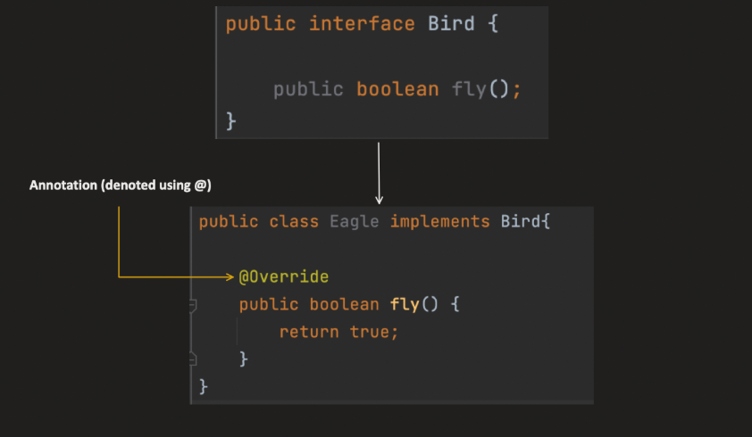

For example : Compiler uses @Override annotation and by mistake while overriding a method if we made a typo in the method name
              compiler will throw error
              Say if we didnot provide override and do a typo it will treat it as a seperate method


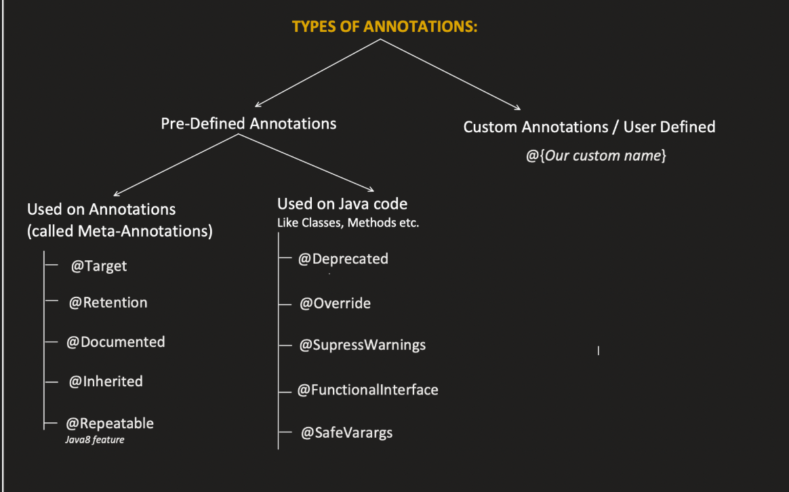


🔹 1️⃣ The Core Problem

        Before annotations, configuration was mostly done using:

❌ XML

Example (old Spring style):

        <bean id="userService" class="com.app.UserService"/>

Problems:

        Separate from code
        Hard to maintain
        Not type-safe
        Verbose
        Easy to misconfigure

🔥 2️⃣ What Annotations Solve

    Annotations allow you to keep configuration close to the code it affects.

Instead of XML:

@Service
class UserService {}

Now:

    Configuration is near the class
    Easier to read
    Less boilerplate
    Cleaner design
    Frameworks like Spring Framework heavily rely on this idea.

🔹 3️⃣ Why Not Just Use Code?

You might ask:

    Why not just write normal Java logic instead of annotations?

Because annotations allow:

✅ Declarative Programming

Instead of writing:
    
    public void save() {
    startTransaction();
    // business logic
    commitTransaction();
    }

You just write:

    @Transactional
    public void save() {}

You declare what you want, not how it works.

Framework handles the how.

🔥 4️⃣ What Annotations Actually Enable

They enable frameworks to:

        Discover components automatically
        Apply cross-cutting logic (AOP)
        Configure behavior declaratively
        Reduce boilerplate
        Improve readability


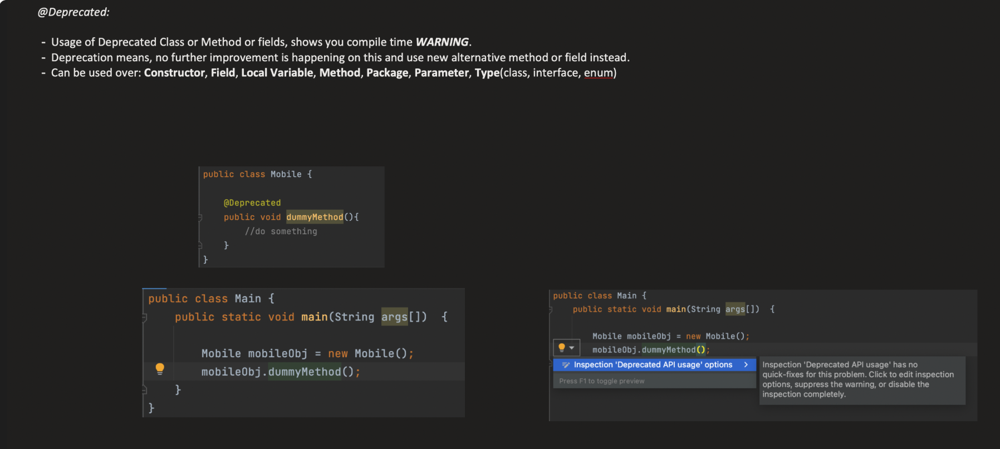

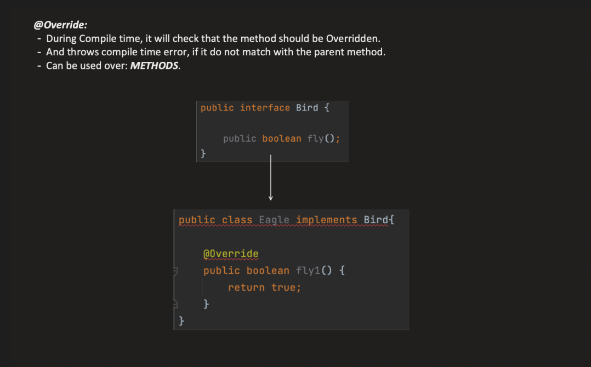

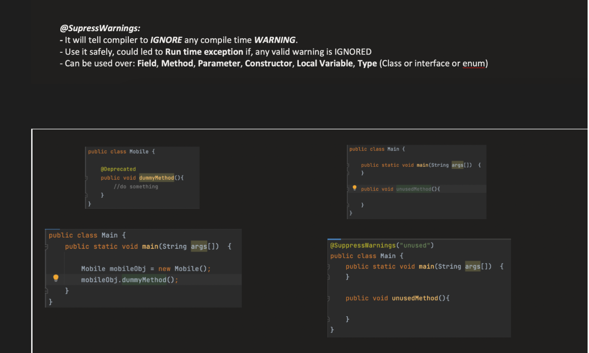


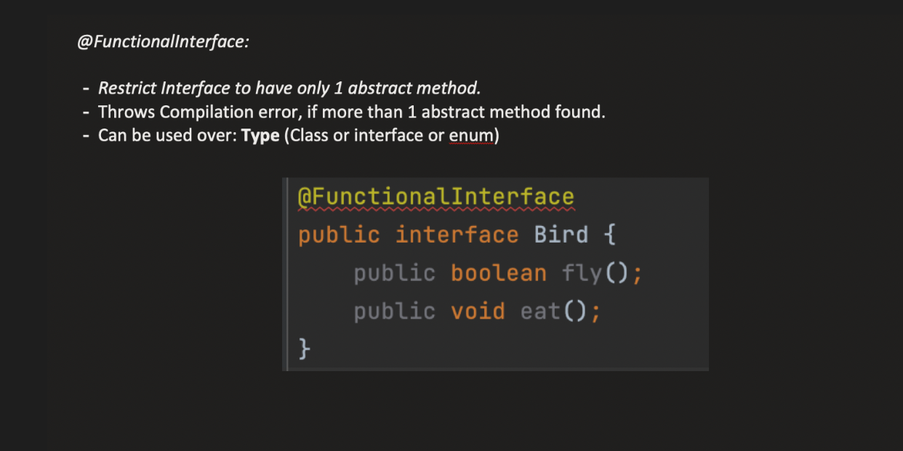

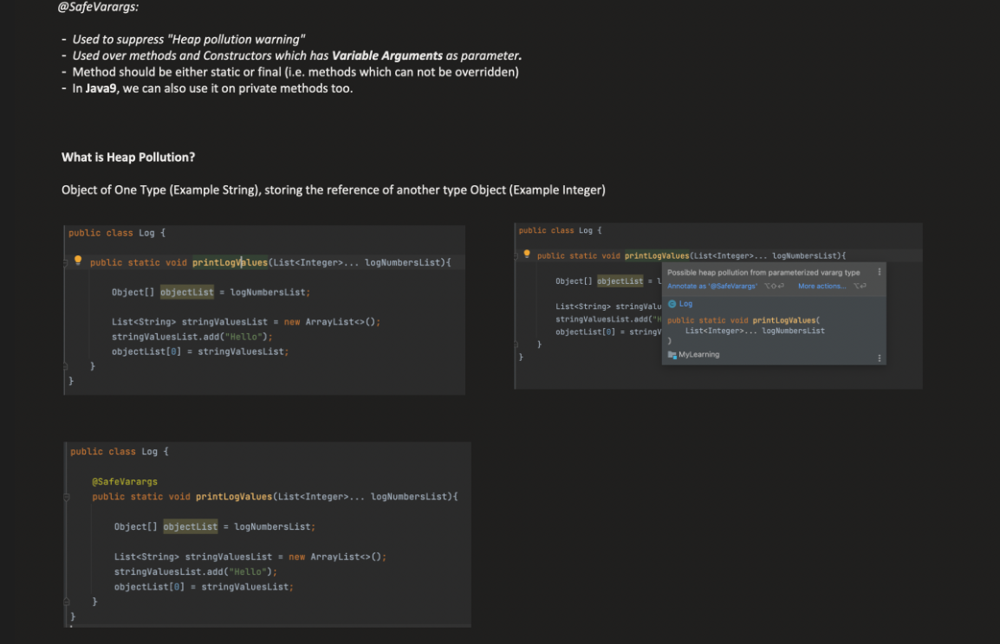


Heap Pollution :

    stringLists has type List<String>[].


**_META ANNOTATIONS:_**

---> These are annotations used on top of another annotations


1. **_TARGET:_**

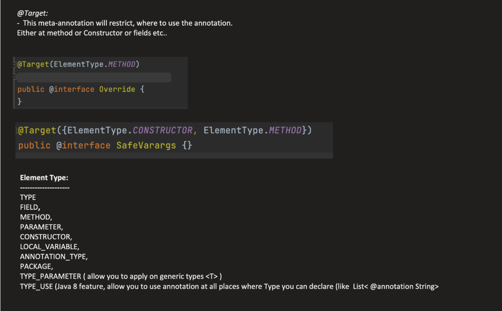

Here type can be class, interface or enum
All meta annotations on their inside will have @Target(ANNOTATION_TYPE) so that they can be used on top of another annotation

2. **_RETENTION:_**

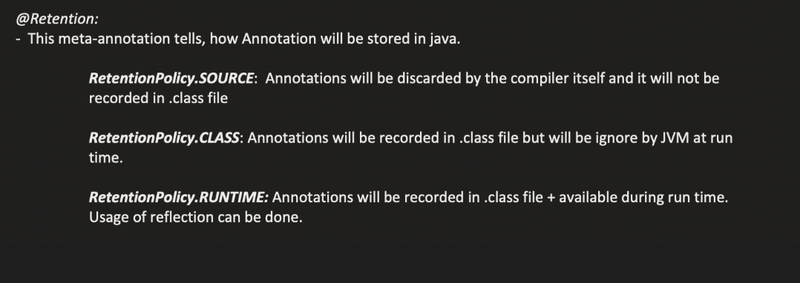

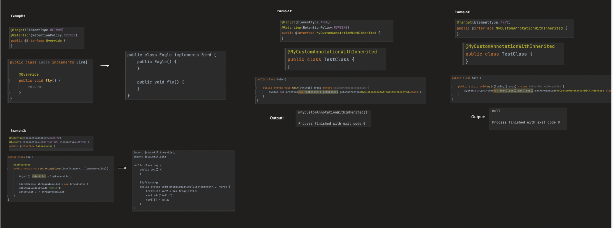

RetentionTYpe.class can be used by bytecode readers , compilers or tools which work with byte codes


3. **_DOCUMENTED :_**

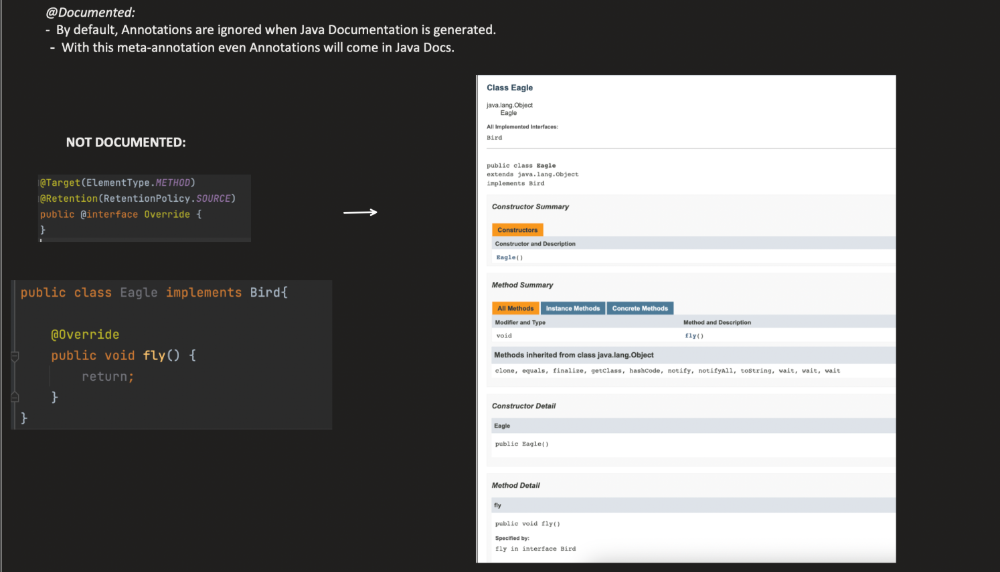


Java docs are created by reading .java files the human wriiten files before compilation

🔹 2️⃣ Generate Javadoc in IntelliJ
Tool Used:

👉 javadoc (comes with JDK)

**_Steps in IntelliJ:**_

Go to:

    Tools → Generate JavaDoc

Choose:

        Output directory
        Scope (module/package)
        Click OK

It generates HTML documentation.

Then open:

        index.html

in the generated folder.


4. **_@Inherited :_**

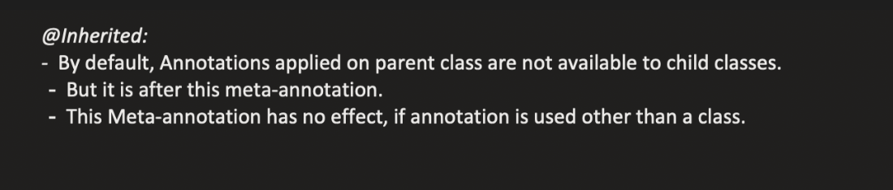

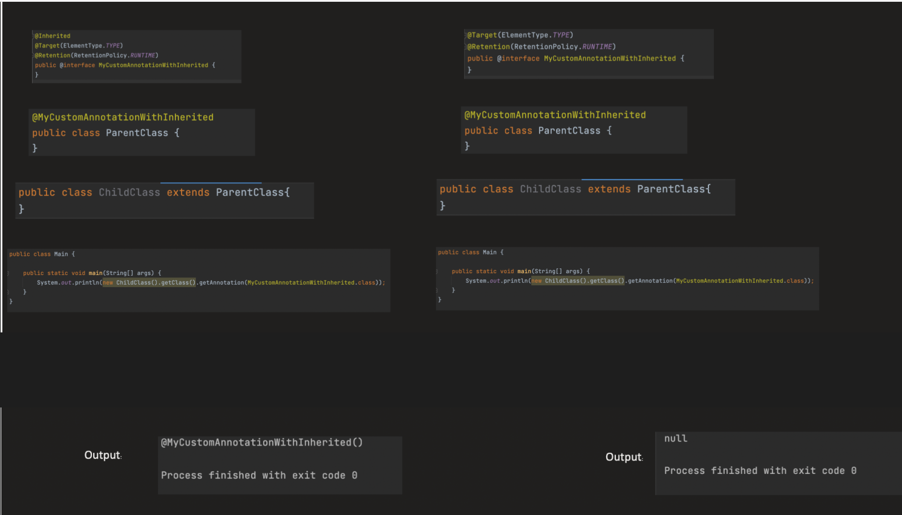


5. **_@Repetable :_**

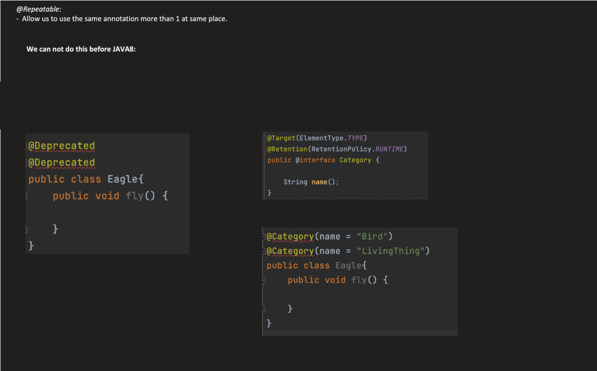

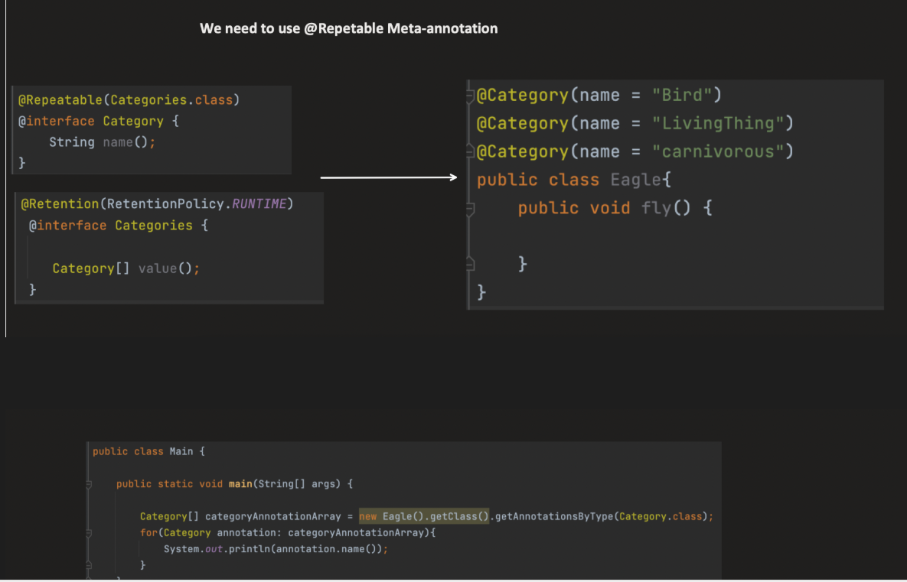


===> CUSTOM ANNOTATIONS :


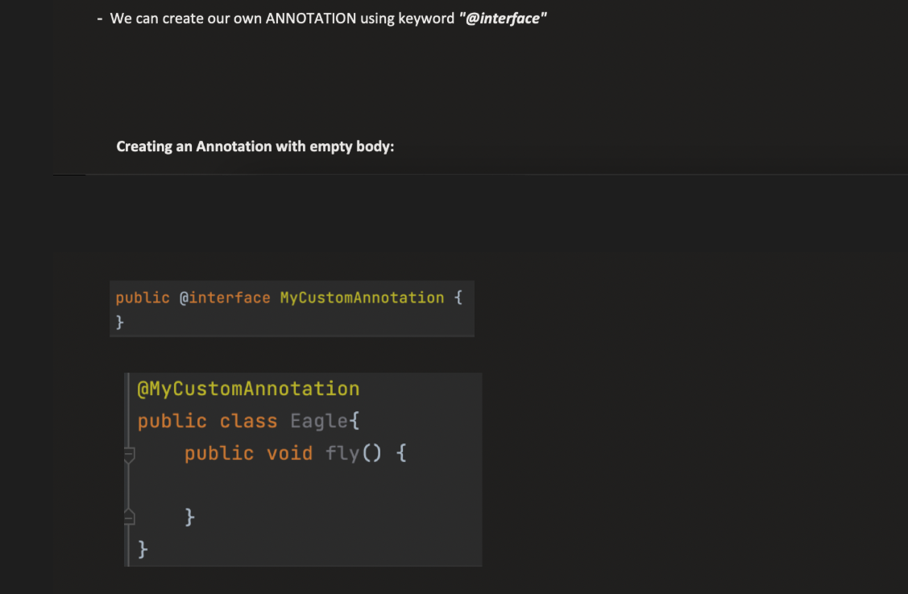

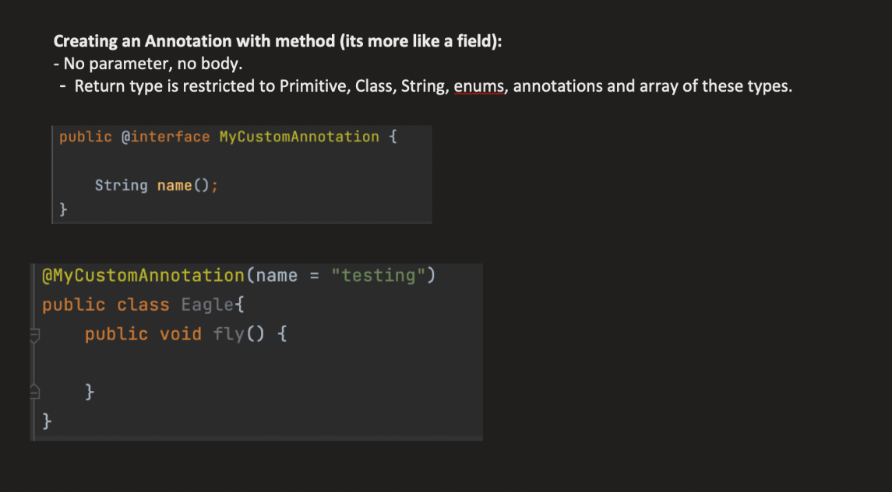

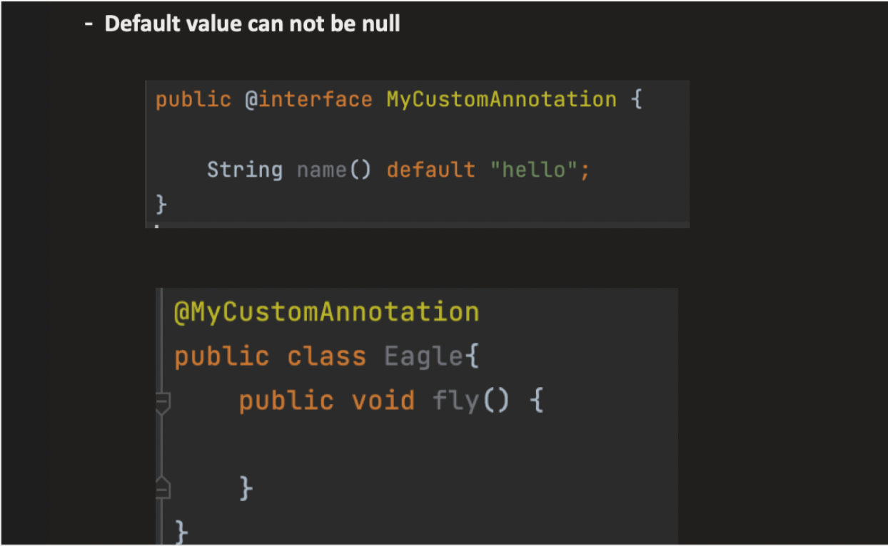


--------------------------------------------------------------------------------------------------------------------------------------


Problem with repetable , why it is used

🔹 The Problem Before Java 8

Before Java 8, you could NOT write:

        @Role("ADMIN")
        @Role("USER")
        class Test {}

It was illegal.

So people had to write:

    @Roles({
    @Role("ADMIN"),
    @Role("USER")
    })
    class Test {}

Notice:

👉 A container annotation
👉 That container holds an array

🔹 Java 8 Solution: @Repeatable

Java 8 introduced:

        @Repeatable(Roles.class)
        @interface Role {
        String value();
        }

And container:

        @interface Roles {
        Role[] value();
        }

Now you can write:

        @Role("ADMIN")
        @Role("USER")
        class Test {}

But internally…

🔥 What Actually Happens?

The compiler rewrites this:

        @Role("ADMIN")
        @Role("USER")

Into this:

        @Roles({
        @Role("ADMIN"),
        @Role("USER")
        })

So the array is required because:

    The container annotation must store multiple annotation instances.
    And the only way to store multiple values in an annotation is:

👉 Using an array.


When you write:

    @interface Role {
    String value();
    }

        This is actually syntactic sugar for something like:

    public interface Role extends java.lang.annotation.Annotation {
    String value();
    }

Without repeatable this was how it was used

        @interface Roles {
        Role[] value();
        }

    Role is again an interface


---------------------------------------------------------------------------------------------------------------------------------------


# Java Annotations Complete Interview Guide

# Table of Contents

1. What are Annotations?
2. Why use Annotations?
3. Annotation Syntax
4. Built-in Annotations
5. Meta Annotations
6. Custom Annotations
7. Reflection with Annotations
8. Retention Policy
9. Target Types
10. Repeatable Annotations
11. Type Annotations
12. Marker Annotations
13. Single Value Annotations
14. Multi Value Annotations
15. Annotation Processing
16. Built-in Examples
17. Best Practices
18. Common Interview Questions
19. Quick Revision Sheet

---

# 1. What are Annotations?

Annotations are metadata.

They provide information about the code.

They DO NOT directly change program execution.

Compiler, JVM, frameworks and tools read them.

Examples:

- @Override
- @Deprecated
- @SuppressWarnings

Example

```java
@Override
public String toString() {
    return "Hello";
}
```

---

# 2. Why use Annotations?

Used by

- Compiler
- JVM
- Reflection
- Frameworks

Examples

Spring

```java
@Service
```

JUnit

```java
@Test
```

JPA

```java
@Entity
```

Lombok

```java
@Getter
```

---

# 3. Annotation Syntax

Simple

```java
@Override
```

With value

```java
@SuppressWarnings("unchecked")
```

Multiple values

```java
@Author(
    name="John",
    version=2
)
```

---

# 4. Built-in Java Annotations

---

## @Override

Tells compiler method overrides parent method.

Example

```java
class A{
    void print(){}
}

class B extends A{

    @Override
    void print(){}

}
```

Benefits

- Compile time safety
- Prevent spelling mistakes

Wrong

```java
@Override
void Print(){}
```

Compiler Error.

---

## @Deprecated

Marks old APIs.

```java
@Deprecated
public void oldMethod(){}
```

Compiler shows warning.

Replacement

```java
@Deprecated(since="17", forRemoval=true)
```

---

## @SuppressWarnings

Suppress compiler warnings.

```java
@SuppressWarnings("unchecked")
```

Common values

```
unchecked
rawtypes
deprecation
serial
unused
```

Example

```java
@SuppressWarnings("rawtypes")
List list = new ArrayList();
```

---

## @FunctionalInterface

Ensures interface has one abstract method.

```java
@FunctionalInterface
interface Calculator{

    int add(int a,int b);

}
```

Compiler error if multiple abstract methods.

---

## @SafeVarargs

Suppresses heap pollution warning.

Applicable

- final methods
- static methods
- constructors

```java
@SafeVarargs
static <T> void print(T... args){}
```

---

## @Native

Used for native constants.

Rarely used.

---

# 5. Meta Annotations

Meta annotations annotate annotations.

---

## @Target

Specifies where annotation can be used.

Example

```java
@Target(ElementType.METHOD)
```

Possible values

```
TYPE
FIELD
METHOD
PARAMETER
CONSTRUCTOR
LOCAL_VARIABLE
PACKAGE
ANNOTATION_TYPE
TYPE_PARAMETER
TYPE_USE
MODULE
RECORD_COMPONENT
```

---

## @Retention

Defines lifetime.

Three types

SOURCE

```
Compiler removes annotation.
```

CLASS

```
Stored in class file.

Not available at runtime.
```

RUNTIME

```
Available using Reflection.
```

Example

```java
@Retention(RetentionPolicy.RUNTIME)
```

---

## @Documented

Included in JavaDocs.

```java
@Documented
```

---

## @Inherited

Child class inherits annotation.

Example

```java
@Inherited
@interface MyAnnotation{}
```

---

## @Repeatable

Allows multiple annotations.

```java
@Repeatable(Roles.class)
```

---

# 6. Creating Custom Annotation

```java
@Retention(RetentionPolicy.RUNTIME)
@Target(ElementType.TYPE)
@interface Author{

    String name();

}
```

Usage

```java
@Author(name="Bharath")
class Test{}
```

---

Multiple fields

```java
@interface Info{

    String author();

    int version();

}
```

Usage

```java
@Info(
    author="Alex",
    version=2
)
```

---

Default value

```java
@interface Author{

    String value() default "Unknown";

}
```

Usage

```java
@Author
```

or

```java
@Author("John")
```

---

# 7. Marker Annotation

Contains no members.

```java
@interface Test{}
```

Usage

```java
@Test
```

---

# 8. Single Value Annotation

```java
@interface Author{

    String value();

}
```

Usage

```java
@Author("Alex")
```

---

# 9. Multi Value Annotation

```java
@interface Employee{

    String name();

    int age();

}
```

Usage

```java
@Employee(
name="Alex",
age=25
)
```

---

# 10. Reflection

Read annotation during runtime.

Example

```java
@Retention(RetentionPolicy.RUNTIME)
@interface Developer{

    String value();

}
```

```java
@Developer("Alex")
class Test{}
```

Reading

```java
Class<?> cls = Test.class;

Developer d =
cls.getAnnotation(Developer.class);

System.out.println(d.value());
```

Output

```
Alex
```

---

# 11. Repeatable Annotation

Without Repeatable

Only one annotation allowed.

With Repeatable

```java
@Role("Admin")
@Role("Manager")
```

Annotation

```java
@Repeatable(Roles.class)
@interface Role{

    String value();

}
```

Container

```java
@interface Roles{

    Role[] value();

}
```

---

# 12. Type Annotation (Java 8)

Can annotate any type.

Example

```java
List<@NonNull String>
```

```java
new @Readonly File()
```

---

# 13. Annotation Processing

Compile time processing.

Example

Lombok

```
@Getter
@Setter
```

Compiler generates methods.

Used by

- Lombok
- Dagger
- AutoValue
- MapStruct

---

# 14. Built-in Annotation Summary

| Annotation           | Purpose                |
|----------------------|------------------------|
| @Override            | Method override        |
| @Deprecated          | Marks obsolete API     |
| @SuppressWarnings    | Ignore warnings        |
| @FunctionalInterface | Single abstract method |
| @SafeVarargs         | Safe varargs           |
| @Native              | Native constant        |

---

# 15. Meta Annotation Summary

| Annotation  | Purpose              |
|-------------|----------------------|
| @Target     | Applicable elements  |
| @Retention  | Lifetime             |
| @Inherited  | Child inheritance    |
| @Repeatable | Multiple annotations |
| @Documented | JavaDoc              |

---

# 16. Retention Summary

| Policy   | Available     |
|----------|---------------|
| SOURCE   | Compiler only |
| CLASS    | Bytecode only |
| RUNTIME  | Reflection    |

---

# 17. Target Summary

| Target         | Example           |
|----------------|-------------------|
| TYPE           | Class             |
| METHOD         | Method            |
| FIELD          | Variable          |
| PARAMETER      | Parameter         |
| CONSTRUCTOR    | Constructor       |
| LOCAL_VARIABLE | Local variable    |
| TYPE_USE       | Java 8 types      |
| PACKAGE        | package-info.java |

---

# 18. Best Practices

✔ Use @Override always

✔ Prefer RUNTIME only when needed

✔ Use SOURCE for compile-time tools

✔ Use @Documented for public APIs

✔ Avoid unnecessary custom annotations

✔ Keep annotation names meaningful

---

# 19. Common Interview Questions

## What are annotations?

Metadata attached to program elements.

---

## Do annotations change program execution?

No.

Frameworks or reflection use them.

---

## Difference between annotation and interface?

Annotation stores metadata.

Interface defines behavior.

---

## Difference between SOURCE CLASS and RUNTIME?

SOURCE

Removed after compilation.

CLASS

Stored in bytecode.

Not available via reflection.

RUNTIME

Available through reflection.

---

## Why is @Override useful?

Compiler checks overriding.

---

## Why use @FunctionalInterface?

Guarantees exactly one abstract method.

---

## Can annotations have methods?

Yes.

Example

```java
@interface Info{

    String author();

}
```

---

## Can annotation extend another annotation?

No.

---

## Can annotation extend interface?

No.

---

## Can annotation contain fields?

No instance fields.

Only methods.

---

## Can annotation contain default values?

Yes.

```java
String name() default "Unknown";
```

---

## Why does annotation use methods instead of fields?

Because annotation values are immutable metadata.

---

## Which retention policy is used for Spring?

RUNTIME

Because reflection is used.

---

## Which retention policy is fastest?

SOURCE

No runtime overhead.

---

## What is reflection?

Inspect classes during runtime.

---

## Which annotations are frequently asked?

★★★★★

- @Override
- @Deprecated
- @SuppressWarnings
- @FunctionalInterface
- @Target
- @Retention
- @Inherited
- @Repeatable

---

# 20. Quick Revision Sheet

Annotations = Metadata

Compiler Annotations

- @Override
- @Deprecated
- @SuppressWarnings
- @FunctionalInterface
- @SafeVarargs

Meta Annotations

- @Target
- @Retention
- @Inherited
- @Repeatable
- @Documented

Retention

SOURCE

↓

CLASS

↓

RUNTIME

Custom Annotation

```java
@Retention(RetentionPolicy.RUNTIME)
@Target(ElementType.TYPE)
@interface Author{

    String value();

}
```

Reflection

```java
Class<?> cls = Test.class;

Author a =
cls.getAnnotation(Author.class);
```

Interview Must Know

✔ Override

✔ FunctionalInterface

✔ Retention

✔ Target

✔ Reflection

✔ Custom Annotation

✔ Repeatable Annotation

✔ Annotation Processing


Marker Annotation

A marker annotation is an annotation that contains no members (methods).

It simply marks a program element so that the compiler, JVM, or a framework can treat it specially.

Syntax
@interface Test {
}

There are no methods inside the annotation.

Example
@interface Important {
}

Usage

@Important
class Employee {
}

The annotation only indicates that the class is "Important."

Reading Marker Annotation
import java.lang.annotation.*;

@Retention(RetentionPolicy.RUNTIME)
@Target(ElementType.TYPE)
@interface Important {
}

@Important
class Employee {
}

public class Main {

    public static void main(String[] args) {

        Class<Employee> cls = Employee.class;

        if(cls.isAnnotationPresent(Important.class)){
            System.out.println("Important Class");
        }

    }

}

Output

Important Class
Real Java Marker Annotations
@Override
@Override
public String toString() {
return "Hello";
}

Although it has no parameters, it is not technically a marker annotation because it's defined differently in the language specification, but conceptually it behaves like one.

@Deprecated

Not a marker annotation because it has optional members.

@Deprecated(since = "17")
Marker annotations in frameworks

JUnit

@Test

(Modern versions actually define members, so it's no longer a pure marker.)

Spring

@Configuration

Not a marker because it contains meta-information.

When to use Marker Annotations?

When you only need to answer:

"Is this element marked or not?"

Examples:

Serializable classes
Test classes
Security checks
Logging
Special processing
Interview Question
Why use a marker annotation instead of a boolean field?

Because:

Doesn't modify object state
Can be accessed through reflection
Keeps metadata separate from business logic
Frameworks can process it automatically
2. Type Annotations (Java 8)

Before Java 8, annotations could only be placed on declarations.

Example

@Override
public void print() {
}

Java 8 introduced type annotations, allowing annotations to be applied wherever a type is used.

Declaration Annotation
@NotNull
class Employee {
}

The annotation is on the declaration.

Type Annotation
List<@NotNull String> names;

Here the annotation is on the type argument (String).