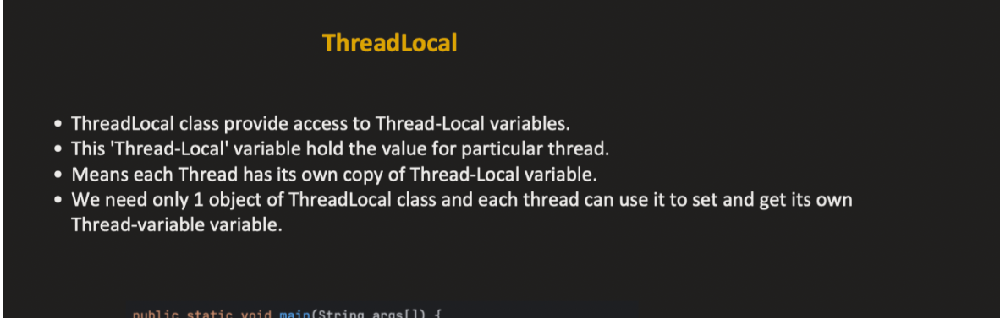
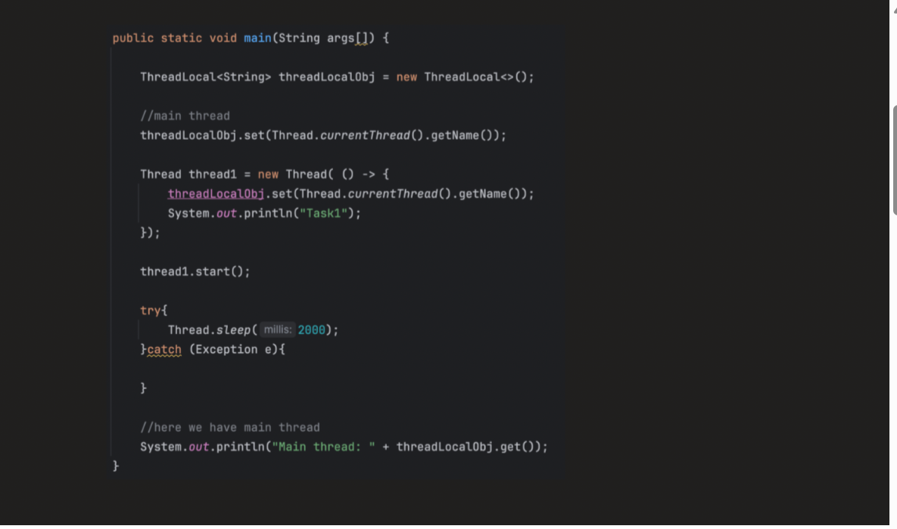
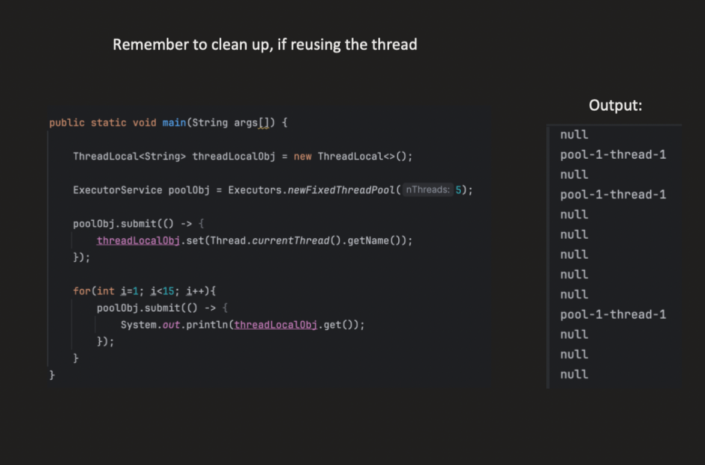
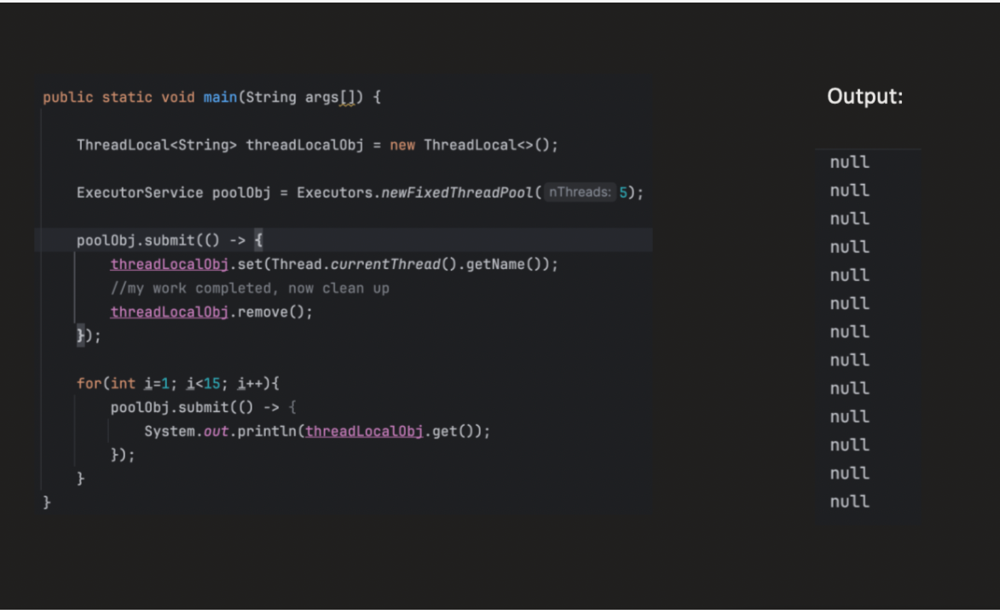
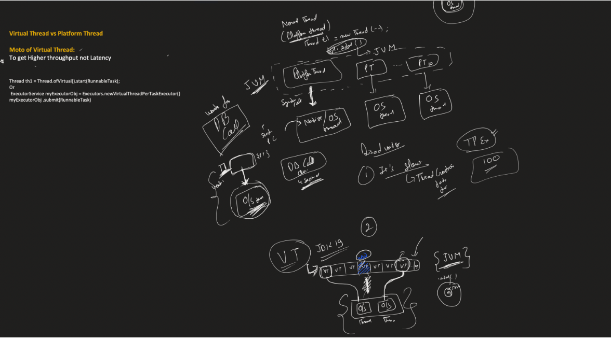

**_ThreadLocal :**_

    ThreadLocal<T> provides variables that are local to a thread. Each thread accessing the variable gets its own independent copy.

Key points:

        Each thread sees its own value.
        Values are not shared across threads.
        Thread-local values are attached to the thread itself, not the ThreadLocal object.


Normally:

    A variable is shared between multiple threads → can cause conflicts.

With ThreadLocal:
    
    Each thread gets its own independent copy of the variable.
    One thread cannot see or modify another thread’s value.
🔧 Why use ThreadLocal?

It’s useful when:
    
    You want to avoid synchronization issues (no need for locks).
    Each thread needs its own state (like user session, database connection, etc.).

2️⃣ How it works internally

Every Java thread has a thread-local map:

        Thread ──> ThreadLocalMap ──> (ThreadLocal key, value)

    Each Thread object has a ThreadLocalMap.
    The key is the ThreadLocal instance, and the value is the thread-specific value.
    When you do threadLocal.get(), it looks up its value in the thread’s map.
    So even if two threads use the same ThreadLocal object, they get different values.

3️⃣ Why use ThreadLocal?

We use ThreadLocal when we need:


        Per-thread context/state accessible throughout the thread without passing as a parameter.
        Avoid synchronization for thread-specific data.
        Maintain consistency in tasks that span multiple methods.

**_a ThreadLocal object stores only one value per thread, but a thread can have many ThreadLocal variables.**_

Typical Use Cases
A. User / Request Context (Web apps)

1️⃣ Security context in a web application

    In frameworks like Spring Security, the current user / authentication info is stored in a ThreadLocal.
    This works perfectly within the same thread handling the request.

```java


ThreadLocal<SecurityContext> contextHolder;
SecurityContext context = contextHolder.get(); // current user info

```

Why useful:

        Every request handled by a thread can access the current user anywhere in the call stack.
        No need to pass user parameter to every method.
        When we are sending it to another ms we need to send the auth details which is in security context if we made the security context as threadlocal it will be in thread itself
        No need to pass security context as an argument from one metho dto another or get from where it is stored.
       Here, you can read the ThreadLocal security context and attach it to the outgoing request headers.


        A single database connection per request or per unit of work.
        That all methods in the call stack use the same connection.
        We don’t want to pass the connection as a parameter to every method.
        We don’t want multiple threads interfering, so synchronization is unnecessary.


✅ Option 1: Multiple ThreadLocal variables

        ThreadLocal<Integer> userId = new ThreadLocal<>();
        ThreadLocal<String> userName = new ThreadLocal<>();
        
        userId.set(101);
        userName.set("Bharath");
        
        ✔ Each ThreadLocal holds its own value
        ✔ Same thread can access both independently

```java

Without ThreadLocal
void methodA() {
    Connection conn = dataSource.getConnection();
    methodB(conn);
}

void methodB(Connection conn) {
    conn.prepareStatement("...");
}


```


    Every method now must receive conn as a parameter.
    In a large codebase, this becomes cumbersome.

```java

public class TransactionManager {
    private static ThreadLocal<Connection> connHolder = new ThreadLocal<>();

    public static void startTransaction() throws SQLException {
        // create a new connection and store it for this thread
        connHolder.set(dataSource.getConnection());
    }

    public static void commit() throws SQLException {
        connHolder.get().commit(); // same connection as startTransaction
    }

    public static void rollback() throws SQLException {
        connHolder.get().rollback();
    }

    public static void close() throws SQLException {
        connHolder.get().close();
        connHolder.remove(); // clean up
    }
}
```

How it works:

ThreadLocal stores the connection per thread.
Thread-0 has its own connection.
Thread-1 has its own connection.
Any method called later in the same thread can access the connection:


```java
void serviceMethod() throws SQLException {
    TransactionManager.startTransaction();
    try {
        dao.insertData();      // uses connHolder.get()
        dao.updateData();      // uses same connection
        TransactionManager.commit();
    } catch (Exception e) {
        TransactionManager.rollback();
    } finally {
        TransactionManager.close(); // important!
    }
}
```










Every Thread has a field like:
      
      class Thread {
      ThreadLocalMap threadLocals;
      }
   
Think of it as:

Thread-1
      
      threadLocals
      {
      userThreadLocal      -> "bharath",
      requestIdThreadLocal -> 123
      }
      
      Thread-2
      threadLocals
      {
      userThreadLocal      -> "john",
      requestIdThreadLocal -> 456
      }


🔥 Real Use Case (Very Important)
🧾 Example: User Request in Web App

Imagine:

100 users hitting your API
Each request runs on a different thread

You need to store:

userId
requestId
auth details
❌ Without ThreadLocal

You must pass data everywhere:

void controller(Request req) {
service(req.getUserId());
}

void service(String userId) {
repository(userId);
}

👉 Problem:

You keep passing userId everywhere (tight coupling)
Messy code
❌ OR use shared variable (BAD)
static String currentUser;

👉 Problem:

Thread A sets "User1"
Thread B sets "User2"
Now both threads see wrong values ❌

✅ With ThreadLocal (Clean Solution)
      
      static ThreadLocal<String> currentUser = new ThreadLocal<>();
      // Controller
      currentUser.set("User1");
      
      // Anywhere in same thread
      String user = currentUser.get();

✔ No need to pass parameter
✔ No data conflict
✔ Clean architecture

🧠 What happens internally?

Each thread has:
      
      Thread
      └── ThreadLocalMap
      ├── ThreadLocal → value
      
      👉 So:
      
      Thread A → User1
      Thread B → User2

They never collide.

⚠️ What if we DON’T use ThreadLocal?
1. You use shared variables

→ ❌ Data corruption
→ ❌ Race conditions

2. You use synchronization
   synchronized method

→ ❌ Slower performance
→ ❌ Thread blocking
→ ❌ Scalability issues

3. You pass data everywhere

→ ❌ Ugly code
→ ❌ Hard to maintain
→ ❌ Breaks clean layering

🔥 Where ThreadLocal is used in real systems
1. Spring Security

Stores logged-in user context

2. Transactions

Spring uses it to bind DB transaction to a thread

3. Logging (MDC)

Stores requestId for tracing logs

4. Hibernate Session

Session per thread

⚠️ Important drawback

If you forget:

threadLocal.remove();

👉 In thread pools:

Thread gets reused
Old data leaks into new request ❌ (very dangerous)

**_VIRTUAL THREADS :**_

Virtual threads are a new type of lightweight thread introduced in Java (Project Loom).

Key points:
        
        Managed by the JVM, not the OS.
        Many virtual threads can share a small number of OS threads.
        Ideal for I/O-bound tasks where threads spend most time waiting.
        Allows writing blocking-style code (read, write) that scales to millions of threads without memory or scheduling overhead.

Before virtual threads:

        Platform threads (normal threads) in Java map 1-to-1 with OS threads.
        Each thread requires OS resources (memory stack, kernel scheduling).
        Creating thousands of threads is expensive in memory and scheduling overhead.

Example Problem:
    
    Server needs to handle 100,000 concurrent connections.
    - Using platform threads, you need 100,000 OS threads.
      - Memory usage = huge (each thread ~1 MB stack by default)
      - Scheduling overhead = high
      - Many threads will be blocked on I/O → CPU idle

✅ Key issue: threads are expensive and inefficient for I/O-bound workloads.

**_2️⃣ Virtual Threads (Project Loom) (Java 21)**_

Definition:
    
    Virtual threads are lightweight threads managed by the Java runtime (JVM) instead of the OS.
    They allow millions of threads to run concurrently with minimal overhead.


3️⃣ How Virtual Threads Work (Internally)
    
    Many-to-One Mapping
    Virtual threads do not have a dedicated OS thread.
    JVM maintains a scheduler that assigns virtual threads to available OS threads when they need to execute.

Example:

        - 10 Virtual Threads (V1–V10)
          - 2 OS threads (O1, O2)
          - Execution:
              - V1 runs on O1
              - V2 runs on O2
              - V3 waits → gets scheduled on O1 when V1 blocks on I/O

Blocking Operations Are Handled Efficiently
    
    In traditional threads: If a thread performs blocking I/O, its OS thread is idle.
    In virtual threads: JVM pauses the virtual thread, frees the OS thread, and lets another virtual thread run.
    This allows high concurrency without needing thousands of OS threads.

4️⃣ Why Virtual Threads Are Ideal for I/O-bound Tasks
        
        I/O-bound tasks spend most time waiting for data (network, DB, file).
        Traditional threads: OS threads sit idle → waste resources.
        Virtual threads: JVM detaches the waiting thread, runs another virtual thread → CPU stays busy.


1️⃣ What are carrier threads?

        A carrier thread is a real OS thread that the JVM uses to execute virtual threads.
        Virtual threads themselves are lightweight and don’t need their own OS thread.
        When a virtual thread runs, the JVM schedules it onto a carrier thread.
        Think of it as “a real worker (OS thread) running lightweight tasks (virtual threads)”.

2️⃣ Who creates the carrier threads?

JVM creates and manages carrier threads automatically.
Default behavior:
    
    Number of carrier threads is usually proportional to the number of CPU cores.
    JVM uses an internal executor / ForkJoinPool to run virtual threads.
    You do not create or manage carrier threads yourself; you only create virtual threads.

3️⃣ How it works internally
    
    You create a virtual thread:
    Thread vThread = Thread.startVirtualThread(() -> doSomeWork());
    JVM schedules this virtual thread onto a carrier thread.
    If the virtual thread blocks (e.g., waiting for I/O), the JVM detaches it from the carrier thread:
    Carrier thread is free to run other virtual threads.
    Virtual thread is paused until ready.
    Millions of virtual threads can run concurrently on a small number of carrier threads.


Carrier thread is created and managed by the JVM only when virtual thread is needed



Advantages:

    High scalability (millions of threads).
    Cheap to create and schedule.
    Simplified code: blocking I/O works naturally.
    No need for complex reactive frameworks for concurrency.


🔑 What actually happens

When you start using virtual threads:

Thread.startVirtualThread(() -> {});
Behind the scenes:
JVM uses an internal scheduler (based on ForkJoinPool)
That scheduler:
creates a small number of OS threads
usually ≈ number of CPU cores
These OS threads are then used as carrier threads


        
        🔥 Example: Handling 10,000 requests
        ❌ Using normal threads
        ExecutorService executor = Executors.newFixedThreadPool(100);
        
        for (int i = 0; i < 10000; i++) {
        executor.submit(() -> {
        try {
        Thread.sleep(1000); // simulate I/O
        System.out.println("Handled by " + Thread.currentThread());
        } catch (Exception e) {}
        });
        }
        🚨 What happens:
        Only 100 threads available
        Remaining 9900 tasks wait in queue
        Each sleep():
        blocks the OS thread ❌
        Poor scalability
        ✅ Using virtual threads
        for (int i = 0; i < 10000; i++) {
        Thread.startVirtualThread(() -> {
        try {
        Thread.sleep(1000); // simulate I/O
        System.out.println("Handled by " + Thread.currentThread());
        } catch (Exception e) {}
        });
        }
        🚀 What happens:
        10,000 virtual threads created easily
        When sleep() happens:
        virtual thread is paused
        OS thread is released ✅
        OS thread runs another virtual thread
        
        👉 So:
        
        No blocking at OS level
        Massive scalability


1. What is ThreadLocal?

         ThreadLocal provides a separate copy of a variable for each thread.
         
         Normally:
         
            class Counter {
            int count = 0;
            }
         
         If multiple threads access count, they share the same variable.
         With ThreadLocal:
         ThreadLocal<Integer> count = ThreadLocal.withInitial(() -> 0);
         Each thread gets its own value.

2. How is it stored internally?

Interview answer:

      Every Thread object contains a ThreadLocalMap.
      When you call threadLocal.set(value), the value is stored in the current thread's ThreadLocalMap.
      
      Key = ThreadLocal object
      Value = actual data
      
      Conceptually:
            
            Thread-1
            ThreadLocalMap
            UserContext -> John
            
            Thread-2
            ThreadLocalMap
            UserContext -> Alice
      
      Same ThreadLocal object.

Different values.

3. Why not use a normal static variable?

Example:

      public class UserContext {
      
          static String user;
      }

      Request 1:
      
      user = "John";
      
      Request 2:
      
      user = "Alice";
      
      Both requests overwrite each other.
      
      Race condition.
      
      With ThreadLocal:
      
      ThreadLocal<String> user = new ThreadLocal<>();
      user.set("John");
      
      and
      
      user.set("Alice");
      
      are isolated.

4. Real-world Spring Boot use case

         Authentication context.
         Suppose a request arrives.
         POST /transfer
         
         User:
         
         bharath
         
         Filter extracts user.
         
         UserContext.setCurrentUser("bharath");
         
         Service layer:
         
         transferMoney();
         
         Deep inside:
         
         auditService.log();
         
         Audit service can get current user without passing it through 20 method calls.
         
         UserContext.getCurrentUser();
         
         using ThreadLocal.
         
         Without ThreadLocal:
         
         controller(user)
         -> service(user)
         -> repository(user)
         -> audit(user)
         
         You must pass user everywhere.
         
         Messy.
5. Why must we remove ThreadLocal?

         Application servers use thread pools.
         Thread-1 handles Request A
         Thread-1 handles Request B
         If you don't clear:
      
         threadLocal.remove();
         Request B may see Request A's data.
      
         Example:
      
         User = John
      
         stored.
      
         Thread returned to pool.
      
         Next request:
      
         User = Alice
      
         Same thread reused.
      
         If not removed:
      
         Alice's request sees John
      
         Bad bug.
      
         Therefore:
      
         try {
         threadLocal.set(user);
         process();
         }
         finally {
         threadLocal.remove();
         }
 6. What are Virtual Threads?

         Introduced in Java 21.
   
         Traditional thread:
   
         Thread.ofPlatform()
   
         Virtual thread:
   
         Thread.ofVirtual()
   
         or
   
         Executors.newVirtualThreadPerTaskExecutor();

7. Why were Virtual Threads created?

       Platform threads map roughly to OS threads.
       OS threads are expensive.
       Creating 100,000 OS threads is difficult.
       Virtual threads are lightweight.
   
       You can create:
   
          1 million virtual threads
   
       much more easily.

 8. Why do people say Virtual Threads are managed by JVM?

         Platform thread:
   
         Java Thread
         ↓
         OS Thread
   
         OS scheduler decides when it runs.
   
         Virtual thread:
   
         Virtual Thread
         ↓
         JVM Scheduler
         ↓
         Few OS Threads
   
         The JVM schedules many virtual threads onto a smaller set of OS threads.
   
         This is why people say:
   
         Virtual Threads are managed by the JVM.

9. ThreadLocal with Virtual Threads

       Works normally.
   
       ThreadLocal<String> user = new ThreadLocal<>();
       Thread.startVirtualThread(() -> {
       user.set("John");
       });
   
       No problem.
   
       Each virtual thread gets its own ThreadLocalMap.

10. Why can ThreadLocal become problematic with Virtual Threads?

         Suppose: 100000 virtual threads
      
         Each has:
      
         ThreadLocal<User>
      
         Now you have:
      
         100000 copies
      
         of data.
      
         Memory usage can become large.
      
         Also, some frameworks historically assumed a small number of threads and stored lots of context in ThreadLocals.
      
         With virtual threads, that assumption may no longer hold.

11. Interview Question: Does ThreadLocal break with Virtual Threads?

Answer:

      No.
      
      ThreadLocal works correctly with Virtual Threads.
      
      However, excessive use of ThreadLocal can increase memory usage because every virtual thread maintains its own ThreadLocal values.

12. Most likely interview question

Q: Difference between Platform Thread and Virtual Thread?

| Platform Thread     | Virtual Thread     |
| ------------------- | ------------------ |
| Backed by OS thread | Managed by JVM     |
| Expensive           | Lightweight        |
| Thousands possible  | Millions possible  |
| Higher memory usage | Lower memory usage |
| OS scheduler        | JVM scheduler      |


Platform Threads vs Virtual Threads — Summary

A platform thread is backed by a real OS thread. When a platform thread is created, the operating system allocates a dedicated native stack for it inside the JVM process's memory space. 
This stack stores the thread's local variables, method calls, and execution state. Because every platform thread requires its own OS-managed stack and kernel resources, creating and managing large numbers of platform threads is expensive.
A virtual thread also has its own logical stack, but it is managed by the JVM rather than the operating system. 
Instead of allocating a dedicated native stack for every virtual thread, the JVM stores the virtual thread's stack frames and execution state in JVM-managed memory and schedules many virtual threads onto a small pool of OS threads called carrier threads. 
When a virtual thread blocks (for example, during I/O or sleep), the JVM saves its state, detaches it from the carrier thread, and allows that carrier thread to run other virtual threads. 
This enables applications to create millions of virtual threads with much lower memory and scheduling overhead than platform threads. 


    List<Thread> threads = new ArrayList<>();
    
    for(int i=0; i<1000; i++) {
        Thread vt = Thread.ofVirtual().start(() ->       // Thread vt = Thread.startVirtualThread(() -> {
                System.out.println("hello" + Thread.currentThread())
        );
        threads.add(vt);
    }


    for(Thread th : threads) {
        th.join();
    }

    List<Thread> threads = new ArrayList<>();

    for(int i=0; i<1000; i++) {
        Thread vt = Thread.startVirtualThread(() -> {
            System.out.println("Running");
        });
        threads.add(vt);
    }


    for(Thread th : threads) {
        th.join();
    }


    var executor = Executors.newVirtualThreadPerTaskExecutor();
    List<Future<String>> futureStrings = new ArrayList<>();
    for(int i=0; i<1000; i++) {
        Future<String> s = executor.submit(() -> {
            return "I am " + Thread.currentThread() ;
        }
        );
        futureStrings.add(s);
    }


    for(Future<String> s : futureStrings) {
        System.out.println(s.get());
    }


