JVM (Java Virtual Machine) :
    
    JVM executes Java programs by converting bytecode (.class files) into machine code using an interpreter and Just-In-Time (JIT) compiler.
    JVM is responsible for:
    Loading classes (Class Loader)
    Verifying bytecode
    Memory management (Heap, Stack, Method Area, etc.)
    Garbage Collection (GC)
    Executing bytecode
    JVM is platform-dependent (Windows has a Windows JVM, Linux has a Linux JVM).
    Java is platform-independent because the same bytecode can run on any JVM.

JRE (Java Runtime Environment)

    JRE = JVM + Core Libraries + Runtime Components

It contains:

    JVM
    Java standard libraries (e.g., java.lang, java.util, java.io, Math)
    Other runtime files required to run Java applications

Purpose: Run Java applications.

    JRE does not contain the Java compiler (javac).

JDK (Java Development Kit)

    JDK = JRE + Development Tools

    It contains everything in the JRE plus tools like:
    
    javac (Java compiler)
    java (launcher)
    jdb (debugger)
    javadoc
    jar
    jconsole
    jps, jstack, jmap, etc.

    Purpose: Develop, compile, debug, package, and run Java applications.


                    JVM
                    │
        ┌───────────┴───────────┐
        │                       │
    Class Loader          Runtime Data Areas
    Subsystem                   │
    │                       │
    │               ┌───────┴────────┐
    │               │                │
    │             Heap            Method Area
    │               │                │
    │             Stack          Metaspace
    │
    └──────────────→ Execution Engine
    │
    ┌─────┼─────┐
    │     │     │
    Interpreter JIT  GC
    │
    Code Cache


    JVM Memory
    │
    ├── Heap (Shared)
    │     ├── Young Gen (Eden + S0 + S1)
    │     ├── Old Gen
    │     └── String Pool
    │
    ├── Method Area (Shared)
    │     ├── Class Metadata
    │     ├── Method Metadata
    │     ├── Static Variables
    │     ├── Runtime Constant Pool
    │     └── Bytecode
    │
    ├── Stack (Per Thread)
    │     └── Stack Frames
    │
    ├── PC Register (Per Thread)
    │
    └── Native Method Stack

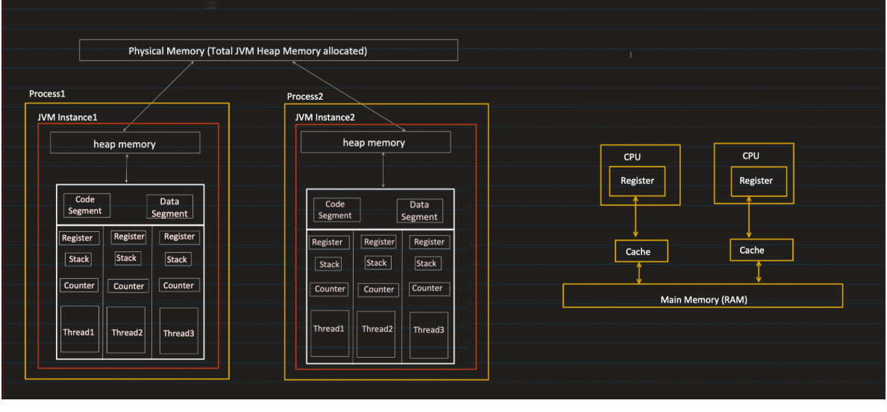


Process Memory
│
├── JVM Managed Memory
│     ├── Runtime Data Areas
│     │     ├── Heap
│     │     ├── Metaspace
│     │     ├── Stack
│     │     ├── PC Register
│     │     └── Native Stack
│     │
│     ├── Code Cache
│     ├── Direct Memory
│     └── GC Structures
│
└── Other OS Memory


**_RUNTIME DATA AREAS :_**

1. Stack : 


---> Each thread in Java consists of seperate Stack
---> Stack is not shared between 2 threads
---> Whenever a method is called a new stack frame is created

---> A Stack Frame is: A single method execution block inside the stack.

Top of Stack
┌──────────────┐
│ methodB()    │  ← Stack Frame
├──────────────┤
│ methodA()    │  ← Stack Frame
├──────────────┤
│ main()       │  ← Stack Frame
└──────────────┘
Bottom of Stack


Each stack frame contains:

    1️⃣ Local Variables
    2️⃣ Method Parameters
    3️⃣ Operand Stack Operand Stack – temporary storage for computation.
    4️⃣ Return Address(the method which it needs to return)
    5. Reference variables

         --> Strong reference
         --> Weak reference
         --> Soft reference

        ---> Reference variables hold the address of the objects like below
       User u = new User()
        u → 0x7f12a0

    The return variable is added inside the caller method's stack frame befor this method gets popped
    Variables are visible only within the scope (that is within the stack frame)
    When goes out of stack(method gets completed) variables gets deleted in LIFO order


When stack memory becomes full it throws java.lang.StackOverFlow error


🔹 1️⃣ Strong References (Default)

What it is: The normal references you use every day.

Syntax:

        User u = new User();  // strong reference

GC Behavior:

        As long as a strong reference exists, object is never garbage collected.

Example:

    User u = new User();
    u = null;  // Now object is eligible for GC

Default in Java, used 99% of the time.

🔹 2️⃣ Soft References

    Purpose: Useful for caching objects.

Syntax:

    SoftReference<User> softUser = new SoftReference<>(new User());

GC Behavior:

    Object is collected only if JVM needs memory
    Otherwise, it stays in memory

Use Case:

    Caches that can be cleared if memory is low, e.g., image cache, computed values

Example:

    SoftReference<byte[]> cache = new SoftReference<>(new byte[1024*1024]);
    System.gc();  // JVM may or may not clear it depending on memory

🔹 3️⃣ Weak References

Purpose:

    Allow objects to be collected more aggressively than soft references.

Syntax:

    WeakReference<User> weakUser = new WeakReference<>(new User());

GC Behavior:

    Object is eligible for GC as soon as there are no strong references
    Used in maps or listeners where you don’t want memory leaks

Example:

    WeakHashMap<String, User> map = new WeakHashMap<>();
    map.put("key", new User());  // entry will disappear when key is no longer strongly referenced

🔹 4️⃣ Phantom References

For completeness (less commonly used):

    Purpose: Track objects after finalization but before actual memory is reclaimed

Syntax:

    PhantomReference<User> phantom = new PhantomReference<>(new User(), referenceQueue);

GC Behavior:

    Cannot get the object (get() always returns null)
    Mainly used to clean up resources manually


HEAP : 

    ---> A shared memory area where all Java objects and arrays are allocated at runtime.
    ---> It is managed by JVM Garbage Collector
    ---> Shared among all threads


| Item                          | Stored Where | Notes                              |
| ----------------------------- | ------------ | ---------------------------------- |
| Objects                       | Heap         | All instance variables live here   |
| Arrays                        | Heap         | Even primitive arrays              |
| String literals (String Pool) | Heap         | Inside special pool area           |
| Class instances               | Heap         | References to them stored in stack |


---> Garbage Collector is used to clean unreferenced heap objects

---> Heap is divided into 2 parts : Young Generation and Old Generation
---> Young Generation is divided into Eden , S0, S1(S0 and S1 are called survivor space)


Whenever we create an object newly the object is stored in eden
Whenever Garbage Collector runs it does something called mark and sweep algortihm

First it marks all the objects from young generation which doesnot have any reference , 
Then it removes the marked objects from memory 
Then it sweeps all the remaining objects from eden to S0 with age = 1
After removing the objects from memory and sweeping there will be holes in middle where memory is free so it does compaction i.e gps are filled with subsequent memory and the gaps are always at the end

The second time GC runs same thing happens when sweeping it also sweeps S0 to S1 with age = 2 and nextime S1 to S0 with incrementing ages

When the age reaches some threshold these objects are moved from young generation to old generation


This process of Garbage Collector doing mark and sweep in young generation is called minor Garbage collection


This process of Garbage Collector marking and removing objects in older generation is called major Garbage collection
Major gc occurs less frequently than minor gc

    When heap gets full it throws Out of Memory error


Types of GC;

1. Serial GC :

---> Only one thread is used for GC
----> GC is expensive since all other threads is passed when GC happens
----> If one thread is there will be more pause time

2. Parallel GC :


---> Multiple threads is used for GC
---> It will reduce the pause time very much lesser

3. COncurrent Mark and Sweep :

----> It tries to run concurrntly both GC thread and other threads but does not gaurantee 100%
---> It doesnot do compaction
--->Next allocation of a large object may fail if there’s no large enough contiguous space, even if total free memory is enough.

4. G1 Garbage COllection:

---> SImilar to Concurrent Mark and Sweep with compaction


🔹 1️⃣ Manual GC Invocation

In Java, you can hint to the JVM that you want garbage collection:

    System.gc();
    
    or
    
    Runtime.getRuntime().gc();

This does not guarantee that GC will run immediately.
It’s only a request, JVM may ignore it.
Modern JVMs generally manage GC automatically for efficiency.

🔹 3️⃣ When JVM Runs GC Automatically

    JVM triggers GC based on memory usage and garbage accumulation. Some common triggers:

1️⃣ Heap is getting full

    If Eden space (Young Generation) or Old Generation is full, JVM runs Minor or Major GC.

2️⃣ Allocation Failure

    When new cannot allocate enough contiguous memory in heap.

3️⃣ Soft Reference cleanup

    JVM may run GC to clear soft references if memory is low.


Java 9 and above uses G1 GC by default


--------------------------------------------------------------------------------------------------------------


## ⚙️ 2. **Runtime Data Areas**

This is the **memory layout** of JVM at runtime.  
It includes both **shared** and **thread-specific** areas.

### 🧮 A. Method Area (shared)

- Stores:

    - Class-level data (metadata)

    - Static variables

    - Method and field names

    - Runtime constant pool (literal and symbolic references)

- One per JVM.

- Garbage collected (in modern JVMs — part of **Metaspace** in Java 8+).
  ### 🔹 **2.1 Method Area (a.k.a Class Area / MetaSpace in Java 8+)**

- Stores **class metadata**, static variables, method bytecode, constant pool.

- Shared across all threads.

  ### ✔ **Static variable VALUES are stored in the HEAP.**

This surprises many people — but it is 100% correct for Java 8 and later
- The **value `10` of static variable `x` is stored in the Heap.**

- The **metadata “static int x” is stored in Metaspace** (because Metaspace stores class structure).

---

### 💾 B. Heap (shared)

- Stores **objects and arrays**.

- Common to all threads.

- Managed by **Garbage Collector (GC)**.


Divided into:

1. **Young Generation**

    - Eden + Survivor spaces (S0, S1)

    - New objects created here.

    - Minor GC happens frequently.

2. **Old (Tenured) Generation**

    - Long-lived objects.

    - Major GC occurs less frequently.

3. **Metaspace**

    - Stores class metadata (replaces PermGen since Java 8).


---

### 🧵 C. Java Stack (per thread)

- Stores **stack frames** for each method call.

- Each frame holds:

    - Local variables

    - Operand stack (for intermediate calculations)

    - Frame data (return address, etc.)


When a method call ends, its frame is **popped** off the stack.

🧠 **Errors:**

- `StackOverflowError`: if recursion is too deep.

- `OutOfMemoryError`: if stack cannot be expanded.


---

### 💻 D. PC (Program Counter) Register (per thread)

- Points to **current instruction** being executed in the method.

- If executing a native method → value is undefined.


---

### 🔧 E. Native Method Stack (per thread)

- Used for **native (non-Java)** methods written in C/C++.

- Supports JNI (Java Native Interface).


---

## 🧠 3. **Execution Engine**

This is the **heart of JVM**, responsible for actually **running bytecode**.

It has three key parts:

### (a) **Interpreter**

- Reads bytecode instructions **one by one** and executes them.

- Slow for repeated instructions.


### (b) **JIT (Just-In-Time) Compiler**

- Converts frequently executed bytecode (hot code) into **native machine code**.

- Greatly improves performance.

- Includes techniques like:

    - **Inlining** (replace method calls with body)

    - **Loop unrolling**

    - **Escape analysis**

    - **Dead code elimination**


### (c) **Garbage Collector (GC)**

- Reclaims memory of unreachable objects.

- Algorithms include:

    - Serial GC

    - Parallel GC

    - G1 GC

    - ZGC / Shenandoah (low latency)


---

## 🌉 4. **Java Native Interface (JNI)**

- Allows Java code to **interact with native code** (C/C++).

- Provides a bridge between JVM and OS-level libraries.


Example use: accessing hardware or optimized native libraries.

---

## 📚 5. **Native Method Libraries**

- Actual implementation of native methods required by the JVM.

- Typically `.dll`, `.so`, or `.dylib` files loaded during startup.


----------------------------------------------------------------------------------------------------------------------------------


🔹 1️⃣ What is Metaspace?

    Metaspace is a special area of memory in the JVM that stores class metadata.
    Introduced in Java 8 (replacing PermGen)
    Unlike PermGen, it lives in native memory (outside the heap)
    Managed by the JVM automatically
    No fixed size by default; can grow as needed, limited by OS memory

| Component                            | Description                                                                                       |
| ------------------------------------ | ------------------------------------------------------------------------------------------------- |
| **Class Metadata**                   | Information about loaded classes: methods, fields, modifiers, superclass, interfaces, annotations |
| **Method Metadata**                  | Bytecode for methods, method descriptors, and related info                                        |
| **Runtime Constant Pool**            | Class-level constants (strings, numbers, method references, etc.)                                 |
| **Static Variables**                 | Class-level static fields                                                                         |
| **Native pointers / auxiliary data** | JVM internal data structures for classes                                                          |


    Method Area = what the JVM conceptually requires to store class-level info.
    Metaspace = the physical implementation of Method Area in modern JVMs (Java 8+).

   Here only static variable metadat is present that is this class contains this staic variables
   Actual value is stored in heap in class Object

💡 Analogy:

    Method Area → blueprint of a house (concept)
    Metaspace → the actual land and building where the blueprint is realized


🔹 1️⃣ What is PC Register and COunters?
      
      CPU Register: Program Counter (PC) → points to next machine instruction (interpreter or JIT)
      JVM Counter: bytecodePC → tracks the next bytecode instruction 

        PC = Program Counter Register
        It is a small memory area per thread that stores the address of the current bytecode instruction being executed.
        Each thread in Java has its own PC register.

🔹 3️⃣ What Does It Store?

It stores:

        The address (or index) of the current bytecode instruction
        Only for Java methods
        If a thread is executing a native method, the PC register value is undefined.

🔹 What REALLY happens

Every Java thread has:

      CPU Program Counter (real hardware register)
      JVM Bytecode PC (a value stored inside the thread structure)

🔸 In Interpreter Mode

      Hardware level
      CPU PC → points to interpreter machine code
      JVM level
      Thread structure contains:
      
         bytecodePC → points to next bytecode instruction

The interpreter does:
      
      read bytecode[bytecodePC]
      increment bytecodePC
      execute handler

So:

      CPU executes interpreter code

Interpreter reads bytecode using bytecodePC

🔸 In JIT Mode

After compilation:

      Method converted to native machine code
      Stored in Code Cache
      CPU PC now jumps directly to compiled code

Now:

      There is no bytecode loop anymore for that method.


🔹 JVM-Level PC vs CPU PC
              ConceptName	            Points To	              Where Stored
CPU-level	Program Counter (PC)	Next machine instruction	CPU register
JVM-level	Bytecode PC / Counter	Next bytecode instruction	Thread’s JVM data structure


**_Code Segment And Data Segment :**_ 


      ---> Code Segment and Data Segment are not controlled by JVM rather managed directly by OS
      ---> When you run a Java code
      The OS loads:
         The JVM executable (compiled C/C++ machine code)
         That machine code goes into the code segment  
         It will be like read byte code of our app
         and it interprets byte code and has machine code instructions based on our code
         Interprettor contains machine code to handle data based on our byte code


      Your Java bytecode is stored in metadata, not in the code segment.
      
      Only when JIT happens:
      
            Your Java method gets compiled into machine code
            That machine code goes into Code Cache
            Not the original OS code segment


    The original bytecode is stored in the .class file on disk. When the class is loaded, the JVM parses it and creates an internal runtime representation. The class metadata—including method definitions and their bytecode—is maintained as part of the loaded class's metadata in Metaspace, while the corresponding java.lang.Class object resides on the heap. The Execution Engine uses this method bytecode for interpretation or JIT compilation.
    the generated native machine code is stored in a special memory region called the Code Cache.

      ---> Data Segment contains the static and global variables of JVM executbblae(C/C++ code)
      
      🏗 What Happens During Interpretation?
      
      Suppose bytecode says:
      
      iadd
      That is just a number inside the .class file.
      CPU cannot execute iadd.
      So what happens?
      
         CPU executes JVM interpreter code (from code segment)
         Interpreter reads bytecode
         Interpreter switches on opcode
         Interpreter runs corresponding native logic
      
      
      🏗 Step 1: JVM Is Just a Native Program
      
      The JVM (for example java.exe on Windows or java on Linux) is:
      
            Written in C/C++
            Compiled by a C/C++ compiler
            Converted into machine instructions (0s and 1s)
            So it becomes a normal executable file like:
      
      java.exe
      
      At this point, it is just a binary file stored on disk.
      
      🧠 Step 2: When You Run java MyProgram
      
      When you type:java MyProgram
      
      The OS does this:
      
            Creates a new process
            Loads the java executable into memory
            Maps its sections into memory
      The memory layout looks like:
      
      Process Memory
      ---------------------------------
      Code Segment     ← JVM machine instructions
      Data Segment     ← JVM global variables
      Heap             ← dynamic memory
      Stack            ← thread stacks

        1️⃣ JVM itself is a native program
        Written in C/C++
        Loaded into:
        Code segment → JVM machine code
        Data segment → JVM internal data
        
        👉 So code segment = JVM code, NOT your Java code


      The important part:
      
         The Code Segment is marked as executable memory
      
      ⚡ Step 3: How CPU Starts Executing It
      
      Every process has an entry point.
      For JVM, that entry point is a native function like:
      int main(int argc, char* argv[])
      When OS loads the process:
      
         It sets the CPU instruction pointer (IP / RIP register)
         Points it to the JVM’s main function
         CPU begins executing machine instructions from the Code Segment
      
      So:
      
      CPU → fetch instruction from code segment
      CPU → decode
      CPU → execute
      
      This continues instruction by instruction.
      
      🔥 Step 4: Inside JVM Execution
      
      Now JVM native code starts running.
      
      It does:
      
      Initializes memory areas (Heap, MetaSpace, Code Cache)
      Creates main Java thread
      Loads your .class file
      Starts interpreting bytecode
      So even when interpreting:
      
            CPU executes JVM machine instructions
            JVM reads bytecode
            JVM performs operation
      
      The CPU is always executing native JVM machine code.
      
      🧠 Extremely Important Realization
      
      The CPU never executes:
      
            Java source code ❌
            Bytecode ❌
      
      It executes only:
      
            Native machine instructions from executable memory

      
      🔥 1️⃣ Is Bytecode Ever Converted to Machine Code?
      
      It depends.
      
      ✅ If JIT is enabled (which it normally is)
      
      Then:
      
            Bytecode is converted into machine code
            by the JIT compiler.
            That machine code is stored in the Code Cache and executed directly by the CPU.
            So bytecode is sometimes converted to machine code.
      ✅ If Running Only in Interpreter Mode
      
      Then:
      
      Bytecode is NOT converted into machine code.
      
      Instead:
      
         CPU executes interpreter machine code
         Interpreter reads bytecode
         Interpreter performs actions
         No new machine code is generated for your method.


-----------------------------------------------------------------------------------------------------------------------------------


## 🧩 1. **Class Loader Subsystem**

Responsible for **loading class files into JVM memory**.

It goes through **three phases**:

### (a) **Loading**

- Loads `.class` files from disk, network, or JAR. to heap memory

- Converts bytecode into `Class` objects in memory.

- Uses **ClassLoader hierarchy**:

    1. **Bootstrap ClassLoader** – loads core Java classes (from `rt.jar` / `java.base`).

    2. **Extension (Platform) ClassLoader** – loads extension libraries (`lib/ext`).

    3. **Application (System) ClassLoader** – loads classes from your classpath.


📌 **Delegation Model:**  
Each class loader first delegates the loading request to its parent before trying itself — this prevents core classes from being overridden.

---

### (b) **Linking**

Ensures the class is **ready to use**.

1. **Verification:** Checks bytecode for security and format errors.  
   (e.g., illegal access, stack underflow/overflow)

2. **Preparation:** Allocates memory for static variables and sets default values.

3. **Resolution:** Replaces symbolic references (like class names) with direct references (like memory addresses).


---

### (c) **Initialization**

- Assigns **actual values** to static variables.

- Executes static blocks (`static { ... }`).


---


🔥 STEP 1 — Class Loading

When JVM first needs Person (for example new Person(...) or Person.population):

JVM does:

        Reads Person.class bytecode
        Creates metadata structure in Metaspace
        Creates a Class<Person> object in Heap
        Links them

Metadata contains :

        Person Metadata:
        
        Class name: Person
        Superclass: Object
        
        Fields:
        static int population
        String name
        int age
        
        Methods:
        <init>(String,int)
        sayHello()
        
        Runtime constant pool
        Field offsets
        Method table
        Bytecode


🔹 What Gets Created in Heap?

A special object:

Heap:

    Class<Person> object


+--------------------------------------+
|   Class<Person> object               |
|--------------------------------------|
| name = "Person"                     |
| superclass = Class<Object>          |
| classLoader = AppClassLoader        |
| pointer → Person metadata (Metaspace)
|                                      |
| static variable storage:             |
|     population = 0                   |
+--------------------------------------+


🔥 STEP 2 — Linking Phase

During linking:

        population → allocated
        default value = 0
        
        Still no constructor run.

        ✔ Memory for static variables is allocated
        ✔ Default values are assigned

🔥 STEP 3 — Initialization Phase

Now static initializers run.

If you had:

    static int population = 100;

JVM internally does:

    population = 100

This value is stored inside:  Class<Person> object but the value is refernced in metaspace  which in turn references heap if object

🔥 STEP 4 — Creating an Instance

Now: Person p = new Person("John", 25);

JVM does:

        Looks at Class<Person>
        Follows pointer to metadata
        Reads field layout
        Allocates memory in heap
Instance looks like:

Heap:

Person instance:
+------------------+
| name = "John"    |
| age = 25         |
+------------------+

Notice:

No metadata inside instance.
It uses metadata via Class object.


Example 2:


🔥 Example to Prove They Are Different

```java
class Demo {
static {
System.out.println("Initialized");
}

    Demo() {
        System.out.println("Object Created");
    }
}
```

Now:

System.out.println(Demo.class);

👉 Loads class
👉 Links
❌ Does NOT initialize
❌ Does NOT create object

Now:

Class.forName("Demo");

Output:

Initialized

👉 Class initialized
❌ No object created

Now:

new Demo();

Output:

Initialized
Object Created

👉 Class initialized (if not already)
👉 Object created


----------------------------------------------------------------------------------------------------------------------------------


### **1️⃣ JVM Execution**

- JVM has its **own view of memory** (the heap for objects, stack for local variables).

- When a thread executes, JVM loads the variable it needs into the **CPU register** (via the JIT-compiled machine code).


---

### **2️⃣ CPU Register Update**

- CPU performs operations on the **register copy** of the variable.

- At this point:

    - **Only the executing core’s register** has the updated value.

    - **Other threads/cores don’t see it**.


---

### **3️⃣ Writing to CPU Cache**

- Eventually, CPU writes the updated value from its register into **L1/L2 cache** (still core-local).

- The cache **temporarily holds the updated value** before it goes to main memory.


---

### **4️⃣ Cache Coherence Protocol**

- Modern CPUs have protocols like **MESI** (Modified, Exclusive, Shared, Invalid) to maintain **cache coherence**.

- When the variable is in L1/L2 cache in **Modified state**, other cores’ caches that have the same variable get **invalidated**, so next time they read, they fetch the latest value from memory or updated cache.


---

### **5️⃣ Writing Back to Main Memory (Heap)**

- Eventually, the CPU writes the updated value to **main memory (Java heap)**.

- Timing is **not deterministic** unless:

    - You use `volatile` → forces immediate write to main memory and visibility to other threads.

    - You use `synchronized` → flushes caches on lock release/acquire.


---

### **6️⃣ Other Threads Reading**

- Another thread running on another core will:

    1. Check its **own cache** for the variable.

    2. If invalid or not present, fetch the **latest value from main memory or via cache coherence**.

- Without `volatile`/synchronization, **other threads may see stale values**.


### **Think of it like a classroom with notebooks**

1. **Main memory = blackboard in classroom**

    - Everyone can see it if they look at it.

2. **CPU cache / registers = each student’s personal notebook**

    - Each student copies what’s on the blackboard into their notebook to work faster.

3. **Updating a variable = student changes their notebook**


---

#### Step-by-step scenario

- **Thread A (Student A)** writes `x = 10`:

    1. Student A changes the value in **their notebook** first (CPU register / cache).

    2. They **haven’t copied it to the blackboard** (main memory) yet.

- **Thread B (Student B)** reads `x`:

    1. Student B looks in **their own notebook** first (cache).

    2. If they haven’t looked at the blackboard since Thread A’s change, they see the **old value** (stale).

- **When does it update on the blackboard?**

    - Only when Student A writes back (flushes cache or via memory barrier) does the main memory get updated.

    - Other students see the new value only **after they check the blackboard or their cache is updated**.


-----------------------------------------------------------------------------------------

## **Step 0: The Starting Point – JVM Memory**

- JVM stores variables in:

    1. **Heap** → shared memory for objects.

    2. **Stack** → private memory per thread for local variables.

- At this point, **nothing has touched the CPU yet**.


---

## **Step 1: JVM Loads Variable for Execution**

- When a thread executes bytecode, JVM **compiles it (JIT)** to machine code.

- The machine code **loads the variable from heap/stack into a CPU register** for computation.

- At this point:

    - **CPU register** holds the value.

    - Other threads still see the value in heap (or possibly stale in their caches).


---

## **Step 2: CPU Operates on Register**

- CPU executes instructions on the **register value**:

    - e.g., `x = x + 1`

- Changes happen **only inside the register**, fast and local.

- L1/L2 caches may eventually store this value, but **other cores don’t see it yet**.


---

## **Step 3: CPU Cache (L1/L2) Update**

- Registers often write back to **L1/L2 cache** (per-core).

- At this stage:

    - Core-local cache has the latest value.

    - Other cores may have **stale copies** in their caches.

- **Cache coherence protocol (MESI)** ensures:

    - Other caches invalidate old copies.

    - Future reads fetch updated value.


---

## **Step 4: Write-Back to Main Memory (Heap)**

- CPU may **flush cache lines** to main memory.

- Timing is **not immediate** — depends on:

    - CPU optimization

    - JIT-generated memory barriers

    - Java constructs (`volatile`, `synchronized`)

- After flushing:

    - Heap now has the updated value.

    - Other threads reading from main memory can see it.


---

## **Step 5: Other Threads Read the Value**

- Another thread executing on a different core:

    1. Checks **its own L1/L2 cache**.

    2. If the cache is invalid, fetches value from **main memory** (or via coherence protocol).

- Without `volatile` or `synchronized`, this thread may still read a **stale value** if the update hasn’t been flushed yet.


---

## **Step 6: Ensuring Visibility**

- Java guarantees visibility when you use:

    - `volatile` → forces register/cache → memory write & memory barriers.

    - `synchronized` → flushes caches on lock release/acquire.

    - `Atomic*` classes → atomic read/write with memory semantics.


---

## **Full Flow Diagram (Conceptual)**

```
JVM Memory (Heap/Stack)
        │
        ▼  (load)
CPU Register (per-thread/core)
        │
        ▼  (compute)
CPU L1/L2 Cache (per-core)
        │
        ▼  (cache coherence + write-back)
Main Memory (Heap)
        │
        ▼  (other thread reads)
Other Thread CPU Register → L1/L2 Cache

```

---

### ✅ **Key Points**

1. **Registers and L1/L2 cache are core-local**, so updates are **not instantly visible** to other threads.

2. **Stale values happen** when a thread reads from its cache/register before the write-back occurs.

3. **Main memory (heap)** is shared, but writes to it are **deferred** for performance.

4. **Volatile, synchronized, Atomic** enforce immediate visibility.


---

If you want, I can make a **visual diagram showing two threads on two cores, with registers, caches, heap, and the stale value scenario** — it makes the whole flow crystal clear.

Do you want me to do that?

##### You said:

we have jvm registers right why thatisnot mntioned

###### ChatGPT said:

Ah! Yes, you’re right — sometimes people talk about “JVM registers,” but let’s clarify what that really means and where it fits in the flow.

---

### **1️⃣ What JVM Registers Are**

- **JVM registers** are a **conceptual/virtual thing inside the JVM**:

    - When the JVM interprets bytecode, it uses a **stack-based model**.

    - The “registers” in this context are **operand stack slots and local variables in the stack frame**.

    - They are **not physical CPU registers** — just JVM’s internal bookkeeping.


---

### **2️⃣ How JVM Registers Map to CPU Registers**

1. JVM bytecode execution:

    - JVM “registers” (local variables, operand stack) hold values **logically**.

2. JIT compilation:

    - The JIT compiler converts bytecode into **native machine code**.

    - JVM registers are then **mapped to physical CPU registers** for execution.

    - Some may stay in CPU registers, others may spill to CPU cache or memory if needed.


So “JVM registers” **exist at the JVM level**, but the actual computation happens in **CPU registers**.

---

### **3️⃣ Updated Flow Including JVM Registers**
```
JVM Registers (stack frame / local variables)
        │  (JIT loads)
        ▼
CPU Registers (per-thread/core)
        │  (compute)
        ▼
CPU L1/L2 Cache (per-core)
        │  (cache coherence / write-back)
        ▼
Main Memory (Heap)
        │
        ▼
Other Thread CPU Registers / Cache / Heap read

```

- JVM registers are **virtual**, exist **inside the JVM stack frame**, and are **mapped to CPU registers** during execution.

- If you skip this mapping, it looks like JVM just “writes straight to CPU registers,” which is not exactly accurate.

------------------------------------------------------------------------------------


| Memory Region          | Purpose                                       | Shared/Thread-private | Location                    |
| ---------------------- | --------------------------------------------- | --------------------- | --------------------------- |
| **Heap**               | Objects/arrays                                | Shared                | RAM, managed by JVM GC      |
| **Stack**              | Local variables, method calls                 | Thread-private        | RAM, per-thread             |
| **Data Segment**       | Static/global variables                       | Shared                | RAM, part of program memory |
| **Code Segment**       | Program instructions                          | Shared                | RAM, loaded by OS           |
| **Registers**          | Fast computation                              | Per-core              | CPU                         |
| **Metadata/Metaspace** | Class definitions, method info, constant pool | Shared                | Native memory outside heap  |


# 🔥 **1. Strong, Weak, Soft, Phantom References — Complete Explanation**

Java has **4 types of references**—they tell the Garbage Collector _how aggressively_ an object can be removed.

---

# ⭐ 1. **Strong Reference (Default)**

### ✔ What it is:

Normal references you create every day:

`Object obj = new Object();   // strong reference`

### ✔ GC Behavior:

- **Never collected** as long as a strong reference exists.

- Most powerful reference.

- Leads to **memory leaks** if unused objects are still strongly reachable.


### ✔ Example:

`List<Object> list = new ArrayList<>(); list.add(new Object());  // object CAN'T be GC’d`

📌 **If you forget to remove objects from collections → Memory leak.**

---

# ⭐ 2. **Weak Reference**

### ✔ Definition:

Garbage Collector **collects object immediately** when **no strong references** remain.

### How to create:

`WeakReference<MyObject> weakRef = new WeakReference<>(new MyObject());`

### ✔ When GC collects?

- Collected **as soon as memory is scanned**.


### ✔ Used For:

- WeakHashMap (keys are weak)

- Caches

- Avoiding memory leaks


### ✔ Real Use Case:

`WeakHashMap<Object, String> map = new WeakHashMap<>();`

If the key has no strong reference → entry automatically removed.

---

# ⭐ 3. **Soft Reference**

### ✔ Definition:

Object is collected **ONLY when JVM is about to run out of memory.**

### How to create:

`SoftReference<MyObject> softRef = new SoftReference<>(new MyObject());`

### ✔ GC Behavior:

- **Long-lived**

- GC removes them only if:

    - Heap memory is low

    - GC wants to free memory


### ✔ Use Case:

- Caching (LRU, memory-sensitive caches)

- Image caches (Android)


📌 Soft references survive more GC cycles than weak references.

---

# ⭐ 4. **Phantom Reference**

### ✔ Most advanced reference

### ✔ Collected **only after finalization**, but before memory is fully reclaimed.

### Cannot get object using `get()` → always returns null.

`PhantomReference<MyObject> phantomRef =     new PhantomReference<>(new MyObject(), referenceQueue);`

### ✔ Used For:

- Tracking object’s GC lifecycle

- Cleaning native memory (off-heap)

- Implementing resource deallocation frameworks


📌 You always need a **ReferenceQueue** with phantom references.

---

# 🎯 GC Strength Ranking (Strong → Weakest)

`Strong > Soft > Weak > Phantom`

GC frees memory in this order.

---

# 🧩 Example Comparison Table

| Type        | GC Behavior                                   | Good For                    |get() Works?|
|-------------|-----------------------------------------------|-----------------------------|---|
| **Strong**  | Never collected                               | Normal objects              |✔ Yes|
| **Soft**    | Collected when memory is low                  | Caches                      |✔ Yes|
| **Weak**    | Collected immediately (no strong refs)        | WeakHashMap, avoiding leaks |✔ Yes|
| **Phantom** | After finalization, before memory reclamation | Cleanup tasks               |❌ No|

---

# 🚨 **2. Memory Leaks in Java**

Memory leaks happen when objects are **no longer used** but still **strongly referenced**, so GC cannot remove them.

### Common Causes:

---

## ⭐ 1. Static Fields

Static fields live for the entire JVM lifetime → easiest source of leaks.

`public static List<Object> list = new ArrayList<>();`

---

## ⭐ 2. Long-Lived Collections

When objects are added but not removed.

- ArrayList

- HashMap

- ConcurrentHashMap

- Cache without eviction policy


---

## ⭐ 3. Listeners / Observers not unregistered

If you forget to unregister GUI listeners, thread listeners, callbacks.

---

## ⭐ 4. Inner classes holding outer class reference

Non-static inner classes automatically hold a reference to the outer class.

---

## ⭐ 5. Threads & ThreadLocals

If ThreadLocal’s value is never removed → leak.

---

## ⭐ 6. Poorly implemented Singletons

Singletons often hold strong references forever.


# ✅ **What is `finalize()` in Java?**

`finalize()` is a **method in the Object class** that the **Garbage Collector (GC)** _used to call_ **before destroying an object**.

Signature:

`protected void finalize() throws Throwable`

---

# ✅ **What does `finalize()` _do_?**

Originally, the idea of `finalize()` was:

- If an object is about to be garbage-collected,

- JVM gives the object **one last chance** to clean up resources (like closing files, sockets, DB connections).


So, you could override it like:

`@Override protected void finalize() throws Throwable {     System.out.println("Object is being destroyed…"); }`

Then GC would call this method **before deleting the object** from memory.


# **2. What happens if you don’t close them**

1. **Resource leak occurs**

    - The object may eventually be garbage-collected.

    - But the **underlying resource** (file handle, socket, native memory) may remain **open until finalization** or JVM shutdown.

2. **Delayed cleanup**

    - GC may call `finalize()` if defined (deprecated now).

    - Cleanup is **unpredictable and slow**.

3. **Resource exhaustion**

    - If your program opens many files/sockets and doesn’t close them:

        - `java.io.FileNotFoundException: Too many open files`

        - `OutOfMemoryError` if off-heap memory is leaking

        - Application may crash or become unresponsive

---

# ⚠️ **BUT… finalize() is broken and dangerous**

And that’s why it is **deprecated in Java 9** and **removed in Java 18**.

Here’s why:

---

## ❌ 1. **No guarantee that finalize() will run**

GC _may choose not to call it at all_.

If JVM shuts down early → finalize never runs.

Nothing is predictable.

---

## ❌ 2. Finalize causes **performance issues**

Objects with `finalize()` go into a special queue called **Finalization Queue**, delaying garbage collection.

GC has to:

1. Detect object eligible for GC

2. Move it to finalizer queue

3. Call `finalize()` in a separate thread

4. Wait for completion

5. THEN collect it


This makes GC _much slower_.

---

## ❌ 3. Can cause **resurrection**

Inside finalize(), you can "revive" the object:

`static MyObject ref;  @Override protected void finalize() {     ref = this; // Object becomes reachable again! }`

Now GC has to track it again → **complex + dangerous**.

---

## ❌ 4. Can cause **memory leaks**

If finalize takes time, objects remain in memory waiting for finalization → memory leak.


# ⭐ **1. What is a Phantom Reference?**

A **PhantomReference** in Java is:

- The **weakest type of reference**.

- Always returns **null** from `get()`.

- Used **only to know when an object is _about to be garbage-collected_**.

- Works **together with a ReferenceQueue**.


> It is **not for accessing the object** — it’s for **cleanup and lifecycle notification**.


1️⃣ What is finalize()?
finalize() is a method in java.lang.Object that is called by the Garbage Collector (GC) before reclaiming an object’s memory.
Signature:
protected void finalize() throws Throwable
Purpose: to give the object a last chance to clean up resources before GC.
2️⃣ Example
class MyResource {
@Override
protected void finalize() throws Throwable {
System.out.println("Finalize called for MyResource");
super.finalize();
}
}

public class FinalizeDemo {
public static void main(String[] args) {
MyResource res = new MyResource();
res = null; // make object eligible for GC

        System.gc(); // suggest GC
        System.out.println("End of main");
    }
}

Possible Output:

End of main
Finalize called for MyResource

Note: System.gc() is just a hint. The JVM may not run GC immediately.

3️⃣ Important Points About finalize()
No guarantee of execution
GC may never call finalize() before program exits.
It’s unreliable for critical resource cleanup (like closing files or DB connections).
Performance overhead
Objects with finalize() take longer to be collected because GC does extra work.
Dangerous if misused
Can resurrect objects (make them reachable again), which can cause memory leaks.
Deprecated in Java 9+
It’s officially deprecated because there are better alternatives:
try-with-resources for AutoCloseable objects
Cleaner / PhantomReference for more controlled cleanup

# ✅ **1. Using `System.gc()`**

`System.gc();`

- Suggests JVM to run garbage collection.

- JVM **may or may not** actually run GC immediately.

- It’s just a **hint** to the JVM.


### Example:

`public class GCDemo {     public static void main(String[] args) {         String str = new String("Hello");         str = null; // remove strong reference          System.gc(); // request GC          System.out.println("GC requested");     } }`

> The object may or may not be collected immediately.

---

# ✅ **2. Using `Runtime.getRuntime().gc()`**

`Runtime.getRuntime().gc();`

- Same as `System.gc()` (because internally System.gc() calls this).

- JVM may ignore it.


-------------------------------------------------------------------------------------------------------------------------------------------


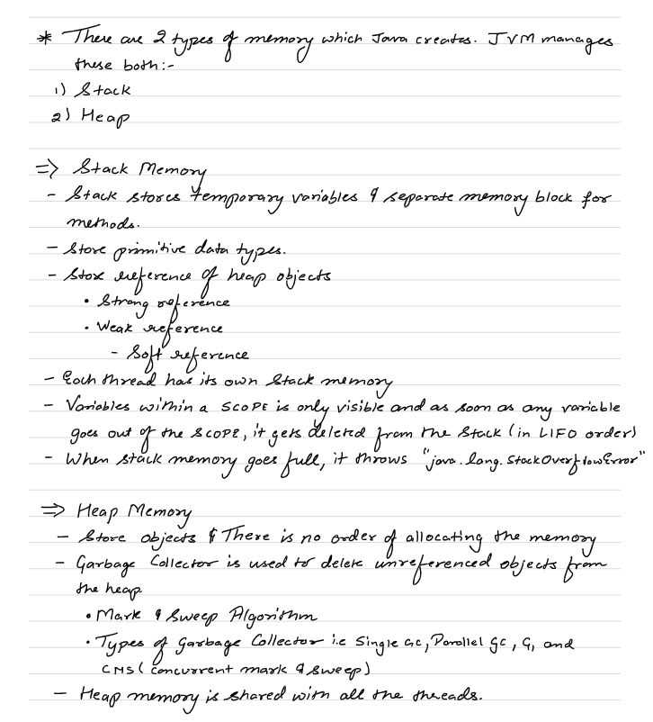

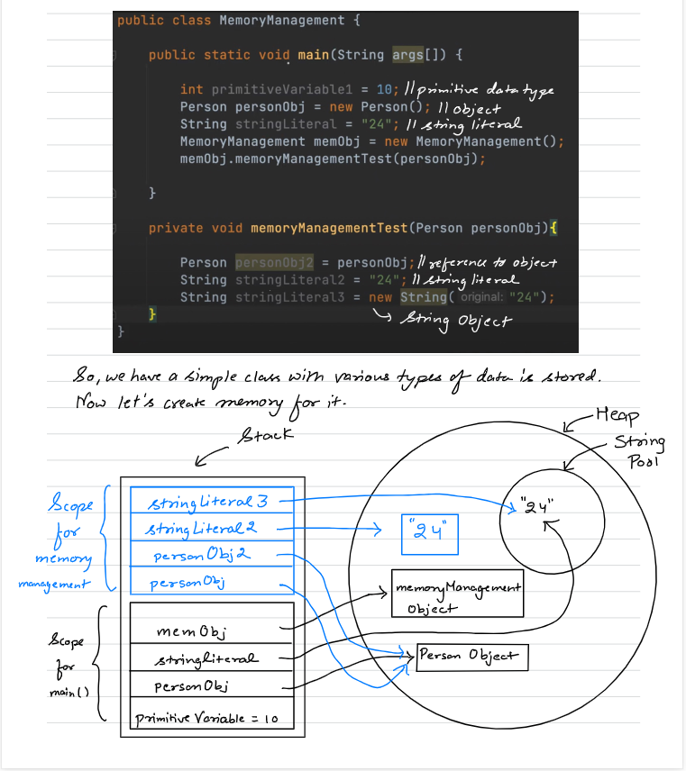

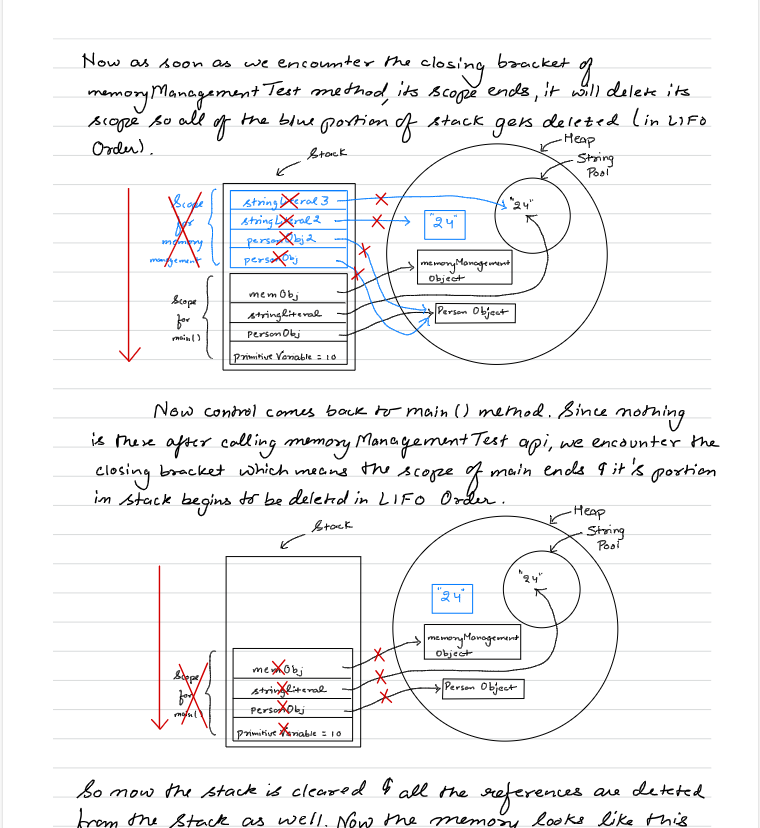

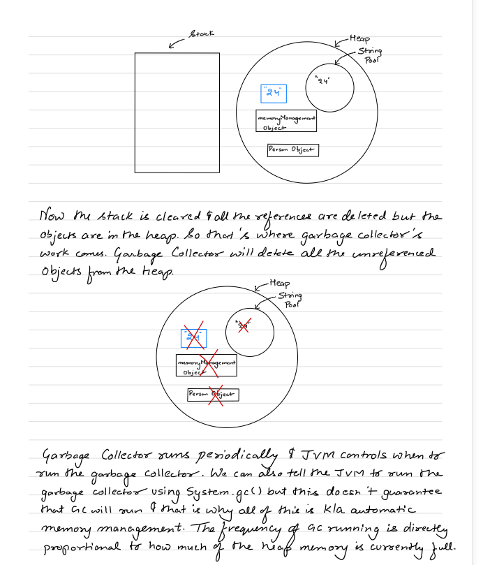

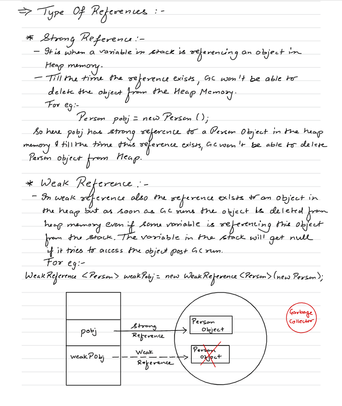

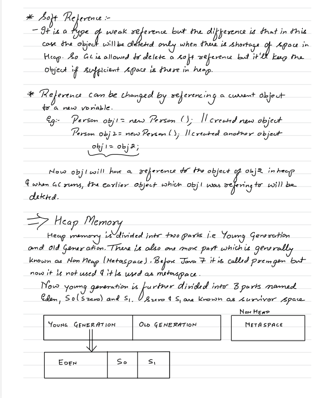

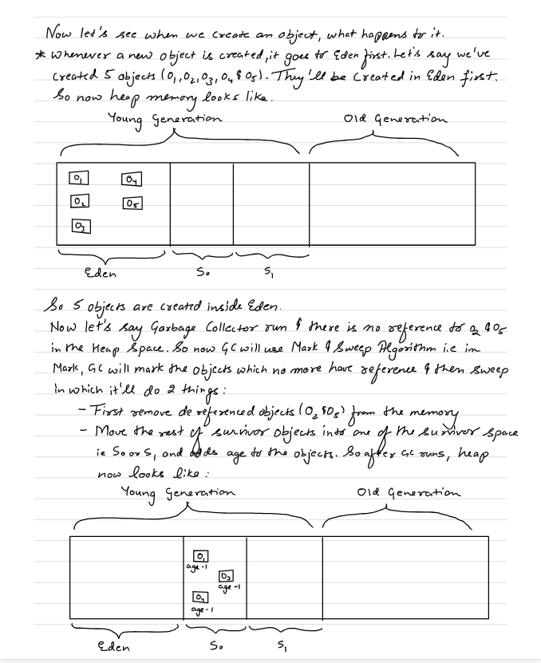

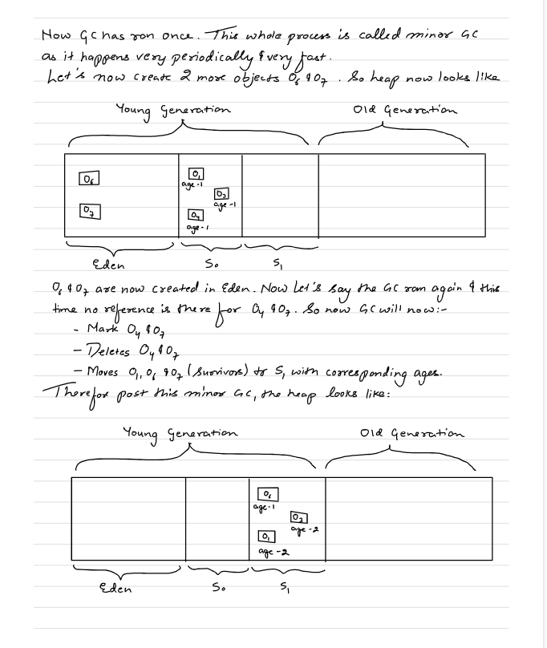

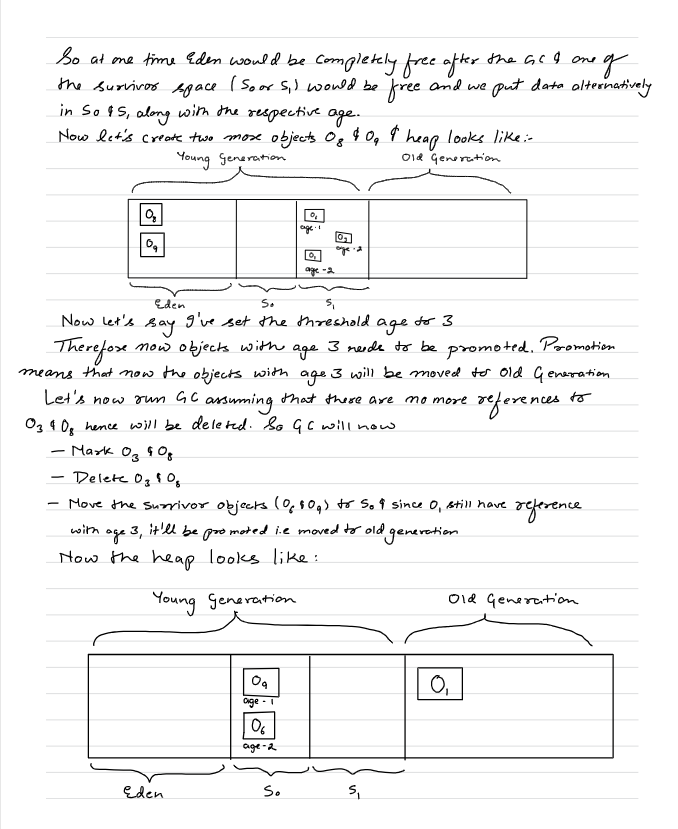

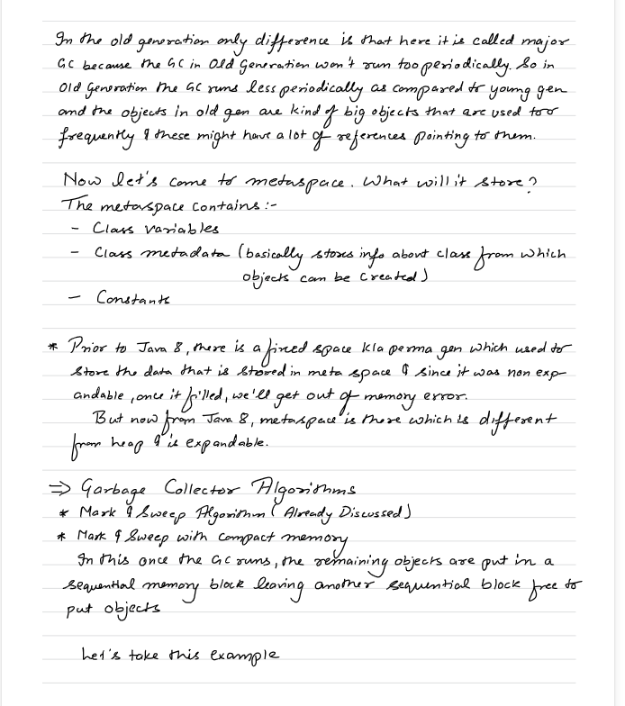

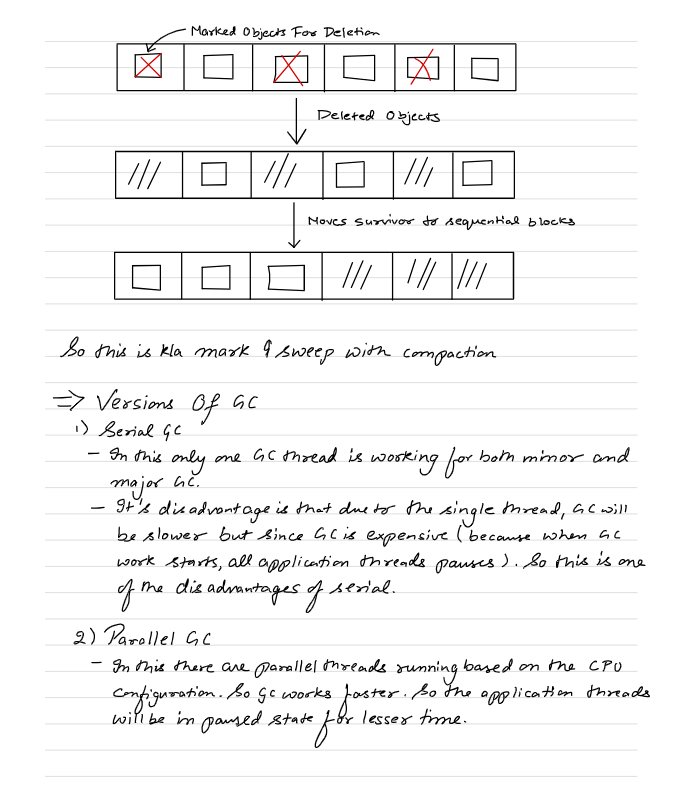

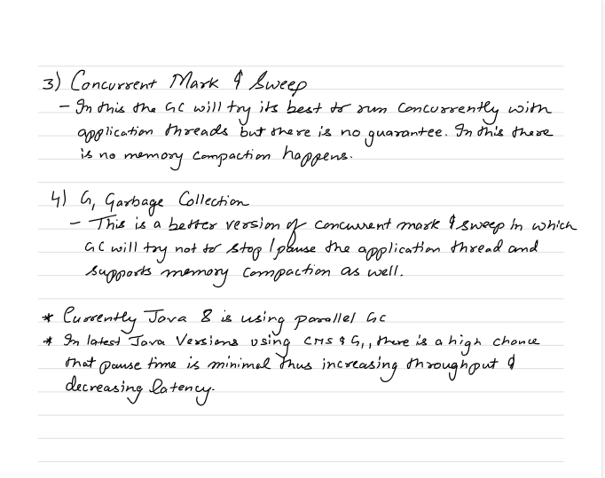


A PhantomReference is a special type of reference in Java that gives you a notification when an object is about to be collected, but does not allow you to access the object. It’s mostly used for advanced resource management. Let’s break it down with examples.


import java.lang.ref.PhantomReference;
import java.lang.ref.ReferenceQueue;

class MyObject {
@Override
protected void finalize() {
System.out.println("MyObject is being finalized");
}
}

public class PhantomExample {
public static void main(String[] args) {
ReferenceQueue<MyObject> queue = new ReferenceQueue<>();
MyObject obj = new MyObject();

        // Create a phantom reference
        PhantomReference<MyObject> phantomRef = new PhantomReference<>(obj, queue);

        // Clear strong reference
        obj = null;

        // Suggest GC
        System.gc();

        // Check the queue
        if (queue.poll() != null) {
            System.out.println("MyObject is ready to be GCed");
        } else {
            System.out.println("MyObject not yet GCed");
        }
    }
}

MyObject is the class.
obj is the instance of MyObject.
The phantom reference is tracking that particular instance obj, not the class itself.

So, the JVM doesn’t care about the class MyObject, it’s tracking the single object we created. When obj becomes unreachable (eligible for GC), the phantomRef will be enqueued into queue to let you know “this object is about to be collected.”
1️⃣ The ReferenceQueue

When you create a phantom reference, you provide a ReferenceQueue:

ReferenceQueue<MyObject> queue = new ReferenceQueue<>();
PhantomReference<MyObject> phantomRef = new PhantomReference<>(obj, queue);
queue is just a normal queue object provided by Java, specifically java.lang.ref.ReferenceQueue.
JVM uses this queue to notify you after the object becomes phantom reachable — meaning it’s eligible for GC but not yet collected.
2️⃣ When does it get enqueued?
You have an object obj:
MyObject obj = new MyObject();
PhantomReference<MyObject> phantomRef = new PhantomReference<>(obj, queue);
If obj is no longer strongly reachable (e.g., you do obj = null;) and the GC runs:
JVM notices that obj is only reachable through phantom references.
JVM cannot give you the object (phantom refs always return null on get()), but it enqueues the phantom reference itself into the ReferenceQueue you provided.


Bootstrap ClassLoader
Role: It is the primordial loader; loads the core Java classes (java.lang.*, java.util.*, java.io.*) from the JDK’s rt.jar (or modules in newer Java).
Implemented in native code, not Java.
Parent of all other class loaders.
Example:
ClassLoader cl = String.class.getClassLoader();
System.out.println(cl); // Output: null
Why null? String is loaded by the Bootstrap loader, which is not a Java object, so Java prints null.

Summary: Loads classes from JDK core libraries, no parent above it.

2. Extension ClassLoader (Platform ClassLoader in newer Java)
   Role: Loads classes from <JAVA_HOME>/lib/ext or modules outside core JDK but still part of JDK extensions.
   Parent: Bootstrap ClassLoader.
   Example:
   ClassLoader cl = javax.crypto.Cipher.class.getClassLoader();
   System.out.println(cl); // Typically sun.misc.Launcher$ExtClassLoader@xxxx
   These are classes provided as optional extensions to Java.
3. Application (System) ClassLoader
   Role: Loads classes from your classpath (e.g., compiled .class files, jars in -cp path).
   Parent: Extension ClassLoader.
   Example:
   ClassLoader cl = MyClass.class.getClassLoader();
   System.out.println(cl); // Usually sun.misc.Launcher$AppClassLoader@xxxx
   Hierarchy
   Bootstrap ClassLoader
   ↑
   Extension ClassLoader
   ↑
   Application ClassLoader
   Delegation model: Each loader asks its parent first before trying to load a class itself.


1. What is Code Cache?
   The Code Cache is a memory area in the JVM that stores compiled native code generated by the Just-In-Time (JIT) compiler.
   When Java code is executed, the JVM can:
   Interpret bytecode (slow path)
   Compile bytecode to native machine code (fast path), which is stored in the Code Cache.
   This improves performance because subsequent calls can execute directly as machine instructions, bypassing the interpreter.
2. Memory Location
   The Code Cache is part of the JVM process memory, separate from:
   Heap (objects)
   Stack (per-thread frames)
   Metaspace (class metadata)
   It is off-heap, meaning it’s not managed by the garbage collector like normal Java objects.
   Typical categories inside Code Cache (HotSpot JVM):
   Non-Profiled Code – freshly compiled code
   Profiled Code – optimized based on runtime profiling
   Non-entrant Code – code ready to be discarded
   NMethod storage – compiled native methods
3. Example: Viewing Code Cache Usage

You can check code cache usage using JVM flags:

java -XX:+PrintFlagsFinal -version | grep CodeCache

Common flags:

-XX:InitialCodeCacheSize=32m – initial size
-XX:ReservedCodeCacheSize=240m – max size
-XX:+PrintCodeCache – prints code cache stats at runtime
4. Why it matters
   If the code cache fills up, the JVM may de-optimize methods or flush old compiled code.
   Usually happens if you have large applications with many classes or hot methods.
   JVM automatically manages it, but can be tuned if needed.
   Summary of Memory Areas
   Area	Stores	Managed By
   Heap	Java objects	GC
   Stack	Method frames, local vars	Per thread, LIFO
   Metaspace	Class metadata	GC (class unloading)
   Code Cache	JIT-compiled native code	JVM, not GC
   Registers	CPU registers	CPU hardware

💡 Key point: Code Cache is JIT native code storage, off-heap, and resides in the JVM process memory, separate from heap/metaspace.

If you want, I can make a full JVM memory layout diagram showing Heap, Stack, Metaspace, and Code Cache so you can see exactly where each piece lives.

Do you want me to make that diagram?


🔍 Examples of what Extension Class Loader loads

In older Java (Java 8):

JARs placed inside:

$JAVA_HOME/lib/ext
Example libraries:
Security providers
Cryptography extensions (like JCE)
XML parsers


----------------------------------------------------------------------------------------------------------------------------------------------------------------------------------------


# Class Loader in Java

## What is a Class Loader?

A **Class Loader** is a JVM component responsible for **loading Java classes (`.class` files)** into memory at runtime.

- It loads the bytecode from the `.class` file.
- Creates a `Class` object in memory.
- Makes the class available for execution.
- Classes are loaded **only when they are first needed** (Lazy Loading).

> **Interview Definition:**
>
> A Class Loader is a JVM component responsible for loading Java bytecode (`.class` files) into JVM memory during runtime.

---

# Why Do We Need a Class Loader?

Imagine a project with **10,000 classes**.

If JVM loaded all classes when the application starts:

- Startup would be very slow.
- Huge amount of memory would be consumed.
- Many classes might never be used.

Instead, JVM uses **Lazy Loading**.

A class is loaded **only when it is referenced for the first time.**

Example:

```java
public class Main {

    public static void main(String[] args) {

        Student s = new Student();

    }
}
```

Execution:

1. JVM loads `Main.class`.
2. Starts executing `main()`.
3. When `new Student()` is encountered,
4. JVM loads `Student.class`.

Student is **not loaded before it is needed.**

---

# Responsibilities of Class Loader

A Class Loader is responsible for:

- Loading `.class` files into memory.
- Creating a `Class` object.
- Delegating loading to parent class loaders.
- Preventing duplicate loading.
- Ensuring core Java classes are loaded safely.

---

# Types of Class Loaders

Java mainly has **three built-in class loaders.**

```
Application Class Loader
        ↑
Platform Class Loader
        ↑
Bootstrap Class Loader
```

---

# 1. Bootstrap Class Loader

## Description

Bootstrap Class Loader is the **parent of all class loaders.**

It loads the core Java classes required by every Java program.

Examples:

```text
java.lang.String
java.lang.Object
java.lang.System
java.lang.Math
java.util.ArrayList
java.util.HashMap
```

### Characteristics

- Written in Native Code (C/C++)
- Part of JVM
- Cannot be accessed directly from Java code
- Loads classes from Java Runtime

Example:

```java
String s = "Hello";
```

`String.class` is loaded by Bootstrap Class Loader.

---

# 2. Platform Class Loader

(Extension Class Loader before Java 9)

## Description

Loads Java platform libraries that are not part of the core runtime but are part of the Java platform.

Examples include packages for:

    Database access (JDBC)
    XML processing
    Security
    Cryptography
    Naming and directory services

Examples:

```text
java.sql.*
javax.xml.*
java.xml.*
import java.sql.Connection;
import java.sql.DriverManager;
```

---

# 3. Application Class Loader

## Description

Loads classes from the application's classpath.

These are your own classes.

Example:

```text
Main
Student
Employee
Spring Boot Controllers
Spring Boot Services
Repositories
```

Example:

```java
public class Student {
}
```

Student.class is loaded by the Application Class Loader.

---

# Parent Delegation Model ⭐⭐⭐⭐⭐

One of the most important interview topics.

When a class needs to be loaded, the Application Class Loader **does not immediately load it itself.**

Instead, it asks its parent.

Flow:

```
Application
      |
      V
Platform
      |
      V
Bootstrap
```

Loading Process:

1. Application Class Loader receives request.
2. It asks Platform Class Loader.
3. Platform asks Bootstrap.
4. Bootstrap tries to load the class.
5. If Bootstrap cannot find it,
6. Platform tries.
7. If Platform cannot find it,
8. Application finally loads it.

---

# Why Parent Delegation?

Suppose someone creates:

```java
package java.lang;

public class String {

}
```


Without Parent Delegation,
this fake String class could replace the real String class.

That would completely break Java.

Because Bootstrap always gets the first chance,
the original `java.lang.String` is always loaded.

This makes Java secure.

Q: Why can't we replace java.lang.String?

    A: Because of the Parent Delegation Model. When a class is requested, the Application Class Loader first delegates the request to its parent loaders. The Bootstrap Class Loader loads the official java.lang.String from the JDK before the application can load any class with the same fully qualified name. Additionally, modern Java prevents user code from defining classes in java.* packages, providing another layer of protection.

---

# Class Loading Process

The loading process consists of **three major phases.**

```
Loading
    |
    V
Linking
    |
    |---- Verification
    |---- Preparation
    |---- Resolution
    |
    V
Initialization
```

---

# Phase 1 : Loading

During loading:

- JVM locates the `.class` file.
- Reads bytecode.
- Creates a `Class` object.

Example:

```
Student.class
      |
      V
Class<Student>
```

---

# Phase 2 : Linking

Linking consists of **three steps.**

---

## Verification

Purpose:

Ensures that the bytecode is valid.

Checks include:

- Illegal bytecode
- Stack correctness
- Variable initialization
- Access rules
- JVM format validation

If verification fails,

```
java.lang.VerifyError
```

is thrown.

---

## Preparation

Memory is allocated for **static variables.**

Default values are assigned.

Example:

```java
class Demo {

    static int x = 100;

}
```

During Preparation:

```
x = 0
```

Only default values are assigned.

---

## Resolution

Symbolic references are replaced by actual memory references.

Example:

Before Resolution:

```
Student
```

After Resolution:

```
Memory Address -> Student Class
```

---

# Phase 3 : Initialization

Initialization executes:

- Static variable assignments
- Static blocks

Example:

```java
class Demo {

    static int x = 100;

    static {

        System.out.println("Static Block");

    }

}
```

During Initialization:

```
x becomes 100

Static block executes.
```

---

# Static Initialization Order

Example:

```java
class Demo {

    static int a = 10;

    static {

        System.out.println(a);

    }

}
```

Execution:

```
Loading

↓

Linking

↓

Initialization

↓

a = 10

↓

Static Block executes
```

Output:

```
10
```

---

    The Class Loader itself is mainly responsible for the Loading phase. The subsequent Linking and Initialization phases are performed by the JVM as part of the overall class loading process. That's why interviewers often use "class loading" to refer to the complete sequence of Loading → Linking → Initialization.


# Class.forName()

Loads and initializes a class.

Example:

```java
Class.forName("Student");
```

Effects:

- Loads Student class
- Executes static variables
- Executes static blocks

Used in:

- Reflection
- JDBC (older drivers)
- Frameworks
- Dependency Injection

---

# loadClass()

Example:

```java
ClassLoader loader = ClassLoader.getSystemClassLoader();

loader.loadClass("Student");
```

    This only loads the class.
    loadClass() performs Loading and Linking, but it does not initialize the class.

Initialization does **not** happen immediately.

---

# Difference: Class.forName() vs loadClass()

| Class.forName()        | loadClass()                                |
|------------------------|--------------------------------------------|
| Loads class            | Loads class                                |
| Initializes class      | Does not initialize immediately            |
| Executes static blocks | Static blocks are not executed immediately |
| Common in Reflection   | Common in custom class loading             |

---

# Can We Create Our Own Class Loader?

Yes.

By extending:

```java
ClassLoader
```

Override:

```java
findClass()
```

Applications:

- Plugin Systems
- Application Servers
- IDEs
- Bytecode manipulation
- Frameworks

---

# Important Interview Questions

## Basic

- What is a Class Loader?
- Why is Class Loader required?
- Why does Java use Lazy Loading?
- What is a Class object?

---

## Intermediate

- Types of Class Loaders?
- Bootstrap vs Platform vs Application?
- Parent Delegation Model?
- Why is Parent Delegation important?

---

## Advanced

- Explain the complete Class Loading Process.
- Verification, Preparation, Resolution?
- Difference between Loading and Initialization?
- Difference between `Class.forName()` and `loadClass()`?
- Can we create our own Class Loader?

---

# Quick Revision

## Class Loader

- Loads `.class` files.
- Creates `Class` objects.
- Uses Lazy Loading.
- Prevents duplicate loading.

---

## Types

- Bootstrap
- Platform
- Application

---

## Parent Delegation

Application

↓

Platform

↓

Bootstrap

Bootstrap gets the first chance to load classes.

---

## Class Loading Phases

```
Loading

↓

Linking

    Verification

    Preparation

    Resolution

↓

Initialization
```

---

## Linking

Verification

- Validates bytecode.

Preparation

- Allocates memory.
- Assigns default values to static variables.

Resolution

- Converts symbolic references into actual references.

---

## Initialization

- Assigns actual values to static variables.
- Executes static blocks.

---

## Class.forName()

- Loads class.
- Initializes class.
- Executes static blocks.

---

## loadClass()

- Loads class only.
- Does not initialize immediately.

---

# Memory Trick

Think of it like this:

- **Loading** → Bring the class into memory.
- **Linking** → Verify and prepare the class.
- **Initialization** → Execute static initialization.

**Flow:**

```
.class File
      ↓
Loading
      ↓
Verification
      ↓
Preparation
      ↓
Resolution
      ↓
Initialization
      ↓
Program Execution
```


How to create one?

Extend the ClassLoader class and override findClass().

Example:

    public class MyClassLoader extends ClassLoader {
    
        @Override
        protected Class<?> findClass(String name)
                throws ClassNotFoundException {
    
            byte[] classData = loadClassBytes(name);
    
            return defineClass(name, classData, 0, classData.length);
        }
    
        private byte[] loadClassBytes(String name) {
    
            // Read bytes from file/database/network
    
            return new byte[0];
        }
    }


Where is the Class object stored?

    The Class object is stored in the Method Area (called Metaspace in Java 8+).

Flow

        Student.java
        │
        ▼
        javac
        │
        ▼
        Student.class
        │
        ▼
        Class Loader
        │
        ▼
        JVM
        │
        ▼
        Creates Class<Student> object
        │
        ▼
        Stored in Method Area (Metaspace)
What does the Class object contain?


    It does not store the actual object instances.
    
    class Student {
    int id;
    String name;
    
        void display() {}
    }

The Class<Student> object contains metadata like:

    Class Name : Student
    
    Fields:
    id
    name
    
    Methods:
    display()
    
    Constructor:
    Student()
    
    Superclass:
    Object


                JVM Memory

+------------------------------------+
|          Metaspace                 |
|------------------------------------|
| Class Metadata                     |
| - Class name                       |
| - Package name                     |
| - Superclass                       |
| - Interfaces                       |
| - Field definitions                |
| - Method definitions               |
| - Constructor definitions          |
| - Runtime Constant Pool            |
| - Annotations                      |
| - Access modifiers                 |
|------------------------------------|
+------------------------------------+

                ▲
                │ Associated with
                ▼

+------------------------------------+
|              Heap                  |
|------------------------------------|
| java.lang.Class object             |
|                                    |
| Class<Student>                     |
|                                    |
| Used by Reflection                 |
| getMethods()                       |
| getFields()                        |
| getName()                          |
| newInstance()                      |
+------------------------------------+


What is inside the Class object?

    Think of it as a handle (or wrapper) around the metadata.
    
    It contains things like:
    
    Reference to the class metadata in Metaspace.
    APIs used by reflection.
    Information the JVM needs to represent the class as an object.

-------------------------------------------------------------------------------------------------------------------------------------------------------------------------------------------


# JVM Execution Engine

## What is the Execution Engine?

The **Execution Engine** is a component of the JVM responsible for executing the Java bytecode that has been loaded into memory.

It takes the bytecode (`.class` files) loaded by the Class Loader and executes it by converting it into native machine code that the CPU understands.

### Responsibilities

- Execute Java bytecode.
- Convert bytecode into machine code.
- Improve performance using the Just-In-Time (JIT) Compiler.
- Work with the Garbage Collector (GC) to manage memory.

---

# Execution Flow

```text
Java Source (.java)
        │
        ▼
Compiler (javac)
        │
        ▼
Bytecode (.class)
        │
        ▼
Class Loader
        │
        ▼
Execution Engine
        │
        ▼
Machine Code
        │
        ▼
CPU Executes Instructions
```

---

# Components of the Execution Engine

The Execution Engine mainly consists of:

```text
Execution Engine
│
├── Interpreter
├── Just-In-Time (JIT) Compiler
├── Garbage Collector (GC)
└── Runtime Optimizer
```

---

# 1. Interpreter

## What is an Interpreter?

The **Interpreter** reads and executes Java bytecode **one instruction at a time**.

It translates each bytecode instruction into machine instructions and executes them immediately.

### Working

```text
Bytecode

↓

Instruction 1 → Execute

↓

Instruction 2 → Execute

↓

Instruction 3 → Execute

↓

...
```

### Example

```java
public class Demo {

    public static void main(String[] args) {

        int a = 10;
        int b = 20;

        int c = a + b;

        System.out.println(c);

    }
}
```

Initially, every bytecode instruction is interpreted one by one.

---

## Advantages

- Starts execution immediately.
- No need to compile the complete application first.
- Faster startup time.

---

## Disadvantages

Suppose a method executes one million times.

```java
for(int i = 0; i < 1000000; i++) {

    add();

}
```

The Interpreter executes the same bytecode one million times.

This makes execution slower.

---

# 2. Just-In-Time (JIT) Compiler

## What is JIT?

The **Just-In-Time Compiler (JIT)** improves performance by converting **frequently executed bytecode into native machine code**.

Instead of interpreting the same bytecode repeatedly, the compiled machine code is reused.

---

# Why is JIT Needed?

Without JIT:

```text
Bytecode

↓

Interpreter

↓

Executed Again

↓

Interpreter

↓

Executed Again

↓

Interpreter
```

Every execution requires interpretation.

With JIT:

```text
Bytecode

↓

Interpreter

↓

Frequently Executed

↓

JIT Compiler

↓

Machine Code

↓

Future Executions Use Machine Code Directly
```

This greatly improves performance.

---

# Hot Methods

The JVM monitors method execution.

Methods that execute very frequently are called **Hot Methods**.

Example:

```java
public int add(int a, int b) {

    return a + b;

}
```

If this method is called thousands of times,

the JVM marks it as **Hot**.

The JIT Compiler then compiles it into native machine code.

---

# JIT Execution Flow

```text
Method Call

↓

Interpreter Executes

↓

Execution Count Increases

↓

Method Becomes Hot

↓

JIT Compiler Compiles It

↓

Machine Code Stored

↓

Future Calls Execute Machine Code
```

---

# Advantages of JIT

- Faster execution.
- Eliminates repeated interpretation.
- Performs runtime optimizations.
- Improves application performance significantly.

---

# JIT Optimizations

The JIT Compiler performs several optimizations.

Examples include:

- Method Inlining
- Dead Code Elimination
- Loop Optimization
- Constant Folding
- Escape Analysis

You are **not expected to know the implementation details** for most backend interviews.

Simply knowing that **JIT optimizes hot code** is sufficient.

---

# Interpreter vs JIT Compiler

| Interpreter                                   | JIT Compiler                                             |
|-----------------------------------------------|----------------------------------------------------------|
| Executes bytecode instruction by instruction. | Converts frequently executed bytecode into machine code. |
| Faster startup.                               | Faster long-term execution.                              |
| Slower for repeated execution.                | Very fast after compilation.                             |
| No optimization.                              | Performs many runtime optimizations.                     |

---

# Why Does Java Use Both?

If Java used **only the Interpreter**:

- Fast startup.
- Slow execution.

If Java used **only the Compiler**:

- Slow startup because everything must be compiled first.

Java combines both approaches.

Execution Flow:

```text
Program Starts

↓

Interpreter Executes Bytecode

↓

JVM Detects Frequently Executed Methods

↓

JIT Compiles Hot Methods

↓

Future Calls Execute Machine Code
```

This provides:

- Fast startup.
- High runtime performance.

---

# 3. Garbage Collector (GC)

The Execution Engine also works with the **Garbage Collector**.

The Garbage Collector automatically removes objects that are no longer reachable.

Example:

```java
Student s = new Student();

s = null;
```

The `Student` object becomes **eligible for garbage collection** because no live reference points to it.

The Garbage Collector reclaims its memory automatically.

---

# HotSpot JVM

The most commonly used JVM implementation is **HotSpot JVM**.

Its responsibilities include:

- Detect frequently executed methods.
- Send hot methods to the JIT Compiler.
- Perform runtime optimizations.
- Improve application performance.

---

# Complete Execution Flow

```text
Java Source (.java)

        │

        ▼

Compiler (javac)

        │

        ▼

Bytecode (.class)

        │

        ▼

Class Loader

        │

        ▼

Execution Engine

        │

        ├──────────────► Interpreter

        │

        ├──────────────► JIT Compiler

        │

        └──────────────► Garbage Collector

        │

        ▼

Machine Code

        │

        ▼

CPU
```

---

# Interview Questions

## Basic

- What is the Execution Engine?
- What are its responsibilities?
- What are the components of the Execution Engine?
- What is an Interpreter?
- What is a JIT Compiler?

---

## Intermediate

- Why do we need both the Interpreter and JIT Compiler?
- What is a Hot Method?
- How does JIT improve performance?
- What is the role of the Garbage Collector?

---

## Advanced

- What is the HotSpot JVM?
- Name some JIT optimizations.
- How does the JVM decide when to compile a method?

---

# Quick Revision

## Execution Engine

- Executes bytecode.
- Converts bytecode into machine code.
- Optimizes execution.
- Works with the Garbage Collector.

---

## Components

- Interpreter
- JIT Compiler
- Garbage Collector
- Runtime Optimizer

---

## Interpreter

- Executes bytecode line by line.
- Faster startup.
- Slower for repeated execution.

---

## JIT Compiler

- Compiles hot methods into machine code.
- Improves runtime performance.
- Performs runtime optimizations.

---

## Garbage Collector

- Removes unreachable objects.
- Frees heap memory automatically.

---

## HotSpot JVM

- Detects hot methods.
- Invokes the JIT Compiler.
- Optimizes execution.

---

# Memory Trick

Remember the execution sequence as:

```text
Bytecode

↓

Interpreter

↓

Hot Method

↓

JIT Compiler

↓

Machine Code

↓

CPU Execution
```

**Easy way to remember:**

- **Interpreter** → Starts the program quickly.
- **JIT Compiler** → Makes frequently executed code run faster.
- **Garbage Collector** → Cleans up unused memory.


How does the HotSpot JVM know which methods are "hot"?

The HotSpot JVM keeps execution counters for methods and loops.

Every time a method is executed, its counter increases.

Example:

public class Demo {

    public static void add() {
        System.out.println("Hello");
    }

    public static void main(String[] args) {

        for (int i = 0; i < 100000; i++) {
            add();
        }
    }
}

Initially:

add() called

Counter = 1

↓

Counter = 2

↓

Counter = 3

↓

...

↓

Counter = 10000

When the counter crosses a JVM-defined threshold, HotSpot marks it as a Hot Method


-----------------------------------------------------------------------------------------------------------------------------------------------------------------------------------------------------

# Advanced JVM Topics for Java Backend Interviews

These topics are commonly asked in **product-based company interviews (2–8 years)**. They help you understand **how HotSpot JVM achieves high performance**.

---

# 1. JVM Startup Options (JVM Arguments)

JVM behavior can be customized using command-line options.

Example:

```bash
java -Xms512m -Xmx2g MyApplication
```

These options control memory, garbage collection, debugging, and performance.

---

## 1.1 -Xms (Initial Heap Size)

Specifies the **initial heap size** allocated when the JVM starts.

Example:

```bash
java -Xms512m MyApp
```

Meaning:

- JVM immediately allocates **512 MB** heap.
- Heap will not start with a smaller size.

### Why use it?

If your application is large, repeatedly expanding the heap is expensive.

Using a larger initial heap reduces heap expansion.

---

## 1.2 -Xmx (Maximum Heap Size)

Specifies the maximum heap memory JVM may use.

Example:

```bash
java -Xmx2g MyApp
```

Meaning:

Maximum heap = 2 GB

If heap exceeds this:

```
java.lang.OutOfMemoryError: Java heap space
```

---

## 1.3 -Xss (Thread Stack Size)

Specifies stack size for **each thread**.

Example:

```bash
java -Xss1m
```

Meaning:

Every thread gets 1 MB stack.

If recursion is very deep:

```
StackOverflowError
```

Increasing Xss allows deeper recursion.

But:

Larger stack → fewer threads can be created.

---

## 1.4 -XX:MaxMetaspaceSize

Limits Metaspace size.

Example:

```bash
-XX:MaxMetaspaceSize=512m
```

If many classes are loaded:

```
OutOfMemoryError: Metaspace
```

Useful in application servers where many class loaders exist.

---

## 1.5 -XX:+UseG1GC

Chooses G1 Garbage Collector.

```bash
java -XX:+UseG1GC
```

G1:

- Low pause times
- Region-based heap
- Default GC since Java 9

Suitable for:

- Spring Boot
- Large backend systems
- Web servers

---

## 1.6 -XX:+HeapDumpOnOutOfMemoryError

Automatically generates heap dump.

Example:

```bash
java -XX:+HeapDumpOnOutOfMemoryError
```

When OOM occurs:

```
java_pid12345.hprof
```

is generated.

Developers analyze it using:

- Eclipse MAT
- VisualVM
- JProfiler

Useful for detecting memory leaks.

---

# 2. Escape Analysis

One of the biggest JVM optimizations.

Question:

**Does this object escape the method?**

If NOT,

JVM performs several optimizations.

---

Example:

```java
public int sum() {
    Point p = new Point(2,3);
    return p.x + p.y;
}
```

Does `p` escape?

No.

Nobody outside this method can access it.

Therefore JVM optimizes it.

---

Escape analysis enables:

- Stack Allocation
- Lock Elimination
- Scalar Replacement

---

# 2.1 Stack Allocation

Normally:

```
new Object()
↓

Heap
```

But if object never escapes:

JVM may allocate it on stack.

```
Method Stack

Point p
```

Advantages:

- No GC required
- Faster allocation
- Automatic cleanup

Interview point:

Not guaranteed.

HotSpot decides.

---

# 2.2 Lock Elimination

Suppose:

```java
public void test() {

    Object lock = new Object();

    synchronized(lock){
        System.out.println("Hello");
    }

}
```

Normally synchronized requires locking.

But:

No other thread can access this lock.

So JVM removes synchronization completely.

Benefits:

- Less locking overhead
- Better performance

---

# 2.3 Scalar Replacement

Suppose:

```java
Point p = new Point(10,20);
```

Instead of creating object:

```
Heap

Point
 x
 y
```

JVM converts it into:

```
int x = 10;
int y = 20;
```

No object exists.

Benefits:

- No heap allocation
- No GC
- Faster execution

---

# 3. TLAB (Thread Local Allocation Buffer)

One of the most important JVM optimizations.

Question:

How can thousands of threads create objects simultaneously without locking the heap?

Answer:

Each thread gets its own small allocation area inside Eden.

Called

```
Thread Local Allocation Buffer
```

Example:

```
Young Generation (Eden)

------------------------------------------------

TLAB Thread 1

TLAB Thread 2

TLAB Thread 3

TLAB Thread 4

------------------------------------------------
```

When thread creates object:

```
new User()
```

Object goes into its own TLAB.

No synchronization required.

Hence allocation is extremely fast.

When TLAB becomes full:

Thread requests another TLAB.

Large objects bypass TLAB and are allocated directly in Eden.

---

## Why object allocation is so fast?

Reasons:

1. Allocation usually happens inside TLAB.
2. Only pointer increment required.

Example:

```
Current Pointer

↓

+-------------------------------+

Free Space

+-------------------------------+
```

Creating object:

```
Pointer += Object Size
```

No searching.

No linked list.

No lock.

Almost as fast as stack allocation.

---

# 4. Safepoints

Safepoint = a moment where JVM knows every thread is in a safe state.

Needed before:

- Garbage Collection
- Class Redefinition
- Thread dump
- Deoptimization

Question:

Why stop threads?

Imagine:

GC moving objects.

Meanwhile another thread:

```
user.address.city
```

If GC moves object simultaneously:

Thread could read invalid memory.

Therefore:

JVM pauses threads.

Runs GC.

Updates references.

Resumes execution.

---

### Where do safepoints occur?

Typically:

- Method entry
- Method exit
- Loop back edges
- Exception handling

JIT inserts safepoint polls into compiled code.

---

# 5. Minor GC vs Major GC vs Full GC

## Minor GC

Operates on:

```
Young Generation

Eden

S0

S1
```

Triggered when Eden fills.

Objects surviving several Minor GCs may be promoted to the Old Generation.

Characteristics:

- Frequent
- Fast
- Short pause

---

## Major GC

Targets:

```
Old Generation
```

Triggered when old generation fills.

Characteristics:

- Less frequent
- Longer pause
- More expensive

(Some collectors use different terminology, and "Major GC" is not always a distinct event.)

---

## Full GC

Collects:

```
Entire Heap

Young

Old
```

Additionally:

May unload unused classes and reclaim Metaspace depending on the garbage collector and JVM implementation.

Characteristics:

- Slowest GC
- Long pause
- Avoid in production if frequent

---

## Comparison

| Feature | Minor GC | Major GC | Full GC |
|----------|----------|----------|----------|
| Young Generation | ✅ | ❌ | ✅ |
| Old Generation | ❌ | ✅ | ✅ |
| Metaspace/Class Unloading | ❌ | Collector-dependent | Often Yes |
| Speed | Fast | Medium | Slow |
| Frequency | High | Low | Very Low |

---

# 6. Common JVM Errors

## 6.1 OutOfMemoryError: Java heap space

Reason:

Heap exhausted.

Example:

```java
List<byte[]> list = new ArrayList<>();

while(true)
    list.add(new byte[1024*1024]);
```

Result:

```
OutOfMemoryError:
Java heap space
```

Solutions:

- Increase Xmx
- Fix memory leak
- Optimize object usage

---

## 6.2 OutOfMemoryError: Metaspace

Reason:

Too many classes loaded.

Common in:

- Tomcat
- Spring Boot DevTools
- Dynamic proxies
- Class loader leaks

Solution:

Increase:

```
-XX:MaxMetaspaceSize
```

or fix class-loader leaks.

---

## 6.3 StackOverflowError

Reason:

Infinite recursion.

Example:

```java
void fun(){
    fun();
}
```

Every recursive call creates another stack frame until the thread's stack is exhausted.

Solutions:

- Fix recursion
- Increase Xss (only if appropriate)

---

## 6.4 GC Overhead Limit Exceeded

Meaning:

JVM spends almost all its time performing GC but recovers very little memory.

Typical cause:

Memory leak or extremely undersized heap.

Symptoms:

- High CPU usage
- Frequent Full GCs
- Application barely progresses

Solutions:

- Fix leaks
- Increase heap
- Analyze heap dump

---

# 7. JIT Compilation Levels

HotSpot JVM uses two JIT compilers.

---

## C1 Compiler (Client Compiler)

Goal:

Fast compilation.

Characteristics:

- Compiles quickly
- Lower optimization
- Faster startup
- Good for short-lived applications

---

## C2 Compiler (Server Compiler)

Goal:

Maximum runtime performance.

Characteristics:

- More aggressive optimizations
- Longer compilation time
- Produces highly optimized native code
- Best for long-running server applications

Optimizations include:

- Inlining
- Loop unrolling
- Escape analysis
- Dead code elimination
- Vectorization (where applicable)

---

## Tiered Compilation

Modern HotSpot combines the interpreter, C1, and C2.

Execution flow:

```
Bytecode
      │
      ▼
Interpreter
      │
      ▼
Frequently Executed?
      │
      ▼
Compile using C1
      │
      ▼
Collect Profiling Information
      │
      ▼
Very Hot?
      │
      ▼
Compile again using C2
      │
      ▼
Highly Optimized Native Code
```

Benefits:

- Fast application startup (thanks to the interpreter and C1)
- Excellent long-term performance (thanks to C2)
- Runtime profiling ensures expensive optimizations are applied only to genuinely hot code

---

# Interview Summary

| Topic | Key Point |
|--------|-----------|
| `-Xms` | Initial heap size |
| `-Xmx` | Maximum heap size |
| `-Xss` | Thread stack size |
| `MaxMetaspaceSize` | Limit Metaspace |
| `UseG1GC` | Enable G1 Garbage Collector |
| `HeapDumpOnOutOfMemoryError` | Generate heap dump on OOM |
| Escape Analysis | Determines if an object escapes its scope |
| Stack Allocation | Non-escaping objects may be allocated on the stack |
| Lock Elimination | Removes unnecessary synchronization |
| Scalar Replacement | Replaces objects with primitive fields when possible |
| TLAB | Per-thread allocation buffer for fast object creation |
| Safepoint | Safe point where JVM can pause threads for VM operations |
| Minor GC | Collects the Young Generation |
| Major GC | Primarily collects the Old Generation |
| Full GC | Collects the whole heap and may unload classes |
| Heap OOM | Heap memory exhausted |
| Metaspace OOM | Class metadata memory exhausted |
| StackOverflowError | Thread stack exhausted due to deep recursion |
| GC Overhead Limit | JVM spends too much time in GC with little memory reclaimed |
| C1 | Fast compilation with modest optimizations |
| C2 | Slower compilation with aggressive optimizations |
| Tiered Compilation | Interpreter → C1 → C2 optimization pipeline |